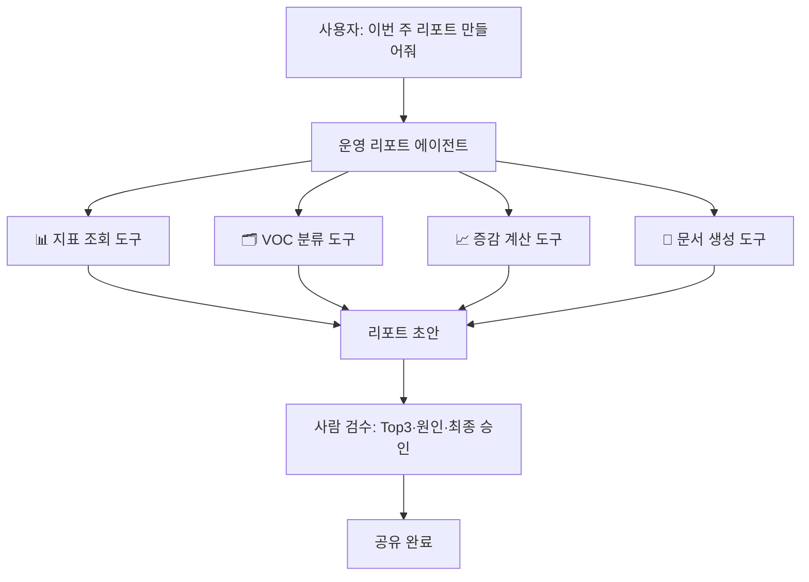

> 🏷️ **[NextX_Automation_Solution]** · 주식회사 넥스트엑스(NEXT X) 정식 업무 자동화 솔루션
{: .prompt-tip }

## 프로젝트 한 줄 정의

> **기획/운영자가 매주 1~2시간 쓰는 반복적 운영 리포트 작성을,
> 수집–분석–초안까지 대신 처리하는 AI 에이전트가 없다.**

이걸 6개월 동안 붙잡고 만들어 보기로 했다.

## 누가, 왜 필요한가

- **대상:** 지표·VOC를 주기적으로 리포트하는 소규모 팀의 기획자·PM·운영자
- **Pain point**
  - 단순 수집·복붙에 시간 낭비, 숫자 오기입 리스크
  - 매주 같은 포맷을 처음부터 다시 작성
  - 정작 중요한 **해석·의사결정**에 쓸 시간이 부족

## 가설

> 반복 구간(수집·계산·분류·초안)을 에이전트가 처리하면,
> 작성 시간을 **절반 이하**로 줄이고 사람은 판단에 집중할 수 있다.

## 구상 — 에이전트 구조

- **에이전트가 대신:** 수집·계산·분류·초안 작성
- **사람이 유지:** 중요도 판단·원인 해석·최종 승인

## 성공 지표

| 기준 | 목표 |
|------|------|
| ⏱️ 작성 시간 | 150분 → **60분 이하** |
| 🎯 수치 오기입 | **0건** |
| 📝 초안 활용률 | **80% 이상** |

## 리스크 & 다음 액션

- ⚠️ LLM의 수치·요약 신뢰성(환각) → **사람 검수 단계 필수**
- 🔐 데이터 소스 접근 권한/보안 확인 필요
- ▶️ **다음:** 프롬프트 엔지니어링 수업에서 *VOC 분류·요약* 프롬프트부터 실험해보기

*이 시리즈는 수업 진도에 맞춰 `#2 프롬프트`, `#3 도구 연동`, `#4 배포`로 이어집니다.*

---

> 📎 본 글은 **주식회사 넥스트엑스(NEXT X) 기술연구소**의 R&D 자산입니다.
> **함께 읽기** — [⚡ 자동화 대표 사례]() · [📖 블로그 안내]() · [📩 비즈니스 문의]()
{: .prompt-info }
