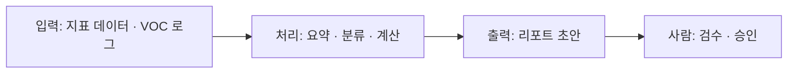

> 지난 글 [#1 문제 정의]()에서 *"주간 운영 리포트 작성을 대신하는 에이전트"* 라는 목표를 세웠습니다.
> 이번 편은 그 목표를 **누구나 따라 만들 수 있는 설계도**로 바꾸는 과정입니다. 코딩을 몰라도 읽을 수 있게 정리했어요.
{: .prompt-info }

## 🧭 이번 편의 목표

"만들고 싶다"와 "만들 수 있다" 사이엔 **설계도**가 있습니다. 설계도 = *무엇을, 어떤 순서로, 어떤 재료로 만들지* 정하는 것. 4단계로 갑니다.

---

## 1단계. 업무 분해를 '에이전트 흐름'으로 번역

[컴퓨팅 사고 수업]()에서 리포트 업무를 **입력 → 처리 → 출력**으로 분해했습니다. 이걸 그대로 에이전트 흐름으로 옮깁니다.

> 핵심: 에이전트는 마법이 아니라 **"입력을 받아 정해진 출력을 만드는 흐름"** 입니다. 이 그림이 설계도의 뼈대예요.

## 2단계. 필요한 '도구(tool)' 목록화

에이전트는 스스로 다 하지 않고 **도구를 호출**합니다. 리포트 업무에 필요한 도구를 적어봅니다.

| 도구 | 하는 일 | 난이도 |
|------|---------|:------:|
| 📊 지표 조회 | 대시보드/시트에서 숫자 가져오기 | 중 |
| 📈 증감 계산 | 전주 대비 계산 (규칙) | 하 |
| 🗂️ VOC 분류 | 문의 텍스트를 카테고리로 (LLM) | 중 |
| 📝 문서 생성 | 템플릿에 요약 채우기 (LLM) | 하 |

> "도구 호출(Tool Calling)"은 곧 수업에서 배울 핵심 개념입니다. 지금은 *"에이전트에게 어떤 손발이 필요한가"* 를 적어두는 단계.

## 3단계. 기술 선택 — MVP는 'API'로 빠르게

[1인 AI 기업 인사이트]()에서 배운 원리를 그대로 적용합니다.

> **처음엔 로컬 GPU 대신 API 종량제로 시작한다.** 고정비 리스크 없이 2~3일 만에 MVP를 만들고, 매출/사용이 손익분기를 넘으면 그때 최적화한다.
{: .prompt-tip }

- MVP 재료: **LLM API**(요약·분류) + **스프레드시트/CSV**(지표) + 간단한 화면
- "완벽한 하나"가 아니라 **"작동하는 최소한"** 부터.

## 4단계. MVP 범위 좁히기 (제일 아픈 것 하나만)

한 번에 다 만들면 못 끝냅니다. 4개 도구 중 **가장 시간을 잡아먹는 것 하나**만 먼저.

- ✅ **MVP v0.1**: "지표 3개를 넣으면 → 3줄 요약 초안을 만들어준다"
- ⏳ 다음: VOC 분류 → 문서 자동화 → 화면 붙이기

---

## 🪜 누구나 따라 하는 3줄 요약

1. 내 반복 업무를 **입력 → 처리 → 출력** 흐름으로 그린다.
2. 처리에 필요한 **도구를 목록**으로 적는다.
3. 그중 **제일 아픈 것 하나**를 API로 2~3일 안에 만든다.

> 다음 편 **#3**에서는 이 MVP의 심장인 **"요약 프롬프트"** 를 직접 실험합니다. 그 전에, 프롬프트의 기초를 [수업노트: 기획자는 원래 프롬프트 강자다]()에서 먼저 다뤘어요.
{: .prompt-info }
