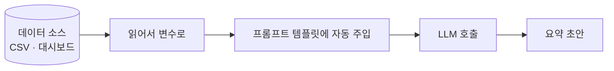

> 🏷️ **[NextX_Automation_Solution]** · 주식회사 넥스트엑스(NEXT X) 정식 업무 자동화 솔루션
{: .prompt-tip }

> [#3 프롬프트 실험실]()에서 좋은 요약 프롬프트(v3)를 완성했습니다.
> 그런데 아직 **지표를 손으로 붙여넣고** 있어요. 이번 편은 그 마지막 수작업을 없앱니다.
{: .prompt-info }

## 🎯 이번 편의 목표



핵심은 **"데이터를 사람이 옮기지 않게"** 만드는 것. 두 가지 길이 있습니다.

## 🛣️ 두 가지 연결 방법

| 방법 | 난이도 | 언제 |
|------|:------:|------|
| **A. CSV/스프레드시트 읽기** | 하 | MVP 시작. 데이터를 파일로 내려받을 수 있을 때 |
| **B. 대시보드 API 연결** | 중 | 실시간·정기 자동화가 필요할 때 |

> [1인 AI 기업 인사이트]()의 원리대로, **가장 쉬운 A(CSV)부터** 시작해 작동을 확인하고 나중에 B로 고도화합니다.
{: .prompt-tip }

## 🧩 A안: CSV → 프롬프트 (의사코드)

```text
1. metrics.csv 읽기        # 지표 | 이번주 | 전주
2. 각 행을 변수로 담기       # data = "가입 1200(전주 1000) ..."
3. v3 프롬프트 템플릿의 [데이터] 자리에 끼워넣기   # 문자열 치환
4. LLM API 호출 → 요약 초안 받기
5. 결과를 report.md로 저장
```

여기서 3번의 "자리에 끼워넣기"가 곧 **템플릿 변수**(예: `{데이터}`)입니다. 기획서의 *빈칸 채우기*와 똑같은 개념이에요.

## 🔌 B안: API 연결 시 주의점

- **API 키는 코드에 쓰지 말고** `.env` 파일 같은 **환경 변수**로 분리 (유출 방지)
- 호출 실패·빈 데이터에 대비한 **예외 처리** 한 줄
- 비용: 호출당 과금이므로 **필요할 때만** 부르기

> ⚠️ 민감한 운영 데이터를 다룰 땐 **회사 보안 정책**부터 확인하세요. 개인 계정/외부 서비스로 내부 데이터를 함부로 보내면 안 됩니다.
{: .prompt-warning }

## 🧠 이게 곧 'Tool Calling'의 예고편

지금은 데이터를 코드로 직접 넣었지만, 다음 단계에선 **에이전트가 "지표 조회 도구"를 스스로 호출**하게 만듭니다. [에이전트 vs RPA]()에서 말한 *"도구를 쓰는 에이전트"* 가 여기서 시작돼요.

## ✅ 이번 편 요약

1. 수작업(붙여넣기)을 **CSV 읽기 → 템플릿 자동 주입**으로 대체
2. 키는 `.env`, 보안 정책 확인은 필수
3. 다음 **#5**: 사람이 검수·수정할 수 있는 **간단한 화면(UI)** 붙이기 (드디어 '앱'의 모습으로!)

> 참고로 이 모든 걸 코드 한 줄 안 짜고 **바이브 코딩**으로 만들 수 있습니다 — 그게 뭔지는 [수업노트: 바이브 코딩이란?]()에 정리했어요.
{: .prompt-info }
