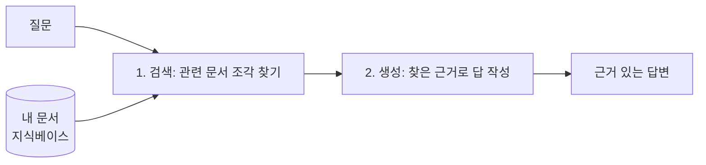

> 🏷️ **[NextX_AX_Solution]** · 주식회사 넥스트엑스(NEXT X) 정식 AX 솔루션 라인업
{: .prompt-tip }

> LLM은 똑똑하지만 **"우리 회사 문서"** 는 모릅니다. 그리고 가끔 그럴듯한 거짓말(환각)을 하죠.
> **RAG**는 이 두 문제를 한 번에 푸는 방법입니다.
{: .prompt-info }

## 🍽️ 한 줄 비유

> **오픈북 시험.** 학생(LLM)이 머릿속 지식만으로 답하는 게 아니라,
> **관련 페이지를 먼저 펴서(검색) 보고 답을 쓰는 것(생성)** — 그게 RAG입니다.

**RAG** = **R**etrieval(검색) **A**ugmented(증강) **G**eneration(생성)

---

## ⚙️ 어떻게 동작하나 (2단계)

1. **검색(Retrieval)**: 질문과 관련된 문서 조각을 지식베이스(벡터 DB 등)에서 찾는다.
2. **생성(Generation)**: 그 조각을 **근거로 붙여** LLM이 답을 만든다.

> 핵심은 **"답의 근거를 외부 문서에서 실시간으로 가져온다"** 는 것. 그래서 최신 정보도, 우리 회사 내부 문서도 반영할 수 있습니다.

## 🤔 왜 필요할까 — RAG가 푸는 3가지

| 문제 | 일반 LLM | RAG |
|------|----------|-----|
| 우리 회사 문서 모름 | ❌ | ✅ 내 문서 반영 |
| 최신 정보 없음(학습 시점 고정) | ❌ | ✅ 실시간 자료 |
| 환각(그럴듯한 거짓) | 자주 | ✅ 근거 기반이라 감소 |

## 🏢 내 프로젝트에 어떻게 쓸까

[운영 리포트 에이전트]()에 RAG를 붙이면:

- **VOC 분류 정확도 ↑**: "지난 분기 유사 문의를 어떻게 분류했는지" 과거 사례를 검색해 참고
- **리포트 톤 일관성 ↑**: 지난 리포트들을 지식베이스로 두고, 우리 팀 표현·포맷을 그대로 따르게
- **근거 있는 요약**: "이 수치가 왜 중요한지"를 사내 문서(정책·목표)에서 찾아 붙임

> ⚠️ RAG도 만능은 아닙니다. **검색이 엉뚱한 문서를 가져오면 답도 틀립니다.** "무엇을, 어떻게 잘게 쪼개 저장하고(chunking), 잘 찾을까"가 실제 난관.
{: .prompt-warning }

## 🧩 한 걸음 더 — 에이전트와의 관계

RAG는 에이전트의 **"기억·자료 조회 도구"** 로 자주 쓰입니다. [에이전트 vs RPA]()에서 본 "도구를 쓰는 에이전트" 관점에서 보면, **RAG = 에이전트가 참고서를 펴보는 능력**인 셈이죠.

## 📚 참고 자료

- [Simple RAG Explained (machinelearningplus)](https://machinelearningplus.com/gen-ai/simple-rag-explained-a-beginners-guide-to-retrieval-augmented-generation/)
- [RAG Tutorial: A Beginner's Guide (SingleStore)](https://www.singlestore.com/blog/a-guide-to-retrieval-augmented-generation-rag/)

> 요약: **RAG = 오픈북 시험.** LLM에게 "우리 자료"를 펴 보게 해서, 더 정확하고 근거 있는 답을 얻는 기술.
{: .prompt-tip }

---

> 📎 본 글은 **주식회사 넥스트엑스(NEXT X) 기술연구소**의 R&D 자산입니다.
> **함께 읽기** — [🤖 AX 대표 사례]() · [📖 블로그 안내]() · [📩 비즈니스 문의]()
{: .prompt-info }
