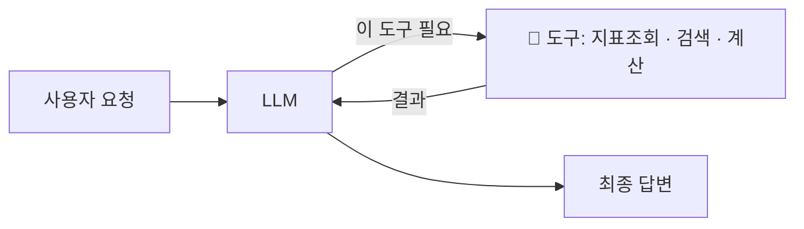
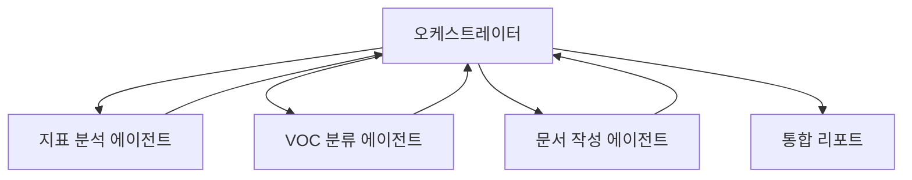

> LLM은 '말'은 잘하지만 혼자선 아무것도 '실행'하지 못합니다. **도구(tool)** 를 쥐여줘야 검색·계산·저장을 하죠.
> [#4 데이터 연결]()에서 예고한 그 개념을 정리합니다.
{: .prompt-info }

## 🔧 Tool Calling이란

> LLM이 "이 작업엔 이 도구가 필요해"라고 판단해, 정해진 **도구(함수)를 호출**하고 그 결과를 받아 이어가는 것.

내 프로젝트로 치면, "요약해줘"라는 말에 에이전트가 **지표 조회 도구**를 스스로 불러 데이터를 가져오는 것. [에이전트 vs RPA]()에서 말한 *"목표를 주면 알아서"* 가 이 메커니즘으로 구현됩니다.

## 🏗️ 워크플로우 vs 에이전트 (중요)

Anthropic은 이 둘을 구분합니다.

| | 워크플로우(Workflow) | 에이전트(Agent) |
|---|----------------------|------------------|
| 제어 | **사람이 짠 순서**대로 | **AI가 스스로 판단** |
| 장점 | 예측·일관성 | 유연성 |
| 적합 | 정해진 작업 | 열린·복잡한 작업 |

> Anthropic의 핵심 조언: **"단순하게 시작하라. 유연성의 이득이 비용·지연·오류 누적을 넘어설 때만 '에이전트'로 올려라."** 처음부터 거창한 자율 에이전트를 만들 필요가 없습니다.
{: .prompt-warning }

## 👥 멀티 에이전트 — 역할 나눠 협업

한 에이전트가 다 하기 버거우면, **역할별로 나눠** 협업시킵니다. ([컴퓨팅 사고]()의 "에이전트 팀 꾸리기"와 연결)

- 장점: 각자 전문화 → 품질↑
- 단점: 복잡·비용·디버깅 난이도↑ → **정말 필요할 때만**

## 🧩 내 프로젝트 로드맵에 대입

| 단계 | 형태 | 설명 |
|------|------|------|
| 지금(MVP) | 단순 워크플로우 | 정해진 순서로 요약 |
| 다음 | + Tool Calling | 지표조회·VOC분류 도구 자동 호출 |
| 나중 | 멀티 에이전트 | 분석/분류/작성 역할 분리 |

> "start simple" 원칙대로, **지금은 워크플로우로 충분**합니다. 도구·멀티에이전트는 필요가 명확해질 때 얹으면 돼요.
{: .prompt-tip }

## 📚 참고 자료

- [Building Effective AI Agents — Anthropic](https://www.anthropic.com/engineering/building-effective-agents)
- [Writing effective tools for AI agents — Anthropic](https://www.anthropic.com/engineering/writing-tools-for-agents)
