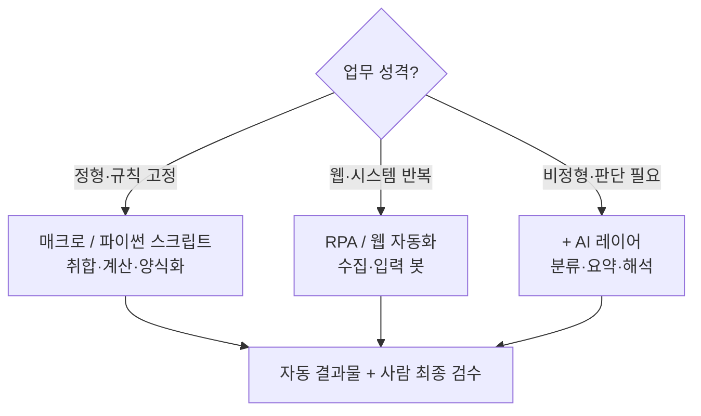

> 🏷️ **[NextX_Automation_Solution]** · 주식회사 넥스트엑스(NEXT X) 정식 업무 자동화 솔루션
{: .prompt-tip }

> 대표님, 혹시 직원이 **엑셀에 갇혀** 있지 않나요? 매주 같은 시트를 취합하고, 정산하고, 보고서 양식을 다시 채우는 일 — 그 시간은 곧 **인건비**입니다.
> 넥스트엑스는 이런 반복을 **자동화**로 걷어내, 사람이 판단과 영업에 집중하게 만듭니다.
{: .prompt-info }

## 🔥 "엑셀 지옥"은 어디에나 있습니다

- 📥 여러 부서/지점의 엑셀을 **하나로 취합**
- 🧮 매출·급여·재고 **정산 및 대사(對査)**
- 📄 같은 양식의 **주간/월간 보고서** 반복 작성
- 🧹 형식이 제각각인 원시 데이터 **정제**

문제는 이게 **"어렵진 않지만 매주 반복되고, 실수가 잦다"** 는 점입니다. 딱 자동화가 돈을 버는 지점이죠.

## 💸 비용으로 보면 (예시 시나리오)

> 아래는 이해를 돕기 위한 **예시 계산**입니다. 실제 수치는 업무·조직마다 다릅니다.
{: .prompt-warning }

담당자 1명이 **정산·취합에 주 5시간**을 쓴다고 가정하면:

| 항목 | 값 (예시) |
|------|-----------|
| 주당 소요 | 5시간 |
| 월 소요 | 약 20시간 |
| 인건비 환산(시급 2만원 가정) | **월 약 40만원** |
| 연간 | **약 480만원** + 야근·실수 비용 |

자동화하면 이 작업이 **버튼 한 번(또는 예약 실행)** 으로 끝납니다. 구축은 한 번, 절감은 **매주 누적**됩니다.

## 🧭 넥스트엑스의 자동화 접근법

무작정 매크로부터 짜지 않습니다. **업무 성격에 맞는 도구**를 고릅니다.

| 유형 | 도구 | 예시 |
|------|------|------|
| 정형 반복 | 엑셀 매크로(VBA)·**파이썬** | 시트 취합, 정산, 피벗, 양식 채우기 |
| 웹/시스템 | RPA·웹 자동화 | ERP 입력, 사이트 데이터 수집 |
| 비정형 | **+ 생성형 AI** | 제각각 문서 분류·요약([RPA vs AI 차이]()) |

> 순수 규칙 업무는 스크립트가 가장 싸고 정확합니다. **"판단"이 섞일 때만** AI를 얹습니다. 과잉 설계는 비용만 늘리니까요.
{: .prompt-tip }

## 🛠️ 진행 방식 (작게, 빠르게)

1. **진단** — 어떤 반복 업무가, 얼마나 시간을 잡아먹는지 파악
2. **MVP 자동화** — 가장 아픈 것 하나부터 2~3일 내 시제품
3. **효과 측정** — 시간·오류 절감을 숫자로 확인
4. **확장·안정화** — 예약 실행, 예외 처리, 사람 검수 흐름

이 "문제 분해 → 작은 검증 → 확장" 방식은 [AI Transformation 대표 사례]()와 동일한 원칙입니다.

## ✅ 자동화 후보 자가진단

- [ ] 매주/매월 **똑같이 반복**되는 엑셀·문서 작업이 있다
- [ ] 사람이 하다 보니 **오타·누락**이 가끔 난다
- [ ] 여러 파일/시스템에서 데이터를 **복붙**해 모은다
- [ ] 그 시간에 정작 **중요한 일**을 못 한다

2개 이상이면 **자동화로 비용을 줄일 여지**가 큽니다.

## 🔗 이어지는 솔루션 (카테고리 교차 참고)

- ⚡ **더 깊이(Automation)** → [파이썬 엑셀 자동화]() · [노코드 시작]() · [문서 대량 생성]()
- 🤖 **판단이 필요하면(AX)** → [운영 리포트 자동화(대표)]() · [에이전트 vs RPA]() · [VOC 자동 분류]()
- 📊 **데이터 품질(Data)** → 자동화 전에 [데이터 클렌징]()으로 원천 정리
- 🛠️ **실행·연동(Dev)** → [API란?]() · [웹훅으로 자동 알림]()

## 📩 우리 회사 엑셀, 자동화될까요?

**무료 진단**으로 시작하세요. 반복 업무 1건만 알려주시면, 자동화 가능 여부와 예상 절감을 짚어드립니다.

- **Email** — [csnextx@gmail.com](mailto:csnextx@gmail.com) · **Tel** — 010-4125-2009 (이경규 전무)
- 자세한 안내 → [Business Inquiry]()

> **주식회사 넥스트엑스(NEXT X)** — 반복은 기계에게, 판단은 사람에게.
{: .prompt-info }

---

> 📎 본 글은 **주식회사 넥스트엑스(NEXT X) 기술연구소**의 R&D 자산입니다.
> **함께 읽기** — [⚡ 자동화 대표 사례]() · [📖 블로그 안내]() · [📩 비즈니스 문의]()
{: .prompt-info }
