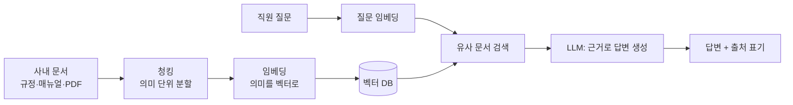

> 🏷️ **[NextX_AX_Solution]** · 주식회사 넥스트엑스(NEXT X) 정식 AX 솔루션 라인업
{: .prompt-tip }

> "그 규정 어디 있죠?", "이 절차 담당이 누구였죠?" — 사내 지식이 문서 여기저기 흩어져 매번 사람에게 묻는다면, **RAG 기반 지식 챗봇**이 답입니다.
> [RAG 개념]()을 실제 **구축 관점**으로 한 단계 더 들어갑니다.
{: .prompt-info }

## 💼 어디에 쓰나 (비즈니스 가치)

- 🧑‍💼 **온보딩** — 신입이 규정·매뉴얼을 챗봇에게 바로 질문
- 📋 **사내 규정/절차 검색** — "휴가 규정", "구매 프로세스"를 즉시
- 🎧 **CS 응대 지원** — 과거 답변·정책을 근거로 초안 생성
- 🔎 **계약·기술 문서 Q&A** — 방대한 문서에서 근거와 함께 답

## 🏗️ 아키텍처

## 🧭 구축 5단계

| 단계 | 하는 일 | 실무 포인트 |
|------|---------|-------------|
| **1. 문서 수집·정제** | 규정·매뉴얼·위키를 모아 텍스트화 | 최신본만, 중복·구버전 제거 |
| **2. 청킹(Chunking)** | 문서를 의미 단위로 분할 | 너무 크면 부정확, 너무 작으면 맥락 손실 |
| **3. 임베딩·적재** | 벡터로 변환해 벡터 DB에 저장 | [임베딩·벡터DB]() 참고 |
| **4. 검색+프롬프트** | 질문과 가까운 조각을 찾아 근거로 주입 | "찾은 근거 밖 내용은 답하지 말 것" |
| **5. 검수·출처** | 답변에 **출처 문서·링크** 표기 | 신뢰·추적성 확보 |

## ⚠️ 실무 함정 (안 겪으면 모르는 것)

- **청킹 전략이 정확도의 절반** — 문단/heading 기준 분할 + 약간의 overlap
- **출처 없으면 안 믿는다** — 답변마다 근거 문서를 반드시 노출
- **권한·보안** — 부서별 접근 권한을 검색 단계에서 필터링 (아무나 인사문서 못 보게)
- **환각 방지** — "문서에 없으면 '자료 없음'이라고 답" 규칙 필수 ([에이전트 관점]())
- **평가(Eval)** — 대표 질문 세트로 정답률을 주기적으로 측정·개선

> 핵심은 "똑똑한 모델"이 아니라 **"잘 정리된 문서 + 정확한 검색 + 출처"** 입니다. RAG 품질의 8할은 검색 설계에서 갈립니다.
{: .prompt-tip }

## 🚀 도입은 작게 시작

전사 도입 전, **문서 50~100건 + 대표 질문 20개**로 파일럿을 만들어 정답률부터 확인합니다. (넥스트엑스의 "작게 검증 → 확장" 원칙)

## 📩 사내 챗봇, 우리 문서로 되나요?

보유 문서 종류만 알려주시면 **파일럿 범위와 예상 정확도**를 짚어드립니다.

- **Email** — [csnextx@gmail.com](mailto:csnextx@gmail.com) · **Tel** — 010-4125-2009 (이경규 전무)
- 자세한 안내 → [Business Inquiry]()

> **주식회사 넥스트엑스(NEXT X)** — 흩어진 지식을 '물어보면 답하는 AI'로.
{: .prompt-info }
