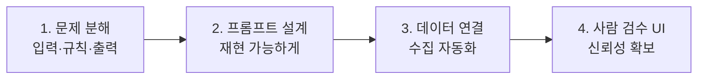

> 🏷️ **[NextX_AX_Solution]** · 주식회사 넥스트엑스(NEXT X) 정식 AX 솔루션 라인업
{: .prompt-tip }

> 기업의 시간은 대부분 **"반복되는 일"** 에 갇혀 있습니다. 넥스트엑스는 그 반복을 **생성형 AI로 걷어내** 사람이 판단에 집중하게 만듭니다.
> 이 글은 우리가 직접 만든 **레퍼런스 빌드**(주간 운영 리포트 자동화)로 그 접근법을 공개합니다.
{: .prompt-info }

## 🎯 흔한 문제 — "매주 같은 일을 처음부터"

많은 팀이 **주간 리포트**에 매주 1~2시간을 씁니다. 지표를 긁어 모으고, 계산하고, 같은 양식을 다시 채우고… 정작 중요한 **해석과 의사결정**엔 시간이 부족합니다. 리포트뿐 아니라 회의록·VOC 정리·제안서 초안도 같은 구조의 반복입니다.

## 🧭 넥스트엑스의 AX 접근법 (4단계)

우리는 "AI를 붙이자"가 아니라 **업무를 구조로 분해**하는 데서 시작합니다.

| 단계 | 하는 일 | 왜 |
|------|---------|----|
| **1. 문제 분해** | 업무를 입력 → 규칙 → 출력으로 해부, 자동/판단 구간 구분 | 어디를 AI가 맡을지 명확해짐 |
| **2. 프롬프트 설계** | 매번 같은 품질이 나오게 프롬프트를 튜닝·검증 | "느낌"이 아닌 재현 가능한 결과 |
| **3. 데이터 연결** | 지표·문서를 자동으로 끌어와 주입 | 수작업(복붙) 제거 |
| **4. 사람 검수 UI** | AI 초안 → 사람이 최종 판단·승인 | 환각 방지, 책임 있는 자동화 |

> 각 단계의 실제 구현 과정은 레퍼런스 빌드에 낱낱이 공개돼 있습니다:
> [#1 문제 정의]() · [#2 설계]() · [#3 프롬프트]() · [#4 데이터]() · [#5 배포]()
{: .prompt-tip }

## 📊 결과 (레퍼런스 빌드 기준)

| 지표 | Before(수작업) | After(자동화) |
|------|:--------------:|:-------------:|
| 리포트 1건 작성 시간 | ~130분 | **~40분** |
| 수치 오기입 | 간헐 발생 | **0건** |
| 사람의 역할 | 수집·정리 | **해석·의사결정** |

> ※ 위 수치는 넥스트엑스가 만든 **자사 레퍼런스 빌드** 기준이며, 실제 도입 효과는 업무·데이터 환경에 따라 달라집니다.
{: .prompt-warning }

## 🔁 이 접근법이 통하는 업무들

같은 4단계로 확장할 수 있습니다.

- 📝 **문서·리포트 자동화** — 주간/월간 리포트, 제안서 초안
- 🗂️ **VOC·문의 분류** — 고객 문의 자동 태깅·요약
- 🗣️ **회의록 정리** — 녹취 → 결정사항·액션아이템 추출
- 🔎 **사내 지식 검색** — RAG로 "우리 문서를 아는" 챗봇

## 🔗 이어지는 솔루션 (카테고리 교차 참고)

이 에이전트를 **실제 시스템**으로 굴리려면 여러 카테고리가 맞물립니다:

- 🧠 **판단 로직(AX)** → [프롬프트를 v1→v3로 튜닝한 실험]() · [사내 문서를 아는 RAG 챗봇]()
- 📊 **백엔드 데이터(Data)** → 지표는 [데이터 파이프라인]()으로 모으고, [데이터 클렌징]()으로 품질을 확보해야 결과가 정확합니다
- ⚡ **다른 반복 업무로 확장(Automation)** → [엑셀 자동화]() · [문서 대량 생성]()
- 🛠️ **연동·실시간화(Dev)** → [API란?]() · [웹훅으로 자동 알림]()

## 📩 우리 회사 업무에 적용하려면

"이 반복 업무, 자동화될까?"가 궁금하시면 편하게 문의 주세요. **문제 분해 → 작은 MVP로 효과 검증 → 확장** 순서로 함께 시작합니다.

- **Email** — [csnextx@gmail.com](mailto:csnextx@gmail.com) · **Tel** — 010-4125-2009 (이경규 전무)
- 자세한 안내 → [Business Inquiry]()

> **주식회사 넥스트엑스(NEXT X)** — AI 전환(AX)과 업무 자동화로 일하는 방식을 바꿉니다.
{: .prompt-info }

---

> 📎 본 글은 **주식회사 넥스트엑스(NEXT X) 기술연구소**의 R&D 자산입니다.
> **함께 읽기** — [🤖 AX 대표 사례]() · [📖 블로그 안내]() · [📩 비즈니스 문의]()
{: .prompt-info }
