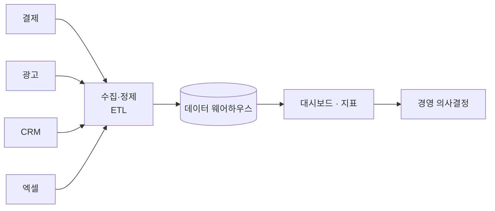

> 🏷️ **[NextX_Data_Solution]** · 주식회사 넥스트엑스(NEXT X) 정식 데이터 솔루션
{: .prompt-tip }

> 대표님, 데이터는 많은데 **"그래서 지금 우리 회사 어떤데?"** 에 바로 답하기 어렵진 않나요?
> 문제는 데이터가 없어서가 아니라, **여기저기 흩어져 있고 매번 사람이 모아야** 하기 때문입니다. 넥스트엑스는 이 과정을 **자동 파이프라인**으로 만듭니다.
{: .prompt-info }

## 🧩 흔한 상황 — "데이터는 있는데 지표가 없다"

- 매출은 결제사, 광고비는 광고 플랫폼, 고객은 CRM, 재고는 엑셀… **소스가 제각각**
- 볼 때마다 담당자가 **수기로 취합** → 시점마다 숫자가 다름
- 정작 **"이번 달 순이익률", "채널별 ROAS"** 같은 지표는 **한참 뒤에** 나옴

## 🔧 데이터 파이프라인이란 (한 문장)

> **여러 곳의 원시 데이터를 자동으로 모아 → 정제하고 → 한 곳에 쌓아 → 지표·대시보드로** 흘려보내는 자동화된 경로.

## 🧭 넥스트엑스의 구축 접근법 (4단계)

| 단계 | 하는 일 |
|------|---------|
| **1. 지표 정의** | "무엇을 보고 결정할지" 핵심 지표(KPI)부터 확정 |
| **2. 소스 연결** | 결제·광고·CRM·시트 등 데이터 소스를 자동 수집 |
| **3. 정제·적재** | 형식 통일·중복 제거 후 한 곳(웨어하우스)에 축적 |
| **4. 시각화** | 대시보드(BI)로 자동 갱신되는 지표 제공 |

> 핵심 원칙: **지표(무엇을 볼지)부터 정의**하고 거꾸로 파이프라인을 설계합니다. "일단 다 모으자"는 비용만 키웁니다.
{: .prompt-tip }

## 💡 이렇게 바뀝니다

| | Before | After |
|---|--------|-------|
| 지표 확인 | 담당자가 매번 수집(반나절) | **자동 갱신, 실시간** |
| 신뢰도 | 취합 시점마다 다름 | **단일 기준(Single Source of Truth)** |
| 사람의 역할 | 데이터 모으기 | **데이터로 의사결정** |

> 이런 데이터의 '의미 기반' 검색·활용이 필요하면 [임베딩 & 벡터 DB]()까지 확장할 수 있습니다.

> 💬 **팀 노트** — 넥스트엑스는 이런 데이터 구조를 회의실 안에서만 논하지 않습니다. 얼마 전엔 **정석현 상무와 청계천을 걸으며** "흩어진 데이터를 어떻게 한눈에 보이게 할까"를 두고 한참 이야기했죠. 좋은 설계는 대체로 이런 편한 대화에서 시작됩니다.
{: .prompt-tip }

## 📩 데이터, 지표로 바꿔드립니다

"우리 데이터로 이런 지표 볼 수 있을까요?" 궁금하시면 **무료 진단**부터 시작하세요.

- **Email** — [csnextx@gmail.com](mailto:csnextx@gmail.com) · **Tel** — 010-4125-2009 (이경규 전무)
- 자세한 안내 → [Business Inquiry]()

> **주식회사 넥스트엑스(NEXT X)** — 흩어진 데이터를 결정 가능한 지표로.
{: .prompt-info }
