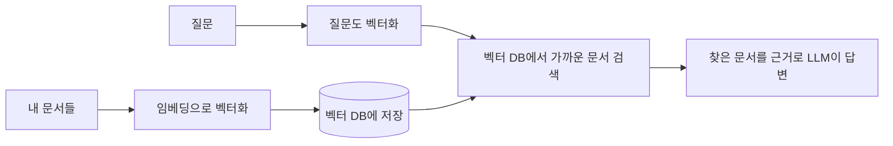

> 🏷️ **[NextX_Data_Solution]** · 주식회사 넥스트엑스(NEXT X) 정식 데이터 솔루션
{: .prompt-tip }

> [RAG]()는 "관련 문서를 찾아 근거로 답한다"고 했죠. 그런데 **"관련 있는 문서"를 어떻게 찾을까요?** 그 비밀이 임베딩과 벡터 DB입니다.
{: .prompt-info }

## 🔑 문제: 키워드 검색의 한계

옛날 검색은 **단어가 똑같이 겹쳐야** 찾았습니다.
- 질문: "환불 어떻게 해요?"
- 문서: "**결제 취소** 절차 안내" → 단어가 안 겹쳐서 **놓침** ❌

하지만 둘은 **의미가 같습니다.** 이걸 잡아내는 게 임베딩이에요.

## 🧭 임베딩(Embedding)이란

> 글의 **의미를 숫자 좌표(벡터)로 바꾸는 것.** 의미가 비슷한 글은 좌표상 **가까이** 놓입니다.

```text
"환불"        → [0.81, 0.12, ...]  ┐  가까움 (의미 유사)
"결제 취소"   → [0.79, 0.15, ...]  ┘
"점심 메뉴"   → [0.03, 0.94, ...]     멀리 떨어짐
```

즉, 단어가 달라도 **의미가 가까우면 가까운 숫자**가 됩니다. 이게 "의미 검색(Semantic Search)"의 핵심.

## 🗄️ 벡터 DB(Vector Database)

이 숫자 좌표들을 저장하고, **"가장 가까운 것들"을 빠르게 찾아주는** 특수 데이터베이스입니다.



이 전체가 곧 [RAG]()의 '검색' 부분입니다.

## 🏢 내 프로젝트에 대입

[운영 리포트 에이전트]()의 VOC 분류에 적용하면:

- 과거 문의들을 **임베딩해서 벡터 DB에** 저장
- 새 문의가 오면 **의미가 가장 가까운 과거 사례**를 찾아
- "이건 예전에 '버그'로 분류했었다"는 근거와 함께 분류

> 단어가 아니라 **의미로 찾으니**, "앱이 먹통이에요" = "실행이 안 돼요" = "튕겨요"를 같은 이슈로 묶을 수 있습니다.
{: .prompt-tip }

## ⚠️ 알아둘 점

- 임베딩 품질(어떤 모델을 쓰나)에 따라 검색 정확도가 갈림
- 문서를 **어떻게 잘게 쪼개 저장하나(chunking)** 가 실전 난관
- 벡터 DB도 저장·조회 비용이 든다 → 규모에 맞게 선택

## 🔗 함께 보기

- [RAG 쉽게 이해하기]() · [AI 용어 사전]()

> 요약: **임베딩 = 의미를 숫자로**, **벡터 DB = 가까운 의미를 빠르게 검색.** 둘이 RAG의 '똑똑한 검색'을 만든다.
{: .prompt-info }


---

> 📎 본 글은 **주식회사 넥스트엑스(NEXT X) 기술연구소**의 R&D 자산입니다.
> **함께 읽기** — [📊 데이터 대표 사례]() · [📖 블로그 안내]() · [📩 비즈니스 문의]()
{: .prompt-info }
