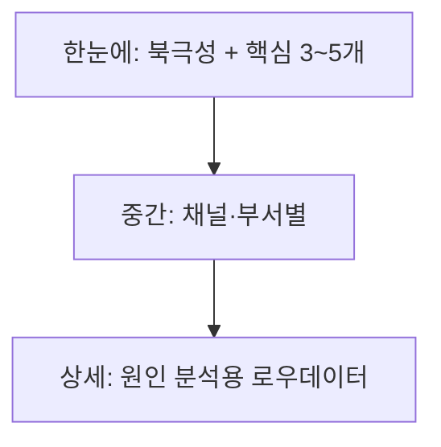

> 대시보드를 만들었는데 **아무도 안 본다면?** 대부분 "숫자는 많은데 결정에 안 쓰이기" 때문입니다.
> [데이터 파이프라인]()으로 데이터를 모았다면, 마지막은 **"보면 결정되는" 대시보드**입니다.
{: .prompt-info }

## ❌ 안 쓰이는 대시보드의 공통점

- 지표가 **30개** — 뭘 봐야 할지 모름
- **맥락 없는 숫자** — "매출 1억"이 좋은 건지 나쁜 건지 모름
- **액션이 안 나옴** — 봐도 "그래서 뭘 하지?"

## 🧭 설계 원칙 4가지

### 1. 북극성 지표(North Star)부터
회사가 **가장 중요하게 보는 단 하나**를 맨 위 크게. (예: MRR, 활성사용자, 순이익률)

### 2. 항상 "비교"와 함께
숫자 하나는 의미가 없습니다. **전기 대비·목표 대비**를 붙여야 판단이 됩니다.

```text
매출  1.2억   ▲ 20% (전월)   ● 목표 대비 96%
```

### 3. 피라미드 구조 (요약 → 드릴다운)



경영진은 **맨 위 한 화면**, 실무자는 **드릴다운**으로. 한 대시보드에 다 넣지 않습니다.

### 4. 색은 '의미'로만
빨강=주의, 초록=양호처럼 **의미 있는 곳에만** 색을. 무지개 대시보드는 피로합니다.

## 📐 지표 설계 예시 (SaaS 가정)

| 층위 | 지표 |
|------|------|
| 🌟 북극성 | 월 반복매출(MRR) |
| 핵심 | 신규/이탈, 전환율, CAC, LTV |
| 채널 | 채널별 유입·ROAS |
| 상세 | 코호트·퍼널 원본 |

> 지표는 "볼 수 있는 것"이 아니라 **"결정에 필요한 것"** 으로 고릅니다. 나머지는 과감히 숨기세요.
{: .prompt-tip }

## 🛠️ 도구

- **Metabase / Looker Studio** — 빠르게 시작(무료~저비용)
- **Power BI / Tableau** — 대규모·고급 시각화
- 핵심은 도구가 아니라 **지표 정의와 데이터 신뢰성**([SSOT]())

## ⚠️ 자주 하는 실수

- 📉 **허영 지표(vanity metric)** — 늘어도 사업에 의미 없는 숫자(단순 조회수 등)
- 🔄 **수기 갱신** — 사람이 매번 업데이트하면 결국 안 봄 → **자동 갱신** 필수
- 🧩 **정의 불일치** — "매출" 기준이 팀마다 다름 → 정의를 한곳에 문서화

## 📩 대시보드, 결정 도구로 만들어드립니다

"우리 회사는 뭘 봐야 하죠?"부터 함께 정의합니다.
→ [Business Inquiry]() · [csnextx@gmail.com](mailto:csnextx@gmail.com)

> **주식회사 넥스트엑스(NEXT X)** — 데이터를 '결정'으로 바꿉니다.
{: .prompt-info }
