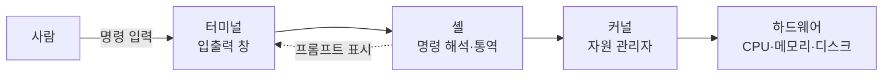

> 🏷️ **[NextX_R&D_Log]** · 모두의연구소 아이펠 AI 에이전트 1기 [바이브 코딩으로 웹 서비스 개발하기] 학습 기록
{: .prompt-tip }

> 검은 창을 처음 열면 껌벅이는 커서와 낯선 기호가 한 덩어리로 보여, 보통 "터미널에 명령어를 쳤다"라고 퉁쳐 말합니다. 하지만 이 한 문장 안에는 **역할이 다른 4가지**가 숨어 있습니다. 이걸 구분할 수 있어야 [바이브 코딩]() 중 에러가 터졌을 때 **AI에게 정확히 질문하고 빠르게 디버깅**할 수 있습니다.
{: .prompt-info }

## 🗺️ 한눈에 보는 4총사

명령이 컴퓨터에 전달되는 과정은 **대형 콘서트홀** 운영과 똑같습니다.



| 구성 | 비유 | 한 줄 역할 |
|------|------|-----------|
| **터미널** | 창문 | 글자를 입력받고 보여주기만 함 (해석 X) |
| **셸** | 통역사 | 사람 명령어를 해석해 프로그램 실행 |
| **커널** | 총감독 | 하드웨어 자원을 실제로 움직이는 중심 |
| **프롬프트** | 재촉 표시 | "입력하세요" 하고 셸이 띄우는 기호 |

## 1️⃣ 터미널(Terminal) — 사람이 만나는 "말단 장치"

- **역사**: 1960~70년대 컴퓨터가 집 한 채 값이던 시절, 본체 앞에 앉지 못한 사람들은 **키보드·화면만 달린 말단 장치**를 연결해 썼습니다. 선로의 *끝단(terminal)* 이라 붙은 이름이죠.
- **지금**: macOS의 Terminal, 윈도우의 **PowerShell 창**, VS Code 내장 터미널 모두 옛 물리 장치를 소프트웨어로 재현한 **'터미널 에뮬레이터'** 입니다.
- **핵심**: 글자를 **입출력만** 할 뿐, 명령어의 뜻은 해석하지 못하는 **외형 창문**.

## 2️⃣ 셸(Shell) — 명령어를 번역하는 "껍데기"

- **역사**: 알맹이인 커널을 **감싼 바깥 껍데기(shell)** 라는 뜻.
- **지금**: 사람이 쓴 명령어를 컴퓨터가 알아들을 신호로 **해석해 실행**하는 '명령어 해석기'.
- **종류**: Unix 계열 `bash`, macOS 기본 `zsh`, 윈도우 **`PowerShell`**. 셸은 특정 앱 이름이 아니라 **명령을 해석하는 프로그램 계열**을 뜻합니다.

## 3️⃣ 커널(Kernel) — 운영체제의 "알맹이"

- **뜻**: kernel = *알맹이·핵심·씨앗*.
- **지금**: CPU·메모리·디스크·네트워크 같은 **하드웨어 자원을 관리**하는 운영체제의 절대 중심.
- **핵심**: 사람은 커널에게 직접 말할 수 없습니다. **셸(통역사)이 번역한 명령**을 받아 실제로 하드웨어를 움직입니다.

## 4️⃣ 프롬프트(Prompt) — 대기를 알리는 "표시"

- **뜻**: prompt = *재촉하다, 응답을 요구하다*.
- **지금**: 셸이 "준비됐으니 명령을 입력하라"고 띄우는 `$`, `%`, `PS C:\>` 같은 기호.

> 🚨 **프롬프트는 명령어가 아닙니다!** 문서에 `% pwd` 라고 적혀 있으면 `%`는 프롬프트이므로 **`pwd`만** 입력해야 합니다.
{: .prompt-warning }

**윈도우 예시 (전무님 환경)** — 아래 한 줄에서 색으로 구분하면:

```text
PS C:\Users\LKG> node --version
└──── 프롬프트 ────┘ └── 명령어 ──┘
```

`PS C:\Users\LKG>` 까지는 **셸(PowerShell)이 그려준 프롬프트**, 실제로 내가 입력하는 건 `node --version` 뿐입니다.

## 🤖 그럼 Claude Code는 어디에 속할까?

> **"Claude Code는 터미널도, 셸도, 커널도 아닙니다."**
{: .prompt-tip }

Claude Code는 **셸 위에서 실행되는 똑똑한 프로그램(앱)** 일 뿐입니다. 터미널에서 `claude`를 치면 → 셸이 주소록(`$PATH`)에서 프로그램을 찾아 실행하고 → Claude Code는 그 **셸이 허용한 권한 안에서** 파일을 고치고 명령을 내립니다. AI가 아무리 강력해도 **운영체제(커널)의 권한과 현재 작업 폴더를 초월할 수 없습니다.** (그래서 [Git 안전장치]()가 중요하죠.)

## 🛠️ 실전 꿀팁 — 에러 메시지 분석 지도

이 구분을 알면, 에러가 났을 때 **어느 층위가 고장 났는지** 바로 추적됩니다.

| 에러 | 원인 층위 | 무슨 상태인가 |
|------|-----------|---------------|
| ❌ `command not found` | **셸** | 셸이 `$PATH` 주소록에서 프로그램을 못 찾음 (설치 안 됨/경로 미설정) |
| ❌ `Permission denied` · `EACCES` | **커널/OS** | 프로그램은 찾았으나 OS가 **접근 권한**을 막음 |
| ❌ 창이 멈추거나 글자가 깨짐 | **터미널 앱** | 인코딩·화면 출력이 꼬임 |

## 💡 마무리 한 줄

앞으로 AI 에이전트에게 오류 수정을 요청할 땐 "안 돼요"라고만 하지 말고,

> **① 현재 작업 폴더(`pwd`) · ② 실행한 명령어 · ③ 터미널에 뜬 에러 원문** — 이 3가지를 통째로 묶어 넘기세요.

내가 컴퓨터의 **동작 지도**를 이해하고 있을 때, AI는 추측을 멈추고 훨씬 안전하고 정확한 답을 줍니다.

## 🔗 이어지는 R&D 일지

- 🛠️ **작업대 세팅 전체** → [바이브 코딩의 시작 — AI 작업대 차리기]()
- 💡 **개념** → [바이브 코딩이란?]() · [API란?]()
- 📖 **학습 여정** → [아이펠 AI 에이전트 1기]()

---

> 📎 본 글은 **주식회사 넥스트엑스(NEXT X) 기술연구소**의 R&D 자산입니다.
> **함께 읽기** — [🛠️ 개발 대표 사례]() · [📖 블로그 안내]() · [📩 비즈니스 문의]()
{: .prompt-info }
