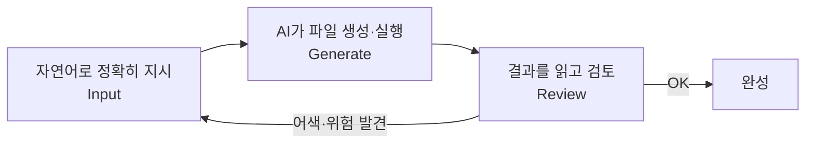

> 🏷️ **[NextX_R&D_Log]** · 모두의연구소 아이펠 AI 에이전트 1기 [바이브 코딩으로 웹 서비스 개발하기] 학습 기록
{: .prompt-tip }

> AI에게 무작정 "코드 짜줘"라고 요청하는 단계를 넘어, **내 컴퓨터에서 말하는 대로 손이 움직이는** 에이전틱 코딩(Agentic Coding) 작업대를 구축하고 첫 웹페이지를 빌드한 기록입니다. 넥스트엑스가 [바이브 코딩]()을 실제 업무에 쓰기 위한 R&D 실전 일지죠.
{: .prompt-info }

## 💡 바이브 코딩이란?

단순히 챗봇에게 코드를 물어보고 복사·붙여넣기 하는 게 아닙니다. **개발 스케치(컴퓨팅 사고)** 를 바탕으로, 내가 자연어로 지시하면 AI가 **직접 내 컴퓨터의 파일을 만들고·고치고·명령어를 실행해** 결과물을 확인하는 협업 과정입니다.

> 더 깊은 개념·주의점은 → [바이브 코딩이란?]() · [도구 비교]()

## 🏗️ AI 작업대를 구성하는 5가지 핵심 도구

백지 상태에서 코딩을 직접 하지 않으려면, **AI가 자유롭게 일할 수 있는 인프라**가 필요합니다. 오늘 세팅한 5가지 핵심 장비입니다.

| 도구 | 역할 (What) | 왜 필요한가 (Why) |
|------|-------------|-------------------|
| **Claude Code** | 에이전틱 코딩 도구 | 오늘의 주인공. 자연어 지시로 스스로 파일을 생성·수정 |
| **Node.js & npm** | JS 실행 엔진 & 패키지 창고 | 앞으로 만들 웹 서비스(Next.js 등)를 내 컴퓨터에서 실제로 구동 |
| **uv** | 초고속 파이썬 패키지 관리자 | AI 도구·가상환경을 충돌 없이 빠르게 준비하는 독립 작업실 |
| **Git** | 변경 이력 추적 장치 | AI가 코드를 마음껏 고쳐도 되돌릴 수 있는 "타임머신" 안전장치 |
| **터미널** | 글자로 명령을 내리는 창 | AI가 남긴 로그·결과를 직접 확인하는 **작업 대화창** |

## 🤖 Claude Code의 두 가지 얼굴

- **데스크톱 앱(GUI)** — 마우스로 조작하는 그래픽 화면. 코드 변경 내역(diff)을 **시각적으로** 보여줘 초심자가 검토하기 좋습니다.
- **터미널 `claude` (CLI)** — 글자로만 소통하는 화면. 파일 시스템 전체 접근·자동화가 가능한 **가장 완전한 형태**의 인터페이스입니다.

## 🔍 [실습 1] 내 작업대 상태 검증하기

> AI가 "설치했습니다"라고 말하는 것만 믿으면 안 됩니다. **내 컴퓨터에서 진짜 도는지** 버전 출력으로 직접 눈으로 검증합니다.
{: .prompt-warning }

```bash
pwd              # 현재 위치한 폴더 경로 확인
node --version   # Node.js 설치 버전
npm --version    # npm 패키지 매니저 버전
uv --version     # uv 파이썬 도구 버전
git --version    # Git 버전
claude --version # Claude Code 버전
```

**⚠️ `command not found` 에러가 난다면?** 당황하지 말고 에러 한 줄을 그대로 복사해, AI에게 **환경(OS)·명령어·실제 출력**을 분리해서 질문하세요. 대개 몇 초 만에 해결 가이드가 나옵니다.

## 🚀 [실습 2] 3분 만에 첫 웹페이지 생성하기

백지 상태에서 HTML을 외워 쓰지 않고, **Claude Code에게 파일 생성을 직접 명령**합니다.

**① 프로젝트 폴더 만들기**

```bash
mkdir my-first-web
cd my-first-web
touch index.html          # Windows PowerShell: New-Item index.html
```

**② Claude Code에게 내리는 "마법의 프롬프트"** — 폴더에서 `claude` 실행 후, 내 도메인에 맞게 주문합니다.

```text
index.html 파일에 브라우저에서 바로 열 수 있는 첫 화면을 만들어줘.
조건:
1. 한국어 문서로 설정해줘.
2. 큰 제목에는 [내 이름 또는 역할]을 넣어줘.
3. 본문에는 [내 도메인]에서 AI로 해보고 싶은 일을 한 문장으로 넣어줘.
```

**③ AI가 뚝딱 만들어 준 결과물**

```html
<!DOCTYPE html>
<html lang="ko">
<head>
    <meta charset="UTF-8">
    <title>나의 첫 웹페이지</title>
</head>
<body>
    <h1>비즈니스 생산성 파트너 LKG</h1>
    <p>반복되는 매출 보고서 작성과 루틴한 이메일 초안 작성 업무를
       AI 에이전트로 자동화하고 싶습니다.</p>
</body>
</html>
```

> 🎯 **중요한 것은 '검토(Review)'** — 브라우저로 `index.html`을 열어 글자가 잘 보이는지, 본문 문장이 내 비즈니스 목표를 **추상적이지 않고 또렷하게** 표현하는지 **주도적으로 판단**해야 합니다. AI가 만든 결과를 그대로 수용하지 않는 것 — 그게 사람의 역할입니다.
{: .prompt-tip }

## 🔁 바이브 코딩 루프 — 오늘 세션의 핵심 흐름



핵심은 **타이핑 속도가 아니라**, 정확히 지시하고(Input) → AI 결과물을 읽고 위험·어색한 부분을 찾아 다시 명령하는 **피드백 루프**를 돌리는 능력입니다.

## 🧭 오늘 세션 전체 커리큘럼 (8강)

작업대 세팅은 물론, 터미널 개념과 안전한 파일 정리까지 다뤘습니다.

1. AI에게 일을 맡길 작업대를 차린다는 것
2. 내 작업대 상태 확인하기 *(실습 1)*
3. 첫 프로젝트 폴더와 파일 만들기
4. 바이브 코딩 루프 한 번 돌리기 *(실습 2)*
5. **터미널·셸·커널·프롬프트** 구분하기 — 헷갈리는 4가지 용어 정리 → [완벽 정리 심화편]()
6. 터미널로 폴더를 탐험하고 만들기 (`cd`·`ls`·`mkdir`)
7. **AI와 바탕화면 폴더를 안전하게 정리하기** — 삭제·이동 전 Git·백업으로 안전장치
8. 직접 작업과 AI 협업을 비교하고 회고하기

> 특히 5번(용어 구분)과 7번(안전한 정리)은 초심자가 가장 많이 사고 내는 지점이라, **되돌릴 수 있는 안전장치(Git)** 를 먼저 갖추는 게 중요합니다.
{: .prompt-info }

## 📝 오늘의 한 줄 회고

> **"개발 환경은 AI에게 일을 시키고, 그 결과를 바로 검토·수정하기 위한 작업대다."**

첫 작업대가 완벽히 차려졌으니, 남은 과정 동안 이 위에서 멋진 에이전트 서비스를 쏘아 올려 보겠습니다. 🚀 이 배움이 넥스트엑스의 [AX 솔루션]()으로 이어집니다.

## 🔗 이어지는 R&D 일지

- 🛠️ **개념·도구** → [바이브 코딩이란?]() · [바이브코딩 도구 비교]()
- 🤖 **작업대 위에서 만든 것(AX)** → [운영 리포트 에이전트 빌드 #1]() · [AX 대표 사례]()
- 📖 **학습 여정 시작** → [아이펠 AI 에이전트 1기]()

---

> 📎 본 글은 **주식회사 넥스트엑스(NEXT X) 기술연구소**의 R&D 자산입니다.
> **함께 읽기** — [🛠️ 개발 대표 사례]() · [📖 블로그 안내]() · [📩 비즈니스 문의]()
{: .prompt-info }
