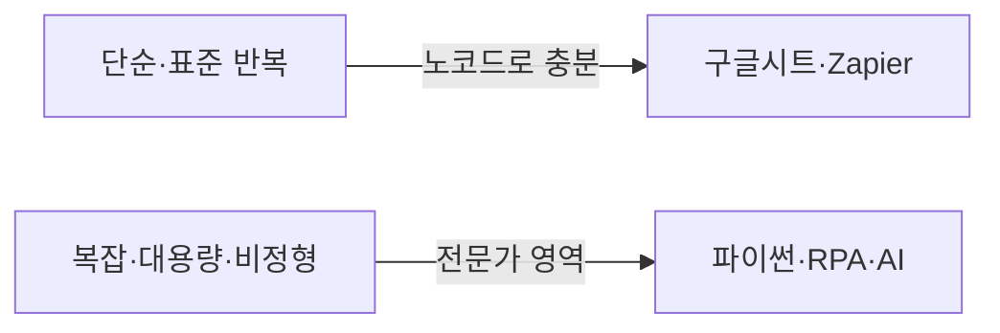

> 🏷️ **[NextX_Automation_Solution]** · 주식회사 넥스트엑스(NEXT X) 정식 업무 자동화 솔루션
{: .prompt-tip }

> "자동화는 개발자가 있어야 하는 거 아냐?" — 아닙니다. **오늘 혼자서** 시작할 수 있는 3가지를 소개합니다.
{: .prompt-info }

## 1️⃣ 구글 시트로 "살아있는" 문서 만들기

엑셀을 구글 시트로 옮기면 그 자체가 자동화의 시작입니다.
- **`IMPORTRANGE`** — 여러 시트를 자동으로 한곳에 취합
- **`GOOGLEFINANCE`·`IMPORTHTML`** — 환율·웹 표를 자동으로 가져오기
- **공유 링크** — "최신본 어디 있어요?"가 사라짐 (항상 한 곳)

> 여기에 **Apps Script**(구글 시트 내장, 약간의 스크립트)를 더하면 "매일 아침 요약 메일 자동 발송"까지 됩니다.

## 2️⃣ 노코드 연결 툴 (Zapier / Make)

앱과 앱을 **"이러면 → 저렇게"** 규칙으로 잇는 도구입니다. 클릭으로 만듭니다.

| 예시 트리거 | 자동 동작 |
|-------------|-----------|
| 문의 폼 접수되면 | → 슬랙 알림 + 시트에 행 추가 |
| 특정 메일 오면 | → 첨부파일을 드라이브에 저장 |
| 새 주문 들어오면 | → 문자·카톡 알림 |

- **Zapier / Make**(구 Integromat) 등이 대표적
- 코드 없이 웬만한 "앱 사이 반복"을 없앨 수 있음

## 3️⃣ 예약 실행 (스케줄러)

"매주 월요일 아침에 자동으로" 같은 반복은 예약만 걸면 됩니다.
- Windows **작업 스케줄러**, Mac/서버 **cron**
- 노코드 툴 대부분에 **스케줄 트리거** 내장

## 🧭 어디까지 노코드로, 언제 전문가가?

| 노코드로 OK | 전문가가 필요 |
|-------------|----------------|
| 앱 간 알림·기록 | 수만 건 대용량 처리 |
| 간단한 취합·폼 | 복잡한 규칙·예외 처리 |
| 정형 데이터 | 비정형 문서 판단([AI 레이어]()) |

> 팁: **노코드로 먼저 만들어보고**, "여기서 막힌다" 싶을 때 전문가를 부르면 비용을 아낍니다. 깊이 들어가려면 → [파이썬 엑셀 자동화]()
{: .prompt-tip }

## 📩 노코드로 안 되는 지점이 오면

무료 진단으로 "이건 노코드, 이건 전문가"를 구분해 드립니다.
→ [Business Inquiry]() · [csnextx@gmail.com](mailto:csnextx@gmail.com)

> **주식회사 넥스트엑스(NEXT X)** — 작게 시작해, 필요할 때 키웁니다.
{: .prompt-info }
