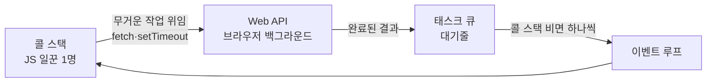

> 🏷️ **[NextX_R&D_Log]** · 모두의연구소 아이펠 AI 에이전트 1기 [바이브 코딩으로 웹 만들기] 학습 기록
{: .prompt-tip }

> **"구글 지도는 어떻게 화면을 움직이면서 동시에 데이터를 끊임없이 받아올까?"** — 이 질문의 답이 오늘의 주제입니다. 웹을 멈추지 않게 만드는 컴퓨터의 일 처리 방식을 쉽게 파헤쳐 봅니다. (웹의 전체 구조는 [세 겹(HTML·CSS·JS)]() 편을 먼저 보셔도 좋아요.)
{: .prompt-info }

## 📞 1. 동기(Sync) vs 비동기(Async) — 전화와 문자

핵심은 **기다림(Wait)을 어떻게 처리하느냐**입니다.

| | 동기(Synchronous) | 비동기(Asynchronous) |
|---|---|---|
| 한마디 | "끝날 때까지 아무것도 안 해!" | "일단 걸어두고 내 일 할게!" |
| 비유 | 📞 **전화** — 받을 때까지 대기 | 💬 **문자** — 보내놓고 딴 일 하다 답장 확인 |
| 코드 | 앞 작업 끝날 때까지 **멈춤** | 예약해두고 **다음 코드 즉시 실행**, 완료 신호 오면 처리 |

> ☕ **카페 진동벨 비유** — 진동벨이 없으면 커피 나올 때까지 카운터 앞에 서 있어야 합니다(동기, 뒷줄이 밀림). 진동벨을 받으면 자리에서 책 읽다가 울릴 때 받으러 갑니다(비동기). 커피 나오는 시간은 같지만, **"기다리는 동안 다른 일을 할 수 있는가"** 가 결정적 차이입니다.
{: .prompt-tip }

## 🏃 2. 자바스크립트는 '외팔이 일꾼' (싱글 스레드)

웹브라우저의 자바스크립트는 한 번에 **딱 한 가지 일만** 하는 **싱글 스레드** 엔진입니다. 일꾼이 단 한 명이죠.

**만약 일꾼 하나가 동기로만 일한다면?** 서버 응답에 3초가 걸리면, 그 3초간 **멍하니 대기** → 화면 전체가 **얼어붙습니다(Freeze).** 스크롤도, 클릭도, 로딩 아이콘마저 멈추는 최악의 UX죠.

**해결책: 오래 걸리는 일은 브라우저에게 토스! 🥎**

1. 오래 걸리는 일(`fetch`·`setTimeout`)은 **요청만 던지고** 다음 코드로.
2. 무거운 일은 **브라우저(Web API)가 백그라운드에서** 대신 처리.
3. 끝나면 결과가 **태스크 큐(대기줄)** 에 올라감.
4. 유일한 일꾼은 자기 일을 하다가 대기줄을 순서대로 확인해 처리.

이 **대기줄을 끊임없이 감시하고 돌리는 구조**가 바로 **이벤트 루프(Event Loop)** 입니다. 덕분에 데이터를 불러오는 중에도 스크롤·클릭이 얼지 않습니다.

## 🏢 3. 프로세스 · 스레드 · 코어

시야를 컴퓨터 시스템 전체로 넓히면 이렇게 나뉩니다.

| 개념 | 비유 | 특징 |
|------|------|------|
| **코어(Core)** | 실제 두뇌 (일꾼 수) | CPU 칩에 **물리적으로** 존재하는 연산 장치. 많을수록 동시에 더 많은 연산 |
| **프로세스(Process)** | 독립된 전용 작업실 | 실행 중인 프로그램 단위. **독립 메모리**라 하나가 죽어도 다른 것 무사 |
| **스레드(Thread)** | 작업실 안 일꾼 | 프로세스 내부 실행 흐름. 메모리 **공유**로 가볍고 빠르지만, 같은 자원 동시 접근 시 **꼬임(Race Condition)** |

> 💡 **실생활 예시**
> - **크롬 탭 (멀티 프로세스)** — 탭마다 독립 프로세스라, 한 탭이 먹통 나도 다른 탭은 멀쩡.
> - **한 페이지 렌더링 (멀티 스레드)** — 한 탭 안에서 화면 그리기·글자·네트워크 일꾼이 **같은 메모리를 공유**하며 일사불란하게 움직임.
{: .prompt-tip }

> 참고 — 코어보다 스레드가 훨씬 많아도, OS가 **시분할(Time-sharing)** 로 아주 짧은 시간 단위로 번갈아 실행해 **동시에 처리되는 것처럼** 보입니다.

## ✍️ 한 줄 요약

> **싱글 스레드(일꾼 1명) 자바스크립트가 웹을 멈추지 않고 부드럽게 유지하는 비결은, 오래 걸리는 작업을 브라우저에 비동기로 맡기고 이벤트 루프로 효율적으로 분담하기 때문이다.**

컴퓨터가 **기다림을 다루는 이 영리한 방식** 덕분에, 우리는 끊김 없는 구글 지도와 실시간 댓글 창을 경험합니다.

## 🔗 이어보기

- 🧱 **웹의 전체 구조** → [웹을 지탱하는 세 겹(HTML·CSS·JS)]()
- 🛠️ **개발 기초** → [터미널·셸·커널·프롬프트]() · [API란 무엇인가]()
- 🤖 **바이브 코딩** → [작업대 차리기]()

---

> 📎 본 글은 **주식회사 넥스트엑스(NEXT X) 기술연구소**의 R&D 자산입니다.
> **함께 읽기** — [🛠️ 개발 대표 사례]() · [📖 블로그 안내]() · [📩 비즈니스 문의]()
{: .prompt-info }
