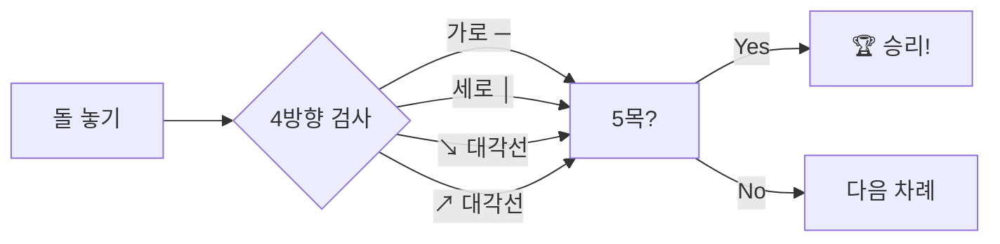
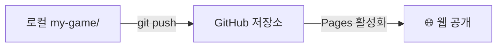

> 🏷️ **[NextX_R&D_Log]** · 모두의연구소 아이펠 AI 에이전트 1기 [웹페이지를 이루는 세 겹 & 게임 만들기] 학습 기록
{: .prompt-tip }

> [웹을 지탱하는 세 겹(HTML·CSS·JS)]()에서 배운 **관심사의 분리(SoC)** — 이론은 알겠는데, 진짜 코드에서 어떻게 나뉘는 걸까? 이 글은 그 답을 **오목 게임을 직접 만들며** 몸으로 증명한 실전 기록입니다.
{: .prompt-info }

## 🎯 왜 하필 오목인가

"게임 만들기"가 학습 과정에 들어있는 이유는 단순합니다. **웹의 세 겹(구조·표현·동작)이 가장 극적으로 드러나는 장르**가 게임이기 때문입니다.

| 레이어 | 오목에서의 역할 |
|--------|-----------------|
| **HTML** (구조) | 오목판 캔버스, 상태 표시, 결과 모달 — "무엇이 있는가" |
| **CSS** (표현) | 나무 질감 보드, 반응형 레이아웃, 차례 피드백 — "어떻게 보이는가" |
| **JavaScript** (동작) | 돌 놓기, 승리 판정, 호버 가이드 — "무엇이 바뀌는가" |

게시판이나 포트폴리오 사이트에서는 세 레이어의 경계가 모호합니다. 하지만 게임은 **클릭 한 번에 구조·표현·로직이 동시에 반응**하기 때문에, 각 레이어가 맡는 역할이 분명히 보입니다.

## 🏗️ 프로젝트 구조 — 정확히 3개의 파일

```
my-game/
├── index.html   ← 구조 (뼈대)
├── styles.css   ← 표현 (스타일)
└── script.js    ← 동작 (로직)
```

파일이 3개뿐이라는 것 자체가 학습 포인트입니다. **하나의 기능(오목 게임)을 세 가지 관심사로 깨끗이 분리**한 것이죠.

## ⚙️ 핵심 구현 — 레이어별 하이라이트

### 1️⃣ HTML — 의미만 담는다

```html
<div class="container">
  <div id="status" class="status black-turn">
    <span class="stone-indicator"></span>
    <span id="status-text">흑돌 차례</span>
  </div>
  <div class="board-wrapper">
    <canvas id="board"></canvas>
  </div>
</div>
```

HTML에는 **색상도, 크기도, 동작도 없습니다.** "여기에 상태 표시가 있고, 여기에 캔버스가 있다"는 **의미**만 선언합니다. 나머지는 CSS와 JS의 몫이죠.

### 2️⃣ CSS — 나무 질감 보드 & 반응형

```css
.board-wrapper {
  width: 100%;
  aspect-ratio: 1 / 1;   /* 정사각형 유지 */
  max-width: 560px;
}

.status.black-turn {
  background: #1a1a1a;
  color: #fff;
}

.status.white-turn {
  background: #f0f0f0;
  color: #1a1a1a;
}
```

- **`aspect-ratio: 1/1`** — 어떤 화면에서든 정사각형 오목판을 유지
- **흑/백 차례에 따라** 상태바 배경이 뒤바뀜 → 직관적 피드백
- **모바일 미디어쿼리**로 패딩·폰트를 조정해 터치 UX 확보

### 3️⃣ JavaScript — 게임 엔진

승리 판정 알고리즘이 핵심입니다. 돌을 놓을 때마다 가로·세로·대각선 네 방향을 검사합니다.



```javascript
function checkWin(row, col, player) {
  const directions = [[0,1], [1,0], [1,1], [1,-1]];
  for (const [dr, dc] of directions) {
    let count = 1;
    count += countDirection(row, col, dr, dc, player);
    count += countDirection(row, col, -dr, -dc, player);
    if (count === 5) return true;
  }
  return false;
}
```

놓은 돌을 중심으로 **양쪽 방향으로 세어** 합이 정확히 5면 승리. 6목 이상은 승리가 아닙니다(정통 오목 룰).

## 🎨 완성된 화면

Canvas API로 그린 **나무 질감(#E6A15C) 15×15 격자** 위에 그래디언트 돌이 놓입니다. 마지막 수에는 빨간 점이 찍혀 한눈에 보이고, 마우스를 올리면 반투명 가이드가 나타납니다. 승리하면 모달이 뜨고 "다시하기"로 즉시 리셋됩니다.

## 🚀 GitHub Pages로 세상에 공개

로컬에서 잘 돌아가는 걸 확인한 뒤, [GitHub Pages]()로 배포했습니다.



1. `my-game/` 폴더를 GitHub 저장소에 push
2. GitHub Settings → Pages → Source: `main` / `/(root)` 선택
3. 1분 뒤 배포 완료

> 🎮 **지금 바로 플레이** → [오목 게임 열기](https://200gyu.github.io/aiffel-project/my-game/){:target="_blank"}
{: .prompt-tip }

## 💡 기술연구소 Insight — AI와의 분업도 '관심사 분리'

이 게임은 [Claude Code]()와의 [바이브 코딩]()으로 만들었습니다. 여기서 발견한 핵심은, **AI에게 지시할 때도 관심사를 분리해야 한다**는 것입니다.

> ❌ *"오목 게임 만들어줘. 나무색 보드에 반응형이고 승리 판정도 해줘."*
> → 뒤섞인 요청 → AI가 한 파일에 모든 걸 우겨넣을 확률 ↑
{: .prompt-warning }

> 🟢 *"HTML은 캔버스와 상태 표시, CSS는 나무 질감 보드와 반응형, JS는 15×15 격자에 정확히 5목 승리 판정. 3개 파일로 분리해줘."*
> → 관심사별 지시 → **각 파일이 독립적이고 정확한 결과물**
{: .prompt-tip }

[웹 3계층]() 편에서 이론으로 배운 이 원칙이, 실제 프로젝트에서 **AI 협업 품질을 좌우하는 실전 기술**이 된 셈입니다.

## 🔗 이어지는 R&D 일지

- 🎮 **같은 날 협업** → [이모지가 쏟아진다 — 3매치 퍼즐의 연쇄 알고리즘]()
- 🧱 **이론편** → [웹을 지탱하는 세 겹(HTML·CSS·JS)]()
- ⚡ **심화편** → [웹이 멈추지 않는 마법 — 이벤트 루프]()
- 🛠️ **작업대** → [바이브 코딩 작업대 차리기]() · [터미널·셸·커널]()
- 🚀 **배포** → [GitHub Pages 배포하기]() · [커스텀 도메인·HTTPS]()


---

> 📎 본 글은 **주식회사 넥스트엑스(NEXT X) 기술연구소**의 R&D 자산입니다.
> **함께 읽기** — [🛠️ 개발 대표 사례]() · [📖 블로그 안내]() · [📩 비즈니스 문의]()
{: .prompt-info }
