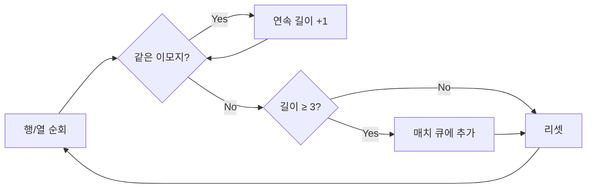
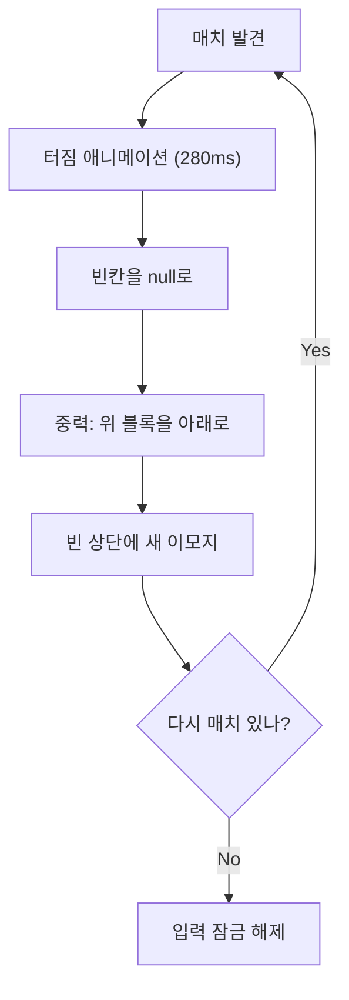

> 🏷️ **[NextX_R&D_Log]** · 모두의연구소 아이펠 AI 에이전트 1기 [웹페이지를 이루는 세 겹 & 게임 만들기] 학습 기록
{: .prompt-tip }

> [오목]()이 **승리 판정** 알고리즘이었다면, 이번 3매치 퍼즐은 **연쇄 반응** 알고리즘입니다. 같은 수업에서 배운 [이벤트 루프]()가 실전에서 어떻게 쓰이는지, 동물 이모지가 터지고 쏟아지는 과정으로 직접 확인한 기록입니다.
{: .prompt-info }

## 👥 이번 프로젝트는 협업으로

이 게임은 아이펠 동기 **최주희** 님과 함께 [Claude Code]()로 만들었습니다. 한 사람이 기획과 구조를 잡고, 다른 사람이 로직과 연출을 다듬는 — [바이브 코딩]()이 혼자만의 도구가 아니라 **팀 협업 도구**로도 작동한다는 걸 확인한 순간이었습니다.

## 🎮 게임 규칙 한눈에

| 항목 | 내용 |
|------|------|
| 그리드 | **7×7** (49칸) |
| 블록 | 동물 이모지 5종 — 🐱🐶🐰🦊🐻 |
| 조작 | 인접한 상하좌우 블록을 **스왑** (대각선 불가) |
| 매치 | 같은 이모지 **3개 이상** 연속 → 터짐(Pop) + 점수 |
| 연쇄 | 터진 빈자리를 새 블록이 채운 뒤 **자동 재판정** → 콤보! |
| 제한 | **60초** 타임 어택 |

> 🎮 **지금 바로 플레이** → [미니 3매치 퍼즐 열기](https://200gyu.github.io/aiffel-project/match3-game/){:target="_blank"}
{: .prompt-tip }

## ⚙️ 핵심 알고리즘 3가지

오목이 "5개 연속인지 세기"라는 단순한 판정이었다면, 3매치 퍼즐은 **매치 → 제거 → 낙하 → 보충 → 재판정**이 끊임없이 반복되는 **연쇄 루프**입니다.

### 1️⃣ 자동 매치 방지 초기화

게임을 시작하자마자 이미 3개가 줄지어 있으면? 유저가 손도 대기 전에 터져버리는 버그가 됩니다.

```javascript
function causesMatchAt(fullBoard, currentRowArr, row, col, emoji) {
  if (col >= 2 && currentRowArr[col-1] === emoji
               && currentRowArr[col-2] === emoji) return true;
  if (row >= 2 && fullBoard[row-1][col] === emoji
               && fullBoard[row-2][col] === emoji) return true;
  return false;
}
```

왼쪽 2칸, 위쪽 2칸만 검사하면 충분합니다. 배열은 왼쪽 위에서 오른쪽 아래로 채워지니까, **이미 채운 방향만 역으로 체크**하는 것이 핵심입니다.

### 2️⃣ 2차원 배열 매치 판정

가로·세로 각각 **연속 구간(Run)**의 길이를 추적합니다.



매치된 칸은 `Set`에 `"row,col"` 문자열로 저장해 **중복 없이** 관리합니다. 가로 3매치와 세로 3매치가 겹치는 T자·L자 패턴도 자연스럽게 처리됩니다.

### 3️⃣ 중력 낙하 + 연쇄 콤보 (이 게임의 심장)

블록이 터진 뒤 빈칸을 채우고, 새로 채워진 상태에서 **또 매치가 있는지 재귀적으로 확인**하는 루프입니다.



```javascript
function resolveMatches() {
  const matches = findMatches();
  if (matches.size === 0) { inputLocked = false; return; }

  score += scoreForRuns(matches.runs);
  // 터짐 애니메이션 → 제거 → 낙하 → 보충 → 재귀 호출
  setTimeout(() => {
    removeMatchedFromBoard(matches);
    applyGravityAndRefill();
    renderBoard();
    resolveMatches();  // 연쇄!
  }, 280);
}
```

`resolveMatches()`가 **자기 자신을 다시 호출**합니다. 수업에서 배운 [이벤트 루프]()의 `setTimeout`이 여기서 진짜 힘을 발휘합니다 — 280ms 딜레이로 애니메이션이 끝난 뒤에야 다음 판정이 시작되니, 싱글 스레드인 JS가 **화면을 얼리지 않고** 연쇄 콤보를 처리할 수 있는 것이죠.

## 🎨 CSS 애니메이션 4종 — 손맛의 비밀

게임의 "손맛"은 로직이 아니라 **시각 피드백**에서 옵니다. 모든 연출은 CSS만으로 구현했습니다.

| 애니메이션 | 언제 | 효과 |
|-----------|------|------|
| `wiggle` | 블록 선택 시 | 살짝 흔들리며 확대 |
| `shake` | 스왑 실패 시 | 좌우로 덜컹 → 원위치 복귀 |
| `pop` | 매치 성공 시 | 커졌다가 축소되며 사라짐 |
| `dropIn` | 새 블록 보충 시 | 위에서 떨어지는 느낌 |

[관심사의 분리]() 원칙 그대로 — 로직(JS)은 클래스명만 붙이고, 연출(CSS)이 나머지를 책임집니다.

## 📊 오목 vs 3매치 — 같은 수업, 다른 알고리즘

같은 날 만든 두 게임이지만, 컴퓨터 과학 측면에서 전혀 다른 근육을 씁니다.

| | [오목]() | 3매치 퍼즐 |
|---|---|---|
| 핵심 알고리즘 | 4방향 직선 카운트 (승리 판정) | 연쇄 루프 (매치→낙하→재판정) |
| 데이터 구조 | 2D 배열 (고정) | 2D 배열 (동적 변형: null·낙하·보충) |
| 비동기 활용 | 없음 (즉시 판정) | `setTimeout` 체인 (애니메이션 동기화) |
| 상태 관리 | 현재 차례(흑/백) | `inputLocked` + 타이머 + 점수 |
| 종료 조건 | 5목 완성 or 판 가득 | 60초 타임아웃 |

## 🏗️ 파일 구조 — 역시 3개

```
match3-game/
├── index.html   ← HUD·보드·모달 구조
├── styles.css   ← 파스텔 테마·CSS Grid·4종 애니메이션
└── script.js    ← 초기화·매치·낙하·연쇄·타이머 로직
```

[오목 게임]()에서 실습한 **HTML·CSS·JS 3파일 분리**가 여기서도 그대로 적용됩니다. 한번 몸에 익힌 패턴은 프로젝트가 바뀌어도 자연스럽게 나옵니다.

## 💡 기술연구소 Insight — '연쇄'는 어디에나 있다

3매치 퍼즐의 **매치 → 제거 → 보충 → 재판정** 루프는 게임에서만 쓰이는 게 아닙니다. 넥스트엑스가 구축하는 AI 에이전트 시스템에서도 본질적으로 동일한 패턴이 작동합니다.

| 3매치 퍼즐 | AI 에이전트 파이프라인 |
|-----------|----------------------|
| 매치 판정 | 사용자 의도 분석 (LLM 추론) |
| 블록 제거·보충 | 문서 검색·벡터 DB 업데이트 |
| 연쇄 콤보 자동 판정 | 후속 [툴 콜링]() 자동 실행 |
| `inputLocked` | 파이프라인 실행 중 중복 요청 차단 |

**루프를 돌며 조건이 충족될 때까지 반복하는 구조** — 이 사고방식을 코드로 익혀두면, 어떤 시스템을 설계하든 뼈대가 됩니다.

## 🔗 이어지는 R&D 일지

- 🎯 **같은 날 실습** → [오목 게임 — 관심사의 분리 실전편]()
- ⚡ **이론 배경** → [이벤트 루프 심화]() · [웹 3계층]()
- 🛠️ **작업대** → [바이브 코딩 작업대]() · [터미널·셸·커널]()
- 🚀 **배포** → [GitHub Pages 배포하기]()


---

> 📎 본 글은 **주식회사 넥스트엑스(NEXT X) 기술연구소**의 R&D 자산입니다.
> **함께 읽기** — [🛠️ 개발 대표 사례]() · [📖 블로그 안내]() · [📩 비즈니스 문의]()
{: .prompt-info }
