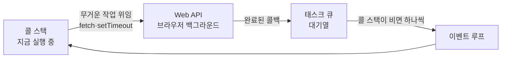

> 🏷️ **[NextX_R&D_Log]** · 모두의연구소 아이펠 AI 에이전트 1기 [웹페이지를 이루는 세 겹 & 게임 만들기] 학습 기록
{: .prompt-tip }

> 매일 마주하는 웹페이지는 겉보기엔 하나의 덩어리 같지만, 그 이면엔 성격이 전혀 다른 **세 개의 기술 레이어**가 정교하게 겹쳐 작동합니다. 이 글은 웹 3대 요소(HTML·CSS·JS)의 탄생 비화와, **싱글 스레드 자바스크립트가 화면을 멈추지 않고** 비동기 처리를 해내는 CS 원리를 풀어냅니다.
{: .prompt-info }

## Part 1. 웹을 이루는 세 겹 — 관심사의 분리(SoC)

컴퓨터 과학의 오랜 원칙인 **'관심사의 분리(Separation of Concerns)'** 는 웹 설계에 가장 완벽하게 적용돼 있습니다. 웹은 처음부터 완성된 게 아니라, 30여 년간 **구조(HTML) · 표현(CSS) · 동작(JS)** 의 영역을 나누며 진화했습니다.

| 레이어 | 질문 | 역할 |
|--------|------|------|
| **HTML** (구조) | "무엇이 있는가" | 정보의 뼈대와 의미(Semantics) |
| **CSS** (표현) | "어떻게 보이는가" | 시각적 스타일 규칙 |
| **JavaScript** (동작) | "무엇이 바뀌는가" | 인터랙션·상태 변화 |

### 1️⃣ HTML — 잃어버린 문서들의 연결 고리

- **탄생**: 1989년, 유럽입자물리연구소(**CERN**)의 팀 버너스리(Tim Berners-Lee)가 연구소 문서 유실 문제를 풀기 위해, 순차적으로 읽는 텍스트의 한계를 넘어 문서를 비선형으로 잇는 **하이퍼텍스트(HyperText)** 를 제안했습니다.
- **본질**: 원고 여백에 "여기는 제목, 여기는 본문"이라 표시하던 교정 관행(Markup)처럼, 정보의 **뼈대와 의미**를 규정합니다.
- **검토 기준**: 꾸밈이 아니라 *"정확하고 필요한 정보가 의미에 맞게 누락 없이 담겼는가?"*

### 2️⃣ CSS — "제목 색 다 바꿔라"라는 악몽의 탈출구

- **탄생**: 초기 웹은 문서 곳곳에 꾸밈 태그를 직접 박았습니다. 대형 사이트에서 테마 하나 바꾸려면 모든 문서를 열어야 하는 악몽이었죠. 1994년 호콘 비움 리(Håkon Wium Lie)가 **내용과 표현의 분리**를 제안합니다.
- **본질**: 정보 구조는 그대로 두고 **'어떻게 보일지'** 만 정의. 폭포수처럼(Cascading) 규칙이 겹칠 때 우선순위 계층을 가집니다.
- **검토 기준**: *"시선이 의도대로 흐르는가? 모바일 등 다양한 뷰포트에서 레이아웃이 깨지지 않는가?"*

### 3️⃣ JavaScript — 정적 문서에 생명을 불어넣은 '열흘의 기적'

- **탄생**: 1995년 넷스케이프의 브렌던 아이크(Brendan Eich)가 사용자 행동에 즉각 반응하는 가벼운 스크립트 언어를 **단 열흘 만에** 설계했습니다. (이름은 마케팅상 당시 인기였던 *Java*를 빌렸을 뿐, 본질적으로 완전히 다른 언어입니다.)
- **본질**: 클릭·입력·필터링 등 변화에 따라 화면 상태(**DOM**)를 유동적으로 제어.
- **검토 기준**: *"사용자 행동에 기대한 상태 변화가 즉각·정확하게 일어나는가?"*

## Part 2. [CS 교양] 브라우저가 얼지 않고 동시에 일하는 비결

구글 지도를 드래그하는 중에도 배경 지도가 끊김 없이 로드됩니다. 자바스크립트는 일꾼이 **한 명뿐인 싱글 스레드** 언어인데 어떻게 가능할까요?

### 동기 vs 비동기 — 전화 vs 문자

| | 동기(Synchronous) | 비동기(Asynchronous) |
|---|---|---|
| 비유 | **전화** — 받을 때까지 대기 | **문자/진동벨** — 보내놓고 내 일 하다 응답 오면 처리 |
| 코드 | 앞 작업 끝날 때까지 **멈춤** | 다음 작업 **즉시 실행**, 완료 시 이어서 처리 |

### 싱글 스레드인데 어떻게 비동기를?

핵심은 **자바스크립트 엔진은 싱글 스레드지만, 브라우저 환경(Web API·이벤트 루프)이 백그라운드를 돕는다**는 것입니다.

1. `fetch`·`setTimeout` 같은 무거운 작업은 브라우저(Web API)에 **진동벨 걸어두고 위임**.
2. 완료되면 결과가 **태스크 큐**에 줄을 섭니다.
3. 유일한 일꾼은 **콜 스택이 비면** 이벤트 루프를 통해 대기열 작업을 하나씩 처리.

덕분에 대용량 데이터를 불러오는 중에도 마우스 스크롤·클릭이 **얼어붙지 않습니다.**

## Part 3. 프로세스 · 스레드 · 코어 — OS와 CPU까지

시야를 브라우저 아래 운영체제(OS)와 CPU까지 낮추면, 자원이 어떻게 쪼개져 관리되는지 보입니다.

| 개념 | 비유 | 설명 |
|------|------|------|
| **프로세스** | 독립된 작업실 | OS가 독립 메모리를 준 실행 단위. 하나가 죽어도 다른 것 무사 — *크롬이 탭마다 프로세스를 띄워 탭 하나 깨져도 전체가 안 꺼지는 원리* |
| **스레드** | 작업실 안 일꾼 | 프로세스 내부 실행 흐름. 메모리 공유로 빠르지만, 동시에 자원을 건드리면 **꼬임(Race Condition)** 위험 |
| **코어** | 물리적 일손 | CPU 칩에 박힌 실제 계산 장치. 코어보다 스레드가 많아도, OS의 **시분할(Time-sharing)** 로 번갈아 실행해 *동시처럼* 보임 |

## 💡 기술연구소 Insight — AI 에이전트 시대의 '관심사 분리'

이 다층 구조를 이해해야 하는 진짜 이유는, **AI 에이전트([Claude Code]() 등)와의 협업 생산성에 직결**되기 때문입니다.

> ❌ **나쁜 지시 (뒤섞인 요청)**
> *"웹게임 만들었는데 점수판 고쳐주고 화면 디자인도 모바일에 맞게 직관적으로 다듬어줘."*
> → 정보(HTML)·스타일(CSS)·로직(JS)을 뒤섞으면 AI가 수정 범위를 넓게 잡아 **기존 코드를 훼손**하거나 엉뚱한 사이드 이펙트를 냅니다.
{: .prompt-warning }

> 🟢 **좋은 지시 (관심사 분리)**
> *"데이터·JS 로직은 그대로 두고, 모바일(390px) 뷰포트에서 두 점수 카드가 가로로 겹치지 않고 세로로 줄바꿈되도록 **CSS 레이아웃 영역만** 수정해줘."*
> → 좁은 실행 영역에 집중시키면 AI가 **정확하고 완벽한 패치**를 냅니다.
{: .prompt-tip }

명확한 개념 모델을 갖고 **관심사를 분리해 질문**할 때, 비로소 AI 에이전트도 제 실력을 냅니다. 이것이 넥스트엑스가 [프롬프트 설계]()를 중요하게 보는 이유입니다.

## 🔗 이어지는 R&D 일지

- 🛠️ **작업대·개념** → [바이브 코딩 작업대]() · [터미널·셸·커널·프롬프트]()
- 🔌 **다음 편 예고** → 이 3-Layer 위에서 백엔드 서버와 오가는 비동기 통신, [API란 무엇인가]()로 이어집니다.

> 다음 포스팅에서는 이 프론트엔드 구조 위에서 **실제 백엔드 API를 오가는 비동기 데이터 통신 아키텍처**를 심층적으로 다룹니다.
{: .prompt-info }

---

> 📎 본 글은 **주식회사 넥스트엑스(NEXT X) 기술연구소**의 R&D 자산입니다.
> **함께 읽기** — [🛠️ 개발 대표 사례]() · [📖 블로그 안내]() · [📩 비즈니스 문의]()
{: .prompt-info }
