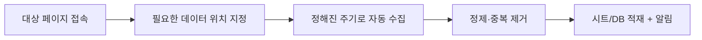

> 🏷️ **[NextX_Automation_Solution]** · 주식회사 넥스트엑스(NEXT X) 정식 업무 자동화 솔루션
{: .prompt-tip }

> 경쟁사 가격, 입찰 공고, 리뷰, 부동산 매물… 매일 사람이 사이트를 돌며 복붙하고 있다면, **크롤링 자동화**가 답입니다. 단, **경계선**을 반드시 알고 시작해야 합니다.
{: .prompt-info }

## 🧭 어디에 쓰나

- 💰 **가격·재고 모니터링** — 경쟁사/오픈마켓 변동 추적
- 📢 **공고·입찰 수집** — 나라장터 등 공공 공고 정기 수집
- ⭐ **리뷰·평판** — 우리/경쟁사 리뷰 모아 분석
- 🏢 **매물·채용 등** 반복 게시 정보

## ⚙️ 어떻게 동작하나

- 정적 페이지: `requests` + `BeautifulSoup`
- 로그인·클릭 필요한 동적 페이지: `Playwright`·`Selenium`
- 예약 실행(cron/스케줄러)으로 "매일 아침 자동 수집"

> **공식 API가 있으면 크롤링보다 API가 먼저입니다.** 더 안정적이고, 합법성도 명확합니다.
{: .prompt-tip }

## ⚠️ 반드시 지켜야 할 경계 (매우 중요)

크롤링은 **잘못하면 법적 문제**가 됩니다. 넥스트엑스는 아래를 원칙으로 합니다.

- 📜 **robots.txt·이용약관(ToS) 확인** — 수집 금지 명시 구역은 수집하지 않음
- 🔒 **개인정보 수집 금지** — 이름·연락처 등 개인정보는 다루지 않음(개인정보보호법)
- 🚦 **서버 부담 최소화** — 요청 간격 두기(과도한 트래픽=업무방해 소지)
- ©️ **저작권·DB권** — 수집물의 무단 재배포·상업적 이용 주의
- 🤝 **로그인·유료 콘텐츠** 우회 수집 금지

> 결론: **"공개된 정보를, 약관을 지키며, 개인정보 없이, 서버에 무리 없이"** 가 안전선입니다. 애매하면 API·제휴·수기 병행을 택합니다.
{: .prompt-warning }

## 🛠️ 진행 방식

1. **대상·합법성 검토** — 약관·robots·개인정보 여부부터
2. **소규모 수집 PoC** — 1개 소스로 정확도·안정성 확인
3. **정제·적재·알림** — 시트/DB 연동, 실패 시 알림
4. **운영·모니터링** — 페이지 구조 변경 대응

> 📉 **도입 효과 한 줄 요약 (예시 ROI)** — 매일 사람이 사이트를 돌며 가격·공고를 복붙하던 **하루 30~60분**이 **0분**으로. 담당자 기준 **월 약 15시간** 회수 + 수집 누락·지연에 따른 기회손실 감소.
> *(합법적 수집 범위 내 예시이며, 실제 대상에 따라 다릅니다.)*
{: .prompt-tip }

## 📩 "이 사이트, 수집해도 될까요?"

합법성 검토부터 함께합니다 — 수집 대상만 알려주셔도 됩니다.
→ [Business Inquiry]() · [csnextx@gmail.com](mailto:csnextx@gmail.com)

> 관련 → [파이썬 엑셀 자동화]() · [노코드 자동화]()
{: .prompt-info }

---

> 📎 본 글은 **주식회사 넥스트엑스(NEXT X) 기술연구소**의 R&D 자산입니다.
> **함께 읽기** — [⚡ 자동화 대표 사례]() · [📖 블로그 안내]() · [📩 비즈니스 문의]()
{: .prompt-info }
