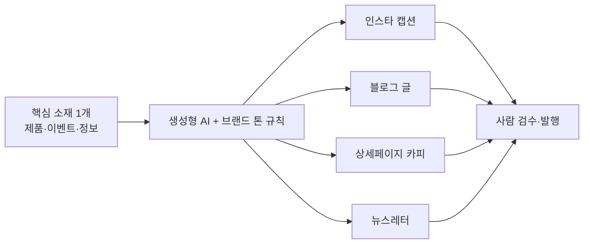

> 🏷️ **[NextX_AX_Solution]** · 주식회사 넥스트엑스(NEXT X) 정식 AX 솔루션 라인업
{: .prompt-tip }

> 콘텐츠 마케팅의 진짜 병목은 아이디어가 아니라 **"매번 처음부터, 채널마다 다시"** 쓰는 반복입니다. 생성형 AI는 이걸 **한 소재 → 여러 채널**로 바꿔줍니다.
{: .prompt-info }

## 🎯 흔한 문제

- 인스타·블로그·상세페이지·뉴스레터… **채널마다 톤·길이를 다시** 맞춰야 함
- 매번 백지에서 시작 → 담당자 소진
- 사람이 바뀌면 **브랜드 톤이 흔들림**

## 🔁 핵심 아이디어 — "1 소재 → N 채널"

## 🧭 넥스트엑스의 콘텐츠 자동화 워크플로

| 단계 | 하는 일 |
|------|---------|
| **1. 브랜드 톤 고정** | "우리 말투·금지어·핵심 메시지"를 규칙(시스템 프롬프트)으로 못박기 |
| **2. 소재 입력** | 제품 정보·이벤트·팩트를 한 번만 정리 |
| **3. 채널별 변환** | 채널마다 길이·톤·해시태그·CTA에 맞게 자동 생성 |
| **4. 사람 검수·발행** | 사실·과장·브랜드 적합성 확인 후 게시 |

> 톤 규칙 예: *"20~30대 대상, 존댓말 반말 섞지 않기, 이모지 2개 이하, 과장·최상급 표현 금지, 마지막에 CTA 1줄."*
{: .prompt-tip }

## ⚠️ 반드시 지킬 3가지 (브랜드 안전)

- **사실 검수** — 가격·스펙·효능 등 숫자·주장(claim)은 사람이 반드시 확인 (환각·과장 방지)
- **저작권·초상권** — AI 생성 이미지·문구의 권리 이슈 점검, 타사 문구 표절 금지
- **광고 표기** — 유료광고·협찬은 법정 표기(#광고 등) 준수

## 💡 이런 팀에 효과적

소량 다품종 판매, 잦은 프로모션, 여러 채널 운영, **마케터가 1~2명**인 팀일수록 시간 절감이 큽니다.

## 📩 우리 브랜드 톤으로 자동화하려면

브랜드 가이드가 없어도 됩니다 — 기존 콘텐츠 몇 개만 주시면 **톤 규칙부터** 함께 만듭니다.
→ [Business Inquiry]() · [csnextx@gmail.com](mailto:csnextx@gmail.com)

> 관련 → [프롬프트 기법]() · [AI 활용 팁 10]()
{: .prompt-info }

---

> 📎 본 글은 **주식회사 넥스트엑스(NEXT X) 기술연구소**의 R&D 자산입니다.
> **함께 읽기** — [🤖 AX 대표 사례]() · [📖 블로그 안내]() · [📩 비즈니스 문의]()
{: .prompt-info }
