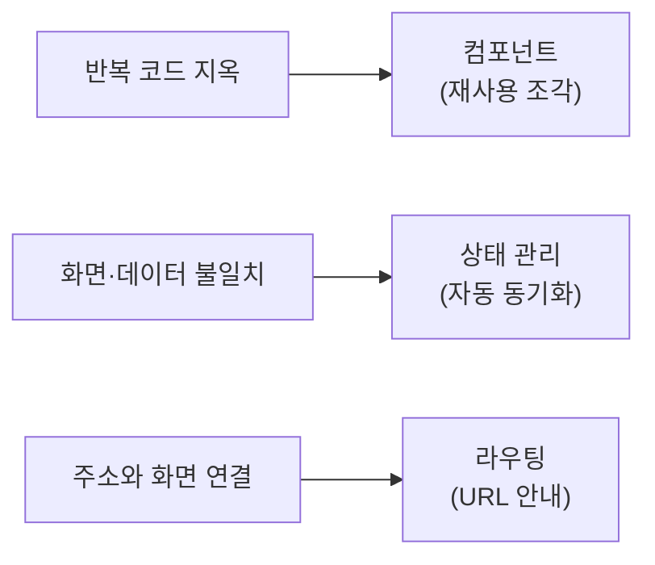
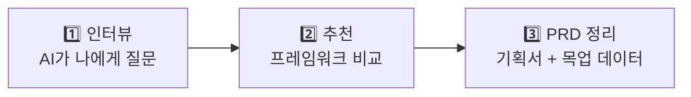
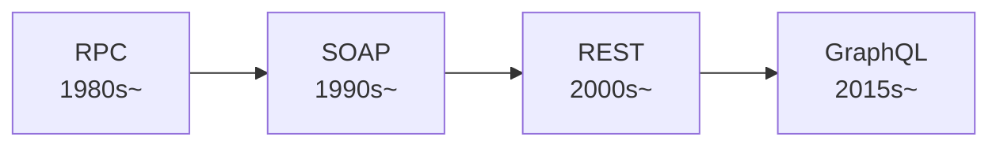

> 🏷️ **[NextX_R&D_Log]** · 모두의연구소 아이펠 AI 에이전트 1기 [오늘 써볼 프레임워크는?] 학습 기록
{: .prompt-tip }

> 지난 시간에 [HTML·CSS·JS 세 겹]()과 [게임]()을 만들었습니다. 하지만 프로젝트가 커지면? 버튼 하나 고치려다 서른 곳을 손대야 하는 악몽이 시작됩니다. 오늘은 그 악몽을 끝내는 **프레임워크**의 세계, AI와 함께 기획서(PRD)를 쓰는 법, 그리고 백엔드 없이 화면을 먼저 만드는 **목업 데이터** 전략을 배웠습니다.
{: .prompt-info }

## 🏗️ 1. 프레임워크란 — 검증된 뼈대

매번 기둥과 배관을 새로 설계하지 않고, **이미 세워진 골조 위에 방을 꾸미는 것** — 그것이 프레임워크입니다.

### 라이브러리 vs 프레임워크

| | 라이브러리 | 프레임워크 |
|---|---|---|
| 비유 | **부품 상자** — 내가 필요할 때 꺼내 쓴다 | **시스템** — 틀이 주도권을 쥐고 내 코드를 호출한다 |
| 주도권 | 내 코드가 라이브러리를 호출 | 프레임워크가 내 코드를 호출 (**제어의 역전**, IoC) |
| 예시 | jQuery, Lodash, Moment.js | React, Vue, Next.js, Django |

> 💡 **제어의 역전(Inversion of Control)**: 내가 전체 흐름을 짜는 게 아니라, 프레임워크가 정해둔 규칙(약속) 안에서 내 코드가 실행됩니다. 이 약속 덕분에 **여러 사람이 함께 일해도** 코드가 엉키지 않습니다.
{: .prompt-tip }

## ⚙️ 2. 프레임워크가 해결하는 3대 문제

순수 HTML·CSS·JS로 프로젝트가 커지면 반드시 부딪히는 세 가지 문제와, 프레임워크의 해법입니다.



### 1️⃣ 컴포넌트(Component) — 레고 블록으로 나누기

상품 카드 50개가 있는 쇼핑몰에서 카드 디자인을 바꾸려면? 순수 HTML이라면 50곳을 손대야 합니다. 프레임워크에서는 **설계도(컴포넌트) 한 곳만 고치면** 50개가 동시에 바뀝니다.

### 2️⃣ 상태(State) — 데이터가 바뀌면 화면도 자동으로

"장바구니에 3개"인데 화면엔 "2개"로 표시되는 버그 — 데이터와 화면의 **불일치**입니다. 프레임워크는 **상태(State)**라는 중앙 데이터를 두고, 상태가 바뀌는 순간 관련 화면을 **자동으로 다시 그립니다**.

### 3️⃣ 라우팅(Routing) — URL이 곧 길 안내

`/products`를 치면 상품 목록, `/cart`를 치면 장바구니 — 주소(URL)에 따라 어떤 화면을 보여줄지 체계적으로 연결합니다. 페이지를 새로고침하지 않고도 화면만 바꾸는 **SPA(Single Page Application)** 의 핵심입니다.

## 🧠 CS 핵심 개념 3가지

| 개념 | 비유 | 핵심 |
|------|------|------|
| **추상화(Abstraction)** | 자동차의 핸들과 페달 | 복잡한 내부(DOM 직접 조작)는 감추고, 단순한 인터페이스만 밖으로 |
| **모듈화(Modularity)** | 레고 조립 | 큰 덩어리를 독립적으로 교체 가능한 작은 조각으로 분리 |
| **가상 DOM(Virtual DOM)** | 설계도 먼저 그리기 | 메모리에 화면 사본을 두고, 바뀐 부분만 찾아 효율적으로 실제 화면에 반영 (React 핵심) |

> 이전에 배운 [관심사의 분리(SoC)]()가 **파일 수준**의 분리였다면, 컴포넌트·상태·라우팅은 **기능 수준**의 분리입니다. 같은 원리가 더 큰 스케일로 확장된 것이죠.
{: .prompt-tip }

## 📝 3. AI와 대화하며 PRD 만들기 — 3단계

좋은 개발은 "OO 만들어 줘" 한 마디로 시작하지 않습니다. **AI와 주고받으며 정하는 편이** 훨씬 좋은 결과를 냅니다.



### 1단계 — AI에게 나를 인터뷰하게 만든다

```
내가 만들고 싶은 건 [수제 디저트 온라인 가게]인데,
[선물 사는 사람이 편하게 고르도록] 하고 싶어.
구체적인 PRD를 짜기 위해 정해야 할 것들을,
한 번에 하나씩 나에게 물어봐 줘.
```

AI가 "주 사용자는 누구인가요? 상품은 어떻게 분류되나요? 결제가 필요한가요?"처럼 질문하고, 답하다 보면 흐릿하던 아이디어가 정리됩니다. 모르는 항목은 **"아직 모르겠어, 네가 제안해 줘"** 라고 답해도 됩니다.

### 2단계 — 프레임워크를 추천받는다

```
이제 이 서비스를 만들기에 어떤 프레임워크가 좋을지,
3개 이상 장단점과 함께 추천해 줘.
```

나온 답을 곧이곧대로 받아들이지 말고, **"왜 이걸 추천했는지", "내 조건에서도 정말 맞는지"** 를 한 번 더 되물어 봅니다.

### 3단계 — PRD로 정리받는다

```
지금까지 정한 내용을 PRD로 작성해 줘.
추후 백엔드(로그인·저장·결제) 기능을 추가할 것도 고려해서 정리해 줘.
```

이 PRD가 프로젝트의 **뼈대이자 길잡이**가 됩니다. 나중에 백엔드를 붙여 나갈 때도 이 문서가 기준점이 되죠.

> 지금 단계에서는 프로그래밍 문법을 파고드는 것보다, **AI와 함께 만든 PRD와 개발 계획을 꼼꼼히 읽어 보는 것**이 훨씬 좋은 학습입니다. 코드가 무엇을, 왜 하려는지 위에서 내려다보는 눈이 생기고, 그 눈이 있어야 AI가 만든 결과도 판단할 수 있기 때문입니다.
{: .prompt-info }

## 🔌 4. 백엔드 없이 프론트엔드 만들기 — 목업 데이터

식당의 홀(프론트엔드)은 주방(백엔드)이 완성되지 않아도, 서빙 창구([API]())를 가정한 **가짜 주문서(목업 데이터)** 로 서비스를 준비할 수 있습니다.

### 목업 데이터란?

실제 [API]() 응답과 **똑같은 구조**로 만든 가짜 데이터입니다.

```json
{
  "products": [
    { "id": 1, "name": "딸기 생크림 케이크", "price": 32000, "image": "cake1.jpg" },
    { "id": 2, "name": "레몬 타르트", "price": 28000, "image": "tart1.jpg" }
  ]
}
```

프론트엔드는 이 JSON을 순회하며 컴포넌트를 그립니다. 진짜 API든 목업이든, **구조가 같으면 화면은 구분하지 못합니다**.

### 왜 강력한가

| 장점 | 설명 |
|------|------|
| **병렬 개발** | 백엔드 완성을 기다리지 않고 프론트엔드를 먼저 만들 수 있음 |
| **AI 코딩 친화** | 바이브 코딩으로 화면을 바로 확인하며 빠르게 반복 |
| **교체 한 줄** | 나중에 목업 → 진짜 API로 바꿀 때 **데이터 소스 URL 한 줄만** 변경 |

## 🌐 5. API 심화 — REST와 그 너머

[API란 무엇인가]() 글에서 개념을 잡았다면, 오늘은 한 단계 더 들어갑니다.

### REST API의 4가지 동사

| HTTP 동사 | 식당 비유 | 의미 |
|-----------|---------|------|
| **GET** | "메뉴판 보여줘" | 데이터 조회 |
| **POST** | "이거 주문할게" | 새 데이터 생성 |
| **PUT** | "1번 주문 이렇게 바꿔줘" | 기존 데이터 수정 |
| **DELETE** | "1번 주문 취소할게" | 데이터 삭제 |

> 💡 바이브 코딩 팁 — AI에게 "이 화면에 POST 요청 추가해줘"라고 말하면, AI는 이 약속을 알고 있습니다. GET으로 "가져오고", POST로 "등록하고" — 이 두 가지가 프론트엔드 프로토타입에서 가장 자주 쓰입니다.
{: .prompt-tip }

### REST vs GraphQL

| 관점 | REST | GraphQL |
|------|------|---------|
| 데이터 효율 | 정해진 덩어리가 옴 (불필요한 것도) | 원하는 필드만 골라 받음 |
| 학습 난이도 | 낮음 — URL과 HTTP 동사면 충분 | 중간 — 쿼리 문법 필요 |
| AI 코딩 친화도 | 자료가 많고 AI가 익숙함 | 점점 늘고 있지만 REST만큼은 아님 |

> 🐣 첫 프로토타입에서는 **REST가 기본**입니다. 서비스가 커져서 "데이터 요청이 너무 많다"고 느낄 때 GraphQL을 후보에 넣으면 됩니다. **지금은 GET과 POST만 알아도 충분합니다.**
{: .prompt-info }

### API 형식의 진화



형식은 바뀌어도 **"요청하고 응답하는"** 본질은 같습니다. 프론트엔드 개발자가 알아야 할 것은 형식의 세부 스펙이 아니라, **"내가 무엇을 요청하고 어떤 형태로 받는가"** 입니다.

## 💡 기술연구소 Insight — 넥스트엑스도 이렇게 일합니다

오늘 배운 3가지는 그대로 넥스트엑스의 프로젝트 진행 방식입니다.

| 수업에서 배운 것 | 넥스트엑스 실전 |
|-----------------|---------------|
| AI와 PRD 작성 | [프롬프트 설계]()로 기획서 초안을 AI와 협업 |
| 목업 데이터로 프론트 먼저 | 고객 피드백을 빠르게 받는 **프로토타입 우선** 전략 |
| 프레임워크의 규칙 | 팀원 간 코드 충돌 최소화 — [일하는 방식]()의 핵심 |

## 🔗 이어지는 R&D 일지

- 🔌 **API 기초** → [API란 무엇인가]()
- 🧱 **웹의 기초** → [웹 3계층(HTML·CSS·JS)]() · [이벤트 루프]()
- 🎮 **실습** → [오목 게임]() · [3매치 퍼즐]()
- 🛠️ **작업대** → [바이브 코딩 작업대]() · [터미널·셸·커널]()


---

> 📎 본 글은 **주식회사 넥스트엑스(NEXT X) 기술연구소**의 R&D 자산입니다.
> **함께 읽기** — [🛠️ 개발 대표 사례]() · [📖 블로그 안내]() · [📩 비즈니스 문의]()
{: .prompt-info }
