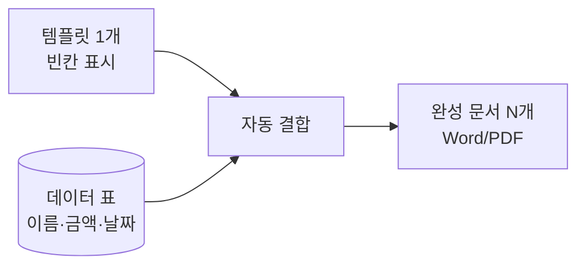

> 🏷️ **[NextX_Automation_Solution]** · 주식회사 넥스트엑스(NEXT X) 정식 업무 자동화 솔루션
{: .prompt-tip }

> "이름·금액만 다르고 양식은 똑같은" 문서를 수십·수백 장 손으로 만들고 계신가요? 계약서·안내문·증명서·견적서… 이건 **데이터 + 템플릿**으로 1분에 끝납니다.
{: .prompt-info }

## 🧩 원리 — "템플릿 + 데이터 = 완성 문서"



이른바 **메일 머지(Mail Merge)** 의 확장입니다. 빈칸(`{이름}`, `{금액}`)이 있는 템플릿에 표의 각 행을 채워 문서를 찍어냅니다.

## 🛠️ 방법 (난이도별)

| 방법 | 도구 | 적합 |
|------|------|------|
| **워드 편지 병합** | MS Word + 엑셀 | 코딩 0, 소량 |
| **파이썬 자동화** | `python-docx` · `openpyxl` | 대량·반복·조건부 |
| **PDF 변환·발송** | + PDF 변환 + 메일/문자 | 생성 후 자동 발송까지 |

```python
# 예: 표의 각 행으로 계약서 자동 생성
from docx import Document
for row in rows:
    doc = Document("계약서_템플릿.docx")
    for p in doc.paragraphs:
        p.text = p.text.replace("{이름}", row["이름"]).replace("{금액}", row["금액"])
    doc.save(f"계약서_{row['이름']}.docx")
```

## 💡 이런 데 효과적

- 📄 **계약서·근로계약서** 대량 발급
- 🧾 **견적서·거래명세서·인보이스**
- 🎓 **수료증·증명서·상장**
- 🏷️ **주소 라벨·명찰·초대장**

## ⚠️ 체크 포인트

- **원본 데이터 검증 먼저** — 잘못된 데이터 = 잘못된 문서 100장 ([데이터 클렌징]())
- **개인정보 보관·파기** 정책 준수
- **최종본 사람 확인** — 특히 금액·법적 효력 문서는 표본 검수

## 📩 반복 문서, 찍어내게 만들어드립니다

양식 1개와 데이터 예시만 주시면 자동 생성 방안을 진단해 드립니다.
→ [Business Inquiry]() · [csnextx@gmail.com](mailto:csnextx@gmail.com)

> 관련 → [파이썬 엑셀 자동화]() · [노코드 자동화]()
{: .prompt-info }
