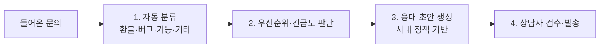

> 🏷️ **[NextX_AX_Solution]** · 주식회사 넥스트엑스(NEXT X) 정식 AX 솔루션 라인업
{: .prompt-tip }

> 문의는 매일 쌓이는데, **분류하고 → 담당 배정하고 → 비슷한 답을 또 쓰는** 일에 CS 팀 시간이 녹습니다. AI가 앞단을 처리하면 사람은 **판단·공감**에 집중할 수 있습니다.
{: .prompt-info }

## 🔁 흐름

## 🧭 3가지 핵심 기능

**1. 자동 분류(태깅)**
문의를 사전 정의 카테고리로 즉시 분류 → 담당팀 자동 배정, 통계 자동화.

**2. 감정·긴급도 파악**
화난 고객·이탈 위험 신호를 우선순위로 올려 **놓치지 않게**.

**3. 응대 초안 생성**
사내 정책·FAQ를 근거로 **답변 초안**을 만들어 상담사가 다듬어 발송. (근거 문서 활용 → [RAG]())

## 📊 무엇이 좋아지나

| | Before | After |
|---|--------|-------|
| 분류·배정 | 수기 | **자동** |
| 첫 응답 속도 | 지연 | **초안 즉시** |
| 반복 답변 | 매번 작성 | **초안 재사용** |
| 상담사 역할 | 단순 응대 | **판단·공감** |

## ⚠️ 반드시 지킬 것

- **자동 발송 금지(초기엔)** — AI 초안은 **사람이 검수 후** 발송. 오답·무례 방지
- **개인정보 최소화** — 문의 속 개인정보 처리·보관 정책 준수
- **분류 정확도 평가** — 대표 문의로 정기 점검·개선

## 📩 우리 CS에 맞게 만들려면

과거 문의 샘플만 주시면 **분류 체계와 정확도부터** 진단해 드립니다.
→ [Business Inquiry]() · [csnextx@gmail.com](mailto:csnextx@gmail.com)

> 관련 → [프롬프트 기법]() · [에이전트 vs RPA]()
{: .prompt-info }
