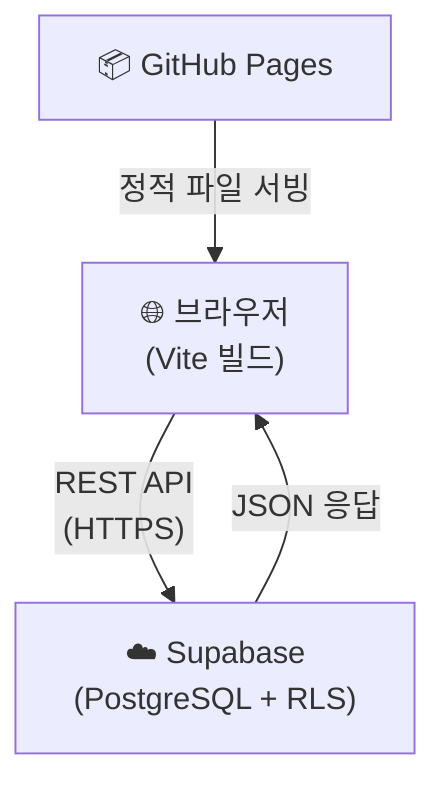
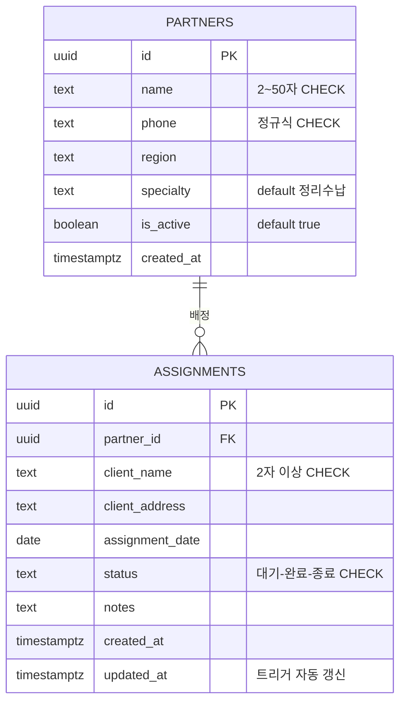
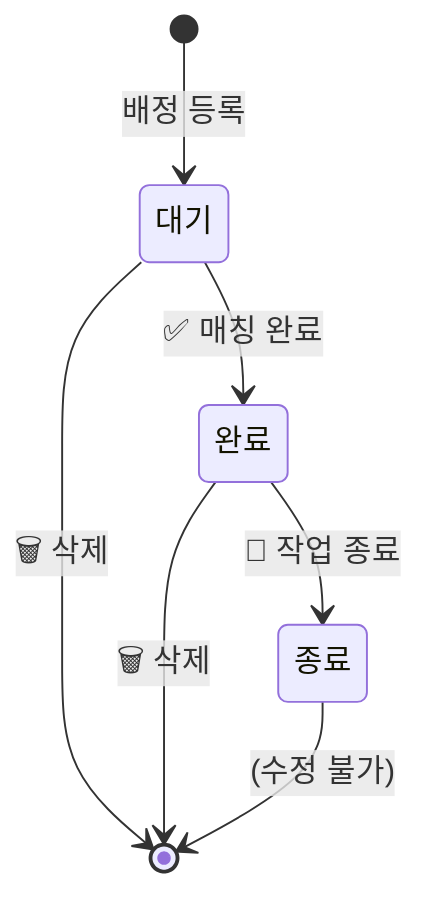
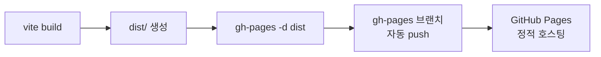

> 🏷️ **[NextX_R&D_Log]** · 모두의연구소 아이펠 AI 에이전트 1기 [내 서비스에 백엔드 한 겹 붙이기] 프로젝트 제작기
{: .prompt-tip }

> 지난 시간에 [백엔드·네트워크 완전 지도]()로 서버·DNS·HTTP·API·보안의 전체 지형을 살펴봤습니다. 이번에는 그 지식을 **실전에 적용**합니다 — Supabase를 백엔드로 붙여 실제 서비스를 만들고, GitHub Pages로 세상에 내보내는 전 과정입니다.
{: .prompt-info }

## 🎯 프로젝트 개요 — 무엇을, 왜 만들었나

넥스트엑스는 **정리수납 프리랜서 파트너**를 고객 현장에 배정하는 업무를 수행합니다. 기존에는 카카오톡과 스프레드시트로 관리하다 보니, 누가 어디에 배정됐는지 한눈에 파악하기 어려웠습니다.

이 프로젝트의 목표는 명확했습니다:

| 항목 | 내용 |
|------|------|
| **서비스명** | 파트너스 매칭 매니저 |
| **핵심 기능** | 파트너 등록·관리, 현장 배정 CRUD, 상태 워크플로우 |
| **기술 스택** | Vite + Tailwind CSS + Supabase (PostgreSQL) |
| **배포** | GitHub Pages (프론트) + Supabase (백엔드) |
| **라이브 URL** | [200gyu.github.io/partners-manager](https://200gyu.github.io/partners-manager/) |


---

## 🏗️ 1단계 — 아키텍처 설계

### BaaS(Backend as a Service) 선택: Supabase

직접 서버를 세우는 대신, **Supabase**를 선택했습니다. Supabase는 PostgreSQL 위에 REST API·인증·실시간 구독을 얹어주는 오픈소스 BaaS입니다.



**왜 Supabase인가?**

| 비교 항목 | 직접 서버 (Express 등) | Supabase (BaaS) |
|-----------|----------------------|------------------|
| 서버 코드 | 직접 작성·유지 | **불필요** |
| DB 관리 | 설치·설정·마이그레이션 | **웹 대시보드에서 클릭** |
| 인증 | passport.js 등 직접 구현 | **내장 Auth** |
| 보안 | 미들웨어 직접 구성 | **RLS 정책 선언** |
| 비용 | 서버 호스팅비 | **무료 티어 충분** |

> 💡 "백엔드 코드를 한 줄도 안 짜도 되는 건 아닙니다." SQL로 테이블을 설계하고, RLS 정책을 작성하는 것 자체가 백엔드 작업입니다. 서버 **프로세스**가 없을 뿐, 백엔드 **사고**는 그대로 필요합니다.
{: .prompt-tip }

---

## 🗄️ 2단계 — 데이터베이스 설계

### ERD: 두 개의 테이블



### SQL 핵심 포인트

```sql
-- 전화번호 정규식 검증 (DB 레벨에서도 방어)
CREATE TABLE partners (
  id     UUID DEFAULT gen_random_uuid() PRIMARY KEY,
  name   TEXT NOT NULL CHECK (char_length(name) >= 2 AND char_length(name) <= 50),
  phone  TEXT NOT NULL CHECK (phone ~ '^\d{2,3}-\d{3,4}-\d{4}$'),
  region TEXT NOT NULL CHECK (char_length(region) >= 2),
  -- ...
);

-- 상태값을 ENUM 대신 CHECK로 제한
CREATE TABLE assignments (
  -- ...
  status TEXT NOT NULL DEFAULT '대기'
         CHECK (status IN ('대기', '완료', '종료')),
  -- ...
);
```

**설계 원칙:**
- `gen_random_uuid()` — 순차 ID 대신 UUID를 사용하여 데이터 유추 방지
- `CHECK` 제약조건 — 프론트엔드 검증이 뚫려도 DB가 최종 방어선
- `ON DELETE CASCADE` — 파트너 삭제 시 관련 배정도 자동 정리
- `updated_at` 트리거 — 수정 시각을 자동 기록

---

## 🔒 3단계 — 보안 설계 (RLS)

이 프로젝트에서 가장 중요하게 다룬 부분입니다.

### .env 파일 격리

```
# .env (절대 git에 올리지 않는다)
VITE_SUPABASE_URL=https://your-project.supabase.co
VITE_SUPABASE_ANON_KEY=sb_publishable_xxxx
```

```javascript
// src/supabase.js — 환경변수에서 키를 읽어온다
import { createClient } from '@supabase/supabase-js';

const supabaseUrl = import.meta.env.VITE_SUPABASE_URL;
const supabaseKey = import.meta.env.VITE_SUPABASE_ANON_KEY;

export const supabase = createClient(supabaseUrl, supabaseKey);
```

> ⚠️ `VITE_` 접두사가 붙은 변수는 빌드 시 코드에 **인라인**됩니다. 따라서 **Publishable Key(anon)** 만 사용하고, **Secret Key(service_role)** 는 절대 프론트엔드에 노출하지 않습니다.
{: .prompt-warning }

### RLS(Row Level Security) 정책

```sql
-- RLS 활성화
ALTER TABLE partners    ENABLE ROW LEVEL SECURITY;
ALTER TABLE assignments ENABLE ROW LEVEL SECURITY;

-- 읽기: 누구나 가능
CREATE POLICY "Allow read partners"
  ON partners FOR SELECT TO anon, authenticated
  USING (true);

-- 쓰기: anon, authenticated 역할 허용
CREATE POLICY "Allow insert partners"
  ON partners FOR INSERT TO anon, authenticated
  WITH CHECK (true);

-- 삭제: assignments만 허용 (partners는 삭제 정책 없음 → 삭제 불가)
CREATE POLICY "Allow delete assignments"
  ON assignments FOR DELETE TO anon, authenticated
  USING (true);
```

RLS가 없으면 Supabase anon key를 가진 누구나 **모든 테이블의 모든 행**에 접근할 수 있습니다. RLS를 활성화하면, 명시적으로 허용한 작업만 가능해집니다.

### XSS 방지

사용자 입력을 HTML에 렌더링할 때 반드시 이스케이프 처리합니다:

```javascript
function esc(str) {
  const div = document.createElement('div');
  div.textContent = str;
  return div.innerHTML;
}

// 사용 예시 — 모든 사용자 입력에 적용
container.innerHTML = `<h3>${esc(partner.name)}</h3>`;
```

### 보안 체크리스트

- [x] `.env` 파일 → `.gitignore`에 포함
- [x] Publishable Key만 사용 (Secret Key 미노출)
- [x] RLS 활성화 + 7개 정책 설정
- [x] 전화번호 검증: 프론트(정규식) + DB(CHECK)
- [x] XSS: `esc()` 함수로 텍스트 이스케이프
- [x] UUID 사용으로 순차 ID 유추 불가

---

## 💻 4단계 — 프론트엔드 구현

### 프로젝트 구조

```
partners-manager/
├── index.html          # SPA 진입점 (Tailwind CDN)
├── src/
│   ├── supabase.js     # Supabase 클라이언트 초기화
│   └── main.js         # CRUD 로직 + 렌더링
├── .env                # 환경변수 (git 제외)
├── .env.example        # 템플릿
├── vite.config.js      # Vite 빌드 설정
├── vercel.json         # Vercel 배포 설정
├── supabase-setup.sql  # DB 스키마 + RLS
└── package.json
```

### 핵심 기능 구현

#### 1) Supabase CRUD — 파트너 등록

```javascript
async function handleAddPartner(e) {
  e.preventDefault();
  const form = e.target;
  const name = form.name.value.trim();
  const phone = form.phone.value.trim();

  // 프론트엔드 검증 (1차 방어)
  if (!validatePhone(phone)) {
    showToast('전화번호 형식이 올바르지 않습니다', 'error');
    return;
  }

  // Supabase INSERT (DB CHECK가 2차 방어)
  const { error } = await supabase
    .from('partners')
    .insert([{ name, phone, region, specialty }]);

  if (error) {
    showToast('등록 실패: ' + error.message, 'error');
    return;
  }

  showToast(`${name} 파트너가 등록되었습니다`);
  form.reset();
  await loadPartners();  // 목록 갱신
}
```

#### 2) 상태 워크플로우 — 대기 → 완료 → 종료

배정의 생명주기는 세 단계로 설계했습니다:



```javascript
window.updateStatus = async function (id, newStatus) {
  const { error } = await supabase
    .from('assignments')
    .update({ status: newStatus })
    .eq('id', id);

  if (error) {
    showToast('상태 변경 실패', 'error');
    return;
  }
  await loadAssignments();
};
```

**종료 상태**에 도달하면 버튼이 사라져 더 이상 변경할 수 없습니다. 실수 방지를 위한 의도적 설계입니다.

#### 3) 관계 조회 — Foreign Key JOIN

```javascript
// assignments 조회 시 partners 테이블을 JOIN
const { data } = await supabase
  .from('assignments')
  .select('*, partners(name, region)')  // FK 관계 자동 JOIN
  .order('assignment_date', { ascending: false });
```

Supabase의 `select('*, partners(name, region)')` 구문은 SQL의 `JOIN`을 REST API로 표현한 것입니다. FK 관계만 설정해두면 별도 JOIN 쿼리 없이 관련 데이터를 한 번에 가져옵니다.

---

## 🚀 5단계 — 배포

### GitHub Pages 배포 과정



#### Vite 설정 — base 경로

GitHub Pages는 `username.github.io/repo-name/` 형태로 서빙하므로, 빌드 시 base 경로를 설정해야 합니다:

```javascript
// vite.config.js
import { defineConfig } from 'vite';

export default defineConfig({
  root: '.',
  base: '/partners-manager/',  // GitHub Pages 서브 경로
  build: {
    outDir: 'dist',
  },
});
```

#### 배포 명령어

```bash
# 1. 빌드 (.env의 값이 코드에 인라인됨)
npm run build

# 2. dist 폴더를 gh-pages 브랜치로 push
npx gh-pages -d dist

# 3. GitHub 저장소 Settings > Pages에서 확인
# Source: Deploy from a branch → gh-pages / root
```

> 💡 `npm run build` 시점에 `.env` 파일이 있어야 합니다. `VITE_` 접두사 변수는 빌드 타임에 코드로 치환되기 때문입니다. GitHub Actions를 쓴다면 Secrets에 등록하고 빌드 스텝에서 `.env`를 생성하는 방식을 사용합니다.
{: .prompt-tip }

---

## 📸 완성된 화면

### 파트너 관리 탭

- 이름, 전화번호, 활동 지역, 전문 분야를 입력하여 새 파트너 등록
- 카드 형태로 목록 표시, 활성/비활성 토글 가능

### 배정 현황 탭

- 담당 파트너 드롭다운(활성 파트너만 표시), 고객명, 주소, 날짜, 메모 입력
- 상태 필터(전체/대기/완료/종료)로 배정 내역 필터링
- 상태 워크플로우 버튼으로 대기 → 완료 → 종료 순차 진행

---

## 🔍 배운 것들 — 회고

### 1. "백엔드 없이"는 없다

Supabase를 쓰면 서버 코드는 없지만, **DB 설계, 보안 정책, API 호출 패턴**은 그대로입니다. BaaS는 서버 운영 부담을 덜어줄 뿐, 백엔드 사고방식 자체를 대체하지는 않습니다.

### 2. 검증은 2중으로

전화번호 검증을 예로 들면:
- **1차** — 프론트엔드 정규식 (`/^\d{2,3}-\d{3,4}-\d{4}$/`)
- **2차** — DB CHECK 제약조건 (`phone ~ '^\d{2,3}-\d{3,4}-\d{4}$'`)

브라우저 검증은 DevTools로 우회할 수 있습니다. DB가 **최종 방어선**입니다.

### 3. RLS는 선택이 아니라 필수

Supabase의 anon key는 브라우저에 노출됩니다. RLS 없이 anon key만으로도 모든 데이터에 접근할 수 있으므로, **RLS 정책을 켜지 않는 것은 DB를 공개하는 것**과 같습니다.

### 4. 환경변수 관리의 중요성

| 상황 | 올바른 방법 |
|------|-----------|
| 로컬 개발 | `.env` 파일 (`.gitignore`에 포함) |
| Vercel 배포 | Dashboard > Environment Variables |
| GitHub Pages | 빌드 타임에 `.env` 존재 필요 |
| GitHub Actions | Repository Secrets → 빌드 스텝에서 `.env` 생성 |

---

## 🔗 프로젝트 링크

| 항목 | URL |
|------|-----|
| **라이브 서비스** | [200gyu.github.io/partners-manager](https://200gyu.github.io/partners-manager/) |
| **GitHub 소스코드** | [github.com/200gyu/partners-manager](https://github.com/200gyu/partners-manager) |
| **Supabase** | [supabase.com](https://supabase.com) (무료 티어) |

---

## 📚 이전 학습 기록

이 프로젝트를 이해하려면 아래 글들을 순서대로 읽어보세요:

1. [웹을 지탱하는 세 겹(HTML·CSS·JS)]()
2. [프레임워크·PRD·목업 데이터]()
3. [백엔드·네트워크 완전 지도]()
4. **이 글** — 실전 프로젝트 적용

> 다음 글에서는 이 서비스를 AI 에이전트와 연결하여, 카카오톡이나 슬랙으로 배정을 자동화하는 방법을 다룰 예정입니다.
{: .prompt-info }
