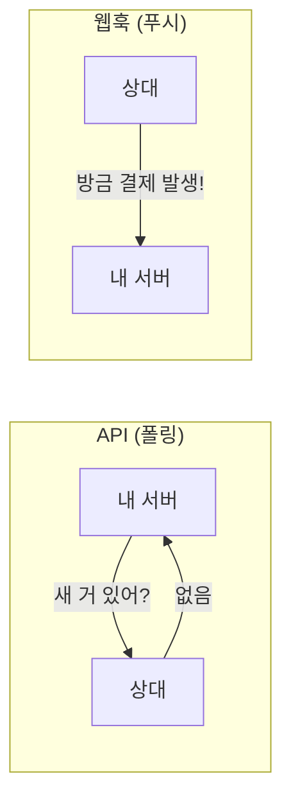

> [API]()가 "필요할 때 내가 **물어보는**" 것이라면, 웹훅은 "일이 생기면 상대가 **알려주는**" 것입니다. 실시간 자동화의 핵심이죠.
{: .prompt-info }

## 🔔 한 줄 비유 — "택배 알림"

> 택배가 어디쯤인지 **1분마다 전화로 물어보면(API 폴링)** 번거롭죠. 대신 **"도착하면 문자로 알려주세요"** 가 웹훅입니다.

## 🆚 API vs 웹훅

| | API(폴링) | 웹훅 |
|---|-----------|------|
| 방향 | 내가 물어봄 | 상대가 알려줌 |
| 시점 | 주기적으로 확인 | **사건 발생 즉시** |
| 효율 | 자주 물으면 낭비 | 필요할 때만 |

## 💡 실무 예시

- 💳 **결제 완료** → 웹훅으로 즉시 주문 처리·문자 발송
- 📩 **문의 폼 접수** → 슬랙/카톡 즉시 알림
- 🚀 **코드 배포·오류 발생** → 담당자에게 즉시 통보 (이 블로그도 [Actions 배포]()에서 이 방식 활용)
- 🛒 **재고 소진** → 발주 자동 트리거

## 🛠️ 어떻게 쓰나 (개념)

1. 상대 서비스에 **"이 주소로 알려줘"** 라고 수신 URL 등록
2. 사건이 생기면 상대가 그 URL로 **데이터(JSON)를 쏨**
3. 내 쪽에서 받아 **자동 처리**(알림·기록·후속 작업)

> 노코드 도구([Zapier/Make]())도 대부분 웹훅 트리거를 지원해, **코드 없이도** 실시간 자동화가 가능합니다.
{: .prompt-tip }

## ⚠️ 챙길 것

- 🔐 **검증(서명 확인)** — 아무나 가짜로 쏠 수 있으니, 진짜 발신인지 검증
- 🔁 **재시도·중복 처리** — 같은 알림이 두 번 올 수 있음(멱등성)
- 🌐 **수신 서버 필요** — 받을 주소(엔드포인트)가 항상 켜져 있어야

## 📩 실시간 알림·연동이 필요하면

"이런 일이 생기면 자동으로 알림/처리" — 원하는 시나리오만 알려주세요.
→ [Business Inquiry]() · [csnextx@gmail.com](mailto:csnextx@gmail.com)

> 관련 → [API란 무엇인가]()
{: .prompt-info }

---

> 📎 본 글은 **주식회사 넥스트엑스(NEXT X) 기술연구소**의 R&D 자산입니다.
> **함께 읽기** — [🛠️ 개발 대표 사례]() · [📖 블로그 안내]() · [📩 비즈니스 문의]()
{: .prompt-info }
