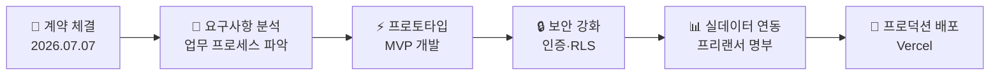
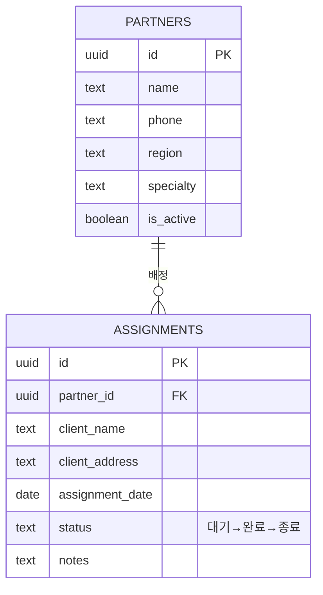
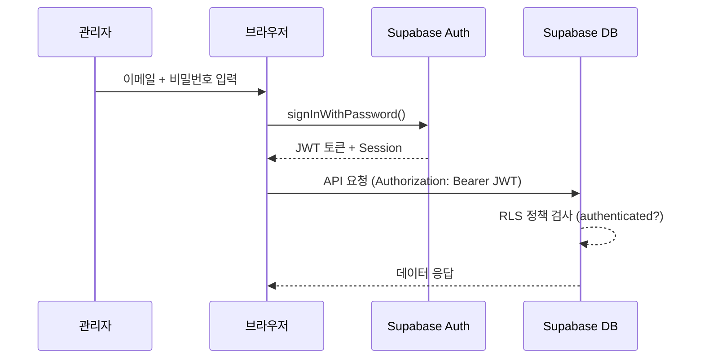
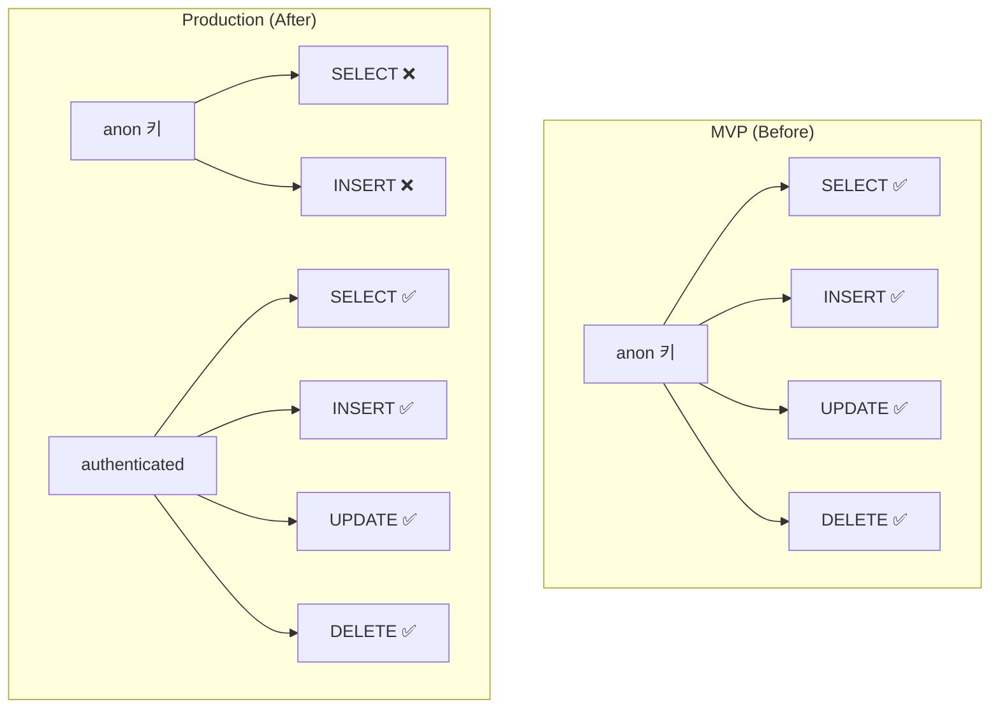
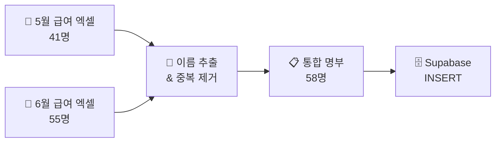
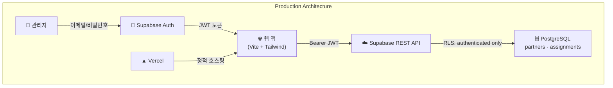
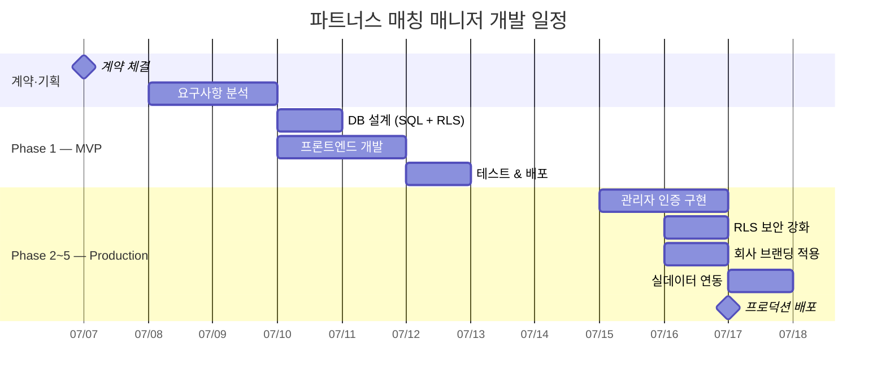

> 🏷️ **[NextX_AX_Solution]** · 주식회사 넥스트엑스(NEXT X) AX 솔루션 실전 납품 사례
{: .prompt-tip }

> 이 글은 파트너스 매칭 매니저 시리즈의 **두 번째 글**입니다.
> 1. [프로토타입 제작기]() — MVP 개발
> 2. **[현재 글] 실전 납품 개발기** — 인증·보안·실데이터
> 3. [Auth 트러블슈팅]() — 로그인 오류 해결
> 4. [v2 업그레이드]() — 명부 교체·스키마 유연화
> 5. [v3 업그레이드]() — 팀 배정 시스템·캘린더 뷰
> 6. [v3.1 업그레이드]() — 휴무일 관리·스케줄 충돌 방지
> 7. [v4 업그레이드]() — 급여 정산 및 관리 시스템
> 8. [v4.1 업그레이드]() — UX 고도화 및 급여 기타수당
> 9. [v5 업그레이드]() — 통합 일정 관리 달력
> 10. [v5.1 업그레이드]() — 급여 산식 정밀화 및 모바일 카드 레이아웃
> 11. [v5.2 업그레이드]() — 엑셀 기반 Mock 데이터 파이프라인
> 12. [v5.3 업그레이드]() — 운영 데이터 전환 및 공제액 산식
> 13. [v5.4 업그레이드]() — 보안 감사·권한 분리(RBAC)·엑셀
{: .prompt-info }

## 📋 프로젝트 배경

### 고객사: 주식회사 케이제이파트너스

| 항목 | 내용 |
|------|------|
| **법인명** | 주식회사 케이제이파트너스 |
| **소재지** | 제주특별자치도 제주시 |
| **사업 영역** | 정리수납 및 컨설팅, 해외직구대행, 경영 컨설팅 |
| **핵심 업무** | 프리랜서 정리수납사를 고객 현장에 매칭·배정 |
| **관리 인원** | 약 55~60명의 프리랜서 파트너 |

케이제이파트너스는 카카오톡과 엑셀로 **50명 이상의 프리랜서**를 관리하고 있었습니다. 누가 어디에 배정됐는지 추적하려면 여러 채팅방과 시트를 오가야 했고, 급여 정산 시 명부 대조에 상당한 시간이 소요되고 있었습니다.

### 계약 체결

넥스트엑스는 케이제이파트너스와 **AI 기반 업무 자동화 및 솔루션 개발** 계약을 체결했습니다.



계약 범위 중 **첫 번째 산출물**이 바로 이 파트너스 매칭 매니저입니다:
- 경영 및 업무 공정 자동화를 위한 AX 솔루션
- 프리랜서 파트너 매칭·배정 관리 웹 시스템
- 관리자 인증 및 데이터 보안 체계 구축

---

## 🏗️ Phase 1 — 프로토타입 (MVP)

> 프로토타입의 상세 제작 과정은 [이전 글]()에서 다뤘습니다. 여기서는 핵심만 요약합니다.
{: .prompt-info }

### MVP에서 검증한 것

| 기술 스택 | 역할 |
|-----------|------|
| **Vite** | 빌드 도구, HMR 개발 환경 |
| **Tailwind CSS** | 유틸리티 기반 UI 스타일링 |
| **Supabase** | PostgreSQL + REST API + RLS |
| **GitHub Pages** | 정적 호스팅 |



MVP는 핵심 CRUD와 상태 워크플로우가 동작하는 것을 확인했습니다. 하지만 **실무에 바로 쓰기엔 부족한 점**이 있었습니다:

### MVP의 한계

| 항목 | MVP 상태 | 실무 요구사항 |
|------|---------|-------------|
| **인증** | 없음 (URL만 알면 접근 가능) | 관리자만 접근 가능해야 함 |
| **RLS 정책** | anon 역할에 읽기/쓰기 허용 | 로그인한 사용자만 CRUD |
| **데이터** | 샘플 3명 | 실제 프리랜서 55명+ |
| **브랜딩** | 일반 타이틀 | 고객사 회사명·정보 반영 |
| **대시보드** | 없음 | 현황 한눈에 파악 |
| **파트너 삭제** | 없음 | 퇴사·이탈 파트너 관리 |

> ⚠️ MVP에서 가장 위험한 부분은 **인증 없이 anon 키로 모든 데이터에 접근 가능**하다는 점이었습니다. URL이 노출되면 누구든 데이터를 조회·수정·삭제할 수 있는 상태였습니다.
{: .prompt-warning }

---

## 🔒 Phase 2 — 관리자 인증 시스템

### Supabase Auth 도입

Supabase는 PostgreSQL 위에 **인증 시스템**을 내장하고 있습니다. 별도의 인증 서버를 구축할 필요 없이, 이메일/비밀번호 로그인을 즉시 사용할 수 있습니다.



### 인증 모듈 설계

```javascript
// src/auth.js — Supabase Auth 래퍼
import { supabase } from './supabase.js';

export async function signIn(email, password) {
  const { data, error } = await supabase.auth.signInWithPassword({
    email,
    password,
  });
  if (error) throw error;
  return data;
}

export async function getSession() {
  const { data: { session } } = await supabase.auth.getSession();
  return session;
}

export async function signOut() {
  const { error } = await supabase.auth.signOut();
  if (error) throw error;
}
```

### 앱 진입점 변경

```javascript
// src/main.js — 인증 상태에 따른 화면 전환
document.addEventListener('DOMContentLoaded', async () => {
  setupAuthForms();
  const session = await getSession();
  if (session) {
    showApp(session);  // 로그인 상태 → 앱 표시
  }
  onAuthStateChange((session) => {
    if (session) showApp(session);
    else showLogin();  // 로그아웃 → 로그인 화면
  });
});
```

**핵심 포인트:**
- `getSession()` — 페이지 로드 시 기존 세션 확인 (새로고침해도 로그인 유지)
- `onAuthStateChange()` — 로그인/로그아웃 이벤트를 실시간 감지
- JWT는 Supabase 클라이언트가 자동으로 `Authorization` 헤더에 포함

---

## 🛡️ Phase 3 — RLS 보안 강화

MVP에서는 `anon` 역할에도 쓰기를 허용했습니다. 프로덕션에서는 **인증된 사용자만** 데이터에 접근할 수 있어야 합니다.

### Before vs After



### 마이그레이션 SQL

```sql
-- 1. 기존 anon 허용 정책 제거
DROP POLICY IF EXISTS "Allow read partners"     ON partners;
DROP POLICY IF EXISTS "Allow insert partners"   ON partners;
DROP POLICY IF EXISTS "Allow update partners"   ON partners;

-- 2. authenticated 전용 정책으로 교체
CREATE POLICY "Authenticated read partners"
  ON partners FOR SELECT
  TO authenticated
  USING (true);

CREATE POLICY "Authenticated insert partners"
  ON partners FOR INSERT
  TO authenticated
  WITH CHECK (true);

CREATE POLICY "Authenticated update partners"
  ON partners FOR UPDATE
  TO authenticated
  USING (true)
  WITH CHECK (true);

CREATE POLICY "Authenticated delete partners"
  ON partners FOR DELETE
  TO authenticated
  USING (true);
```

> 💡 `TO authenticated` — Supabase Auth로 로그인한 사용자에게만 해당 정책이 적용됩니다. JWT가 없는 요청(anon)은 모든 CRUD가 거부됩니다.
{: .prompt-tip }

### 보안 레벨 비교

| 보안 항목 | MVP | Production |
|-----------|:---:|:---:|
| URL 접근 제어 | ❌ | ✅ 로그인 필수 |
| anon 읽기 | 허용 | **차단** |
| anon 쓰기 | 허용 | **차단** |
| JWT 인증 | 없음 | ✅ Supabase Auth |
| 세션 관리 | 없음 | ✅ 자동 유지/만료 |
| .env 격리 | ✅ | ✅ |
| XSS 방지 | ✅ | ✅ |

---

## 🏢 Phase 4 — 회사 브랜딩 & 대시보드

### 로그인 화면

고객사 정보를 반영한 전용 로그인 화면을 구현했습니다:

- **KJ 로고** — 브랜드 컬러(#1e3a5f)로 통일
- **회사명·대표·소재지·사업자번호** — 푸터에 표시
- **회원가입/로그인 토글** — 최초 관리자 계정 생성 지원

### 대시보드 통계

로그인 직후 한눈에 현황을 파악할 수 있는 대시보드를 추가했습니다:

```javascript
function updateDashboard() {
  const total = partners.length;
  const active = partners.filter(p => p.is_active).length;
  const pending = assignments.filter(a => a.status === '대기').length;

  // 이번 달 완료 건수
  const monthStart = new Date(now.getFullYear(), now.getMonth(), 1)
    .toISOString().slice(0, 10);
  const completed = assignments.filter(a =>
    (a.status === '완료' || a.status === '종료')
    && a.assignment_date >= monthStart
  ).length;
}
```

| 지표 | 의미 |
|------|------|
| **전체 파트너** | 등록된 프리랜서 총 인원 |
| **활동중** | 현재 배정 가능한 파트너 |
| **대기 배정** | 아직 매칭되지 않은 건 |
| **이번달 완료** | 당월 완료·종료된 작업 수 |

---

## 📊 Phase 5 — 실데이터 연동

### 프리랜서 명부 이관

고객사로부터 5월·6월 급여 자료를 전달받아 **실제 프리랜서 명부를 추출**했습니다.



| 단계 | 처리 내용 |
|------|---------|
| **추출** | 엑셀에서 이름 컬럼만 추출 (개인정보 제외) |
| **중복 제거** | 5월/6월 공통 인원 통합, 동명이인 구분 (김경숙A/B) |
| **시드 생성** | SQL INSERT문으로 58명 일괄 등록 |
| **보안** | 주민번호·계좌번호 등 PII 절대 미포함 |

> ⚠️ 개인정보(주민등록번호, 급여 금액 등)는 **코드·DB·Git 어디에도 포함하지 않습니다**. 시드 데이터는 이름만 포함하며, `.gitignore`에 등록하여 공개 저장소에 push되지 않도록 처리했습니다.
{: .prompt-warning }

### 추가된 기능

| 기능 | 설명 |
|------|------|
| **파트너 검색** | 이름 실시간 필터링 (한글 검색 지원) |
| **파트너 삭제** | 확인 다이얼로그 후 삭제 (CASCADE로 배정도 제거) |
| **이름순 정렬** | ABC/가나다 순으로 파트너 목록 정렬 |

---

## 🏛️ 전체 아키텍처 — MVP vs Production



### 프로젝트 구조 변화

```
partners-manager/
├── index.html              # 로그인 + 앱 (SPA)
├── src/
│   ├── supabase.js         # Supabase 클라이언트
│   ├── auth.js             # 🆕 인증 모듈
│   └── main.js             # CRUD + 대시보드 + 검색
├── .env                    # 환경변수 (git 제외)
├── vite.config.js          # 동적 base 경로
├── supabase-setup.sql      # DB 스키마 (v1)
├── supabase-migration-v2.sql  # 🆕 RLS 보안 마이그레이션
├── supabase-seed-partners.sql # 🆕 실데이터 (git 제외)
└── package.json
```

---

## 📈 개발 타임라인



---

## 💡 실전에서 배운 것

### 1. MVP → 프로덕션의 간극

작동하는 프로토타입과 실무에서 쓸 수 있는 시스템 사이에는 **보안·인증·실데이터**라는 간극이 있습니다. MVP에서 확인한 것은 "기능이 동작하는가"이고, 프로덕션에서 확인해야 할 것은 "안전하게 동작하는가"입니다.

### 2. RLS 마이그레이션 전략

기존 정책을 한 번에 교체하면 서비스 중단이 발생할 수 있습니다. 이번 프로젝트에서 사용한 전략은:

1. **먼저** 인증 시스템을 구현하고 배포
2. **그 다음** 관리자 계정 생성
3. **마지막에** RLS 정책을 교체

이 순서를 지키면 정책 교체 시점에 이미 인증된 세션이 존재하므로 서비스 중단 없이 전환됩니다.

### 3. 개인정보 보호는 코드 레벨부터

프리랜서 명부를 다루면서 개인정보 보호를 코드 레벨에서 철저히 적용했습니다:

| 원칙 | 적용 |
|------|------|
| **최소 수집** | 이름만 추출, 주민번호·급여 미수집 |
| **격리** | 시드 SQL은 `.gitignore`로 Git 제외 |
| **접근 제한** | RLS로 인증된 관리자만 조회 가능 |
| **전송 암호화** | Supabase HTTPS 기본 적용 |

---

## 🔗 프로젝트 링크

| 항목 | URL |
|------|-----|
| **라이브 서비스 (Vercel)** | [partners-manager-omega.vercel.app](https://partners-manager-omega.vercel.app/) |
| **GitHub 소스코드** | [github.com/200gyu/partners-manager](https://github.com/200gyu/partners-manager) |
| **프로토타입 제작기** | [내 서비스에 백엔드 한 겹 붙이기]() |

---

## 🔮 다음 단계

계약 기간(2026.07 ~ 2026.10) 동안 추가로 예정된 작업:

- **AI 기반 자동 매칭** — 파트너 지역·전문 분야와 고객 요청을 분석하여 최적 매칭 추천
- **모바일 앱 연동** — 파트너가 현장에서 상태를 업데이트할 수 있는 모바일 인터페이스
- **급여 정산 자동화** — 배정 기록 기반 월별 정산 리포트 자동 생성
- **카카오톡 알림** — 배정·상태 변경 시 파트너에게 자동 알림 전송

> 이 프로젝트는 넥스트엑스가 추구하는 **"작게 시작하고, 빠르게 검증하고, 확실하게 확장한다"**는 개발 철학을 그대로 보여줍니다. MVP를 먼저 만들어 업무 흐름을 검증한 뒤, 보안·인증·실데이터를 입혀 프로덕션으로 전환하는 과정이 곧 AX의 정석입니다.
{: .prompt-tip }

---

*NEXT X R&D · AI Transformation*
