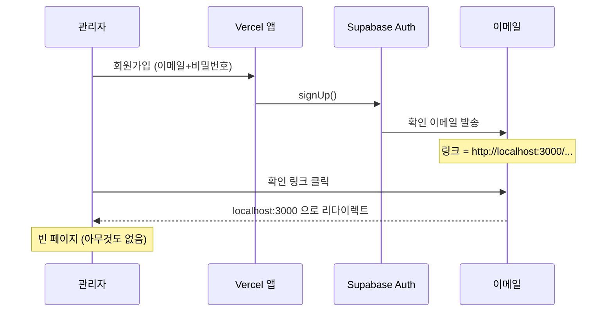
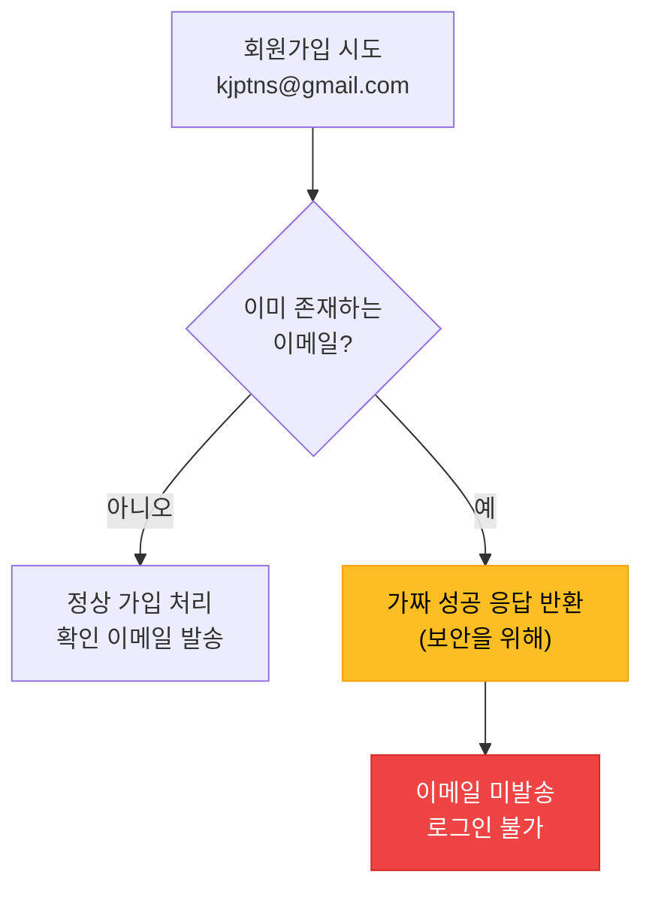
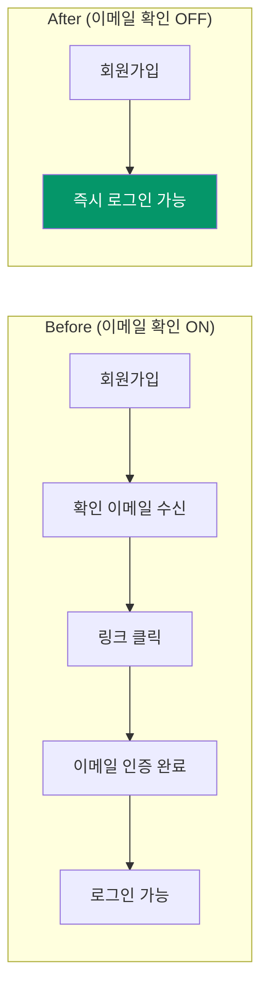
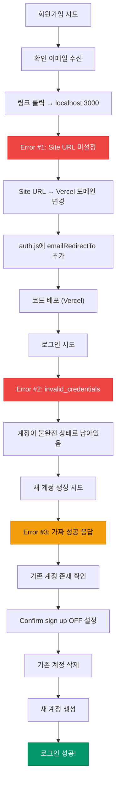

> **[NextX_AX_Solution]** · 주식회사 넥스트엑스(NEXT X) AX 솔루션 실전 트러블슈팅 기록
{: .prompt-tip }

> 이 글은 [프로토타입 제작기]()와 [실전 납품 개발기]()의 **후속편**입니다. 인증 시스템을 구현한 뒤 실제로 로그인을 시도하며 마주친 **에러와 해결 과정**을 다룹니다.
{: .prompt-info }

## 상황 — "로그인이 안 돼요"

파트너스 매칭 매니저에 Supabase Auth 기반 관리자 로그인을 구현하고, Vercel에 배포까지 마쳤습니다. 코드는 완성됐고, 배포도 성공. 그런데 **실제로 로그인을 시도하니 아무것도 안 되는** 상황이 벌어졌습니다.

관리자 계정을 만들려고 회원가입을 하자 "확인 이메일이 전송되었습니다"라는 메시지가 표시됐고, 실제로 이메일이 도착했습니다. 그런데 이메일의 확인 링크를 클릭하면:

```
http://localhost:3000
```

**localhost로 리다이렉트**되면서 빈 페이지가 뜨는 겁니다.

여기서부터 3단계에 걸친 트러블슈팅이 시작됐습니다.

---

## Error #1 — localhost:3000 리다이렉트

### 증상

Supabase에서 보낸 이메일 확인 링크를 클릭하면, 프로덕션 도메인(`partners-manager-omega.vercel.app`)이 아닌 `http://localhost:3000`으로 이동합니다.

### 원인 분석

Supabase 프로젝트를 처음 생성하면, **Site URL**이 기본값 `http://localhost:3000`으로 설정됩니다. 이메일 확인 링크는 이 Site URL을 기반으로 생성되기 때문에, 프로덕션 도메인을 등록하지 않으면 모든 인증 관련 리다이렉트가 localhost로 향합니다.



### 해결

**두 가지를 동시에 수정**해야 했습니다.

**1단계 — Supabase Dashboard에서 Site URL 변경**

`Supabase Dashboard` → `Authentication` → `URL Configuration`으로 이동하여:

| 설정 | Before | After |
|------|--------|-------|
| **Site URL** | `http://localhost:3000` | `https://partners-manager-omega.vercel.app` |
| **Redirect URLs** | (없음) | `https://partners-manager-omega.vercel.app/**` |

**2단계 — 코드에 emailRedirectTo 옵션 추가**

Supabase 클라이언트 측에서도 리다이렉트 URL을 명시적으로 지정해야 합니다:

```javascript
// src/auth.js
export async function signUp(email, password) {
  const { data, error } = await supabase.auth.signUp({
    email,
    password,
    options: {
      emailRedirectTo: window.location.origin + window.location.pathname,
    },
  });
  if (error) throw error;
  return data;
}
```

`window.location.origin`을 사용하면 개발 환경(`localhost`)과 프로덕션 환경(`vercel.app`)에서 **동적으로 올바른 URL이 적용**됩니다.

> `emailRedirectTo`를 하드코딩하면 개발 환경에서 테스트할 때 문제가 생깁니다. `window.location.origin`을 쓰면 환경에 따라 자동으로 맞는 URL이 들어갑니다.
{: .prompt-tip }

---

## Error #2 — invalid_credentials

### 증상

Site URL을 수정한 뒤, 다시 로그인을 시도했습니다. 그런데 이번에는:

```
이메일 또는 비밀번호가 올바르지 않습니다.
```

분명히 방금 가입한 계정인데 로그인이 안 됩니다.

### 원인 분석

Supabase Auth API의 응답을 확인하니 에러 코드가 `invalid_credentials`였습니다. 여기서 중요한 단서가 있었습니다:

| 에러 메시지 | 의미 |
|------------|------|
| `email_not_confirmed` | 이메일 인증 안 됨 → 인증하면 해결 |
| `invalid_credentials` | 비밀번호 불일치 OR 계정 없음 |

`invalid_credentials`가 나왔다는 건, **이메일 인증 자체는 완료됐지만 비밀번호가 맞지 않는다**는 뜻이었습니다.

그런데 왜 비밀번호가 안 맞을까? Site URL이 `localhost`였던 상태에서 이메일 인증을 시도했기 때문에, **인증 확인 콜백이 정상 처리되지 않은 상태**로 계정이 불완전하게 남아 있었습니다.

### 해결

기존 계정을 삭제하고 새로 만들어야 했습니다:

1. `Supabase Dashboard` → `Authentication` → `Users` 이동
2. 기존 `kjptns@gmail.com` 계정 선택 → **삭제**
3. 앱에서 다시 회원가입

하지만 여기서 또 하나의 문제가 발견됐습니다.

---

## Error #3 — "계정 생성은 되는데 로그인은 안 돼요"

### 증상

기존 계정을 삭제하기 전에, 먼저 새 계정을 만들어 보기로 했습니다. 같은 이메일로 회원가입을 시도하자:

```
확인 이메일이 전송되었습니다. 이메일을 확인해 주세요.
```

성공 메시지가 뜹니다. 그런데 이메일이 오지 않고, 로그인도 안 됩니다.

### 원인 분석

이것은 Supabase의 **보안 설계** 때문이었습니다. 이미 존재하는 이메일로 가입을 시도하면, Supabase는 보안상 "이미 계정이 있다"는 사실을 노출하지 않습니다. 대신 **마치 정상적으로 가입된 것처럼 가짜 성공 응답**을 반환합니다.



이 동작은 **이메일 열거 공격(Email Enumeration Attack)** 을 방지하기 위한 것입니다. 공격자가 "이 이메일은 이미 가입됨"이라는 응답을 이용해 가입된 이메일 목록을 수집하는 것을 막아줍니다.

> Supabase가 이미 존재하는 이메일에 대해 가짜 성공 응답을 반환하는 것은 **정상 동작**입니다. 공격자가 특정 이메일의 가입 여부를 확인하지 못하도록 하는 보안 조치입니다.
{: .prompt-warning }

### 해결

로그인 자체를 하려면 결국 **이메일 확인(Confirm sign up)을 비활성화**하고, 기존 계정을 삭제한 뒤 새로 만들어야 했습니다.

---

## 핵심 해결 — Supabase Dashboard 설정 3단계

모든 에러의 근본 원인은 **Supabase Dashboard 설정**이었습니다. 코드는 문제없었지만, Supabase 프로젝트의 인증 설정이 프로덕션 환경에 맞지 않았습니다.

### Step 1. Site URL 변경

`Authentication` → `URL Configuration`

```
Site URL:  https://partners-manager-omega.vercel.app
```

> 이 설정은 이메일 확인, 비밀번호 재설정 등 모든 인증 관련 리다이렉트의 기준 URL이 됩니다.
{: .prompt-info }

### Step 2. 이메일 확인 비활성화

`Authentication` → `Providers` → **Email** 클릭하여 펼침 → **Confirm sign up** 토글 OFF → Save

소규모 관리자 전용 시스템에서는 이메일 확인이 오히려 진입 장벽이 됩니다. 관리자가 직접 계정을 생성하는 구조이므로 이메일 인증 없이 **즉시 로그인 가능**하도록 설정했습니다.



### Step 3. 기존 계정 삭제 후 재생성

`Authentication` → `Users` → 기존 계정 삭제

그런 다음 앱(`https://partners-manager-omega.vercel.app`)에서 "관리자 계정 생성"을 클릭해 새 계정을 만들면, 이메일 확인 없이 **바로 로그인이 됩니다**.

---

## Supabase Dashboard 길 찾기

이 과정에서 가장 오래 걸린 부분은 사실 **Supabase Dashboard에서 설정을 찾는 것**이었습니다. 비슷한 메뉴가 여러 개 있어서 혼동하기 쉽습니다.

| 메뉴 | 위치 | 용도 |
|------|------|------|
| **URL Configuration** | Authentication → URL Configuration | Site URL, Redirect URLs 설정 |
| **Providers** | Authentication → Providers | 이메일 확인 ON/OFF, OAuth 설정 |
| **Templates** | Authentication → Templates | 이메일 본문 템플릿 편집 |
| **Users** | Authentication → Users | 가입된 사용자 조회·삭제 |

특히 **Providers** 페이지에서 "Email" 행은 **클릭해서 펼쳐야** 세부 설정(Confirm sign up 토글)이 나타납니다. 이 부분을 모르면 토글 자체를 찾을 수 없습니다.

> Supabase Providers 페이지에서 "Email"을 클릭하면 아코디언 방식으로 세부 설정이 펼쳐집니다. Confirm sign up 토글은 **펼쳐진 안에** 있습니다.
{: .prompt-tip }

---

## 전체 트러블슈팅 타임라인



---

## 코드 변경 요약

이 트러블슈팅 과정에서 실제로 변경된 코드는 **딱 하나**였습니다:

```javascript
// src/auth.js — signUp 함수에 options 추가
export async function signUp(email, password) {
  const { data, error } = await supabase.auth.signUp({
    email,
    password,
    options: {
      // 이메일 확인 링크 클릭 시 돌아올 URL
      emailRedirectTo: window.location.origin + window.location.pathname,
    },
  });
  if (error) throw error;
  return data;
}
```

나머지는 **모두 Supabase Dashboard 설정**이었습니다. 코드보다 설정이 문제인 경우, 아무리 코드를 들여다봐도 답이 안 나옵니다. 인프라 설정과 코드를 함께 점검하는 습관이 중요합니다.

---

## 교훈 — BaaS 프로덕션 배포 체크리스트

이번 경험을 바탕으로, Supabase Auth를 프로덕션에 배포할 때 **반드시 확인해야 할 항목**을 정리했습니다:

| 순서 | 항목 | 확인 사항 |
|:---:|------|---------|
| 1 | **Site URL** | 프로덕션 도메인으로 변경했는가? |
| 2 | **Redirect URLs** | 프로덕션 도메인 패턴을 등록했는가? |
| 3 | **이메일 확인** | 서비스 특성에 맞게 ON/OFF 설정했는가? |
| 4 | **emailRedirectTo** | 코드에서 동적 URL을 사용하는가? |
| 5 | **RLS 정책** | `anon` → `authenticated` 전환했는가? |
| 6 | **환경변수** | `.env`에 프로덕션 키가 설정되어 있는가? |
| 7 | **테스트** | 실제 배포 URL에서 가입→로그인→CRUD 테스트했는가? |

> 이 체크리스트는 Supabase뿐 아니라 Firebase Auth, Auth0 등 어떤 BaaS 인증 서비스를 쓰더라도 비슷하게 적용됩니다. **"로컬에서 되는데 프로덕션에서 안 되는"** 문제의 대부분은 URL 설정과 환경변수에 있습니다.
{: .prompt-tip }

---

## 프로젝트 링크

| 항목 | URL |
|------|-----|
| **라이브 서비스** | [partners-manager-omega.vercel.app](https://partners-manager-omega.vercel.app/) |
| **프로토타입 제작기** | [내 서비스에 백엔드 한 겹 붙이기]() |
| **실전 납품 개발기** | [계약부터 납품까지]() |

---

*NEXT X R&D · AI Transformation*
