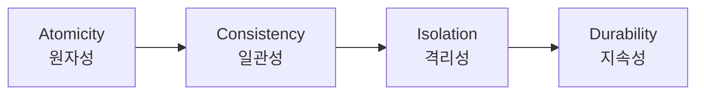
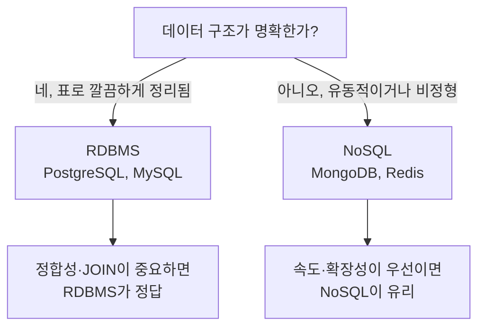
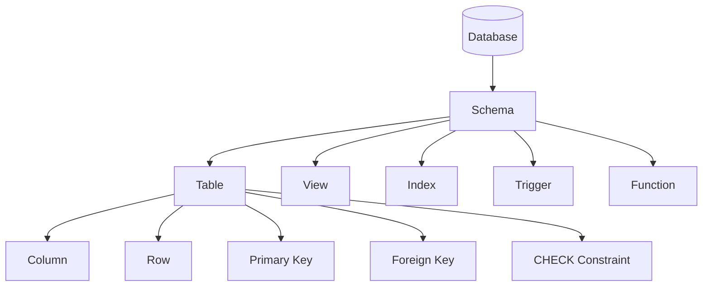
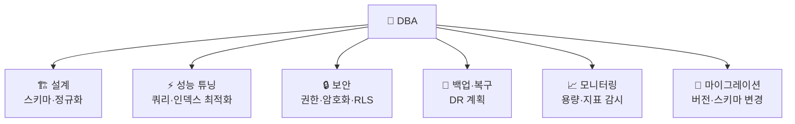
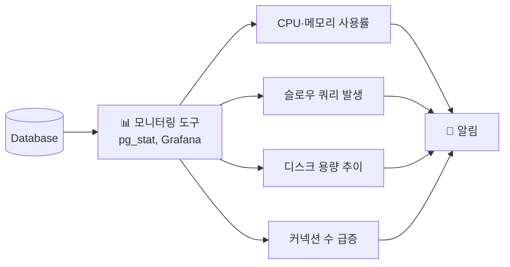
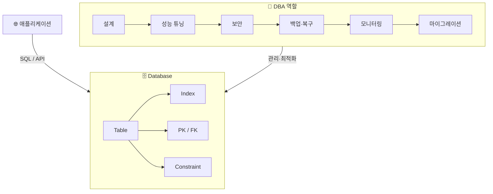

> 🏷️ **[NextX_Data_Solution]** · 주식회사 넥스트엑스(NEXT X) 정식 데이터 솔루션
{: .prompt-tip }

> [데이터 파이프라인]()에서 "데이터를 어딘가에 쌓는다"고 했죠. 그 **"어딘가"** 가 바로 데이터베이스(DB)입니다. 이 글에서는 DB의 구조, 종류, SQL 기본기, 그리고 이 DB를 **지키고 가꾸는 사람** — DBA의 역할을 다룹니다.
{: .prompt-info }

## 🏗️ 1. 데이터베이스란 — 정리된 창고

### 엑셀과 뭐가 다른가?

"엑셀로도 데이터 관리 잘 하는데?" — 맞습니다, **소규모·단독 작업**이면 충분합니다. 하지만 다음 상황이 오면 엑셀은 한계에 부딪힙니다.

| 상황 | 엑셀 | 데이터베이스 |
|------|------|-------------|
| 여러 명이 동시에 수정 | 충돌·덮어쓰기 | **트랜잭션**으로 안전하게 처리 |
| 데이터 10만 행 이상 | 느려지고 꺼짐 | **인덱스**로 밀리초 검색 |
| "주문" + "고객" 연결 | VLOOKUP 지옥 | **JOIN** 한 줄 |
| 실수로 삭제 | Ctrl+Z 기도 | **백업·복구** 체계 |
| 외부 앱에서 접근 | 파일 공유 | **API / SQL 인터페이스** |

> 💡 핵심 차이: 엑셀은 **파일**, DB는 **시스템**입니다. DB에는 데이터를 안전하게 관리하기 위한 **규칙 엔진**이 내장되어 있습니다.
{: .prompt-tip }

### DB의 핵심 속성 — ACID

데이터베이스가 신뢰받는 이유는 **ACID** 4원칙을 보장하기 때문입니다.



| 원칙 | 의미 | 비유 |
|------|------|------|
| **Atomicity** (원자성) | 전부 성공하거나 전부 실패 | 계좌 이체: 보내기만 되고 받기 안 되면 롤백 |
| **Consistency** (일관성) | 규칙을 위반하는 데이터는 저장 불가 | "나이 = -5"는 CHECK 위반으로 거부 |
| **Isolation** (격리성) | 동시 작업이 서로 간섭하지 않음 | A가 읽는 중에 B가 바꿔도 A에게 영향 없음 |
| **Durability** (지속성) | 저장 완료되면 전원이 꺼져도 유지 | 커밋된 데이터는 디스크에 기록됨 |

---

## 📊 2. DB의 종류 — RDBMS vs NoSQL

### RDBMS (관계형 데이터베이스)

**표(Table)** 로 데이터를 관리합니다. 행(Row)과 열(Column)로 구성되고, 테이블 간의 **관계(Relation)** 를 정의합니다.

```
┌─ partners ──────────────────────────────┐
│ id  │ name   │ phone         │ region   │
│─────│────────│───────────────│──────────│
│ 1   │ 김정리 │ 010-1234-5678 │ 서울 강서│
│ 2   │ 이수납 │ 010-2345-6789 │ 서울 마포│
└─────────────────────────────────────────┘
         ↑ FK 관계
┌─ assignments ───────────────────────────┐
│ id  │ partner_id │ client   │ status    │
│─────│────────────│──────────│───────────│
│ A1  │ 1          │ 홍길순   │ 대기      │
│ A2  │ 2          │ 김철수   │ 완료      │
└─────────────────────────────────────────┘
```

**대표 제품:** PostgreSQL, MySQL, Oracle, SQL Server, SQLite

### NoSQL (비관계형 데이터베이스)

표 형태가 아닌, **유연한 구조**로 데이터를 저장합니다.

| 유형 | 저장 방식 | 대표 제품 | 적합한 상황 |
|------|----------|-----------|-------------|
| **Document** | JSON 문서 | MongoDB, Firestore | 스키마가 자주 바뀌는 앱 |
| **Key-Value** | 키=값 쌍 | Redis, DynamoDB | 캐시, 세션 저장 |
| **Column** | 열 단위 저장 | Cassandra, HBase | 시계열, 대용량 로그 |
| **Graph** | 노드-엣지 관계 | Neo4j | 소셜 네트워크, 추천 |

### 어떤 걸 써야 할까?



> 💡 실무에서는 **둘 다 씁니다.** 주 데이터는 RDBMS에, 캐시·세션·검색은 NoSQL에 맡기는 조합이 흔합니다. "어느 쪽이 더 좋다"가 아니라 "각자의 강점을 어디에 쓸까"의 문제입니다.
{: .prompt-tip }

---

## 🗄️ 3. DB의 내부 구조 — 테이블만 있는 게 아니다



| 구성 요소 | 역할 | 비유 |
|-----------|------|------|
| **Table** | 데이터 저장 단위 | 엑셀 시트 |
| **Column** | 데이터 속성(필드) | 시트의 열 (이름, 전화번호…) |
| **Row** | 실제 데이터 한 건 | 시트의 행 |
| **Primary Key (PK)** | 행을 유일하게 식별하는 키 | 주민등록번호 |
| **Foreign Key (FK)** | 다른 테이블과의 연결 고리 | "이 주문은 저 고객의 것" |
| **Index** | 빠른 검색을 위한 색인 | 책의 찾아보기(색인) |
| **View** | 자주 쓰는 쿼리를 저장한 가상 테이블 | 저장된 필터 |
| **Trigger** | 데이터 변경 시 자동 실행되는 코드 | "수정되면 updated_at 갱신" |
| **Constraint** | 데이터 규칙 강제 | "나이는 0 이상", "전화번호 형식" |

---

## 📝 4. SQL 기본기 — DB와 대화하는 언어

SQL(Structured Query Language)은 DB에 질문하고 명령하는 **표준 언어**입니다.

### CRUD — 4가지 기본 동작

| 동작 | SQL 명령 | 뜻 |
|------|---------|-----|
| **C**reate | `INSERT` | 새 데이터 추가 |
| **R**ead | `SELECT` | 데이터 조회 |
| **U**pdate | `UPDATE` | 기존 데이터 수정 |
| **D**elete | `DELETE` | 데이터 삭제 |

### 실전 예시

```sql
-- 활동중인 파트너 목록 조회
SELECT name, phone, region
FROM partners
WHERE is_active = true
ORDER BY name;

-- 새 파트너 등록
INSERT INTO partners (name, phone, region, specialty)
VALUES ('최깔끔', '010-9876-5432', '서울 송파구', '정리수납');

-- 파트너 비활성화
UPDATE partners
SET is_active = false
WHERE id = 'some-uuid';

-- 완료된 배정에서 파트너 이름도 함께 조회 (JOIN)
SELECT a.client_name, a.assignment_date, p.name AS partner_name
FROM assignments a
JOIN partners p ON a.partner_id = p.id
WHERE a.status = '완료';
```

### DDL vs DML vs DCL

SQL은 용도에 따라 세 가지로 나뉩니다:

| 분류 | 풀네임 | 주요 명령 | 하는 일 |
|------|--------|----------|---------|
| **DDL** | Data Definition Language | `CREATE`, `ALTER`, `DROP` | 테이블 구조 정의 |
| **DML** | Data Manipulation Language | `SELECT`, `INSERT`, `UPDATE`, `DELETE` | 데이터 조작 |
| **DCL** | Data Control Language | `GRANT`, `REVOKE` | 권한 관리 |

> 💡 **"SQL을 안다"는 것은 곧 "데이터와 대화할 수 있다"는 뜻입니다.** 개발자가 아니어도 마케터, 기획자, 경영진이 SQL을 알면 "데이터 뽑아주세요" 대신 직접 답을 찾을 수 있습니다.
{: .prompt-tip }

---

## 🔍 5. 인덱스 — DB가 빠른 진짜 이유

### 인덱스 없이 검색하면?

10만 행에서 `WHERE phone = '010-1234-5678'`을 찾을 때:
- **인덱스 없음** → 1행부터 10만 행까지 **전부 훑음** (Full Table Scan)
- **인덱스 있음** → 색인에서 바로 위치 점프 (보통 **3~4번 비교**로 끝)

### 비유: 책의 찾아보기

| | 찾아보기 없는 책 | 찾아보기 있는 책 |
|---|---|---|
| 찾기 | 1페이지부터 한 장씩 넘김 | 뒤의 색인에서 페이지 번호 확인 → 바로 이동 |
| 속도 | 책이 두꺼울수록 느려짐 | 책 두께와 무관하게 빠름 |
| 비용 | 공간 0 | 색인 페이지만큼 공간 추가 |

```sql
-- 인덱스 생성 예시
CREATE INDEX idx_partners_phone ON partners(phone);

-- 이제 phone으로 검색하면 Full Scan 대신 Index Scan
SELECT * FROM partners WHERE phone = '010-1234-5678';
```

### 인덱스의 트레이드오프

| 장점 | 단점 |
|------|------|
| `SELECT` (조회) 속도 향상 | `INSERT`/`UPDATE`/`DELETE` 시 인덱스도 갱신 → 쓰기 느려짐 |
| 대용량 데이터에서 효과 극대화 | 디스크 공간 추가 사용 |
| 정렬(`ORDER BY`) 성능 개선 | 잘못된 인덱스는 오히려 성능 저하 |

> ⚠️ "인덱스를 많이 만들수록 좋다"는 **오해**입니다. 자주 조회하는 열에만 선별적으로 만들어야 합니다. 모든 열에 인덱스를 걸면 쓰기 작업이 느려져 전체 성능이 떨어집니다.
{: .prompt-warning }

---

## 👤 6. DBA — 데이터베이스를 지키는 사람

### DBA(Database Administrator)란?

DB를 **설계하고, 운영하고, 지키는** 전문가입니다. 개발자가 건물을 짓는 사람이라면, DBA는 **건물 관리인**입니다 — 배관 점검, 소방 설비, 보안 시스템, 에너지 효율을 모두 책임집니다.

### DBA의 6대 역할



#### 1) 설계 — 데이터의 뼈대를 세운다

| 작업 | 설명 |
|------|------|
| **스키마 설계** | 테이블, 컬럼, 관계(FK), 제약조건을 정의 |
| **정규화** | 데이터 중복을 최소화하는 구조로 분리 |
| **비정규화** | 성능을 위해 의도적으로 중복을 허용하기도 |

**정규화 예시 — 주문 테이블:**

```
❌ 비정규화 (중복 발생)
┌────┬──────┬──────────┬────────┐
│ 주문│ 고객  │ 고객전화   │ 상품    │
│ 1  │ 김철수│ 010-1111  │ 노트북  │
│ 2  │ 김철수│ 010-1111  │ 마우스  │  ← 김철수 정보가 반복됨
└────┴──────┴──────────┴────────┘

✅ 정규화 (분리)
고객 테이블          주문 테이블
┌────┬──────┬────────┐  ┌────┬────────┬──────┐
│ id │ 이름  │ 전화    │  │ id │ 고객_id │ 상품  │
│ C1 │ 김철수│ 010-1111│  │ 1  │ C1     │ 노트북│
└────┴──────┴────────┘  │ 2  │ C1     │ 마우스│
                        └────┴────────┴──────┘
```

#### 2) 성능 튜닝 — 느린 쿼리를 잡는다

DBA가 가장 많은 시간을 쓰는 영역입니다.

- **슬로우 쿼리 분석** — `EXPLAIN ANALYZE`로 실행 계획을 읽고, Full Scan을 Index Scan으로 전환
- **인덱스 전략** — 자주 조회되는 컬럼에 인덱스 추가, 사용되지 않는 인덱스 제거
- **쿼리 리팩터링** — `SELECT *` 대신 필요한 컬럼만, 서브쿼리를 JOIN으로 전환
- **커넥션 풀 관리** — DB 동시 접속 수 제한으로 과부하 방지

```sql
-- 슬로우 쿼리 분석 예시 (PostgreSQL)
EXPLAIN ANALYZE
SELECT * FROM assignments
WHERE partner_id = 'some-uuid'
AND status = '대기';

-- 결과에서 "Seq Scan"이 보이면 → 인덱스 필요
-- "Index Scan"이 보이면 → 양호
```

#### 3) 보안 — 데이터를 지킨다

| 보안 영역 | DBA가 하는 일 |
|-----------|-------------|
| **접근 제어** | 역할(Role)별 권한 분리 — 누가 무엇을 할 수 있는지 |
| **RLS** | 행 단위 접근 제어 — 같은 테이블이라도 사용자마다 보이는 행이 다름 |
| **암호화** | 저장 시(at rest) + 전송 시(in transit) 암호화 |
| **감사 로그** | 누가 언제 무엇을 했는지 기록 |
| **SQL Injection 방지** | 파라미터 바인딩 강제, 입력값 검증 |

```sql
-- 역할 기반 접근 제어 예시
CREATE ROLE readonly_user;
GRANT SELECT ON ALL TABLES IN SCHEMA public TO readonly_user;
-- → 이 역할은 조회만 가능, 수정·삭제 불가
```

#### 4) 백업·복구 — 최악에 대비한다

| 백업 유형 | 설명 | 복구 시간 |
|-----------|------|----------|
| **Full Backup** | DB 전체를 통째로 복사 | 느리지만 확실 |
| **Incremental** | 마지막 백업 이후 변경분만 | 빠르지만 의존성 있음 |
| **Point-in-Time** | 특정 시각으로 되돌리기 (WAL 로그) | 정밀 복구 가능 |

> 💡 **"백업은 복구 테스트를 해야 백업입니다."** 백업 파일이 있다고 안심하면 안 됩니다. 정기적으로 **복구 훈련**을 해서 실제로 되는지 확인해야 합니다. DBA의 가장 중요한 습관입니다.
{: .prompt-tip }

#### 5) 모니터링 — 문제를 미리 감지한다



DBA는 **DB가 아플 때**가 아니라 **아프기 전에** 조치합니다:
- 디스크 80% → 용량 확보 또는 파티셔닝
- 슬로우 쿼리 급증 → 인덱스 점검
- 커넥션 풀 소진 → 풀 크기 조정 또는 쿼리 최적화

#### 6) 마이그레이션 — 구조를 안전하게 바꾼다

서비스가 성장하면 테이블 구조도 변해야 합니다. 하지만 **운영 중인 DB의 구조를 바꾸는 건 비행기 엔진을 비행 중에 교체하는 것**과 같습니다.

| 단계 | 작업 |
|------|------|
| 1. 계획 | 변경 SQL 작성, 영향도 분석 |
| 2. 테스트 | 스테이징 환경에서 먼저 실행 |
| 3. 백업 | 운영 DB 스냅샷 생성 |
| 4. 실행 | 트래픽이 적은 시간에 적용 |
| 5. 검증 | 앱 정상 동작 확인, 롤백 시나리오 준비 |

---

## 🤖 7. AI 시대의 DBA — 사라지는 게 아니라 진화한다

"AI가 DBA를 대체하나요?" — **아니요**, 하지만 DBA의 일하는 방식은 바뀌고 있습니다.

| 과거 DBA | 현재/미래 DBA |
|----------|-------------|
| 수동 쿼리 튜닝 | AI가 슬로우 쿼리 자동 추천, DBA가 **판단** |
| 주기적 수동 백업 | 자동 백업 + DBA가 **복구 전략 설계** |
| 직접 모니터링 | AIOps가 이상 감지, DBA가 **근본 원인 분석** |
| 온프레미스 서버 관리 | 클라우드(RDS, Supabase) + DBA가 **아키텍처 설계** |

DBA의 가치는 **"쿼리를 짜는 것"이 아니라 "데이터를 이해하고 판단하는 것"** 입니다. AI가 실행력을 더해줄수록, 이 판단력의 가치는 더 올라갑니다.

---

## 🎯 정리 — 한 장으로 보기



| 키워드 | 핵심 요약 |
|--------|----------|
| **DB** | 데이터를 구조화하여 안전하게 저장·조회하는 시스템 |
| **ACID** | 원자성·일관성·격리성·지속성 — DB의 신뢰 기반 |
| **RDBMS** | 표 형태, 관계(JOIN), 정합성 강점 — PostgreSQL, MySQL |
| **NoSQL** | 유연한 구조, 확장성 강점 — MongoDB, Redis |
| **SQL** | DB와 대화하는 표준 언어 — CRUD + DDL + DCL |
| **Index** | 빠른 검색의 비결, 단 과다 생성은 역효과 |
| **DBA** | DB의 설계·성능·보안·백업·모니터링·마이그레이션을 책임지는 전문가 |

---

## 🔗 함께 보기

- 📦 **데이터 기초** → [데이터 파이프라인이란?]() · [데이터 클렌징 실전]()
- 🔍 **검색·AI** → [임베딩 & 벡터 DB]()
- 🚀 **DB 실전 프로젝트** → [파트너스 매칭 매니저 제작기]() (Supabase + RLS 실전)
- 📊 **시각화** → [대시보드 설계의 기술]()

---

> 📎 본 글은 **주식회사 넥스트엑스(NEXT X) 기술연구소**의 R&D 자산입니다.
> **함께 읽기** — [📖 블로그 안내]() · [📩 비즈니스 문의]()
{: .prompt-info }
