> **[NextX_R&D_Log]** · 주식회사 넥스트엑스(NEXT X) 기술연구소 — 백엔드 개발 가이드
{: .prompt-tip }

> 사용자는 버튼을 누르고, 목록이 뜨고, 로그인이 되면 "잘 작동한다"고 느낍니다. 하지만 그 버튼 뒤에서 데이터를 꺼내고, 권한을 확인하고, 결과를 돌려주는 **보이지 않는 시스템** — 그것을 설계하고 운영하는 사람이 **백엔드 개발자**입니다. 이 글은 백엔드의 본질, 핵심 업무, 기술 생태계, 그리고 프론트엔드와의 협업까지 다룹니다.
{: .prompt-info }

## 백엔드란 — "뒷무대"의 모든 것

**백엔드(Backend)** 는 사용자에게 **직접 보이지 않지만**, 서비스가 돌아가기 위해 반드시 필요한 모든 것을 뜻합니다.

> 네트워크, 서버, 호스팅, HTTP 등 백엔드의 인프라 기반은 [백엔드·네트워크 완전 지도]() 편에서 자세히 다뤘습니다. 이 글은 **백엔드 개발자의 역할과 역량**에 집중합니다.
{: .prompt-info }

### 레스토랑 비유

| 레스토랑 | 웹 서비스 |
|----------|----------|
| **홀** — 메뉴판, 인테리어, 서빙 | **프론트엔드** — 화면, 인터랙션, UI |
| **주방** — 조리, 재료 관리, 위생 | **백엔드** — 데이터 처리, 비즈니스 로직, 보안 |
| **냉장고·창고** — 식재료 보관 | **데이터베이스** — 데이터 저장·조회 |
| **주문 전표 시스템** — 홀↔주방 소통 | **API** — 프론트↔백엔드 소통 |
| **위생 관리 체계** — 유통기한, 소독 | **보안** — 인증, 암호화, 권한 관리 |

손님(사용자)은 주방 안을 볼 수 없지만, 주방이 무너지면 레스토랑 전체가 멈춥니다. **좋은 백엔드는 사용자가 그 존재를 의식하지 못하는 백엔드**입니다 — 느리거나 오류가 나야 비로소 "뭔가 잘못됐다"고 느끼니까요.

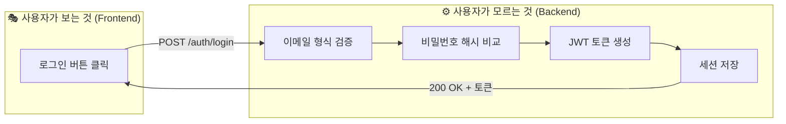

---

## 백엔드 개발자의 핵심 업무 6가지

"서버 개발자"라는 이름으로도 불리지만, 현대 백엔드 개발자의 업무는 서버 코드 작성을 넘어 **데이터 설계, 보안, 인프라, 운영**까지 아우릅니다.

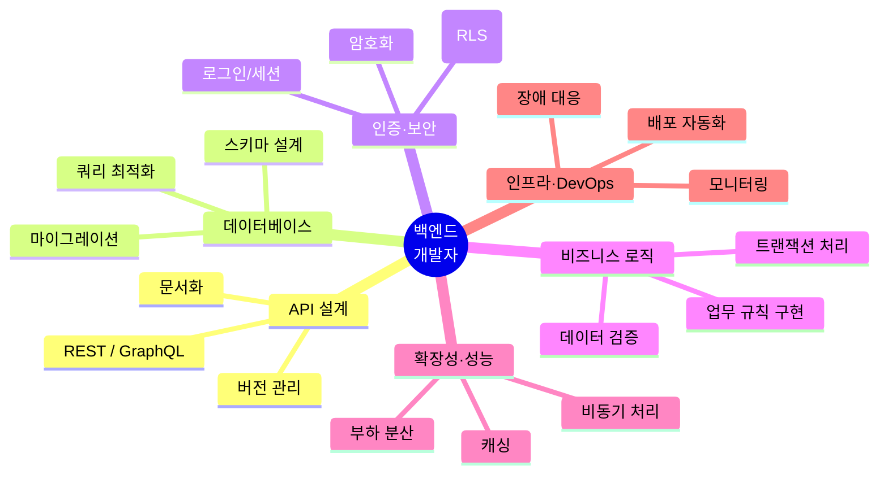

### 1. API 설계 & 구현

API(Application Programming Interface)는 프론트엔드와 백엔드가 소통하는 **계약서**입니다. 백엔드 개발자의 가장 기본적이면서 중요한 업무입니다.

> API의 기본 개념은 [API가 뭐길래]() 편을 참고하세요.
{: .prompt-info }

```
GET    /api/partners          → 파트너 목록 조회
POST   /api/partners          → 새 파트너 등록
PUT    /api/partners/:id      → 파트너 정보 수정
DELETE /api/partners/:id      → 파트너 삭제
```

단순히 URL을 만드는 것이 아니라, **누가, 어떤 데이터를, 어떤 형식으로, 어떤 조건에서** 접근할 수 있는지를 설계합니다.

| 좋은 API | 나쁜 API |
|----------|----------|
| `GET /api/partners?region=제주` | `GET /api/getData?type=1&mode=2` |
| `POST /api/assignments` (201 Created) | `POST /api/do` (200 OK, 뭘 했는지 모름) |
| 에러 시 `{"error": "partner_not_found"}` | 에러 시 `500 Internal Server Error` (정보 없음) |
| API 문서(Swagger/OpenAPI) 제공 | "코드 보면 알아요" |

#### REST vs GraphQL

| | REST | GraphQL |
|---|---|---|
| **비유** | 정해진 메뉴판 — 세트 메뉴 | 뷔페 — 원하는 것만 골라 담기 |
| **요청** | URL마다 고정된 데이터 | 클라이언트가 필요한 필드만 지정 |
| **장점** | 단순, 캐싱 쉬움, 표준적 | 유연, 데이터 낭비 없음 |
| **단점** | Over-fetching(필요 이상 받음) | 복잡, 캐싱 어려움 |
| **적합** | 대부분의 CRUD 서비스 | 복잡한 데이터 관계, 모바일 앱 |

### 2. 데이터베이스 설계 & 최적화

백엔드의 핵심 자산은 **데이터**입니다. 데이터를 어떤 구조로 저장하고, 어떻게 효율적으로 꺼내고, 안전하게 보호하느냐가 백엔드의 가치를 결정합니다.

> 데이터베이스의 기본 개념, SQL, DBA 역할은 [DB와 DBA]() 편에서 다뤘습니다.
{: .prompt-info }

#### 스키마 설계 — "데이터의 설계도"

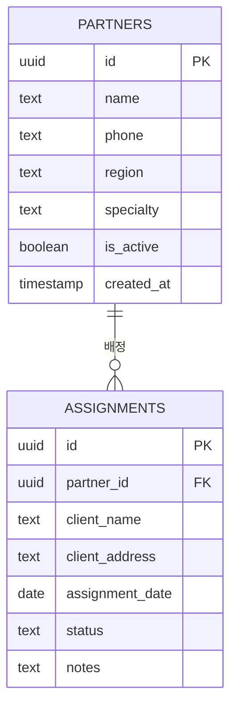

테이블 구조를 잘못 설계하면 나중에 수정하기가 매우 어렵습니다. 백엔드 개발자는 프로젝트 초기에 **정규화(Normalization)**, **관계(Relationship)**, **인덱스(Index)** 전략을 결정합니다.

#### 쿼리 최적화 — "같은 질문, 다른 속도"

```sql
-- 느린 쿼리: 전체 테이블 스캔
SELECT * FROM partners WHERE name LIKE '%김%';

-- 빠른 쿼리: 인덱스 활용
SELECT id, name, region FROM partners WHERE region = '제주' AND is_active = true;
```

| 최적화 기법 | 설명 |
|------------|------|
| **인덱스** | 자주 검색하는 컬럼에 색인 생성 (책의 목차) |
| **쿼리 분석** | EXPLAIN으로 실행 계획 확인, 병목 발견 |
| **N+1 문제 방지** | 반복 쿼리 대신 JOIN으로 한 번에 조회 |
| **페이지네이션** | 만 건을 한 번에 안 꺼내고, 20건씩 나눠 전달 |

### 3. 인증 & 보안

**"이 요청을 보낸 사람이 누구인가? 이 작업을 할 권한이 있는가?"** — 백엔드 보안의 핵심 질문입니다.

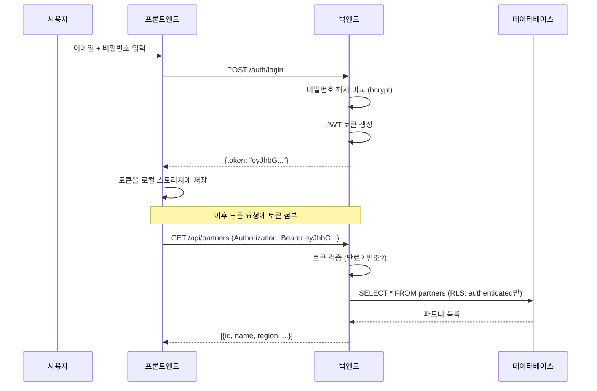

#### 인증(Authentication) vs 인가(Authorization)

| | 인증(Authentication) | 인가(Authorization) |
|---|---|---|
| **질문** | "당신은 **누구**인가?" | "당신은 이것을 **할 수 있는가**?" |
| **비유** | 건물 출입증 — 신원 확인 | 층별 권한 — 3층은 출입 가능, 5층은 불가 |
| **구현** | 로그인, JWT, 세션 | 역할(Role), 권한(Permission), RLS |
| **실패 시** | 401 Unauthorized | 403 Forbidden |

#### 절대 하지 말아야 할 것

| 위험 행위 | 올바른 방법 |
|----------|-----------|
| 비밀번호를 평문으로 저장 | **bcrypt/argon2** 해시 후 저장 |
| SQL 문자열 직접 조립 | **파라미터 바인딩** (SQL 인젝션 방지) |
| 프론트에서만 권한 체크 | **백엔드에서 반드시 재검증** |
| 시크릿 키를 코드에 하드코딩 | **.env 파일 + 환경변수** |
| 에러 시 스택 트레이스 노출 | **일반적 에러 메시지** 반환, 상세 로그는 서버에만 |

> 넥스트엑스가 파트너스 매칭 매니저에 적용한 Supabase Auth + RLS 보안 구현 과정은 [실전 납품 개발기]()에서, 설정 과정에서 겪은 실전 트러블슈팅은 [Supabase Auth 트러블슈팅]()에서 확인할 수 있습니다.
{: .prompt-tip }

### 4. 비즈니스 로직

**비즈니스 로직**은 서비스의 핵심 규칙을 코드로 표현한 것입니다. 프론트엔드가 "어떻게 보이는지"를 담당한다면, 백엔드는 **"어떻게 동작하는지"** 를 담당합니다.

| 서비스 | 비즈니스 로직 예시 |
|--------|-----------------|
| **파트너 매칭 매니저** | "비활성 파트너는 배정 대상에서 제외", "배정 상태는 대기→완료→종료 순서로만 변경 가능" |
| **쇼핑몰** | "재고 0이면 주문 불가", "쿠폰은 1인 1회만 사용" |
| **은행** | "출금 시 잔액 부족이면 거부", "이체 중 시스템 오류 시 양쪽 모두 원복(트랜잭션)" |
| **예약 시스템** | "같은 시간대 중복 예약 방지", "취소 수수료는 24시간 전까지 무료" |

#### 트랜잭션 — "전부 아니면 전무"

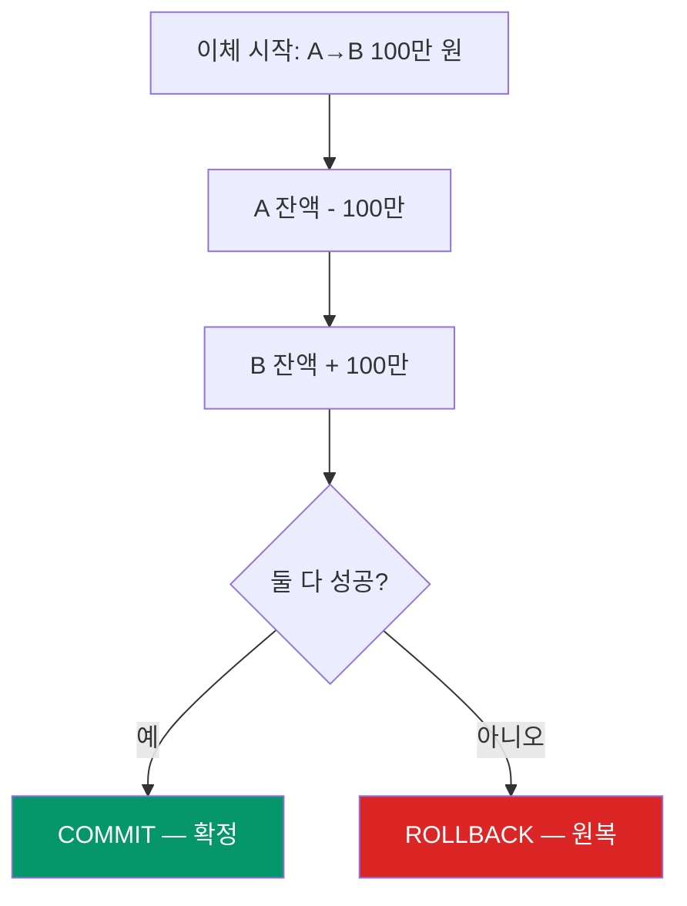

A 계좌에서 100만 원을 빼고 B 계좌에 넣는 중, B에 넣는 과정에서 오류가 나면? A에서 뺀 100만 원도 **원래대로 되돌려야** 합니다. 이것이 트랜잭션의 **원자성(Atomicity)** — 전부 성공하거나, 전부 실패하거나.

### 5. 확장성 & 성능

사용자가 10명일 때 잘 되던 시스템이 10,000명이 되면 무너질 수 있습니다. 백엔드 개발자는 **미래의 부하**를 예측하고 대비합니다.

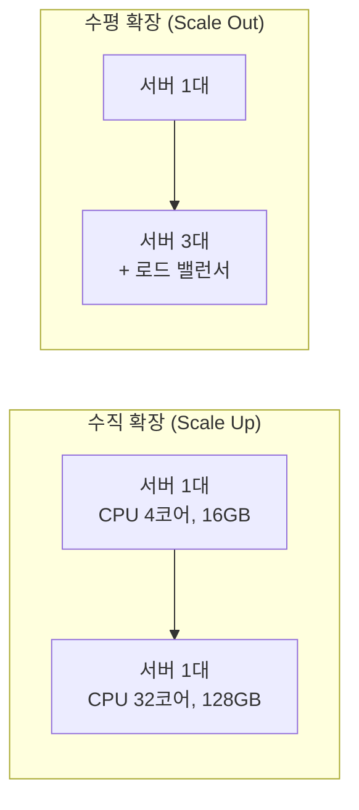

| 기법 | 설명 | 비유 |
|------|------|------|
| **캐싱** | 자주 요청되는 데이터를 메모리에 저장 | 자주 꺼내는 재료를 카운터 위에 |
| **로드 밸런싱** | 요청을 여러 서버에 분산 | 주문을 여러 주방에 나눠 보내기 |
| **비동기 처리** | 오래 걸리는 작업을 대기열에 넣고 나중에 처리 | "진동벨 드릴게요" |
| **CDN** | 정적 파일을 전 세계 서버에 복사 | 각 지역에 창고를 두기 |
| **DB 레플리카** | 읽기 전용 DB 복사본 | 원본은 보존, 복사본으로 조회 |

### 6. 인프라 & DevOps

코드를 작성하는 것만으로 끝나지 않습니다. 그 코드를 **서버에 올리고, 모니터링하고, 장애에 대응**하는 것도 백엔드의 영역입니다.

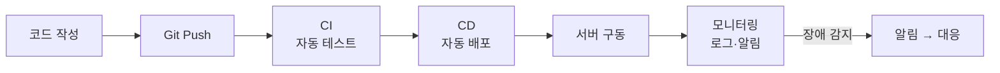

| DevOps 업무 | 도구 예시 |
|------------|----------|
| **컨테이너화** | Docker — 개발 환경과 운영 환경을 동일하게 |
| **오케스트레이션** | Kubernetes — 컨테이너 수백 개를 자동 관리 |
| **CI/CD** | GitHub Actions, Jenkins — 코드 푸시 시 자동 테스트·배포 |
| **모니터링** | Grafana, DataDog — 서버 상태 실시간 감시 |
| **로그 관리** | ELK Stack, Loki — 로그 수집·검색·분석 |

---

## 백엔드 기술 생태계 — 2026년 현재

### 프로그래밍 언어

| 언어 | 특징 | 대표 프레임워크 | 적합한 프로젝트 |
|------|------|--------------|--------------|
| **Node.js** | JavaScript 기반, 비동기 I/O, 프론트와 언어 통일 | Express, Fastify, NestJS | API 서버, 실시간 앱 |
| **Python** | 읽기 쉬운 문법, AI/ML 생태계, 빠른 프로토타입 | Django, FastAPI, Flask | AI 서비스, 데이터 처리, 스타트업 |
| **Java** | 엔터프라이즈 표준, 안정적, 대규모 팀에 강함 | Spring Boot | 금융, 대기업, 복잡한 비즈니스 |
| **Go** | 컴파일 언어, 동시성 처리 탁월, 작은 바이너리 | Gin, Echo | 고성능 마이크로서비스 |
| **Rust** | 메모리 안전, C급 성능, 시스템 프로그래밍 | Actix, Axum | 성능 극한, 인프라 도구 |

### 데이터베이스

| 종류 | 대표 | 데이터 구조 | 적합한 상황 |
|------|------|-----------|-----------|
| **RDBMS** | PostgreSQL, MySQL | 테이블(행·열), 관계 | 정형 데이터, 트랜잭션 중요 |
| **문서 DB** | MongoDB | JSON 문서 | 스키마 유연, 빠른 개발 |
| **키-값 저장소** | Redis | 키:값 쌍 | 캐싱, 세션, 순위표 |
| **검색 엔진** | Elasticsearch | 역색인 | 전문 검색, 로그 분석 |

### BaaS (Backend as a Service)

모든 것을 직접 구축하지 않아도 됩니다. **BaaS**는 백엔드의 핵심 기능(DB, 인증, 스토리지, API)을 서비스로 제공합니다.

| BaaS | 특징 |
|------|------|
| **Supabase** | PostgreSQL 기반, RLS, 실시간 구독, 오픈소스 |
| **Firebase** | Google 제품, NoSQL(Firestore), 모바일 강점 |
| **AWS Amplify** | AWS 서비스 통합, 풀스택 프레임워크 |
| **Appwrite** | 셀프호스팅 가능, Docker 기반, 오픈소스 |

> 넥스트엑스는 파트너스 매칭 매니저에 **Supabase**를 채택했습니다. PostgreSQL의 강력한 RLS(Row Level Security)로 인증된 관리자만 데이터에 접근하도록 설계했습니다. 자세한 과정은 [프로토타입 제작기]()를 참고하세요.
{: .prompt-tip }

---

## 백엔드 개발자의 성장 경로

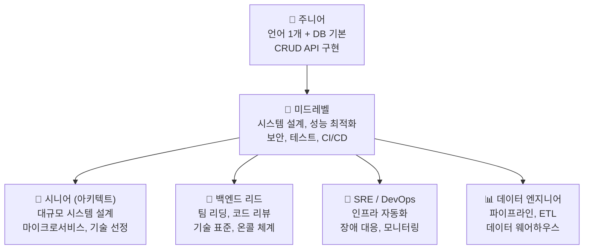

### 주니어 (0~2년)

| 역량 | 수준 |
|------|------|
| 언어 | Node.js 또는 Python **하나**를 깊이 있게 |
| DB | SQL 기본(SELECT/JOIN/GROUP BY), 스키마 설계 |
| API | REST API CRUD 구현, 요청/응답 처리 |
| 도구 | Git, 터미널, Docker 기초, Postman |

### 미드레벨 (2~5년)

| 역량 | 수준 |
|------|------|
| 설계 | 테이블 정규화, 인덱스 전략, 캐싱 도입 |
| 보안 | JWT, OAuth2, SQL 인젝션/XSS 방어 |
| 테스트 | 단위·통합 테스트, 부하 테스트 |
| 인프라 | Docker Compose, CI/CD 파이프라인 구축 |

### 시니어 (5년+)

| 역량 | 수준 |
|------|------|
| 아키텍처 | 모놀리스→마이크로서비스 판단, 이벤트 소싱, CQRS |
| 확장성 | 샤딩, 레플리카, 메시지 큐(Kafka, RabbitMQ) |
| 운영 | SLA 설계, 장애 포스트모템, 온콜 체계 |
| 리더십 | 기술 로드맵, 채용, 주니어 멘토링 |

---

## 프론트엔드와의 협업 — "계약 기반 개발"

백엔드와 프론트엔드는 **API 명세**라는 계약서를 통해 소통합니다. 이 계약이 명확할수록 양쪽이 독립적으로 개발할 수 있습니다.

> 프론트엔드 개발자의 역할과 협업 방식은 [프론트엔드와 프론트엔드 개발자]() 편에서 다뤘습니다.
{: .prompt-info }

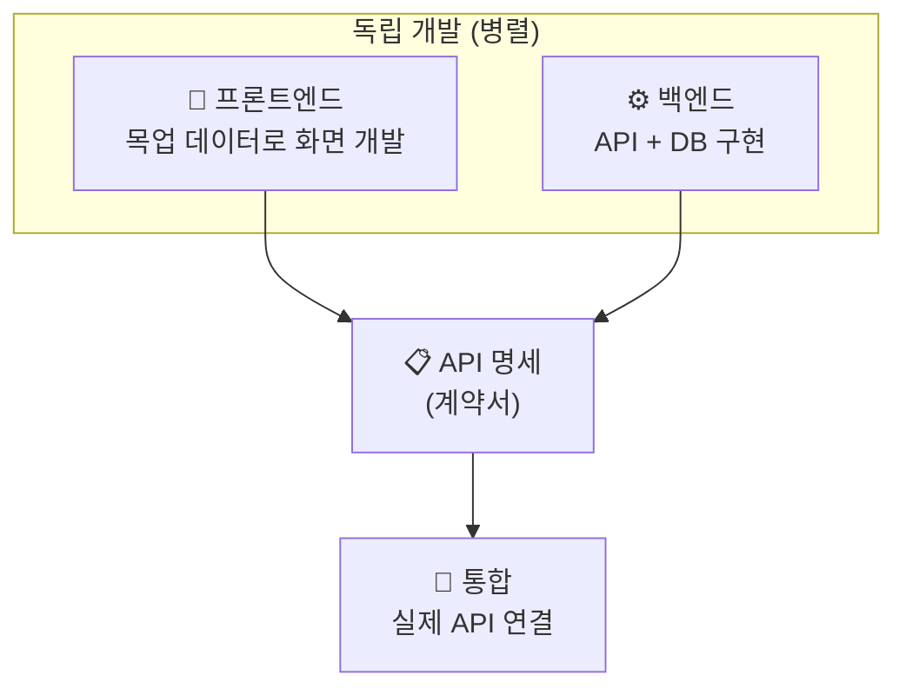

### 좋은 협업을 위한 백엔드의 역할

| 책임 | 구체적 행동 |
|------|-----------|
| **명확한 API 문서** | Swagger/OpenAPI로 자동 생성, 예제 포함 |
| **일관된 응답 형식** | 성공/에러 모두 같은 구조 (`{data, error, message}`) |
| **적절한 상태 코드** | 200(성공), 201(생성), 400(잘못된 요청), 404(없음), 500(서버 오류) |
| **에러 메시지 구체화** | `"partner_not_found"` (프론트가 한국어로 변환 가능) |
| **변경 시 소통** | API 변경 전 프론트엔드 팀과 합의, 버전 관리 |

---

## 실전에서 보는 백엔드 — 파트너스 매칭 매니저

[파트너스 매칭 매니저](https://partners-manager-omega.vercel.app/)의 백엔드는 Supabase(PostgreSQL + Auth + REST API)로 구성됩니다.

### 적용된 백엔드 기술

| 영역 | 적용 내용 |
|------|---------|
| **API** | Supabase REST API — 자동 생성 CRUD 엔드포인트 |
| **DB 설계** | partners, assignments 2개 테이블, FK 관계, CASCADE 삭제 |
| **인증** | Supabase Auth — 이메일/비밀번호, JWT 토큰 자동 관리 |
| **보안 (RLS)** | `authenticated` 역할만 CRUD 허용, `anon` 전면 차단 |
| **데이터 검증** | NOT NULL 제약, 기본값(is_active=true, status='대기') |

### RLS — 백엔드 보안의 핵심

```sql
-- anon(미인증)은 아무것도 못 함
-- authenticated(로그인한 사용자)만 조회 가능
CREATE POLICY "Authenticated read partners"
  ON partners FOR SELECT
  TO authenticated
  USING (true);
```

RLS(Row Level Security)는 **데이터베이스 레벨에서** 접근을 제어합니다. API 서버에 버그가 있어도, DB가 마지막 방어선이 되는 구조입니다.

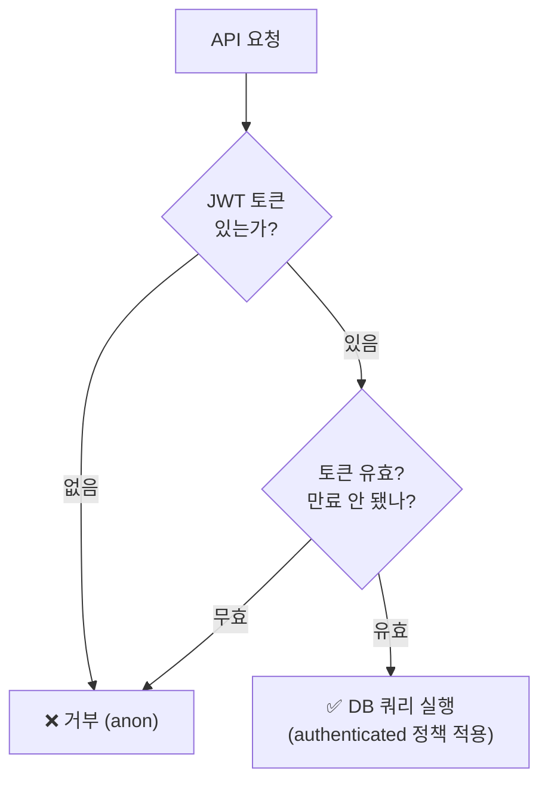

---

## AI 시대의 백엔드 개발자

AI 도구의 발전으로 CRUD API나 기본 스키마를 **빠르게 생성**할 수 있게 됐습니다. 하지만 백엔드의 핵심 가치는 코드 양이 아니라 **설계 판단**에 있습니다.

### AI가 대체하는 것 vs 대체하지 못하는 것

| AI가 잘하는 것 | 백엔드 개발자만 하는 것 |
|---|---|
| CRUD API 보일러플레이트 생성 | "이 데이터를 어떤 구조로 저장할 것인가" 설계 |
| SQL 쿼리 작성 | 인덱스 전략, 파티셔닝, 샤딩 **판단** |
| 기본 인증 코드 생성 | 보안 정책 수립, 위협 모델링 |
| 에러 처리 패턴 적용 | 장애 시나리오 예측 및 대응 전략 |
| 테스트 코드 초안 | "무엇을 테스트해야 하는가" 결정 |

> AI가 "로그인 기능 만들어 줘"라고 하면 코드는 나옵니다. 하지만 [Supabase Auth 트러블슈팅]()에서 봤듯이, **프로덕션에서 실제로 동작하게 만드는 것** — Site URL 설정, 이메일 확인 정책, 리다이렉트 URL 처리 — 은 인프라에 대한 이해와 디버깅 능력이 필요합니다.
{: .prompt-tip }

---

## 백엔드 개발자에게 필요한 소프트 스킬

| 소프트 스킬 | 왜 필요한가 |
|------------|-----------|
| **시스템 사고** | 개별 기능이 아니라 시스템 **전체**를 보는 능력. 이 변경이 다른 서비스에 어떤 영향을 미치는가? |
| **커뮤니케이션** | API 명세, 장애 보고, 기술 문서 — 명확하게 쓰고 말하는 능력 |
| **꼼꼼함** | 엣지케이스, 동시성 문제, 보안 취약점 — 놓치면 장애가 되는 디테일 |
| **장애 대응력** | 새벽 3시에 서버가 죽었을 때 침착하게 원인을 찾고 복구하는 능력 |
| **학습 능력** | 클라우드, 컨테이너, AI — 인프라 기술의 빠른 변화에 적응 |

---

## 정리 — 백엔드 개발자는 "시스템의 설계자"

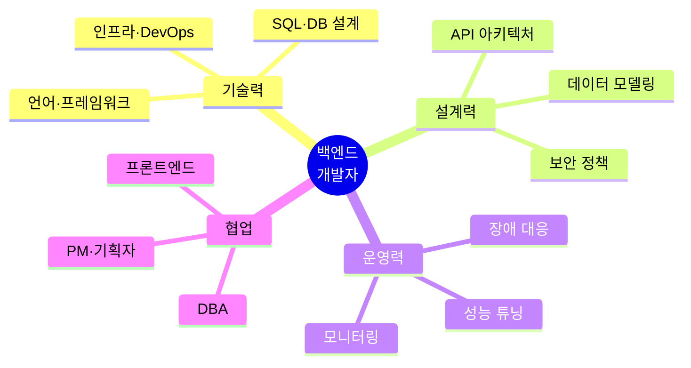

프론트엔드 개발자가 **"사용자 경험의 설계자"** 라면, 백엔드 개발자는 **"시스템의 설계자"** 입니다. 사용자에게 보이지 않지만, 데이터의 안전성, 서비스의 안정성, 비즈니스 로직의 정확성을 **책임지는** 사람들입니다.

좋은 레스토랑의 주방이 그렇듯 — 손님이 주방을 직접 볼 수 없어도, 깨끗하고 체계적인 주방이 있어야 맛있는 음식이 나옵니다. 백엔드가 만드는 것은 코드가 아니라 **서비스의 신뢰**입니다.

---

*NEXT X R&D · Dev & DevOps*
