> **[NextX_R&D_Log]** · 주식회사 넥스트엑스(NEXT X) 기술연구소 — 프론트엔드 개발 가이드
{: .prompt-tip }

> 우리가 매일 쓰는 앱과 웹사이트 — 버튼을 누르고, 스크롤을 내리고, 폼에 입력하는 그 모든 경험. 이것을 설계하고 구현하는 사람이 **프론트엔드 개발자**입니다. 이 글은 프론트엔드의 본질부터, 현대 프론트엔드 개발자에게 요구되는 역량, 그리고 AI 시대에 이 역할이 어떻게 변하고 있는지까지 다룹니다.
{: .prompt-info }

## 프론트엔드란 — "앞무대"의 모든 것

**프론트엔드(Frontend)** 는 사용자가 **직접 보고, 만지고, 상호작용하는** 모든 부분입니다. 반대편에 있는 **백엔드(Backend)** 가 무대 뒤에서 데이터를 처리하는 "뒷무대"라면, 프론트엔드는 관객이 보는 "앞무대"입니다.

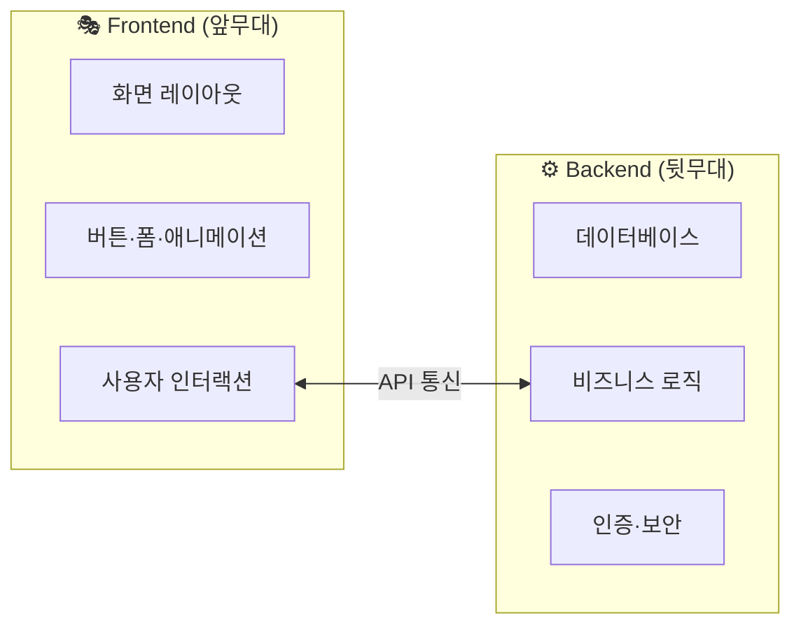

| | 프론트엔드 | 백엔드 |
|---|---|---|
| **비유** | 레스토랑 **홀** — 메뉴판, 인테리어, 서빙 | 레스토랑 **주방** — 조리, 재료 관리, 위생 |
| **관심사** | "사용자가 편하게 쓸 수 있는가?" | "데이터가 안전하고 정확한가?" |
| **결과물** | 사용자가 **보는** 것 | 사용자가 **모르는** 것 |
| **기술** | HTML, CSS, JavaScript, React | Python, Java, SQL, Docker |

> 좋은 레스토랑은 훌륭한 요리(백엔드)와 쾌적한 홀 서비스(프론트엔드) **모두** 필요합니다. 아무리 음식이 맛있어도 메뉴판이 읽기 어렵고 주문이 불편하면 손님은 다시 오지 않습니다.
{: .prompt-tip }

---

## 프론트엔드의 3대 기둥 — HTML·CSS·JavaScript

프론트엔드는 **세 가지 기술**로 이루어져 있습니다. 각각의 역할은 명확하게 분리되어 있고, 이것을 **관심사의 분리(Separation of Concerns)** 라고 합니다.

> 이 세 기술의 탄생 비화와 작동 원리는 [웹을 지탱하는 세 겹(HTML·CSS·JS)]() 편에서 자세히 다뤘습니다.
{: .prompt-info }

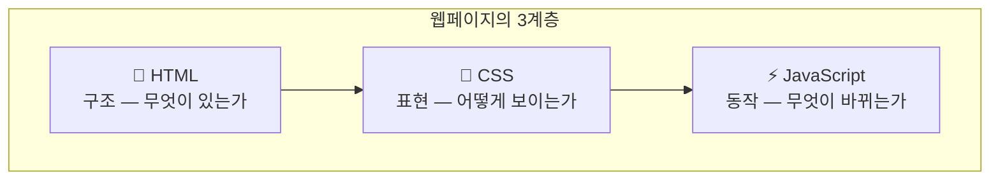

### HTML — 뼈대

```html
<header>
  <h1>파트너스 매칭 매니저</h1>
  <nav>
    <button>파트너 관리</button>
    <button>배정 현황</button>
  </nav>
</header>
```

HTML은 **"이 페이지에 무엇이 있는지"** 를 선언합니다. 제목이 있고, 내비게이션이 있고, 버튼이 두 개 있다는 **의미(Semantics)** 를 담습니다. 꾸밈이 아니라 **정보의 구조**입니다.

### CSS — 피부

```css
.tab-active {
  background-color: #1d4ed8;
  color: white;
  border-radius: 12px;
  padding: 10px 20px;
}
```

CSS는 **"어떻게 보이는지"** 를 정의합니다. 같은 HTML이라도 CSS를 바꾸면 완전히 다른 느낌의 웹사이트가 됩니다. 다크 모드와 라이트 모드의 전환도 CSS가 담당합니다.

### JavaScript — 근육

```javascript
button.addEventListener('click', async () => {
  const data = await fetch('/api/partners');
  renderPartnerList(data);
});
```

JavaScript는 **"무엇이 바뀌는지"** 를 제어합니다. 버튼을 클릭하면 데이터를 불러오고, 입력값을 검증하고, 화면을 동적으로 갱신합니다. 정적인 문서를 **살아 있는 앱**으로 만드는 엔진입니다.

---

## 프론트엔드 개발자는 무엇을 하는가

"화면 만드는 사람"이라는 인식은 2010년대 초반까지의 이야기입니다. 현대 프론트엔드 개발자의 업무 범위는 **훨씬 넓고 깊습니다**.

### 핵심 업무 6가지

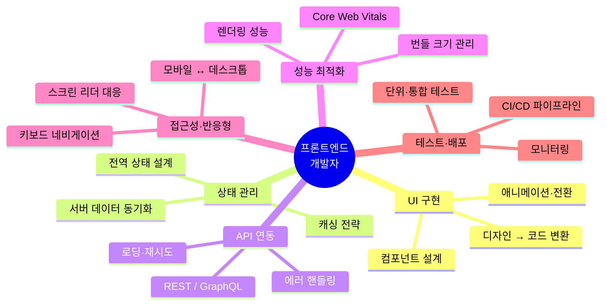

#### 1. UI 구현 & 인터랙션 설계

디자이너가 만든 시안(Figma, Sketch)을 **실제 작동하는 코드**로 옮깁니다. 단순히 "그림을 코드로 그리는" 작업이 아닙니다:

| 디자인 시안에 없는 것 | 프론트엔드가 결정하는 것 |
|---|---|
| 버튼 클릭 후 0.5초간 뭘 보여줄지 | **로딩 상태 UI** (스피너, 스켈레톤) |
| 네트워크가 끊겼을 때 | **에러 상태 UI** + 재시도 버튼 |
| 데이터가 0건일 때 | **빈 상태(Empty State)** 안내 |
| 1만 건 목록을 한 번에 보여줄 때 | **가상 스크롤** 또는 페이지네이션 |

#### 2. 상태 관리 (State Management)

"장바구니에 3개인데 화면엔 2개"같은 버그는 **상태(State)** 관리 실패입니다. 프론트엔드 개발자는 앱 전체의 데이터 흐름을 설계합니다:

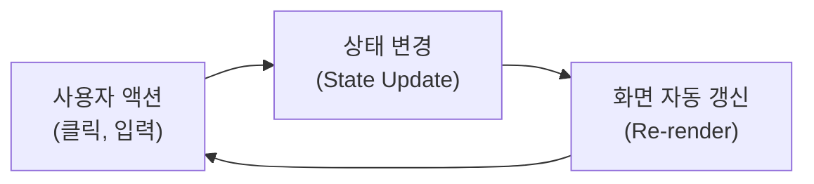

#### 3. API 연동

백엔드에서 보내주는 데이터를 **요청하고, 받고, 화면에 반영**합니다. 단순히 fetch 한 줄이 아니라:

- 요청 중일 때 **로딩 표시**
- 실패했을 때 **에러 메시지 + 재시도**
- 성공했을 때 **캐시에 저장** (같은 데이터를 반복 요청하지 않도록)
- 오프라인 상태 **감지 및 대응**

#### 4. 성능 최적화

화면이 1초 안에 뜨는 것과 3초 걸리는 것은 **사업적으로 큰 차이**입니다.

| 지표 | 의미 | 목표 |
|------|------|------|
| **LCP** (Largest Contentful Paint) | 가장 큰 콘텐츠가 보이는 시점 | 2.5초 이내 |
| **FID** (First Input Delay) | 첫 클릭에 반응하는 시간 | 100ms 이내 |
| **CLS** (Cumulative Layout Shift) | 레이아웃이 갑자기 밀리는 정도 | 0.1 이하 |

이 세 지표를 **Core Web Vitals**라 하며, 구글 검색 순위에도 영향을 줍니다.

#### 5. 접근성 (Accessibility, a11y)

시각·청각·운동 능력에 관계없이 **모든 사용자**가 서비스를 이용할 수 있어야 합니다:

- **시각 장애**: 스크린 리더가 읽을 수 있는 구조적 HTML
- **색각 이상**: 색상에만 의존하지 않는 정보 전달
- **운동 장애**: 마우스 없이 **키보드만으로** 모든 기능 사용 가능
- **인지 장애**: 명확한 레이블, 일관된 네비게이션

> 접근성은 "장애인을 위한 특별 기능"이 아니라, **모든 사용자에게 더 좋은 경험**을 만드는 기본 원칙입니다. 엘리베이터가 휠체어 사용자만을 위한 게 아닌 것처럼.
{: .prompt-tip }

#### 6. 반응형 디자인 (Responsive Design)

같은 웹사이트가 **스마트폰, 태블릿, 데스크톱, 대형 모니터**에서 모두 올바르게 보여야 합니다.

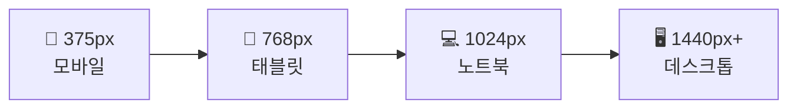

CSS의 **미디어 쿼리(Media Query)** 와 유연한 레이아웃(Flexbox, Grid)을 사용해 화면 크기에 따라 배치를 조정합니다.

---

## 프론트엔드 기술 생태계 — 2026년 현재

### 프레임워크 & 라이브러리

> 프레임워크의 개념과 선택 기준은 [프레임워크·PRD·목업 데이터]() 편에서 다뤘습니다.
{: .prompt-info }

| 기술 | 특징 | 적합한 프로젝트 |
|------|------|--------------|
| **React** | 컴포넌트 기반, 거대한 생태계, 메타(구 페이스북) 지원 | 대규모 SPA, 팀 프로젝트 |
| **Vue** | 낮은 진입 장벽, 양방향 바인딩, 한국·아시아 인기 | 중소규모, 빠른 프로토타입 |
| **Svelte** | 컴파일 방식 (런타임 프레임워크 없음), 작은 번들 | 성능 중시, 경량 앱 |
| **Next.js** | React 기반 풀스택, SSR/SSG, API 라우트 내장 | SEO 중요, 풀스택 |
| **Nuxt** | Vue 기반 풀스택, Next.js의 Vue 버전 | Vue 생태계, 풀스택 |

### 스타일링 도구

| 기술 | 방식 | 특징 |
|------|------|------|
| **Tailwind CSS** | 유틸리티 클래스 | HTML에 직접 스타일, 빠른 개발, 디자인 시스템과 궁합 |
| **styled-components** | CSS-in-JS | JavaScript 안에서 CSS 작성, 동적 스타일에 강함 |
| **CSS Modules** | 파일 스코핑 | 클래스명 충돌 방지, 기존 CSS 문법 유지 |
| **Sass/SCSS** | 전처리기 | 변수·중첩·믹스인, 레거시 프로젝트에 여전히 활발 |

### 빌드 & 번들 도구

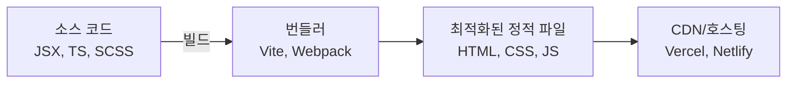

| 도구 | 세대 | 특징 |
|------|------|------|
| **Vite** | 차세대 | ES Modules 기반, 빠른 HMR, 가벼운 설정 |
| **Webpack** | 1세대 | 풍부한 플러그인 생태계, 대형 프로젝트 표준 |
| **Turbopack** | 최신 | Rust 기반, Webpack의 후속 (Next.js 내장) |

---

## 프론트엔드 개발자의 성장 경로

프론트엔드 개발자의 커리어는 크게 **세 갈래**로 나뉩니다:

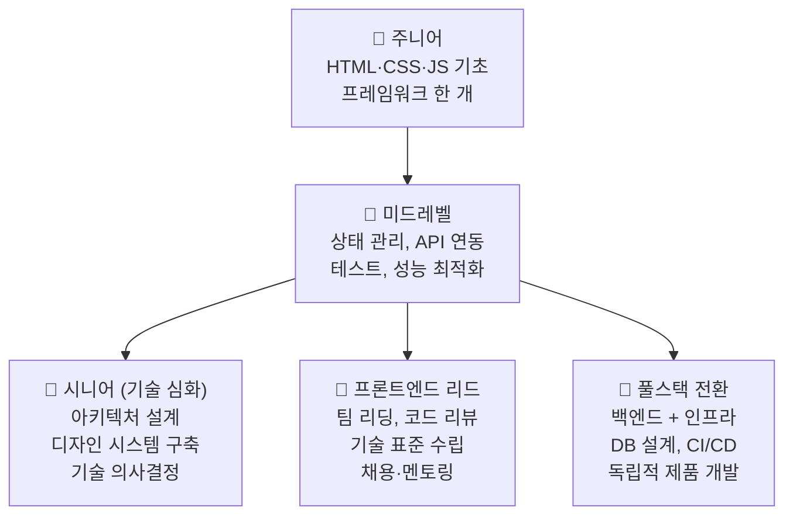

### 주니어 (0~2년)

| 역량 | 수준 |
|------|------|
| HTML/CSS | 시맨틱 마크업, 반응형, Flexbox/Grid |
| JavaScript | ES6+, 비동기(Promise, async/await), DOM |
| 프레임워크 | React 또는 Vue **하나**를 깊이 있게 |
| 도구 | Git, 터미널, 브라우저 DevTools |

### 미드레벨 (2~5년)

| 역량 | 수준 |
|------|------|
| 상태 관리 | 전역 상태 설계, 서버 상태(TanStack Query 등) |
| TypeScript | 타입 시스템 활용, 제네릭, 유틸리티 타입 |
| 테스트 | 단위 테스트(Jest/Vitest), 통합 테스트(Testing Library) |
| 성능 | 코드 스플리팅, 레이지 로딩, 번들 분석 |

### 시니어 (5년+)

| 역량 | 수준 |
|------|------|
| 아키텍처 | 모노레포, 마이크로 프론트엔드, 모듈 설계 |
| 디자인 시스템 | 공통 컴포넌트 라이브러리 설계·유지보수 |
| 기술 의사결정 | 기술 스택 선정, 마이그레이션 계획, 트레이드오프 분석 |
| 멘토링 | 주니어 성장 지원, 코드 리뷰 문화 |

---

## 실전에서 보는 프론트엔드 — 파트너스 매칭 매니저

넥스트엑스가 개발한 [파트너스 매칭 매니저](https://partners-manager-omega.vercel.app/)는 프론트엔드의 핵심 역량이 모두 적용된 실전 사례입니다.

### 적용된 프론트엔드 기술

| 영역 | 적용 내용 |
|------|---------|
| **UI 구현** | Tailwind CSS로 로그인 화면, 대시보드, 카드 리스트 구현 |
| **상태 관리** | 파트너·배정 데이터를 JavaScript 변수로 관리, 변경 시 화면 자동 갱신 |
| **API 연동** | Supabase REST API를 통한 CRUD, JWT 인증 헤더 자동 포함 |
| **인터랙션** | 탭 전환, 실시간 검색 필터, 토스트 알림, 상태 배지 |
| **반응형** | 모바일(1열) → 태블릿(2열) → 데스크톱(3~4열) 그리드 대응 |
| **인증 UI** | 로그인/회원가입 토글, 에러 메시지 표시, 로딩 상태 관리 |

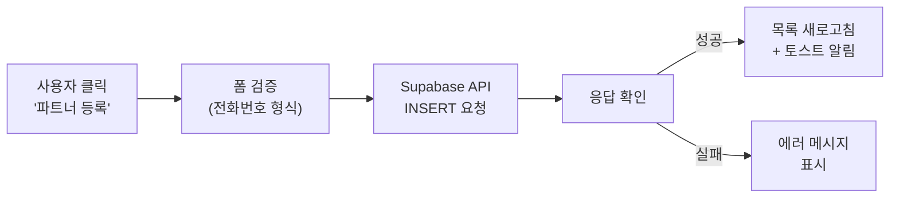

> 프론트엔드 개발의 핵심은 **"사용자가 실패하지 않도록 돕는 것"** 입니다. 전화번호 형식이 틀리면 제출 전에 알려주고, 네트워크 에러가 나면 무엇이 잘못됐는지 명확히 보여주고, 성공하면 즉각 피드백을 줍니다.
{: .prompt-tip }

---

## 백엔드와의 협업 — API 계약

프론트엔드 개발자는 백엔드 개발자와 **API 명세**를 통해 소통합니다. "이런 데이터를 이런 형식으로 보내주면, 내가 화면에 이렇게 보여줄게"라는 **계약**입니다.

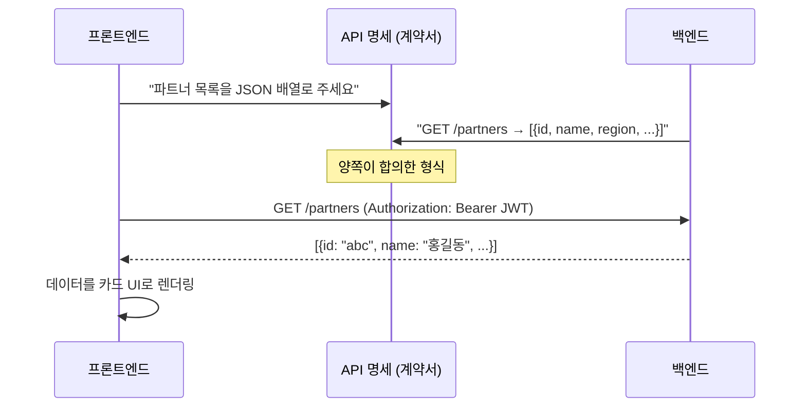

| API 용어 | 비유 | 설명 |
|----------|------|------|
| **엔드포인트** | 주문 창구 | `/api/partners` — 어디로 요청할지 |
| **메서드** | 주문 종류 | GET(조회), POST(등록), PUT(수정), DELETE(삭제) |
| **요청 바디** | 주문서 | 서버에 보내는 데이터 (JSON) |
| **응답** | 음식 | 서버가 돌려주는 데이터 (JSON) |
| **상태 코드** | 결과 안내 | 200(성공), 401(인증 필요), 500(서버 오류) |

> API에 대한 자세한 설명은 [API가 뭐길래]() 편을 참고하세요.
{: .prompt-info }

---

## AI 시대의 프론트엔드 개발자

AI 코드 생성 도구(Claude, Copilot 등)의 등장으로 프론트엔드 개발의 **작업 방식**이 변하고 있습니다. 하지만 **역할의 본질**은 오히려 더 중요해지고 있습니다.

### AI가 대체하는 것 vs 대체하지 못하는 것

| AI가 잘하는 것 | 프론트엔드 개발자만 하는 것 |
|---|---|
| HTML/CSS 코드 생성 | "이 화면이 사용자에게 **왜** 필요한가" 판단 |
| 반복적인 CRUD UI 작성 | 복잡한 **상태 흐름** 설계 |
| 컴포넌트 기본 구조 생성 | 성능 병목 **진단** 및 최적화 전략 |
| 버그 수정 제안 | 비즈니스 맥락에 맞는 **UX 의사결정** |
| 테스트 코드 초안 | 접근성·국제화·엣지케이스 **고려** |

### 바이브 코딩과 프론트엔드

> 바이브 코딩의 개념과 도구는 [바이브 코딩이란 무엇인가]() 편에서 다뤘습니다.
{: .prompt-info }

AI에게 "로그인 화면 만들어 줘"라고 하면 **작동하는 코드**가 나옵니다. 하지만 이것은 시작일 뿐입니다:

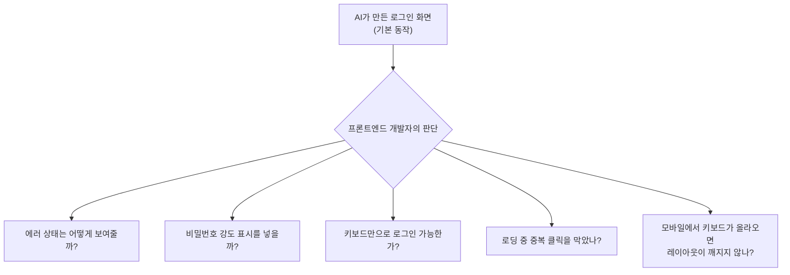

AI는 **"만드는 속도"** 를 높여주지만, **"무엇을 만들지"** 와 **"어떤 경험을 줄지"** 를 결정하는 것은 여전히 프론트엔드 개발자의 몫입니다.

> 넥스트엑스는 파트너스 매칭 매니저를 **바이브 코딩으로** 개발했습니다. AI가 초기 코드를 빠르게 생성하면, 개발자가 보안(인증, RLS), 에러 처리, 성능을 검수하고 강화하는 협업 방식입니다. 자세한 과정은 [프로토타입 제작기]()와 [실전 납품 개발기]()에서 확인할 수 있습니다.
{: .prompt-tip }

---

## 프론트엔드 개발자에게 필요한 소프트 스킬

기술만으로는 좋은 프론트엔드 개발자가 될 수 없습니다. 프론트엔드는 **디자이너, 백엔드 개발자, 기획자, 사용자** 사이의 교차점에 있기 때문입니다.

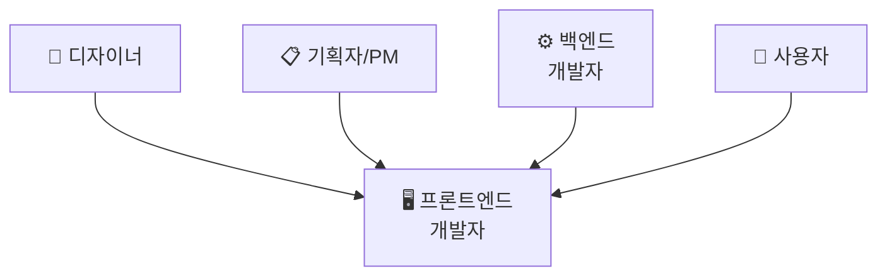

| 소프트 스킬 | 왜 필요한가 |
|------------|-----------|
| **커뮤니케이션** | 디자이너에게는 구현 제약을, 백엔드에게는 데이터 형식을 설명 |
| **공감 능력** | 사용자가 **왜** 헤매는지 이해하고, 그들의 입장에서 UI 설계 |
| **디테일 감각** | 1px 간격, 0.3초 애니메이션 — 작은 차이가 전체 경험을 좌우 |
| **학습 능력** | 프론트엔드 생태계는 빠르게 변화 — 새 도구와 패턴을 꾸준히 흡수 |

---

## 정리 — 프론트엔드 개발자는 "사용자 경험의 설계자"

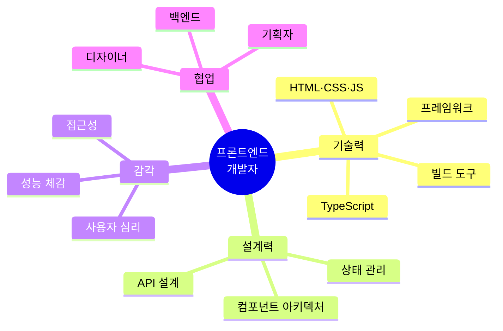

프론트엔드 개발자는 단순히 "화면을 만드는 사람"이 아닙니다. **기술, 디자인 감각, 사용자 심리에 대한 이해**를 결합하여, 사용자가 서비스를 편안하고 효율적으로 쓸 수 있도록 만드는 **경험 설계자**입니다.

백엔드가 아무리 완벽해도, 프론트엔드가 불편하면 사용자는 떠납니다. 프론트엔드가 만드는 것은 코드가 아니라 **사용자의 첫인상이자, 매일의 경험**입니다.

---

*NEXT X R&D · Dev & DevOps*
