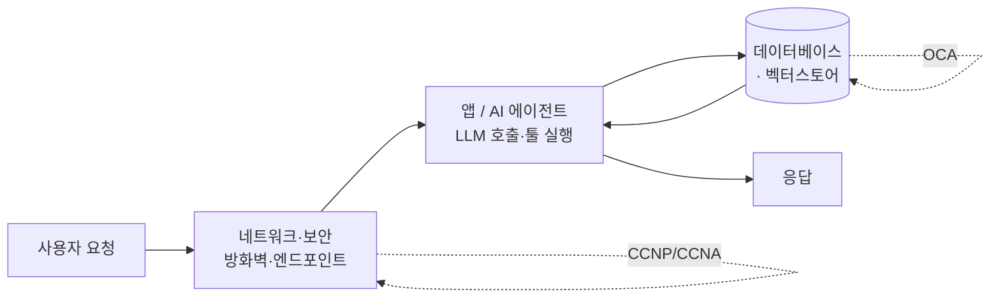

> AI는 화려해 보이지만, 결국 **네트워크·서버·데이터베이스 위에서** 돕니다. 그 뿌리를 아는 사람만이 AI를 **장애·보안 리스크 없이** 설계할 수 있습니다.
> 이 글은 넥스트엑스의 과거 엔진(온프레미스 인프라)과 미래 기술(AI)이 어떻게 **하나로 연결**되는지에 대한 이야기입니다.
{: .prompt-info }

## 🧠 왜 이 이야기를 하나

요즘 "AI 도입"은 대부분 **API 몇 줄 붙이는 데모**에서 멈춥니다. 잘 될 때는 근사하지만, 트래픽이 몰리거나·데이터가 지저분하거나·보안 요건이 붙는 순간 무너지죠.

넥스트엑스가 다른 지점은 여기입니다. **AI 이전에 인프라를 20년 가까이 만지고 운영해왔다**는 것. 새 기술을 좇는 게 아니라, **바닥을 알기 때문에** 위에 무엇을 얹어도 흔들리지 않게 설계합니다.

> 📇 **대표 이력 (요약)**
>
> 정보처리기사 · 네트워크관리사 · **CCNP · CCNA**(Cisco 네트워크) · **OCA**(Oracle DBA), 2015 광주 하계 유니버시아드 **ICT 인프라 무장애 운영**, 제주도청·제주시청·서귀포시청 등 전산장비 유지보수
{: .prompt-tip }

## 🌉 과거의 스펙(Engine) → 현재의 AI(Future)

AI 파이프라인의 각 구간은 사실 **전통 인프라 역량이 그대로 필요한 자리**입니다.

| 과거에 다진 역량 | 현대 AI 파이프라인에서의 역할 |
|------------------|-------------------------------|
| 🌐 **네트워크(CCNP/CCNA)** | LLM API 레이턴시·타임아웃·재시도 설계, VPC·방화벽·프라이빗 엔드포인트, 트래픽 폭주 대응 |
| 🗄️ **DB(OCA · Oracle)** | 데이터 무결성·인덱싱·백업이 곧 **RAG/벡터DB 품질**의 기반, 트랜잭션 정합성 |
| 🛡️ **무장애 운영(장애율 0%)** | SLA·모니터링·장애 대응(Failover) 체계를 AI 서비스에도 그대로 이식 |
| 🧭 **관공서 대규모 PM** | 요구사항·보안심사·이해관계자 조율 — AI 도입 프로젝트의 리스크 관리 |

## ⚙️ AI는 결국 인프라 위에서 돈다

- **RAG 챗봇**([사내 지식검색]())의 정확도는 결국 **DB·데이터 품질**에서 갈립니다. — [데이터 클렌징]()
- **AI 에이전트**의 안정성은 API 호출의 **네트워크 신뢰성**(타임아웃·재시도·장애 격리)에서 갈립니다.
- **데이터 파이프라인**([구축 접근법]())은 수집·적재·보안 전 구간이 전통 인프라 설계 그 자체입니다.

## 🔒 그래서 리스크가 줄어든다

> 신기술만 아는 팀은 **"잘 될 때만 작동하는" 데모**를 만듭니다.
> 인프라를 아는 팀은 **장애·보안·비용·확장을 미리 설계**합니다. 그 차이가 곧 **운영 사고와 비용의 차이**입니다.
{: .prompt-warning }

- **온프레미스 vs 클라우드 판단** — 무조건 클라우드가 답은 아닙니다. 데이터 민감도·비용·규제를 함께 봅니다.
- **보안·개인정보** — 네트워크 분리·접근통제·로그를 설계 단계부터 반영합니다.
- **장애 대응** — "AI가 멈추면?"에 대한 대비(폴백·모니터링·알림)를 함께 만듭니다.

## 🧩 넥스트엑스의 관점 — 뿌리와 잎은 하나다

과거의 단단한 온프레미스 인프라 이해가 뒷받침되어야만, 현대의 AI 에이전트 파이프라인을 **리스크 없이** 설계할 수 있습니다. 넥스트엑스에게 **과거의 스펙(Engine)과 미래의 기술(AI)은 분리된 두 개가 아니라, 하나로 연결된 웅장한 축**입니다.

## 📩 "우리 환경에 AI, 안전하게 올릴 수 있을까?"

기존 시스템·네트워크·데이터 환경을 함께 점검하고, **리스크 없는 도입 경로**를 설계해 드립니다.
→ [Business Inquiry]() · [csnextx@gmail.com](mailto:csnextx@gmail.com)

> 관련 → [데이터 파이프라인]() · [API란?]() · [사내 RAG 챗봇]()
{: .prompt-info }

---

> 📎 본 글은 **주식회사 넥스트엑스(NEXT X) 기술연구소**의 R&D 자산입니다.
> **함께 읽기** — [🛠️ 개발 대표 사례]() · [📖 블로그 안내]() · [📩 비즈니스 문의]()
{: .prompt-info }
