> 🏷️ **[NextX_R&D_Log]** · 주식회사 넥스트엑스(NEXT X) 기술연구소 인프라 솔루션
{: .prompt-tip }

> [백엔드·네트워크 완전 지도]()에서 DNS·HTTP·포트를 간략히 살펴봤습니다. 이번에는 한 발 더 들어가 **네트워크가 어떻게 계층별로 돌아가는지**, 그리고 이 네트워크를 **설계하고 지키는 사람** — 네트워크 엔지니어의 역할을 다룹니다.
{: .prompt-info }

## 🌐 1. 네트워크란 — 컴퓨터끼리의 대화

### 가장 쉬운 비유: 도로와 택배

| 네트워크 요소 | 비유 |
|--------------|------|
| **패킷(Packet)** | 택배 상자 — 데이터를 잘게 나눈 조각 |
| **IP 주소** | 집 주소 — 보내는 곳 + 받는 곳 |
| **라우터(Router)** | 교차로의 이정표 — 패킷이 어디로 갈지 결정 |
| **스위치(Switch)** | 건물 내 우편함 — 같은 네트워크 안에서 배달 |
| **방화벽(Firewall)** | 건물 경비원 — 허용된 택배만 통과 |
| **대역폭(Bandwidth)** | 도로 차선 수 — 넓을수록 한 번에 많이 이동 |

네트워크는 결국 **"A 컴퓨터의 데이터를 B 컴퓨터에 정확하게 전달하는 체계"** 입니다. 이 단순한 목표를 달성하기 위해 수십 년간 쌓아온 표준과 장비가 있습니다.

---

## 📚 2. OSI 7계층 — 네트워크의 설계도

### 왜 계층을 나누는가?

편지를 보낼 때 **"쓰기 → 봉투에 넣기 → 주소 적기 → 우체국 → 배달 → 열기 → 읽기"** 단계가 있듯, 네트워크 통신도 단계별로 역할을 나눕니다. 이것이 **OSI(Open Systems Interconnection) 7계층 모델**입니다.

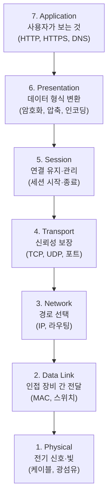

### 각 계층을 택배로 비유하면

| 계층 | 하는 일 | 택배 비유 |
|------|---------|----------|
| **7. Application** | 사용자 요청 생성 | "이 물건을 주문합니다" |
| **6. Presentation** | 데이터 형식 변환·암호화 | 물건을 완충재로 포장 |
| **5. Session** | 통신 세션 관리 | 송·수신 확인 전화 |
| **4. Transport** | 데이터 분할 + 순서·오류 보장 | 큰 물건을 여러 상자로 나누고 번호 매기기 |
| **3. Network** | 목적지까지의 경로 결정 | 어느 고속도로·국도를 탈지 결정 |
| **2. Data Link** | 바로 옆 장비로 전달 | 트럭이 다음 중계소까지 이동 |
| **1. Physical** | 전기/빛 신호로 전송 | 실제 도로 위를 달리는 것 |

### 실무에서는 TCP/IP 4계층

OSI 7계층은 **이론 모델**이고, 실제 인터넷은 **TCP/IP 4계층**으로 동작합니다.

| TCP/IP 계층 | OSI 대응 | 핵심 프로토콜 |
|-------------|---------|-------------|
| **Application** | 7 + 6 + 5 | HTTP, HTTPS, DNS, SSH, FTP |
| **Transport** | 4 | TCP (신뢰), UDP (속도) |
| **Internet** | 3 | IP, ICMP, ARP |
| **Network Access** | 2 + 1 | Ethernet, Wi-Fi |

> 💡 면접에서 "OSI 7계층 설명해보세요"라고 물으면 이론을 말하고, "실제로는 TCP/IP 4계층으로 통합되어 동작합니다"까지 이어주면 됩니다.
{: .prompt-tip }

---

## 🔧 3. 핵심 프로토콜과 장비

### TCP vs UDP — 신뢰 vs 속도

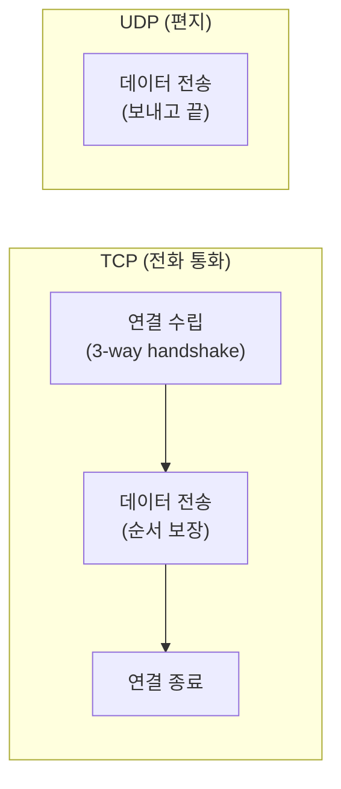

| | TCP | UDP |
|---|---|---|
| 비유 | **전화 통화** — 연결 확인 후 대화 | **편지** — 보내고 끝, 도착 확인 없음 |
| 순서 보장 | O | X |
| 재전송 | O (빠진 패킷 다시 보냄) | X |
| 속도 | 상대적으로 느림 | 빠름 |
| 용도 | 웹(HTTP), 이메일, 파일 전송 | 영상 스트리밍, 게임, DNS 조회 |

#### 3-way Handshake — TCP 연결의 시작

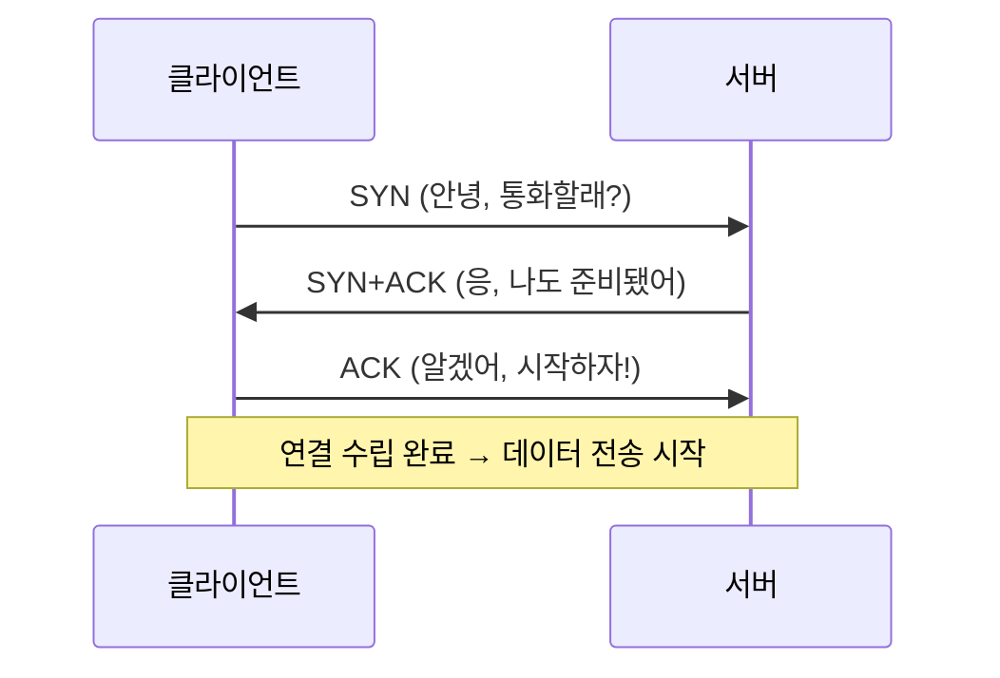

### IP 주소 — 네트워크의 집 주소

| 종류 | 형식 | 예시 |
|------|------|------|
| **IPv4** | 32비트, 4옥텟 | `192.168.0.1` |
| **IPv6** | 128비트, 16진수 | `2001:db8::1` |
| **사설 IP** | 내부 네트워크 전용 | `10.x.x.x`, `172.16~31.x.x`, `192.168.x.x` |
| **공인 IP** | 인터넷에서 유일 | ISP가 할당 |

> 💡 `192.168.0.1`은 **집 안(공유기 뒤)**의 주소이고, 외부에서는 ISP가 부여한 **공인 IP** 하나로 보입니다. 이 변환을 **NAT(Network Address Translation)** 이라고 하며, 공유기가 자동으로 해줍니다.
{: .prompt-tip }

### 서브넷 — 네트워크를 방으로 나누기

큰 사무실을 **층별·부서별**로 나누듯, IP 대역을 논리적으로 쪼갠 것이 서브넷입니다.

```
10.0.0.0/8     → 1,677만 개 IP (대기업 전체)
10.1.0.0/16    → 65,536개 IP (사업부)
10.1.1.0/24    → 256개 IP (한 부서)
10.1.1.128/25  → 128개 IP (한 팀)
```

`/24`의 의미: 32비트 중 앞 24비트가 네트워크 부분, 뒤 8비트가 호스트(장비) 부분입니다. 숫자가 클수록 더 작은 네트워크로 쪼개는 것입니다.

### 핵심 장비 3총사

| 장비 | 동작 계층 | 하는 일 | 비유 |
|------|----------|---------|------|
| **라우터(Router)** | L3 (Network) | 서로 다른 네트워크를 연결, 최적 경로 결정 | 고속도로 IC의 이정표 |
| **스위치(Switch)** | L2 (Data Link) | 같은 네트워크 안에서 MAC 주소로 정확히 전달 | 건물 내 우편함 |
| **방화벽(Firewall)** | L3~L7 | 허용/차단 규칙으로 트래픽 필터링 | 건물 출입 경비 |

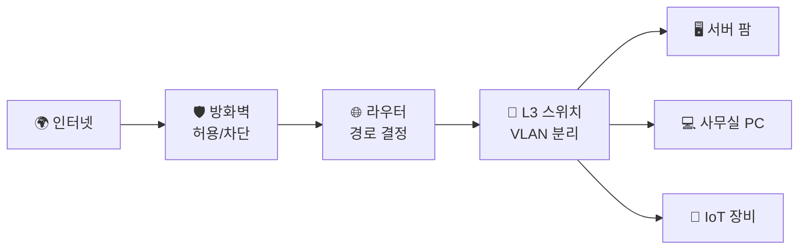

---

## 🔒 4. 네트워크 보안 — 경비 체계

### 방화벽 규칙의 원리

방화벽은 **"기본 차단, 필요한 것만 허용"(Deny All, Allow Specific)** 원칙으로 운영합니다.

```
규칙 1: ALLOW  TCP  외부 → 서버:443  (HTTPS 허용)
규칙 2: ALLOW  TCP  외부 → 서버:80   (HTTP 허용)
규칙 3: ALLOW  TCP  관리자IP → 서버:22  (SSH — 특정 IP만)
규칙 4: DENY   ALL  외부 → 서버:*    (나머지 전부 차단)
```

> ⚠️ 방화벽 규칙은 **위에서 아래로** 순서대로 매칭됩니다. 순서가 잘못되면 허용해야 할 트래픽이 차단되거나, 차단해야 할 트래픽이 통과합니다. 규칙 순서는 보안의 핵심입니다.
{: .prompt-warning }

### VLAN — 물리적 분리 없이 네트워크를 나누기

같은 스위치에 물려있지만, **논리적으로 별도 네트워크**로 격리하는 기술입니다.

| VLAN ID | 용도 | IP 대역 |
|---------|------|---------|
| VLAN 10 | 서버 팜 | 10.1.10.0/24 |
| VLAN 20 | 사무실 | 10.1.20.0/24 |
| VLAN 30 | 게스트 Wi-Fi | 10.1.30.0/24 |

VLAN 30(게스트)에서 VLAN 10(서버)으로 직접 접근하는 것을 차단할 수 있습니다. 물리적으로 케이블을 분리하지 않아도 보안 격리가 가능합니다.

### VPN — 안전한 터널

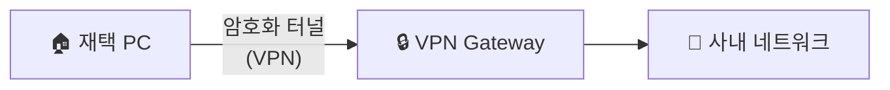

VPN(Virtual Private Network)은 공용 인터넷 위에 **암호화된 터널**을 만들어, 재택·출장 시에도 사내 네트워크에 안전하게 접속할 수 있게 합니다.

---

## 📊 5. 네트워크 모니터링 — 건강 진단

### 기본 진단 도구

| 도구 | 하는 일 | 사용 예시 |
|------|---------|----------|
| `ping` | 상대방까지 도달하는지 확인 | `ping 8.8.8.8` (구글 DNS 응답 확인) |
| `traceroute` / `tracert` | 패킷이 거치는 경유지 확인 | 어디서 느려지는지 구간별 진단 |
| `nslookup` / `dig` | DNS 조회 | 도메인 → IP 변환 확인 |
| `netstat` / `ss` | 현재 연결·포트 상태 확인 | 어떤 프로세스가 어떤 포트를 쓰는지 |
| `tcpdump` / Wireshark | 패킷 캡처·분석 | 실제 오가는 데이터 내용 확인 |

### 모니터링 지표

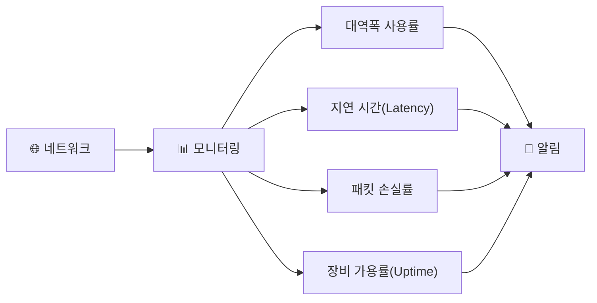

| 지표 | 정상 | 경고 | 위험 |
|------|------|------|------|
| **대역폭 사용률** | < 60% | 60~80% | > 80% |
| **지연 시간** | < 10ms (LAN) | 10~50ms | > 100ms |
| **패킷 손실률** | 0% | < 1% | > 1% |
| **장비 가용률** | 99.99% | < 99.9% | < 99% |

---

## 👤 6. 네트워크 엔지니어(NE) — 보이지 않는 곳에서 네트워크를 지키는 사람

### 네트워크 엔지니어란?

네트워크를 **설계하고, 구축하고, 운영하고, 지키는** 전문가입니다. 개발자가 앱을 만든다면, NE는 그 앱이 달리는 **도로와 신호 체계**를 만들고 관리합니다.

> 💡 "인터넷이 잘 되면 아무도 NE를 모르고, 인터넷이 안 되면 모두가 NE를 찾습니다." — 네트워크 엔지니어의 숙명입니다.
{: .prompt-tip }

### NE의 6대 역할

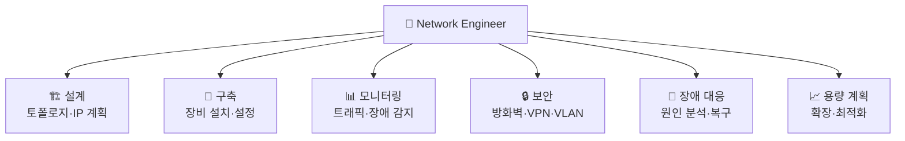

#### 1) 설계 — 네트워크의 청사진

| 설계 항목 | 결정 사항 |
|-----------|----------|
| **토폴로지** | 스타형? 메시형? 이중화 구조? |
| **IP 설계** | 서브넷 분할, VLAN 할당, 대역 계획 |
| **장비 선정** | 라우터·스위치·방화벽 스펙 결정 |
| **이중화** | 장비·회선 이중화로 단일 장애점(SPOF) 제거 |
| **대역폭 산정** | 사용자 수 × 트래픽 패턴 → 필요 대역폭 계산 |

**이중화(Redundancy)** 는 NE 설계의 핵심입니다:

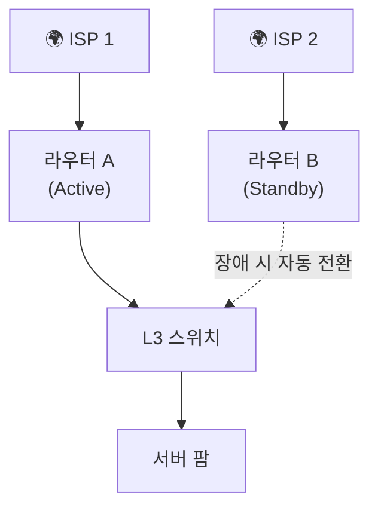

#### 2) 구축 — 장비를 세우고 숨을 불어넣다

- **물리 작업**: 랙 마운트, 케이블링, 전원 연결, 레이블링
- **논리 설정**: IP 할당, VLAN 설정, 라우팅 프로토콜(OSPF, BGP), ACL(접근제어), NAT
- **검증**: 핑 테스트, 경로 확인, 부하 테스트, 장애 전환(Failover) 테스트

```
! Cisco 라우터 기본 설정 예시
Router> enable
Router# configure terminal
Router(config)# hostname CORE-RTR
CORE-RTR(config)# interface GigabitEthernet0/0
CORE-RTR(config-if)# ip address 10.1.1.1 255.255.255.0
CORE-RTR(config-if)# no shutdown
CORE-RTR(config-if)# exit
CORE-RTR(config)# router ospf 1
CORE-RTR(config-router)# network 10.1.1.0 0.0.0.255 area 0
```

#### 3) 모니터링 — 네트워크의 맥박을 읽다

NE는 **문제가 터지기 전에** 징후를 잡아냅니다.

| 모니터링 대상 | 도구 | 행동 기준 |
|-------------|------|----------|
| 대역폭 사용률 | MRTG, Cacti, PRTG | 80% 초과 시 회선 증설 검토 |
| 장비 CPU/메모리 | SNMP + Grafana | 90% 지속 시 설정 최적화 |
| 패킷 손실 | 상시 ping 모니터 | 0.1% 초과 시 경로 점검 |
| 로그 분석 | Syslog 서버 | 오류 패턴 감지 시 즉시 대응 |

#### 4) 보안 — 네트워크의 방패

- **방화벽 정책 수립**: Deny All → 필요한 포트·IP만 허용
- **VLAN 격리**: 서버·사무실·게스트 네트워크 분리
- **VPN 운영**: 원격 접속 암호화 터널 관리
- **IDS/IPS**: 침입 탐지·방지 시스템 운영
- **정기 점검**: 방화벽 규칙 리뷰, 불필요 규칙 제거, 침투 테스트

#### 5) 장애 대응 — 빠르게 찾고 복구하다

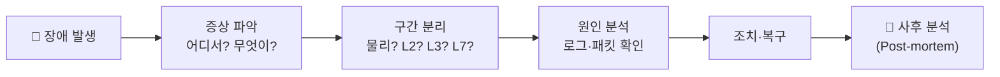

**장애 대응의 핵심 — OSI 계층 순으로 올라가기:**

1. **L1** — 케이블 빠졌나? 링크 LED가 켜져 있나?
2. **L2** — MAC 테이블에 상대방이 보이나? VLAN 설정이 맞나?
3. **L3** — IP 설정이 맞나? 라우팅 테이블에 경로가 있나? `ping`이 되나?
4. **L4** — 포트가 열려 있나? 방화벽이 막고 있나? `telnet host port`로 확인
5. **L7** — 앱이 응답하나? DNS가 정상인가? 인증서가 만료되진 않았나?

> 💡 경험 많은 NE일수록 **"아래부터 올라간다"** 습관이 체화되어 있습니다. "서버가 안 돼요!"라는 신고에 바로 앱 로그를 보는 대신, 케이블·핑·포트 순서로 확인하면 문제를 훨씬 빠르게 찾습니다.
{: .prompt-tip }

#### 6) 용량 계획 — 미래에 대비하다

| 시점 | 작업 |
|------|------|
| **분기별** | 트래픽 추이 분석, 장비 노후화 점검 |
| **프로젝트 시작 전** | 신규 서비스의 예상 트래픽·대역폭 산정 |
| **임계치 도달 시** | 회선 증속, 장비 교체, CDN 도입 검토 |
| **장기(1~3년)** | 기술 로드맵(10G → 25G → 100G), 클라우드 전환 계획 |

---

## 📜 7. 자격증 로드맵 — NE의 성장 경로

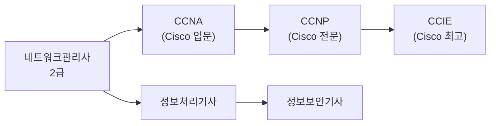

| 자격증 | 수준 | 다루는 범위 |
|--------|------|-----------|
| **네트워크관리사 2급** | 입문 | 기초 네트워크 이론, 장비 기본 설정 |
| **CCNA** | 중급 | Cisco 장비 운용, 라우팅/스위칭, 보안 기초 |
| **CCNP** | 고급 | 대규모 네트워크 설계·운영, 고급 라우팅(OSPF, BGP), 보안 |
| **CCIE** | 최고 | 전 세계 상위 1%, 복잡한 대규모 네트워크 아키텍처 |
| **정보보안기사** | 전문 | 네트워크 보안 + 시스템 보안 + 법규 |

---

## 🤖 8. 클라우드·AI 시대의 네트워크 엔지니어

"클라우드 시대에 NE가 필요한가요?" — **더 필요합니다.** 장비가 물리에서 가상으로 바뀌었을 뿐, 네트워크의 원리는 그대로입니다.

| 과거 NE | 현재/미래 NE |
|---------|-------------|
| 물리 장비 랙 마운트 | 클라우드 VPC·서브넷·보안그룹 설계 |
| CLI로 라우터 설정 | **IaC(Infrastructure as Code)** — Terraform으로 네트워크 선언 |
| 수동 모니터링 | AIOps — AI가 이상 탐지, NE가 **판단·조치** |
| 단일 데이터센터 | 멀티 클라우드·하이브리드 아키텍처 설계 |
| 하드웨어 장애 대응 | **SDN(Software Defined Networking)** — 소프트웨어로 네트워크 제어 |

> 💡 AWS VPC를 설계하려면 서브넷·라우팅 테이블·NAT 게이트웨이·보안그룹을 이해해야 합니다. 이것은 전통 네트워크의 서브넷·라우터·NAT·방화벽과 **완전히 동일한 개념**입니다. 클라우드가 NE를 대체한 게 아니라, NE의 무대가 넓어진 것입니다.
{: .prompt-tip }

---

## 🎯 정리 — 한 장으로 보기

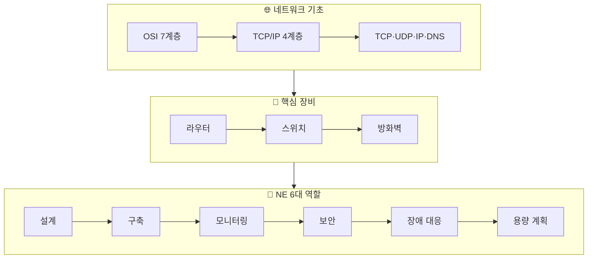

| 키워드 | 핵심 요약 |
|--------|----------|
| **네트워크** | 컴퓨터 간 데이터를 정확하게 전달하는 체계 |
| **OSI 7계층** | 통신을 역할별로 분리한 표준 모델 |
| **TCP/IP** | 실제 인터넷이 동작하는 4계층 프로토콜 |
| **라우터/스위치/방화벽** | 경로 결정 / 내부 전달 / 트래픽 필터링 |
| **서브넷/VLAN** | 네트워크를 논리적으로 분할·격리 |
| **NE** | 네트워크의 설계·구축·모니터링·보안·장애대응·용량계획을 책임지는 전문가 |

---

## 🔗 함께 보기

- 🌐 **백엔드·네트워크** → [백엔드·네트워크 완전 지도]()
- 🏗️ **인프라 → AI** → [온프레미스에서 AI 파이프라인까지]()
- 🗄️ **DB와 DBA** → [DB와 DBA의 역할]()
- 🔒 **보안 실전** → [파트너스 매칭 매니저 제작기]() (RLS·방화벽 실전)

---

> 📎 본 글은 **주식회사 넥스트엑스(NEXT X) 기술연구소**의 R&D 자산입니다.
> **함께 읽기** — [📖 블로그 안내]() · [📩 비즈니스 문의]()
{: .prompt-info }
