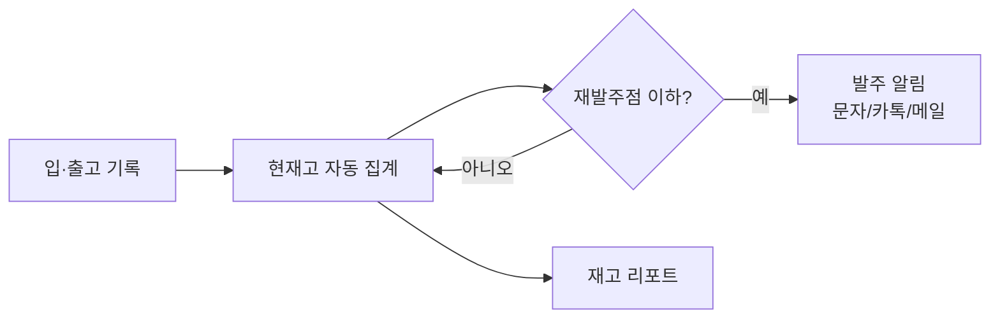

> 🏷️ **[NextX_Automation_Solution]** · 주식회사 넥스트엑스(NEXT X) 정식 업무 자동화 솔루션
{: .prompt-tip }

> **"이거 재고 있어요?"** 를 매번 창고 가서 확인하고, 잘 나가는 상품이 갑자기 품절 나고, 안 나가는 건 쌓여 있고… 재고는 **숫자로 자동 관리**하면 이 스트레스가 사라집니다.
{: .prompt-info }

## 🧮 핵심 개념 2가지 (이것만 알면 됩니다)

- **안전재고** — "이 밑으로 떨어지면 위험한" 최소 수량.
- **재발주점(ROP)** — 발주해야 하는 시점. 대략 **`(하루 판매량 × 배송 소요일) + 안전재고`**.

> 예: 하루 5개 팔리고 입고에 3일 걸리며 안전재고 10개라면 → 재발주점 = 5×3+10 = **25개**. 재고가 25개가 되면 발주!
{: .prompt-tip }

## ⚙️ 흐름



## 🛠️ 가장 쉬운 시작 — 구글 시트

1. **품목 시트**: 품목 · 현재고 · 하루평균판매 · 배송일 · 안전재고
2. **재발주점 계산** (수식 한 줄):

```text
=B2*C2 + D2      // (하루판매 × 배송일) + 안전재고 = 재발주점
```

3. **경고 표시**: 현재고 ≤ 재발주점이면 빨간색(조건부 서식) → 한눈에 "발주할 것"이 보입니다.
4. **알림 자동화**: [노코드 툴]()로 "재고 미달 → 사장님께 카톡" 연결.

규모가 커지면 파이썬·DB로 확장하고, POS·쇼핑몰과 [API 연동]()해 판매가 실시간 반영되게 합니다.

## ⚠️ 주의

- **수요 예측은 단순하게 시작** — 처음부터 AI 예측 말고, 평균 판매량 규칙부터. (과잉 설계는 비용)
- 실제 재고와 시스템 재고를 주기적으로 **실사 대조**.

> 📉 **도입 효과 한 줄 요약 (예시 ROI)** — 재고 확인·발주 판단에 매일 쓰던 **30~60분**을 없애고, **품절로 인한 판매 기회손실**과 과재고 자금 묶임을 줄입니다. *(예시이며 품목 수에 따라 다릅니다.)*
{: .prompt-tip }

## 📩 우리 가게·회사에 맞게

취급 품목 수와 판매 채널만 알려주시면 **딱 맞는 수준**(시트→앱→연동)을 제안해 드립니다.
→ [Business Inquiry]() · [csnextx@gmail.com](mailto:csnextx@gmail.com)

> 관련 → [노코드 자동화]() · [데이터 파이프라인]()
{: .prompt-info }


---

> 📎 본 글은 **주식회사 넥스트엑스(NEXT X) 기술연구소**의 R&D 자산입니다.
> **함께 읽기** — [⚡ 자동화 대표 사례]() · [📖 블로그 안내]() · [📩 비즈니스 문의]()
{: .prompt-info }
