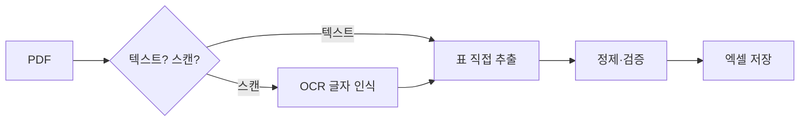

> 🏷️ **[NextX_Automation_Solution]** · 주식회사 넥스트엑스(NEXT X) 정식 업무 자동화 솔루션
{: .prompt-tip }

> 거래명세서·견적서·정산서가 **PDF로 오는데**, 그걸 눈으로 보며 엑셀에 다시 타이핑하고 계신가요? 표만 뽑아 자동으로 정리할 수 있습니다. 단, **PDF의 종류**부터 알아야 합니다.
{: .prompt-info }

## 📑 두 종류의 PDF — 접근이 다릅니다

| 종류 | 특징 | 처리 방법 |
|------|------|-----------|
| **텍스트 PDF** | 글자를 복사할 수 있음 | 바로 표 추출 (쉬움·정확) |
| **스캔 PDF(이미지)** | 복사 안 됨(사진) | **OCR**로 글자 인식 후 추출 |

> 먼저 PDF에서 글자가 드래그·복사되는지 확인하세요. 복사되면 텍스트 PDF입니다.
{: .prompt-tip }

## ⚙️ 흐름



## 🛠️ 텍스트 PDF — 표 추출 (pdfplumber)

```python
import pdfplumber, pandas as pd

rows = []
with pdfplumber.open("거래명세서.pdf") as pdf:
    for page in pdf.pages:
        for table in page.extract_tables():
            rows += table

df = pd.DataFrame(rows[1:], columns=rows[0])  # 첫 행을 헤더로
df.to_excel("추출결과.xlsx", index=False)
```

## 🔍 스캔 PDF — OCR 먼저

스캔본은 글자가 '사진'이라, `pytesseract`(Tesseract OCR)나 클라우드 OCR API로 **글자를 인식**한 뒤 같은 방식으로 표를 만듭니다. 한글은 한국어 OCR 데이터가 필요합니다.

## ⚠️ 주의

- **OCR은 100%가 아닙니다** — 숫자·금액은 반드시 **검수**(특히 0/O, 1/l 혼동).
- 추출 후 [데이터 클렌징]()으로 형식을 통일하세요.
- **개인정보 문서**는 처리·보관 정책을 지킵니다.

> 📉 **도입 효과 한 줄 요약 (예시 ROI)** — 하루 50장 명세서를 손으로 옮겨 적던 **2~3시간**이 **수 분**으로. 담당자 **월 약 40시간** 회수 + 오타 감소. *(예시이며 문서 품질에 따라 다릅니다.)*
{: .prompt-tip }

## 📩 우리 문서로 테스트해보려면

PDF 샘플 1개만 주셔도 됩니다 — **추출 정확도부터** 확인해 드립니다.
→ [Business Inquiry]() · [csnextx@gmail.com](mailto:csnextx@gmail.com)

> 관련 → [파이썬 엑셀 자동화]() · [데이터 클렌징]()
{: .prompt-info }


---

> 📎 본 글은 **주식회사 넥스트엑스(NEXT X) 기술연구소**의 R&D 자산입니다.
> **함께 읽기** — [⚡ 자동화 대표 사례]() · [📖 블로그 안내]() · [📩 비즈니스 문의]()
{: .prompt-info }
