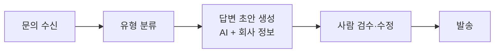

> 🏷️ **[NextX_AX_Solution]** · 주식회사 넥스트엑스(NEXT X) 정식 AX 솔루션 라인업
{: .prompt-tip }

> 하루에도 몇 번씩 오는 **"배송 언제 오나요?", "환불 어떻게 하나요?"** — 답은 거의 똑같은데 매번 새로 쓰고 계신가요? AI가 **초안을 먼저** 써주면, 사람은 확인·발송만 하면 됩니다.
{: .prompt-info }

## ⚙️ 전체 흐름 (자동 발송 아님 — 초안까지)



## 🛠️ 시작하는 법

**1) 자주 오는 문의 유형 정리** — 배송·환불·예약·견적 등 **상위 5~10개**를 뽑습니다. 이게 자동화의 뼈대입니다.

**2) 회사 정보 + AI로 초안 생성** — 정확한 정책·가격을 AI에게 참고자료로 주고, 톤을 정해 초안을 뽑습니다.

```text
너는 우리 회사 고객지원 담당자야. 아래 [회사 정책]만 근거로 답해.
- 정책에 없는 내용은 추측하지 말고 "확인 후 안내드리겠습니다"로.
- 톤: 정중하고 간결하게, 3~5문장.

[회사 정책]
- 배송: 결제 후 2~3일, 주말 제외
- 환불: 수령 7일 이내, 단순변심 왕복 배송비 고객 부담
---
[고객 문의]
"주문했는데 언제 와요?"
```

**3) 사람 검수 후 발송** — 특히 **금액·약속·예외 상황**은 반드시 사람이 확인합니다.

> 🔌 **노코드 연결**: Gmail/문의폼 + [Zapier·Make]()로 "새 문의 → 초안 생성 → 담당자에게 알림"까지 코드 없이 연결할 수 있습니다.
{: .prompt-tip }

## ⚠️ 주의

- **완전 자동 발송은 지양** — 초안 생성까지만 자동화하고 발송은 사람이. (오답·클레임 방지)
- **정책 근거 고정** — "정책에 없으면 추측 금지"가 핵심(환각 방지).
- **개인정보** 포함 문의는 처리 범위를 명확히.

> 📉 **도입 효과 한 줄 요약 (예시 ROI)** — 하루 30건 문의를 건당 4분씩 답하던 CS 기준, 초안 자동화로 **건당 1분 미만** 검수. 담당자 **월 약 20시간** 회수. *(예시이며 문의량·복잡도에 따라 다릅니다.)*
{: .prompt-tip }

## 📩 우리 CS에 맞게

과거 문의·답변 샘플만 주시면 **유형 분류와 초안 정확도부터** 진단해 드립니다.
→ [Business Inquiry]() · [csnextx@gmail.com](mailto:csnextx@gmail.com)

> 관련 → [VOC 자동 분류]() · [프롬프트 기법]()
{: .prompt-info }


---

> 📎 본 글은 **주식회사 넥스트엑스(NEXT X) 기술연구소**의 R&D 자산입니다.
> **함께 읽기** — [🤖 AX 대표 사례]() · [📖 블로그 안내]() · [📩 비즈니스 문의]()
{: .prompt-info }
