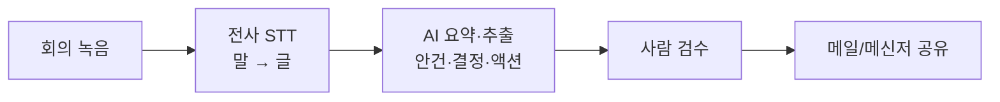

> 🏷️ **[NextX_AX_Solution]** · 주식회사 넥스트엑스(NEXT X) 정식 AX 솔루션 라인업
{: .prompt-tip }

> 회의는 끝났는데, **정리에 또 한 시간.** 누가 무엇을 언제까지 하기로 했는지 다시 녹음을 돌려보고 계신가요? 이 반복은 **전사(STT) + AI 요약**으로 거의 사라집니다.
{: .prompt-info }

## 🎯 무엇이 자동화되나

- 🎙️ 녹음 → **텍스트로 전사(STT)**
- 📝 긴 대화 → **핵심 요약** (안건별)
- ✅ **결정사항 · 액션아이템**(담당자·기한) 자동 추출
- 📤 정리본을 메일·메신저로 **공유**

## ⚙️ 전체 흐름



## 🛠️ 3단계로 시작하기

**1) 녹음·전사(STT)** — 회의 녹음 파일을 텍스트로. 국내외 STT 서비스나 클로바노트 같은 도구, 또는 API로 자동화합니다. 대면 회의는 스마트폰 녹음이면 충분합니다.

**2) AI로 요약·추출** — 전사된 텍스트를 LLM에 넣고 **형식을 고정한 프롬프트**로 뽑습니다.

```text
아래 회의 전사 내용을 정리해줘.
출력 형식(반드시 이 형식):
## 한 줄 요약
## 안건별 논의 (안건 - 핵심)
## 결정 사항
## 액션 아이템 (담당자 | 할 일 | 기한)
- 언급되지 않은 담당자/기한은 '미정'으로 표기하고 지어내지 말 것.
---
[여기에 전사 텍스트 붙여넣기]
```

**3) 검수·공유** — AI 초안을 사람이 **한 번 확인**하고(특히 담당자·기한·숫자) 배포합니다.

> 💡 핵심은 "언급 안 된 건 지어내지 말라"는 지시입니다. 이게 **환각(없는 내용 생성)** 을 막습니다. — [프롬프트 기법]()
{: .prompt-tip }

## ⚠️ 주의

- **개인정보·기밀** 회의는 데이터 처리 범위를 먼저 정하세요. (민감 회의는 사내 처리 권장)
- STT는 **전문용어·고유명사**에서 오타가 납니다 → 용어집을 함께 주면 정확도 상승.
- **자동 발송 금지**, 사람 검수 후 공유가 원칙입니다.

> 📉 **도입 효과 한 줄 요약 (예시 ROI)** — 주 3회 회의, 회당 정리 40분을 쓰던 팀 기준 **월 약 8시간** 회수. 무엇보다 **액션아이템 누락**이 줄어 실행률이 올라갑니다. *(예시이며 회의량에 따라 다릅니다.)*
{: .prompt-tip }

## 📩 우리 회의에 맞게 만들려면

회의 유형(주간·영업·개발)만 알려주시면 **정리 양식과 자동화 방안**을 잡아드립니다.
→ [Business Inquiry]() · [csnextx@gmail.com](mailto:csnextx@gmail.com)

> 관련 → [AI 활용 팁 10]() · [VOC 자동 분류]()
{: .prompt-info }


---

> 📎 본 글은 **주식회사 넥스트엑스(NEXT X) 기술연구소**의 R&D 자산입니다.
> **함께 읽기** — [🤖 AX 대표 사례]() · [📖 블로그 안내]() · [📩 비즈니스 문의]()
{: .prompt-info }
