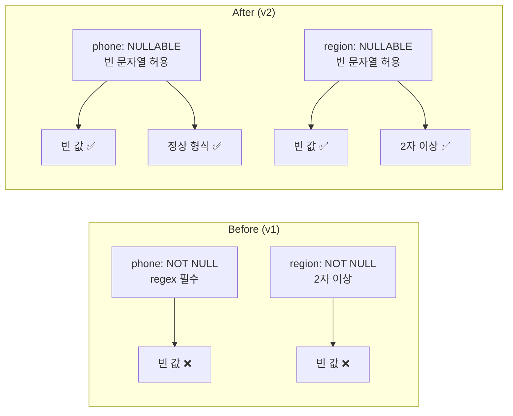
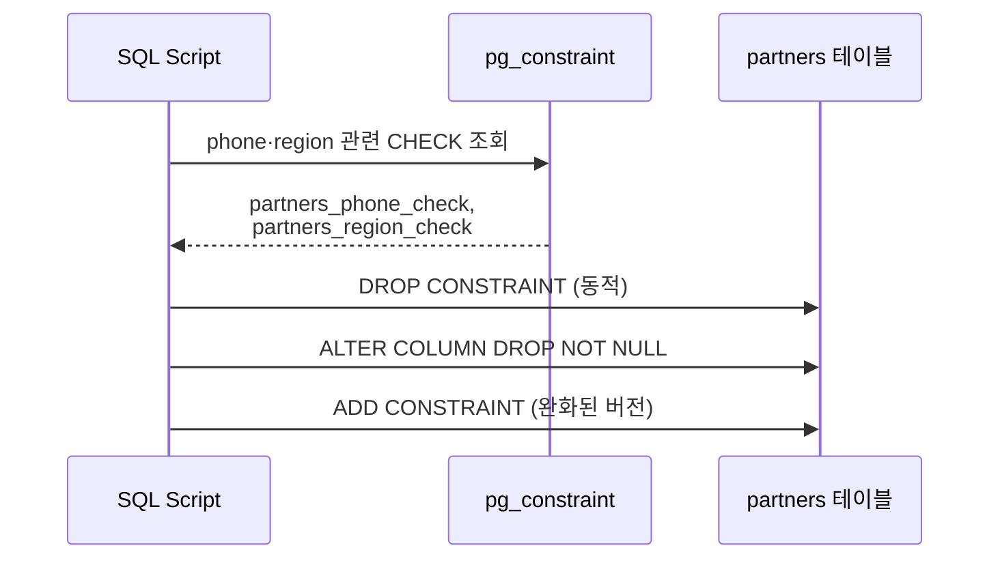
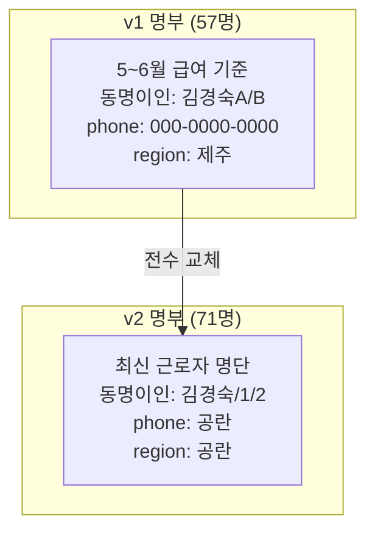
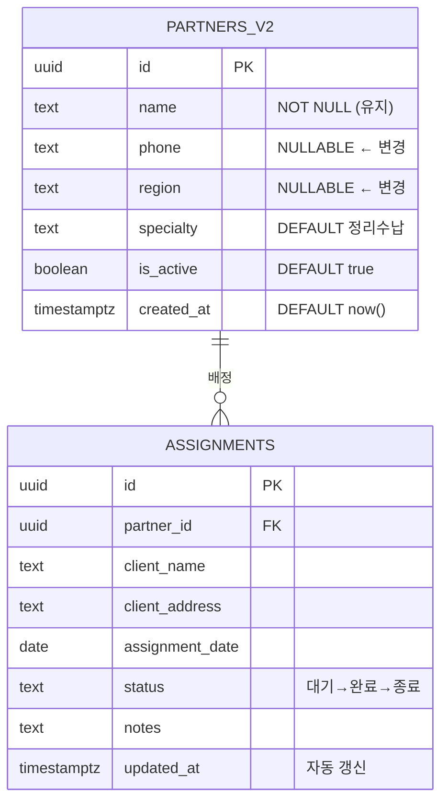
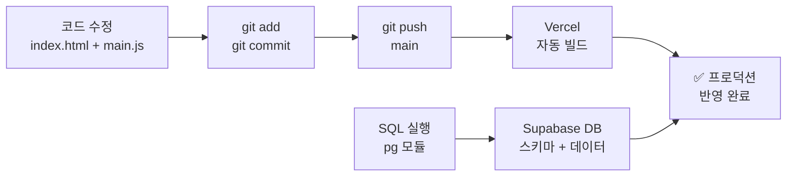
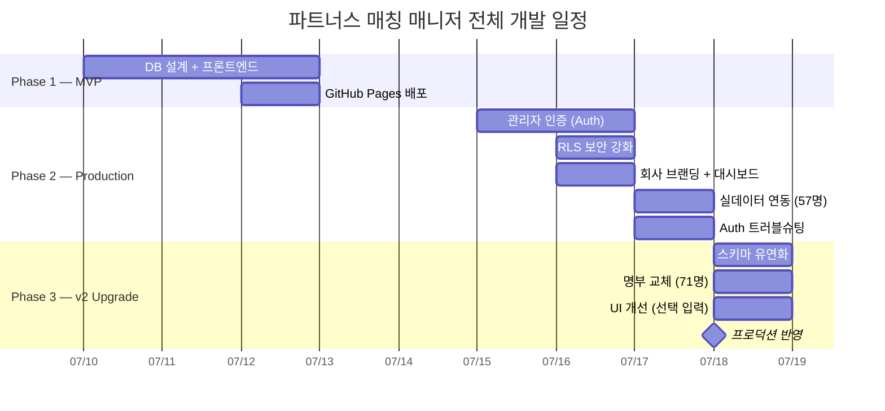

> 🏷️ **[NextX_AX_Solution]** · 주식회사 넥스트엑스(NEXT X) AX 솔루션 운영·유지보수 기록
{: .prompt-tip }

> 이 글은 파트너스 매칭 매니저 시리즈의 **네 번째 글**입니다.
> 1. [프로토타입 제작기]() — MVP 개발
> 2. [실전 납품 개발기]() — 인증·보안·실데이터
> 3. [Auth 트러블슈팅]() — 로그인 오류 해결
> 4. **[현재 글] v2 업그레이드** — 명부 교체·스키마 유연화
{: .prompt-info }

## 📋 업그레이드 배경

### 운영 중 발생한 요구사항

납품 후 실제로 시스템을 사용하면서 **두 가지 변경 요구**가 들어왔습니다:

| 구분 | 기존 상태 | 요구사항 |
|------|----------|---------|
| **명부** | 5~6월 급여 기준 57명 | 최신 근로자 명단 71명으로 교체 |
| **전화번호·지역** | 필수 입력 (NOT NULL) | 공란 허용 → 추후 개별 수정 |

기존에는 등록 시 전화번호·활동지역이 **필수**였습니다. 하지만 71명의 프리랜서를 한 번에 등록할 때 모든 연락처를 사전에 확보하기란 현실적으로 어렵습니다. **"일단 이름만 넣고, 전화번호는 나중에 채우겠다"**는 운영상의 합리적 요청이었습니다.

---

## 🔧 Phase 1 — 스키마 유연화

### 문제: NOT NULL + CHECK 제약조건

기존 `partners` 테이블은 이렇게 생겼습니다:

```sql
CREATE TABLE partners (
  id        UUID DEFAULT gen_random_uuid() PRIMARY KEY,
  name      TEXT NOT NULL CHECK (char_length(name) >= 2),
  phone     TEXT NOT NULL CHECK (phone ~ '^\d{2,3}-\d{3,4}-\d{4}$'),
  region    TEXT NOT NULL CHECK (char_length(region) >= 2),
  specialty TEXT DEFAULT '정리수납',
  is_active BOOLEAN DEFAULT true,
  created_at TIMESTAMPTZ DEFAULT now()
);
```

`phone`에는 `NOT NULL` + **정규식 CHECK**가, `region`에는 `NOT NULL` + **최소 길이 CHECK**가 걸려 있습니다. 빈 문자열(`''`)을 넣으면 CHECK 위반, NULL을 넣으면 NOT NULL 위반으로 **INSERT 자체가 불가능**합니다.

### 해결: 제약조건 완화 마이그레이션

```sql
-- 1. 기존 CHECK 제약조건 중 phone·region 관련 삭제
DO $$
DECLARE
    r RECORD;
BEGIN
    FOR r IN (
        SELECT conname, pg_get_constraintdef(oid) AS def
        FROM pg_constraint
        WHERE conrelid = 'partners'::regclass
          AND contype = 'c'
    ) LOOP
        IF r.def LIKE '%phone%' OR r.def LIKE '%region%' THEN
            EXECUTE 'ALTER TABLE partners DROP CONSTRAINT '
                    || quote_ident(r.conname);
        END IF;
    END LOOP;
END $$;

-- 2. NOT NULL 해제 + 기본값 빈 문자열
ALTER TABLE partners ALTER COLUMN phone DROP NOT NULL;
ALTER TABLE partners ALTER COLUMN phone SET DEFAULT '';
ALTER TABLE partners ALTER COLUMN region DROP NOT NULL;
ALTER TABLE partners ALTER COLUMN region SET DEFAULT '';

-- 3. 완화된 CHECK 재추가 (빈 문자열 허용)
ALTER TABLE partners ADD CONSTRAINT partners_phone_format
  CHECK (phone IS NULL OR phone = ''
         OR phone ~ '^\d{2,3}-\d{3,4}-\d{4}$');
ALTER TABLE partners ADD CONSTRAINT partners_region_length
  CHECK (region IS NULL OR region = ''
         OR char_length(region) >= 2);
```



> 💡 **"제약조건을 제거하는 게 아니라, 유연하게 만드는 것."** 값이 입력되면 여전히 형식을 검증하되, 아직 값이 없는 상태도 허용합니다. 이것이 **점진적 데이터 완성(Progressive Data Completion)** 패턴입니다.
{: .prompt-tip }

### 왜 DO $$ 블록인가?

인라인 CHECK 제약조건의 이름은 PostgreSQL이 자동 생성합니다. 프로젝트마다, 실행 시점마다 이름이 다를 수 있으므로, `pg_constraint` 카탈로그를 조회해서 **동적으로 삭제**하는 것이 안전합니다.



---

## 📦 Phase 2 — 명부 대량 교체

### 기존 데이터 삭제 → 신규 일괄 등록

```sql
-- 기존 데이터 전부 삭제 (assignments도 CASCADE 삭제)
DELETE FROM assignments;
DELETE FROM partners;

-- 신규 프리랜서 71명 일괄 등록
INSERT INTO partners (name, phone, region, specialty) VALUES
  ('강미경', '', '', '정리수납'),
  ('강지현', '', '', '정리수납'),
  -- ... (71명)
  ('황인자', '', '', '정리수납');
```

### 명부 변경 비교



| 항목 | v1 | v2 |
|------|:---:|:---:|
| **인원** | 57명 | 71명 (+14명) |
| **전화번호** | `000-0000-0000` (플레이스홀더) | `''` (공란) |
| **활동지역** | `제주` (일괄) | `''` (공란) |
| **동명이인 표기** | A/B 접미사 | 1/2 접미사 |
| **신규 등록자** | — | 강지현, 김민송, 김현주, 박지연 외 |

### Node.js에서 직접 PostgreSQL 연결

Supabase Dashboard가 아닌 **로컬에서 직접 SQL을 실행**해야 하는 상황이었습니다. `pg` 모듈로 PostgreSQL에 직접 연결했습니다:

```javascript
const { Client } = require('pg');
const fs = require('fs');

const client = new Client({
  host: 'db.[project-ref].supabase.co',
  port: 5432,
  database: 'postgres',
  user: 'postgres',
  password: '********',
  ssl: { rejectUnauthorized: false },
});

await client.connect();
const sql = fs.readFileSync('./supabase-seed-partners.sql', 'utf8');
await client.query(sql);
// Result: [{"등록된 파트너 수":"71"}]
await client.end();
```

> ⚠️ DB 비밀번호는 일회성으로만 사용하고, **스크립트 파일은 즉시 삭제**합니다. 비밀번호를 코드에 하드코딩하거나 Git에 커밋하는 것은 절대 금지입니다. 실행 후 `rm execute-sql.cjs`로 바로 정리했습니다.
{: .prompt-warning }

---

## 🎨 Phase 3 — 앱 UI 개선

### HTML: 필수 입력 해제

```html
<!-- Before: 전화번호 필수 -->
<label>전화번호 *</label>
<input type="tel" name="phone" required />

<!-- After: 선택 입력 -->
<label>전화번호</label>
<input type="tel" name="phone" />
```

활동 지역도 동일하게 `required`와 `minlength` 속성을 제거했습니다.

### JavaScript: 빈 값 처리

**1. 전화번호 유효성 검사 — 값이 있을 때만 검증**

```javascript
// Before
if (!validatePhone(phone)) {
  showToast('전화번호 형식이 올바르지 않습니다', 'error');
  return;
}

// After — 빈 값은 통과, 입력 시에만 형식 검증
if (phone && !validatePhone(phone)) {
  showToast('전화번호 형식이 올바르지 않습니다', 'error');
  return;
}
```

**2. 파트너 카드 — 공란 시 안내 텍스트 표시**

```javascript
// Before
<p>${esc(p.region)}</p>
<p>${esc(p.phone)}</p>

// After — 공란이면 회색 안내 텍스트
<p>${p.region ? esc(p.region)
    : '<span class="text-gray-300">지역 미입력</span>'}</p>
<p>${p.phone ? esc(p.phone)
    : '<span class="text-gray-300">연락처 미입력</span>'}</p>
```

**3. 배정 드롭다운 — 지역 없으면 이름만 표시**

```javascript
// Before
`${esc(p.name)} (${esc(p.region)})`

// After
`${esc(p.name)}${p.region ? ' (' + esc(p.region) + ')' : ''}`
```

### 변경 전후 비교

| UI 요소 | Before | After |
|---------|--------|-------|
| **파트너 카드 (전화번호)** | `000-0000-0000` | `연락처 미입력` (회색) |
| **파트너 카드 (지역)** | `제주` | `지역 미입력` (회색) |
| **등록 폼 (전화번호)** | 필수 (*) | 선택 |
| **등록 폼 (지역)** | 필수 (*) | 선택 |
| **배정 드롭다운** | `강미경 (제주)` | `강미경` |

---

## 📐 스키마 변경 요약



변경된 제약조건 정리:

| 컬럼 | v1 제약조건 | v2 제약조건 |
|------|-----------|-----------|
| `name` | NOT NULL, 2~50자 | 변경 없음 |
| `phone` | NOT NULL, 정규식 필수 | **NULLABLE**, 빈 문자열 또는 정규식 |
| `region` | NOT NULL, 2자 이상 | **NULLABLE**, 빈 문자열 또는 2자 이상 |
| `specialty` | DEFAULT '정리수납' | 변경 없음 |

---

## 🚀 배포

### Git → Vercel 자동 배포



앱 코드 변경과 DB 스키마 변경은 **독립적으로 배포**됩니다:
- **앱**: Git push → Vercel 자동 빌드·배포
- **DB**: Node.js 스크립트로 직접 SQL 실행

---

## 💡 실전에서 배운 것

### 1. 스키마는 운영 중에도 변한다

초기 설계에서 phone을 NOT NULL로 설정한 것은 "데이터 품질을 지키겠다"는 의도였습니다. 하지만 **대량 등록 시나리오**를 고려하지 못했습니다. 실무에서는 "완벽한 데이터를 한 번에 넣는 것"보다 "일단 핵심만 넣고 점진적으로 보완하는 것"이 현실적입니다.

### 2. 제약조건 변경은 데이터보다 먼저

마이그레이션 순서가 중요합니다:

```
1️⃣ 제약조건 완화 (ALTER TABLE)
2️⃣ 기존 데이터 삭제 (DELETE)
3️⃣ 신규 데이터 삽입 (INSERT)
```

순서를 바꾸면 제약조건 위반으로 INSERT가 실패합니다. 하나의 트랜잭션 안에서 실행하면 원자성이 보장됩니다.

### 3. 코드와 스키마의 동기화

| 변경 지점 | 무엇을 변경했는가 |
|-----------|---------------|
| **DB 스키마** | NOT NULL → NULLABLE, CHECK 완화 |
| **HTML** | `required` 속성 제거 |
| **JavaScript** | 유효성 검사 조건문 수정, UI 표시 로직 |

세 곳이 동시에 바뀌어야 일관성이 유지됩니다. DB만 바꾸고 폼은 required를 유지하면 사용자가 혼란스럽고, 폼만 바꾸고 DB를 안 바꾸면 INSERT에서 에러가 납니다.

---

## 📈 시리즈 타임라인



---

## 🔗 프로젝트 링크

| 항목 | URL |
|------|-----|
| **라이브 서비스** | [partners-manager-omega.vercel.app](https://partners-manager-omega.vercel.app/) |
| **GitHub 소스코드** | [github.com/200gyu/partners-manager](https://github.com/200gyu/partners-manager) |
| **시리즈 #1** | [프로토타입 제작기]() |
| **시리즈 #2** | [실전 납품 개발기]() |
| **시리즈 #3** | [Auth 트러블슈팅]() |

---

## 🔮 다음 단계

v2까지 완료된 시스템의 현재 상태와 앞으로의 계획:

| 기능 | 상태 | 다음 목표 |
|------|:---:|----------|
| 파트너 CRUD | ✅ | 인라인 수정 (전화번호·지역 개별 편집) |
| 관리자 인증 | ✅ | 다중 관리자 권한 분리 |
| 대시보드 | ✅ | 지역별·월별 통계 차트 |
| 명부 관리 | ✅ | 엑셀 일괄 가져오기/내보내기 |
| 배정 관리 | ✅ | 캘린더 뷰 + 일정 충돌 감지 |
| AI 자동 매칭 | 🔜 | 지역·전문성 기반 추천 |

> 납품 후 유지보수는 "고치는 것"이 아니라 **"진화시키는 것"**입니다. v1에서 만들 수 없었던 유연성을 v2에서 확보했고, 이 기반 위에 AI 매칭과 정산 자동화를 쌓아갈 수 있습니다.
{: .prompt-tip }

---

*NEXT X R&D · AI Transformation*
