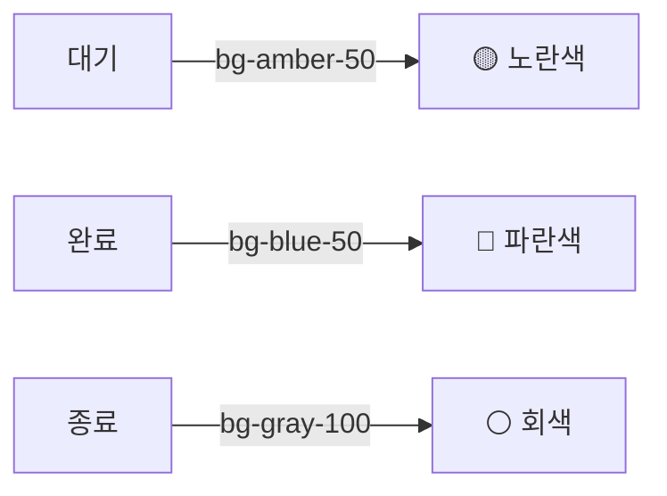
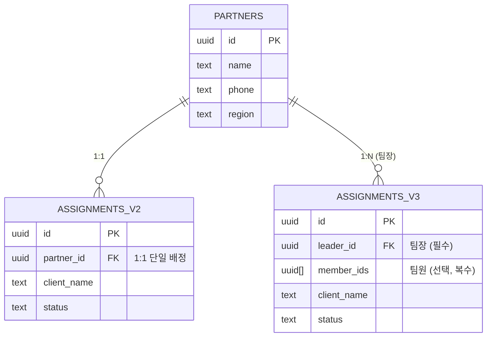
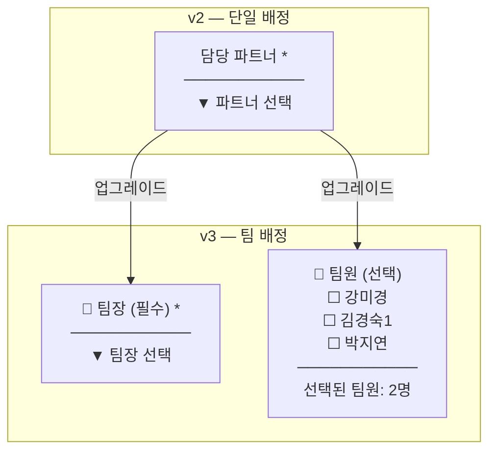
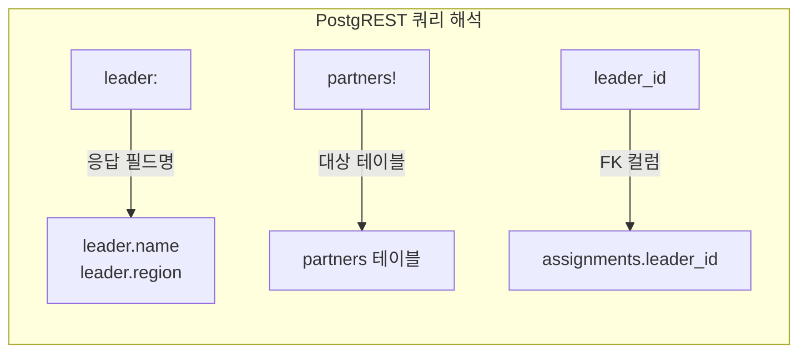
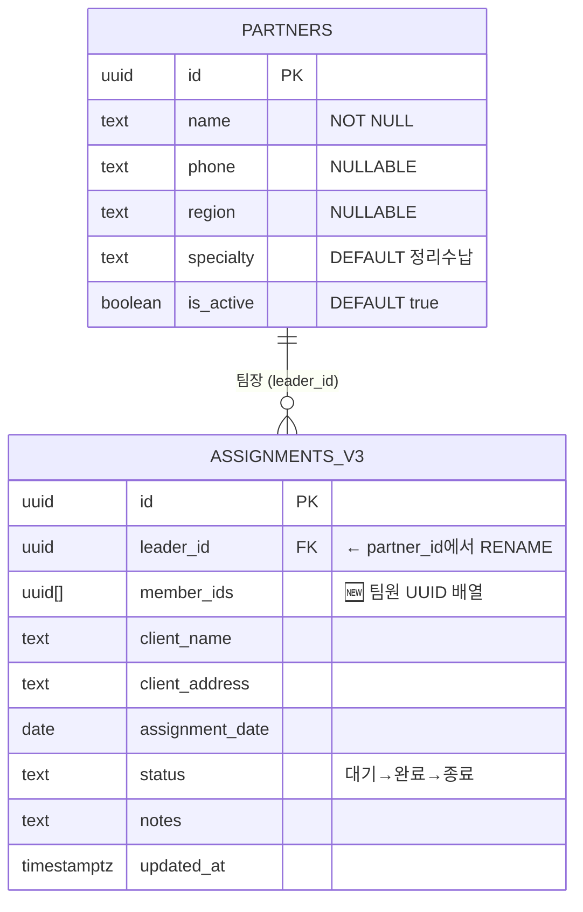
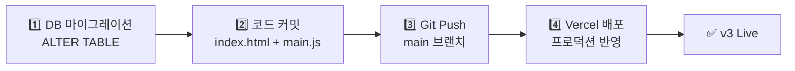
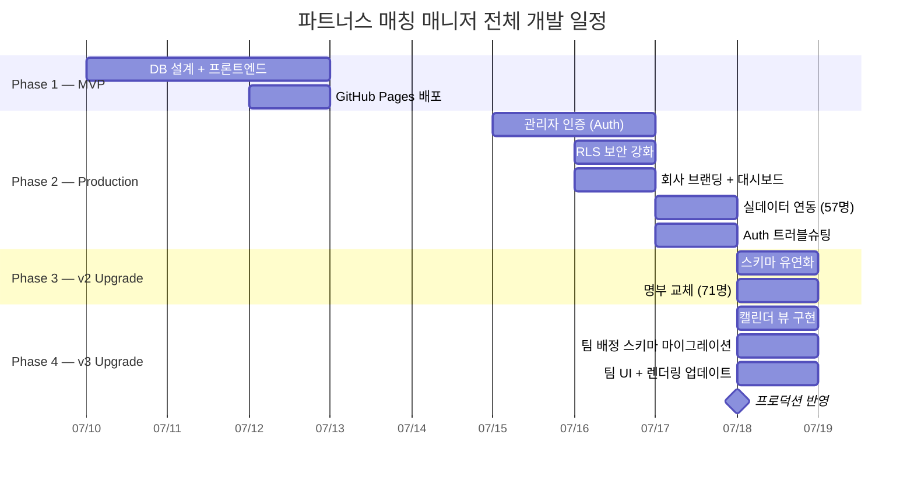

> 🏷️ **[NextX_AX_Solution]** · 주식회사 넥스트엑스(NEXT X) AX 솔루션 운영·유지보수 기록
{: .prompt-tip }

> 이 글은 파트너스 매칭 매니저 시리즈의 **다섯 번째 글**입니다.
> 1. [프로토타입 제작기]() — MVP 개발
> 2. [실전 납품 개발기]() — 인증·보안·실데이터
> 3. [Auth 트러블슈팅]() — 로그인 오류 해결
> 4. [v2 업그레이드]() — 명부 교체·스키마 유연화
> 5. **[현재 글] v3 업그레이드** — 팀 배정 시스템·캘린더 뷰
> 6. [v3.1 업그레이드]() — 휴무일 관리·스케줄 충돌 방지
{: .prompt-info }

## 📋 업그레이드 배경

### 운영 중 발견된 한계

v2까지의 배정 시스템은 **하나의 배정에 하나의 파트너만** 연결할 수 있었습니다. 그런데 실제 현장에서는 다른 상황이 벌어지고 있었습니다:

| 실무 상황 | v2의 한계 |
|-----------|----------|
| 대형 현장 → 2~3명이 팀으로 투입 | 1명만 배정 가능 |
| 팀장이 현장 총괄, 팀원이 보조 작업 | 역할 구분 불가 |
| 이번 달 누가 어디에 배정됐는지 한눈에 파악 | 리스트만 스크롤 |

핵심 요구사항은 두 가지였습니다:

1. **팀 배정** — 팀장(필수) + 팀원(선택, 복수) 구조
2. **캘린더 뷰** — 월간 일정을 한눈에 파악

---

## 🗓️ Phase 1 — 월간 캘린더 뷰

### 리스트 vs 캘린더 토글

기존 배정 목록은 리스트 형태만 지원했습니다. 월간 일정 파악이 어려워, **리스트/캘린더 토글 UI**를 추가했습니다.

```html
<!-- 뷰 전환 토글 -->
<div class="flex gap-1 bg-gray-100 rounded-lg p-0.5">
  <button id="btn-list-view"
    class="px-3 py-1 text-xs rounded-md bg-white shadow-sm font-medium">
    📋 목록
  </button>
  <button id="btn-cal-view"
    class="px-3 py-1 text-xs rounded-md text-gray-500 hover:bg-white/60">
    📅 캘린더
  </button>
</div>
```

### CSS Grid 캘린더 구현

달력은 **CSS Grid 7열 레이아웃**으로 구현했습니다. 별도의 캘린더 라이브러리 없이 순수 JavaScript와 CSS만 사용합니다.

```javascript
function renderCalendar() {
  const year = calYear;
  const month = calMonth;
  const firstDay = new Date(year, month, 1).getDay();  // 0=일, 1=월...
  const lastDate = new Date(year, month + 1, 0).getDate();

  let html = '';
  // 빈 셀 (1일 이전)
  for (let i = 0; i < firstDay; i++) {
    html += `<div class="cal-cell bg-gray-50/50"></div>`;
  }
  // 날짜 셀
  for (let d = 1; d <= lastDate; d++) {
    const dateStr = `${year}-${String(month+1).padStart(2,'0')}-${String(d).padStart(2,'0')}`;
    const entries = filteredAssignments.filter(a => a.assignment_date === dateStr);
    html += `<div class="cal-cell border border-gray-100 rounded-lg p-1">
      <div class="text-xs font-medium ${isToday ? 'text-brand-600' : ''}">${d}</div>
      ${entries.map(a => renderCalEntry(a)).join('')}
    </div>`;
  }
}
```

### 캘린더 셀 상태 표시



| 상태 | 배경색 | 왼쪽 보더 | 의미 |
|------|--------|-----------|------|
| 대기 | `bg-amber-50` | `border-amber-400` | 아직 매칭 전 |
| 완료 | `bg-blue-50` | `border-blue-400` | 매칭 완료, 작업 중 |
| 종료 | `bg-gray-100` | `border-gray-300` | 작업 완료 |

---

## 🔧 Phase 2 — DB 스키마 마이그레이션

### 1:1에서 1:N으로

기존 `assignments` 테이블의 `partner_id` 컬럼은 **하나의 파트너**만 가리킬 수 있었습니다. 팀 배정을 지원하려면 구조를 바꿔야 합니다.



### 마이그레이션 SQL

```sql
-- 1. partner_id → leader_id (의미 변경)
ALTER TABLE assignments
  RENAME COLUMN partner_id TO leader_id;

-- 2. FK 제약조건 이름도 일치시킴
ALTER TABLE assignments
  RENAME CONSTRAINT assignments_partner_id_fkey
  TO assignments_leader_id_fkey;

-- 3. 팀원 목록 (UUID 배열) 추가
ALTER TABLE assignments
  ADD COLUMN member_ids UUID[] NOT NULL DEFAULT '{}';
```

> 💡 **왜 UUID 배열인가?** 별도의 조인 테이블(assignment_members)을 만드는 것도 방법이지만, 팀원 수가 2~5명 수준이고 팀원별 개별 속성이 필요 없으므로 **배열 컬럼이 더 실용적**입니다. 쿼리 한 번으로 팀 전체를 가져올 수 있고, JOIN 없이 INSERT/UPDATE가 완료됩니다.
{: .prompt-tip }

### 설계 결정: 배열 vs 조인 테이블

| 기준 | UUID[] 배열 | 조인 테이블 |
|------|:-----------:|:-----------:|
| **쿼리 복잡도** | 단순 (JOIN 불필요) | 복잡 (3-way JOIN) |
| **INSERT 성능** | 한 번의 INSERT | 2번 이상 INSERT |
| **팀원 수** | 소수 (2~5명) ✅ | 대규모 적합 |
| **팀원별 속성** | 불가 ❌ | 가능 (역할, 시간 등) |
| **PostgreSQL 지원** | 네이티브 | 범용 |

현재 요구사항에서는 **배열이 최적**입니다. 향후 팀원별 역할이나 시간 기록이 필요해지면 그때 조인 테이블로 마이그레이션하면 됩니다.

---

## 🎨 Phase 3 — 팀 배정 UI

### 배정 등록 폼 변경

기존의 단일 드롭다운을 **팀장 선택 + 팀원 체크박스**로 교체했습니다.



### 팀장-팀원 연동 로직

팀장으로 선택된 파트너는 자동으로 **팀원 목록에서 비활성화**됩니다. 같은 사람이 팀장이면서 팀원이 되는 것을 방지합니다.

```javascript
function populateTeamSelect() {
  const leaderSelect = document.getElementById('assign-leader');
  const container = document.getElementById('member-checkboxes');
  const activePartners = partners.filter(p => p.is_active);

  // 팀장 드롭다운 채우기
  leaderSelect.innerHTML = '<option value="">팀장 선택</option>' +
    activePartners.map(p =>
      `<option value="${p.id}">${esc(p.name)}${p.region ? ' (' + esc(p.region) + ')' : ''}</option>`
    ).join('');

  // 팀원 체크박스 목록 채우기
  container.innerHTML = activePartners.map(p => `
    <label class="member-item" data-partner-id="${p.id}">
      <input type="checkbox" name="members" value="${p.id}" />
      <span>${esc(p.name)}</span>
    </label>
  `).join('');

  // 팀장 변경 시 → 해당 팀원 체크박스 비활성화
  leaderSelect.onchange = () => {
    const leaderId = leaderSelect.value;
    container.querySelectorAll('label[data-partner-id]').forEach(label => {
      const cb = label.querySelector('input[type="checkbox"]');
      const isLeader = label.dataset.partnerId === leaderId;
      cb.disabled = isLeader;
      if (isLeader) cb.checked = false;
      label.classList.toggle('disabled', isLeader);
    });
    updateMemberCount();
  };
}
```

### 팀원 항목 스타일

```css
.member-item {
  display: flex;
  align-items: center;
  gap: 6px;
  padding: 4px 8px;
  border-radius: 8px;
  cursor: pointer;
  transition: background-color 0.15s;
}
.member-item:hover { background-color: #e5e7eb; }
.member-item.disabled { opacity: 0.35; cursor: not-allowed; }
.member-item.disabled:hover { background-color: transparent; }
```

---

## 📡 Phase 4 — PostgREST FK 앨리어싱

### 문제: 컬럼명이 바뀌면 쿼리도 바뀐다

v2에서는 이렇게 조회했습니다:

```javascript
// v2 — partner_id FK → partners 테이블 자동 JOIN
const { data } = await supabase
  .from('assignments')
  .select('*, partners(name, region)')
```

`partner_id`를 `leader_id`로 **RENAME**하면, PostgREST는 더 이상 자동으로 FK 관계를 추론하지 못합니다. 컬럼명과 테이블명이 일치하지 않기 때문입니다.

### 해결: 명시적 FK 앨리어싱

```javascript
// v3 — leader_id FK → partners 테이블, 명시적 앨리어스
const { data } = await supabase
  .from('assignments')
  .select('*, leader:partners!leader_id(name, region)')
```



| 구문 | 의미 |
|------|------|
| `leader:` | 응답 JSON에서 사용할 필드명 (앨리어스) |
| `partners!` | JOIN할 대상 테이블 |
| `leader_id` | FK로 사용할 컬럼명 |
| `(name, region)` | 가져올 컬럼 목록 |

> ⚠️ `partners!leader_id` 구문은 PostgREST의 **FK disambiguation** 문법입니다. 하나의 테이블에 같은 대상을 가리키는 FK가 여러 개 있을 때(예: `leader_id`, `reviewer_id` 모두 partners를 참조), 어떤 FK를 사용할지 명시해야 합니다.
{: .prompt-warning }

---

## 📊 Phase 5 — 리스트 & 캘린더 렌더링

### 배정 카드 — 팀 구성 표시

```javascript
function renderAssignments() {
  container.innerHTML = filtered.map(a => {
    const leaderName = a.leader ? esc(a.leader.name) : '미지정';
    const memberNames = getMemberNames(a.member_ids);

    // 팀원이 있으면 팀장/팀원 분리 표시, 없으면 기존처럼 "담당" 표시
    const teamHtml = memberNames.length > 0
      ? `<p class="text-brand-700 font-medium">👑 팀장: ${leaderName}</p>
         <p class="text-brand-500">👥 팀원: ${memberNames.join(', ')}</p>`
      : `<p class="text-brand-700 font-medium">담당: ${leaderName}</p>`;

    return `
      <div class="bg-white rounded-xl shadow-sm p-5">
        <h3>${esc(a.client_name)}</h3>
        ${statusBadge(a.status)}
        ${memberNames.length > 0
          ? `<span class="text-gray-400">${memberNames.length + 1}명</span>`
          : ''}
        ${teamHtml}
      </div>`;
  }).join('');
}
```

### 팀원 이름 역참조

`member_ids`는 UUID 배열이므로, 화면에 표시할 때 **이름으로 변환**해야 합니다. 이미 메모리에 로드된 `partners` 배열에서 룩업합니다:

```javascript
function getMemberNames(memberIds) {
  if (!memberIds || memberIds.length === 0) return [];
  return memberIds
    .map(id => partners.find(p => p.id === id))
    .filter(Boolean)
    .map(p => p.name);
}
```

### 캘린더 — 팀 인원 표시

캘린더 셀에서는 공간이 제한적이므로 **압축된 형태**로 팀을 표시합니다:

```javascript
// 캘린더 엔트리 — 팀원이 있으면 "팀장 외 N명"
const leaderName = a.leader ? a.leader.name : '?';
const memberCount = (a.member_ids || []).length;
const teamLabel = memberCount > 0
  ? `${leaderName} 외 ${memberCount}명`
  : leaderName;

const label = `[${a.status}] ${teamLabel} - ${a.client_name}`;
```

마우스를 올리면 **툴팁으로 전체 팀원 목록**이 표시됩니다:

```javascript
const tooltip = memberCount > 0
  ? `팀장: ${leaderName} / 팀원: ${fullMembers.join(', ')} - ${a.client_name}`
  : label;
```

---

## 📐 스키마 변경 요약



### v2 → v3 변경 사항

| 항목 | v2 | v3 |
|------|:---:|:---:|
| **FK 컬럼명** | `partner_id` | `leader_id` |
| **FK 제약조건명** | `assignments_partner_id_fkey` | `assignments_leader_id_fkey` |
| **팀원 컬럼** | 없음 | `member_ids UUID[]` |
| **배정 모델** | 1:1 | **1:N (팀장 + 팀원)** |
| **캘린더 뷰** | 없음 | **월간 그리드** |
| **PostgREST 쿼리** | `partners(name)` | `leader:partners!leader_id(name)` |

---

## 🚀 배포

### 마이그레이션 실행 → 코드 배포

v3에서는 DB 변경과 코드 변경이 **동시에** 이루어져야 합니다. 순서가 중요합니다:



1. **먼저 DB 마이그레이션** — `partner_id` → `leader_id`, `member_ids` 추가
2. **그 다음 코드 배포** — 새 컬럼명을 사용하는 코드 반영

> ⚠️ 이 순서를 바꾸면 코드가 존재하지 않는 `leader_id` 컬럼을 참조하여 **런타임 에러**가 발생합니다. DB 스키마가 먼저 준비되어야 합니다.
{: .prompt-warning }

---

## 💡 실전에서 배운 것

### 1. 1:N 관계의 설계 선택

관계형 DB에서 1:N을 표현하는 방법은 크게 세 가지입니다:

| 방법 | 장점 | 단점 | 적합한 경우 |
|------|------|------|------------|
| **배열 컬럼** | 단순, JOIN 불필요 | 인덱싱 제한 | N이 작고 (< 10), 개별 속성 불필요 |
| **조인 테이블** | 정규화, 확장 용이 | 쿼리 복잡 | N이 크거나, 관계에 속성이 있을 때 |
| **JSON 컬럼** | 유연한 구조 | 타입 안전성 부족 | 스키마가 유동적일 때 |

이 프로젝트에서는 팀원 수가 2~5명 수준이고 팀원별 추가 속성이 필요 없으므로 **배열 컬럼**이 최적이었습니다.

### 2. PostgREST FK 앨리어싱의 함정

Supabase JS 클라이언트의 `.select('*, partners(name)')` 구문은 PostgREST가 FK를 **자동 추론**합니다. 하지만 이 자동 추론은 **컬럼명이 `테이블명_id` 형태**일 때만 동작합니다.

- `partner_id` → `partners` 테이블 자동 매칭 ✅
- `leader_id` → `partners` 테이블 자동 매칭 ❌ (leader 테이블을 찾음)

컬럼을 RENAME할 때는 반드시 **PostgREST 쿼리도 함께 수정**해야 합니다.

### 3. 하위 호환성 유지

v3 코드는 v2 데이터와 **하위 호환**됩니다:

```javascript
const memberNames = getMemberNames(a.member_ids);
const teamHtml = memberNames.length > 0
  ? `👑 팀장: ${leaderName} / 👥 팀원: ${memberNames.join(', ')}`
  : `담당: ${leaderName}`;  // ← member_ids가 빈 배열이면 기존 형태
```

`member_ids`의 기본값이 `'{}'`(빈 배열)이므로, 기존에 등록된 1:1 배정도 깨지지 않고 "담당: OOO" 형태로 정상 표시됩니다.

---

## 📈 시리즈 타임라인



---

## 🔗 프로젝트 링크

| 항목 | URL |
|------|-----|
| **라이브 서비스** | [partners-manager-omega.vercel.app](https://partners-manager-omega.vercel.app/) |
| **GitHub 소스코드** | [github.com/200gyu/partners-manager](https://github.com/200gyu/partners-manager) |
| **시리즈 #1** | [프로토타입 제작기]() |
| **시리즈 #2** | [실전 납품 개발기]() |
| **시리즈 #3** | [Auth 트러블슈팅]() |
| **시리즈 #4** | [v2 업그레이드]() |
| **시리즈 #6** | [v3.1 업그레이드]() |

---

## 🔮 다음 단계

v3까지 완료된 시스템의 현재 상태와 앞으로의 계획:

| 기능 | 상태 | 다음 목표 |
|------|:---:|----------|
| 파트너 CRUD | ✅ | 인라인 수정 (전화번호·지역 편집) |
| 관리자 인증 | ✅ | 다중 관리자 권한 분리 |
| 대시보드 | ✅ | 지역별·월별 통계 차트 |
| 캘린더 뷰 | ✅ | 일정 충돌 감지·드래그 배정 |
| 팀 배정 | ✅ | 팀원별 역할·작업 시간 기록 |
| AI 자동 매칭 | 🔜 | 지역·전문성·과거 이력 기반 추천 |
| 급여 정산 | 🔜 | 배정 기록 기반 월별 자동 정산 |

> v1에서 시작한 1:1 단일 배정이, v3에서 팀 단위 협업 체계로 진화했습니다. **"한 명이 한 곳을 담당한다"**에서 **"팀이 함께 현장을 수행한다"**로 — 실무의 복잡성을 시스템이 따라가는 과정이 곧 AX입니다. ➡️ 이어서 [v3.1에서 휴무일 관리]()가 추가됩니다.
{: .prompt-tip }

---

*NEXT X R&D · AI Transformation*
