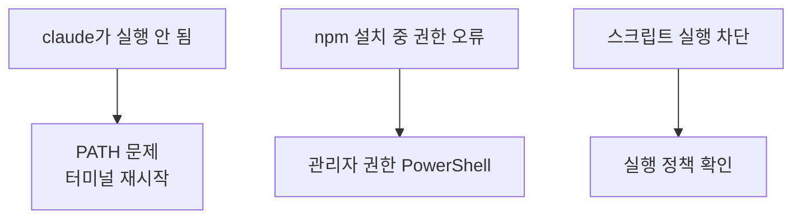

> [바이브 코딩]()을 시작하려면 먼저 **AI 작업대**를 차려야 합니다. 이 글은 윈도우에서 **Claude Code**를 설치하고 첫 실행까지 가는 가장 짧은 길입니다. (전체 작업대 개념은 [여기]().)
{: .prompt-info }

## 🧱 준비물 — Node.js (필수)

Claude Code는 Node 위에서 돕니다. 먼저 Node.js **LTS 버전**을 설치하세요.

1. [nodejs.org](https://nodejs.org) → LTS 설치 파일 다운로드 → 실행(기본값으로 Next).
2. **PowerShell을 새로 열어** 설치 확인:

```powershell
node --version   # 예: v20.x  (숫자가 나오면 성공)
npm --version
```

> 숫자가 안 나오고 `command not found`류가 뜨면, **PowerShell을 완전히 껐다 다시 여세요.** 그래도 안 되면 아래 트러블슈팅으로.
{: .prompt-warning }

## 🚀 Claude Code 설치

PowerShell에서 npm으로 전역 설치합니다.

```powershell
npm install -g @anthropic-ai/claude-code
```

설치가 끝나면 버전으로 검증:

```powershell
claude --version
```

## ▶️ 첫 실행

작업할 폴더를 만들고 그 안에서 실행합니다.

```powershell
New-Item -ItemType Directory my-first-web
cd my-first-web
claude
```

처음 실행하면 **로그인(계정 인증)** 안내가 나옵니다. 안내대로 브라우저에서 로그인하면 준비 끝. 이제 [작업대 글]()의 "마법의 프롬프트"로 첫 웹페이지를 만들어 보세요.

## 🕳️ 흔한 에러 해결



| 증상 | 원인 | 해결 |
|------|------|------|
| `claude: command not found` | 셸이 못 찾음(PATH) | 터미널 **재시작**, 그래도 안 되면 Node 재설치 |
| `npm ... EACCES/권한` | 설치 권한 | PowerShell을 **관리자 권한**으로 실행 |
| 스크립트가 차단됨 | 실행 정책 | `Get-ExecutionPolicy` 확인 후 정책 조정(신중히) |

> 이 에러들이 **어느 층위(셸/OS) 문제인지** 궁금하면 → [터미널·셸·커널·프롬프트]()에서 지도로 정리했습니다.
{: .prompt-tip }

> ⚠️ 설치 방식·패키지명은 업데이트될 수 있으니, 막히면 **공식 문서(code.claude.com/docs)** 의 최신 안내를 함께 확인하세요.
{: .prompt-warning }

## 📩 팀 전체에 세팅하려면

여러 대 PC에 개발/AI 환경을 표준화해 깔아야 한다면, 셋업 가이드부터 함께 만들어 드립니다.
→ [Business Inquiry]() · [csnextx@gmail.com](mailto:csnextx@gmail.com)

> 관련 → [바이브 코딩 작업대]() · [바이브 코딩이란?]()
{: .prompt-info }


---

> 📎 본 글은 **주식회사 넥스트엑스(NEXT X) 기술연구소**의 R&D 자산입니다.
> **함께 읽기** — [🛠️ 개발 대표 사례]() · [📖 블로그 안내]() · [📩 비즈니스 문의]()
{: .prompt-info }
