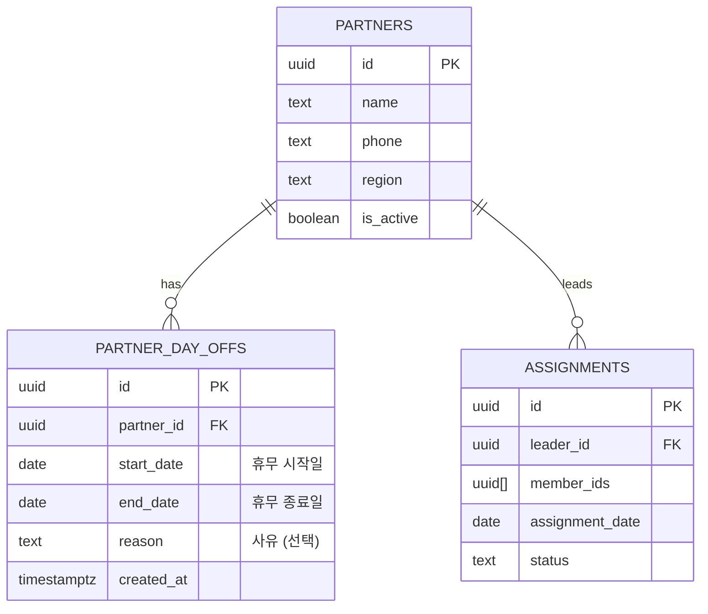
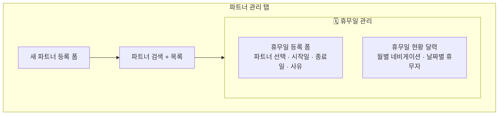
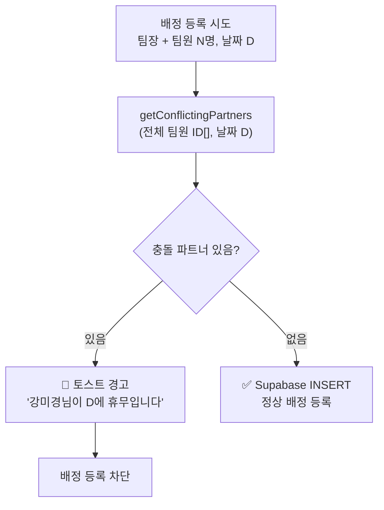
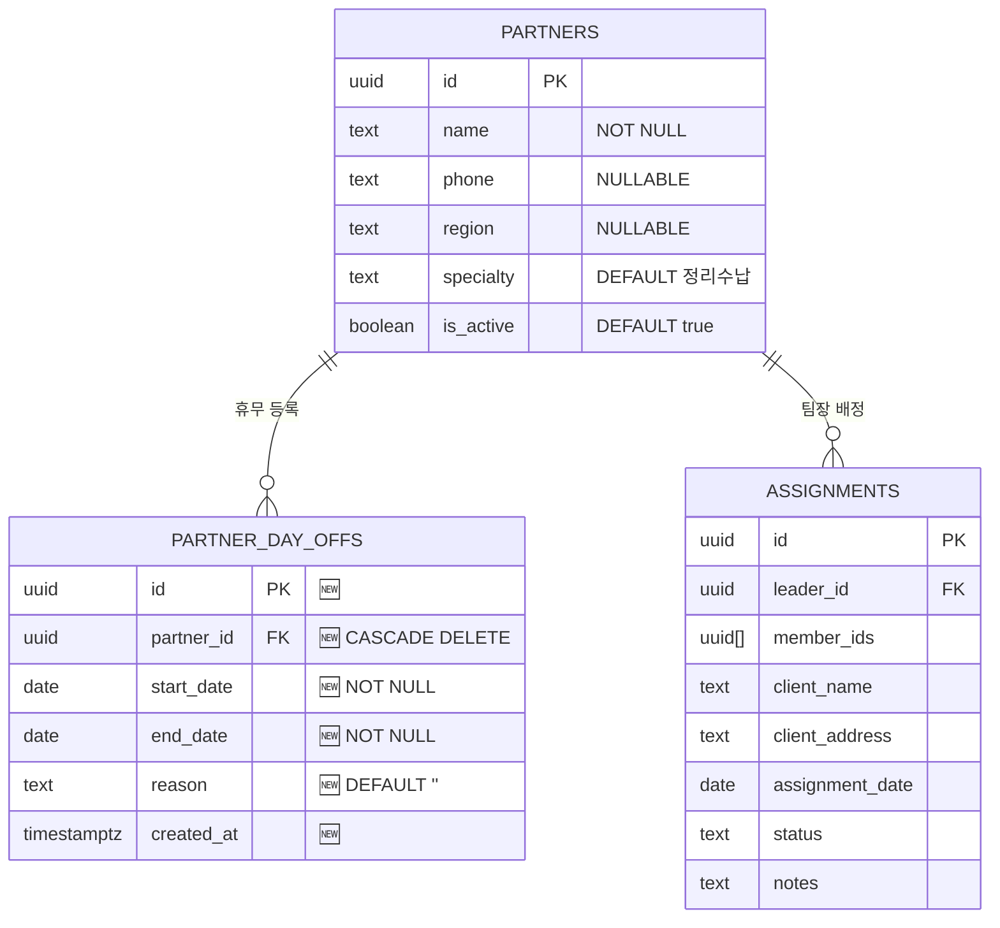
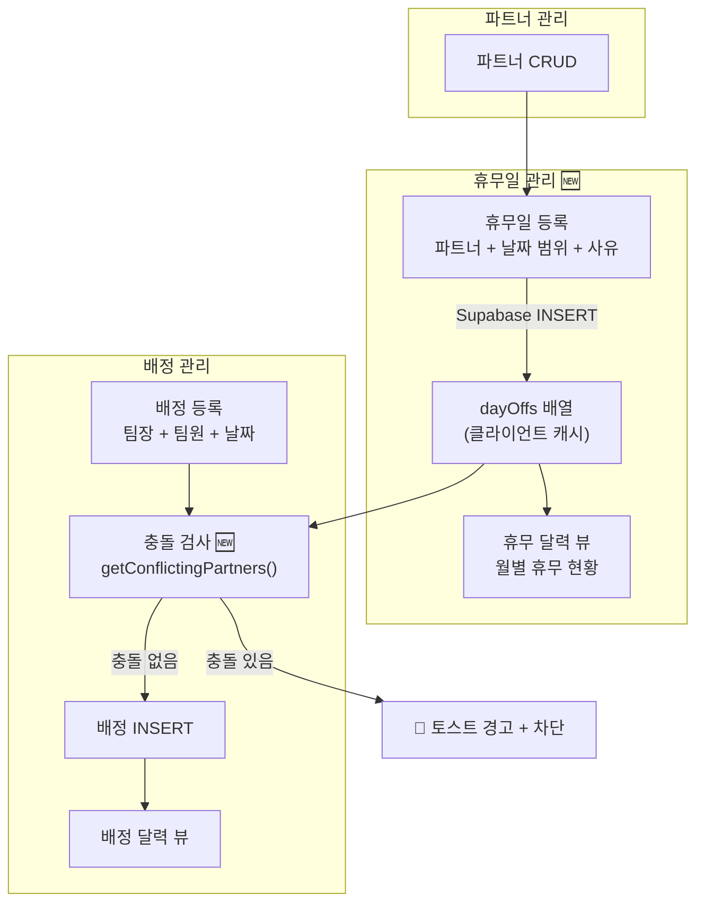
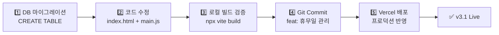
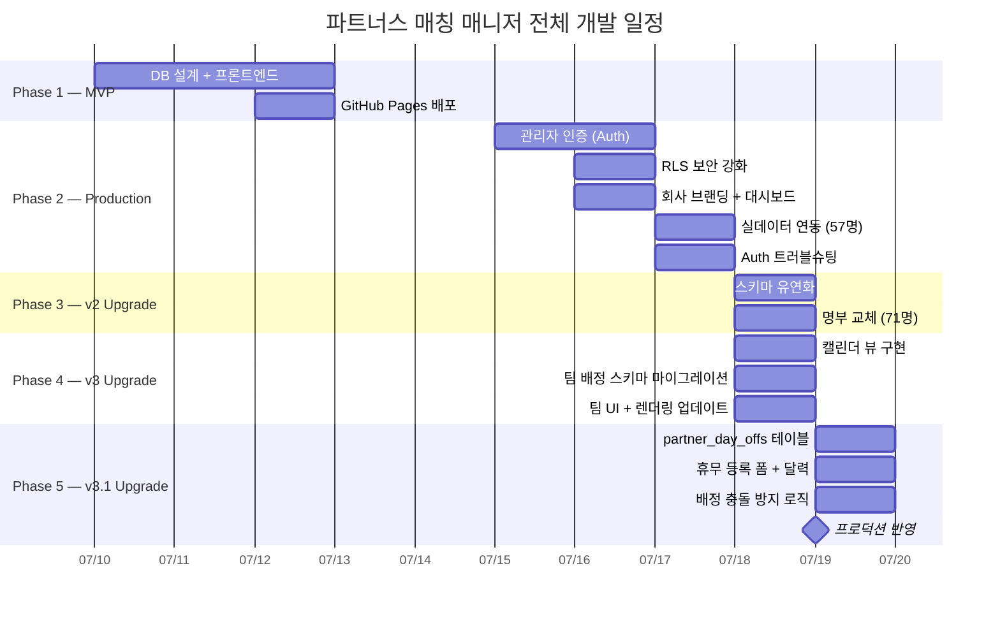

> 🏷️ **[NextX_AX_Solution]** · 주식회사 넥스트엑스(NEXT X) AX 솔루션 운영·유지보수 기록
{: .prompt-tip }

> 이 글은 파트너스 매칭 매니저 시리즈의 **여섯 번째 글**입니다.
> 1. [프로토타입 제작기]() — MVP 개발
> 2. [실전 납품 개발기]() — 인증·보안·실데이터
> 3. [Auth 트러블슈팅]() — 로그인 오류 해결
> 4. [v2 업그레이드]() — 명부 교체·스키마 유연화
> 5. [v3 업그레이드]() — 팀 배정 시스템·캘린더 뷰
> 6. **[현재 글] v3.1 업그레이드** — 휴무일 관리·스케줄 충돌 방지
> 7. [v4 업그레이드]() — 급여 정산 및 관리 시스템
> 8. [v4.1 업그레이드]() — UX 고도화 및 급여 기타수당
> 9. [v5 업그레이드]() — 통합 일정 관리 달력
> 10. [v5.1 업그레이드]() — 급여 산식 정밀화 및 모바일 카드 레이아웃
> 11. [v5.2 업그레이드]() — 엑셀 기반 Mock 데이터 파이프라인
{: .prompt-info }

## 📋 업그레이드 배경

### v3에서 발견된 운영 리스크

v3에서 팀 배정과 캘린더 뷰가 완성되면서, 배정 작업 자체는 편해졌습니다. 하지만 **사람의 가용 상태**를 시스템이 전혀 모른다는 문제가 남아 있었습니다:

| 실무 상황 | v3의 한계 |
|-----------|----------|
| 파트너 A가 다음 주 월~수 휴가 | 관리자가 **기억에 의존**하여 배정 회피 |
| 7/22 배정에 휴무 중인 파트너 포함 | **시스템이 경고 없이** 배정 등록 허용 |
| 이번 달 누가 언제 쉬는지 확인 | 별도 스프레드시트나 메모에 기록 |
| 긴급 현장에 가용 인원 파악 | 전화로 개별 확인 |

핵심 요구사항은 세 가지였습니다:

1. **휴무일 등록** — 파트너별 날짜 범위 + 사유
2. **휴무 달력** — 월간 뷰에서 누가 쉬는지 한눈에 파악
3. **충돌 방지** — 배정 등록 시 휴무 파트너 자동 차단

---

## 🗄️ Phase 1 — DB 설계

### partner_day_offs 테이블



### 마이그레이션 SQL

```sql
CREATE TABLE partner_day_offs (
  id UUID DEFAULT gen_random_uuid() PRIMARY KEY,
  partner_id UUID NOT NULL REFERENCES partners(id) ON DELETE CASCADE,
  start_date DATE NOT NULL,
  end_date DATE NOT NULL,
  reason TEXT DEFAULT '',
  created_at TIMESTAMPTZ DEFAULT now(),
  CONSTRAINT valid_date_range CHECK (end_date >= start_date)
);
```

> 💡 **CHECK 제약조건** `end_date >= start_date`를 DB 레벨에서 강제하여, 클라이언트 유효성 검사가 우회되더라도 잘못된 데이터가 들어가지 않습니다.
{: .prompt-tip }

### RLS 정책

보안 원칙은 기존 테이블과 동일합니다 — 인증된 사용자만 CRUD 가능:

```sql
ALTER TABLE partner_day_offs ENABLE ROW LEVEL SECURITY;

CREATE POLICY "Authenticated users can read day-offs"
  ON partner_day_offs FOR SELECT
  TO authenticated USING (true);

CREATE POLICY "Authenticated users can insert day-offs"
  ON partner_day_offs FOR INSERT
  TO authenticated WITH CHECK (true);

CREATE POLICY "Authenticated users can update day-offs"
  ON partner_day_offs FOR UPDATE
  TO authenticated USING (true);

CREATE POLICY "Authenticated users can delete day-offs"
  ON partner_day_offs FOR DELETE
  TO authenticated USING (true);
```

### 설계 결정: 날짜 범위 vs 개별 날짜

| 방식 | 장점 | 단점 |
|------|------|------|
| **범위 (start_date ~ end_date)** | 연속 휴무 1건으로 관리, 저장 효율적 | 달력 렌더링 시 날짜 전개 필요 |
| **개별 날짜 (date 컬럼 1건=1일)** | 쿼리 단순 | 5일 연속 휴무 → 5건 INSERT |

실무에서 대부분의 휴무는 **연속 기간**(예: 월~수 3일)이므로, 날짜 범위 방식이 등록 UX와 저장 효율 모두에서 유리합니다.

---

## 📝 Phase 2 — 휴무일 등록 폼

### UI 구조

파트너 관리 탭의 **파트너 목록 아래**에 휴무일 관리 섹션을 추가했습니다:



### 등록 폼 HTML

```html
<form id="form-dayoff" class="grid grid-cols-1 sm:grid-cols-2 lg:grid-cols-5 gap-4 items-end">
  <div>
    <label>파트너 *</label>
    <select id="dayoff-partner" required>
      <option value="">파트너 선택</option>
      <!-- 활동 중인 파트너 목록 자동 채움 -->
    </select>
  </div>
  <div>
    <label>시작일 *</label>
    <input type="date" id="dayoff-start" required />
  </div>
  <div>
    <label>종료일 *</label>
    <input type="date" id="dayoff-end" required />
  </div>
  <div>
    <label>사유</label>
    <input type="text" id="dayoff-reason" placeholder="개인 사유" />
  </div>
  <div>
    <button type="submit">+ 휴무 등록</button>
  </div>
</form>
```

### 날짜 연동 로직

시작일을 선택하면 종료일의 최솟값이 자동으로 맞춰집니다. 종료일이 시작일보다 앞서는 것을 UI 레벨에서 방지합니다:

```javascript
function setupDayOffForm() {
  const form = document.getElementById('form-dayoff');
  form.addEventListener('submit', handleAddDayOff);

  const startInput = document.getElementById('dayoff-start');
  startInput.addEventListener('change', () => {
    const endInput = document.getElementById('dayoff-end');
    if (!endInput.value || endInput.value < startInput.value) {
      endInput.value = startInput.value;
    }
    endInput.min = startInput.value;
  });
}
```

---

## 🗓️ Phase 3 — 휴무일 현황 달력

### 날짜 범위 → 날짜별 맵 전개

DB에는 `start_date ~ end_date` 범위로 저장되지만, 달력에 표시하려면 **개별 날짜별로 전개**해야 합니다:

```javascript
function renderDayOffCalendar() {
  const byDate = {};

  dayOffs.forEach(d => {
    const start = new Date(d.start_date + 'T00:00:00');
    const end = new Date(d.end_date + 'T00:00:00');

    // 시작일부터 종료일까지 하루씩 순회
    for (let cur = new Date(start); cur <= end; cur.setDate(cur.getDate() + 1)) {
      const dateStr = formatDate(cur);  // YYYY-MM-DD
      if (!byDate[dateStr]) byDate[dateStr] = [];
      byDate[dateStr].push(d);
    }
  });

  // 이후 CSS Grid 7열 캘린더 렌더링...
}
```

### 달력 셀 스타일링

휴무가 있는 날짜는 **분홍색 배경**으로 시각적으로 구분됩니다:

| 상태 | 배경색 | 표시 |
|------|--------|------|
| 일반 근무일 | `bg-white` | 날짜만 표시 |
| 오늘 | `bg-brand-50` | 브랜드 색 강조 |
| 휴무 있음 | `bg-rose-50` | 분홍 배경 + 파트너 이름 |

```css
.dayoff-entry {
  font-size: 11px;
  padding: 2px 4px;
  border-radius: 4px;
  background-color: #ffe4e6;  /* rose-100 */
  color: #9f1239;             /* rose-800 */
  border-left: 2px solid #fb7185;  /* rose-400 */
}
```

### 달력 네비게이션

배정 달력과 동일한 패턴으로 **이전/다음 월 탐색**과 **오늘 버튼**을 지원합니다:

```javascript
let dayoffCalYear = new Date().getFullYear();
let dayoffCalMonth = new Date().getMonth();

window.dayoffCalPrev = function () {
  dayoffCalMonth--;
  if (dayoffCalMonth < 0) { dayoffCalMonth = 11; dayoffCalYear--; }
  renderDayOffCalendar();
};

window.dayoffCalNext = function () {
  dayoffCalMonth++;
  if (dayoffCalMonth > 11) { dayoffCalMonth = 0; dayoffCalYear++; }
  renderDayOffCalendar();
};
```

---

## 🛡️ Phase 4 — 배정 시 충돌 방지

### 핵심 로직

배정 등록 시, 팀장과 모든 팀원의 휴무 상태를 **배정 날짜 기준**으로 검사합니다:



### 충돌 감지 함수

```javascript
function getConflictingPartners(partnerIds, dateStr) {
  const results = [];
  for (const pid of partnerIds) {
    const isOff = dayOffs.some(d =>
      d.partner_id === pid &&
      dateStr >= d.start_date &&
      dateStr <= d.end_date
    );
    if (isOff) {
      const partner = partners.find(p => p.id === pid);
      if (partner) results.push(partner);
    }
  }
  return results;
}
```

### handleAddAssignment에 충돌 검사 삽입

기존 배정 등록 함수의 유효성 검사 단계에 **휴무일 충돌 검사**를 추가합니다:

```javascript
async function handleAddAssignment(e) {
  e.preventDefault();
  const leader_id = form.leader.value;
  const member_ids = getSelectedMemberIds();
  const assignment_date = form.assignment_date.value;

  // 기존 검사: 팀장 필수
  if (!leader_id) {
    showToast('팀장을 선택하세요', 'error');
    return;
  }

  // 🆕 휴무일 충돌 검사 — 팀장 + 팀원 전원 체크
  const allTeamIds = [leader_id, ...member_ids];
  const conflicting = getConflictingPartners(allTeamIds, assignment_date);
  if (conflicting.length > 0) {
    const names = conflicting.map(c => c.name).join(', ');
    showToast(`휴무일 충돌: ${names}님이 ${assignment_date}에 휴무입니다`, 'error');
    return;  // 배정 차단
  }

  // 충돌 없으면 정상 INSERT
  const { error } = await supabase
    .from('assignments')
    .insert([{ leader_id, member_ids, client_name, client_address, assignment_date, notes }]);
  // ...
}
```

> ⚠️ 충돌 검사는 **팀장만이 아니라 팀원 전원**을 대상으로 합니다. `[leader_id, ...member_ids]`로 전체 팀원 배열을 만들어 한 번에 검사합니다. 팀원 중 한 명이라도 휴무이면 배정이 차단되고, 토스트에 **휴무 중인 파트너 이름**이 표시됩니다.
{: .prompt-warning }

---

## 📐 스키마 변경 요약

### v3 → v3.1 추가된 테이블



### v3 → v3.1 변경 사항

| 항목 | v3 | v3.1 |
|------|:---:|:---:|
| **테이블 수** | 2개 (partners, assignments) | **3개** (+partner_day_offs) |
| **휴무 관리** | 없음 | **등록·조회·삭제** |
| **휴무 달력** | 없음 | **월간 그리드** |
| **배정 충돌 검사** | 없음 | **팀장+팀원 전원 체크** |
| **RLS 테이블** | 2개 | **3개** |
| **CHECK 제약조건** | 없음 | **end_date >= start_date** |

---

## 🔄 데이터 흐름

전체 시스템의 데이터 흐름을 정리하면:



---

## 🚀 배포

### 배포 과정



v3과 마찬가지로, **DB 스키마가 먼저 준비**된 후 코드를 배포합니다. 이번에는 기존 테이블을 수정하지 않고 새 테이블을 추가하는 것이므로, 기존 기능에 영향을 주지 않습니다.

---

## 💡 실전에서 배운 것

### 1. 날짜 범위 처리의 함정

JavaScript에서 날짜 범위를 순회할 때 **시간대 문제**에 주의해야 합니다:

```javascript
// ❌ 잘못된 방식 — 시간대에 따라 날짜가 밀릴 수 있음
const start = new Date(d.start_date);

// ✅ 올바른 방식 — 시간을 명시적으로 00:00:00으로 고정
const start = new Date(d.start_date + 'T00:00:00');
```

`new Date('2026-07-21')`은 브라우저에 따라 UTC 자정으로 해석될 수 있어, 한국 시간(UTC+9)에서는 **전날 15시**가 됩니다. `T00:00:00`을 붙이면 로컬 시간 기준으로 해석되어 날짜가 밀리지 않습니다.

### 2. 클라이언트 캐시 + DB CHECK — 이중 방어

| 계층 | 검증 | 역할 |
|------|------|------|
| **UI** | 시작일 변경 시 종료일 min 설정 | 사용자 편의 |
| **JS** | `endDate < startDate` 조건 검사 | 즉각 피드백 |
| **DB** | `CHECK (end_date >= start_date)` | 최후의 방어선 |

클라이언트 검증만으로는 API 직접 호출이나 브라우저 개발자 도구를 통한 우회가 가능합니다. DB 레벨 CHECK 제약조건이 **진짜 방어선**입니다.

### 3. CASCADE DELETE의 가치

파트너가 삭제되면 해당 파트너의 휴무일도 자동 삭제됩니다:

```sql
partner_id UUID NOT NULL REFERENCES partners(id) ON DELETE CASCADE
```

이것이 없으면 파트너 삭제 후 **고아 휴무 레코드**가 남아, 달력에 "?" 이름의 휴무가 표시되는 버그가 발생합니다.

### 4. 배정 달력과 휴무 달력의 분리

배정 달력과 휴무 달력을 **같은 캘린더에 합치는 것**도 고려했지만, 분리가 더 나은 결정이었습니다:

| 기준 | 통합 달력 | 분리 달력 |
|------|:---------:|:---------:|
| **정보 밀도** | 과밀 — 배정+휴무 혼재 | 적정 — 각자의 역할 |
| **탭 위치** | 배정 탭에만 존재 | 각 탭에 최적 배치 |
| **사용 맥락** | 동시에 다 봐야 함 | 필요한 것만 확인 |

관리자의 워크플로우를 생각하면: **배정할 때**는 배정 달력을, **파트너 상태 확인할 때**는 휴무 달력을 봅니다. 맥락이 다르므로 분리가 맞습니다.

---

## 📈 시리즈 타임라인



---

## 🔗 프로젝트 링크

| 항목 | URL |
|------|-----|
| **라이브 서비스** | [partners-manager-omega.vercel.app](https://partners-manager-omega.vercel.app/) |
| **GitHub 소스코드** | [github.com/200gyu/partners-manager](https://github.com/200gyu/partners-manager) |
| **시리즈 #1** | [프로토타입 제작기]() |
| **시리즈 #2** | [실전 납품 개발기]() |
| **시리즈 #3** | [Auth 트러블슈팅]() |
| **시리즈 #4** | [v2 업그레이드]() |
| **시리즈 #5** | [v3 업그레이드]() |

---

## 🔮 다음 단계

v3.1까지 완료된 시스템의 현재 상태와 앞으로의 계획:

| 기능 | 상태 | 다음 목표 |
|------|:---:|----------|
| 파트너 CRUD | ✅ | 인라인 수정 (전화번호·지역 편집) |
| 관리자 인증 | ✅ | 다중 관리자 권한 분리 |
| 대시보드 | ✅ | 지역별·월별 통계 차트 |
| 캘린더 뷰 | ✅ | 드래그 배정 |
| 팀 배정 | ✅ | 팀원별 역할·작업 시간 기록 |
| 휴무일 관리 | ✅ | 정기 휴무 패턴 자동 등록 |
| 스케줄 충돌 방지 | ✅ | 충돌 시 대체 인원 자동 추천 |
| AI 자동 매칭 | 🔜 | 지역·전문성·휴무·과거 이력 기반 추천 |
| 급여 정산 | 🔜 | 배정 기록 기반 월별 자동 정산 |

> 배정 시스템은 **"누가 가능한가"**를 아는 것에서 시작됩니다. v3.1의 휴무일 관리는 이 질문에 대한 첫 번째 대답이며, 향후 AI 자동 매칭의 핵심 입력 데이터가 됩니다. 시스템이 사람의 가용 상태를 알아야, 비로소 **지능적인 추천**이 가능해집니다.
{: .prompt-tip }

---

*NEXT X R&D · AI Transformation*
