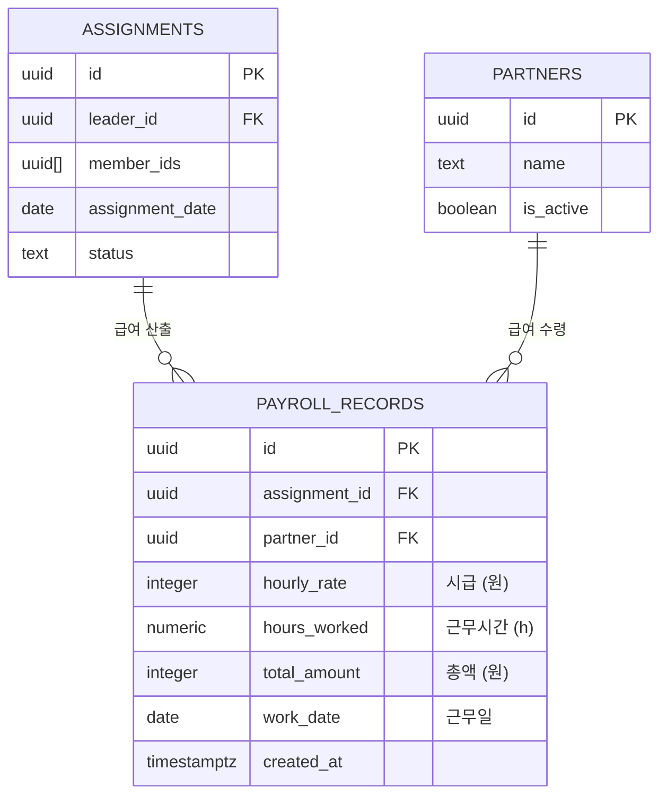
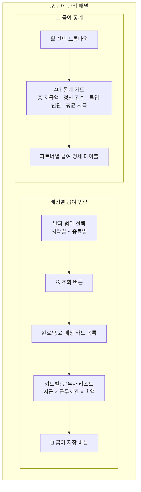
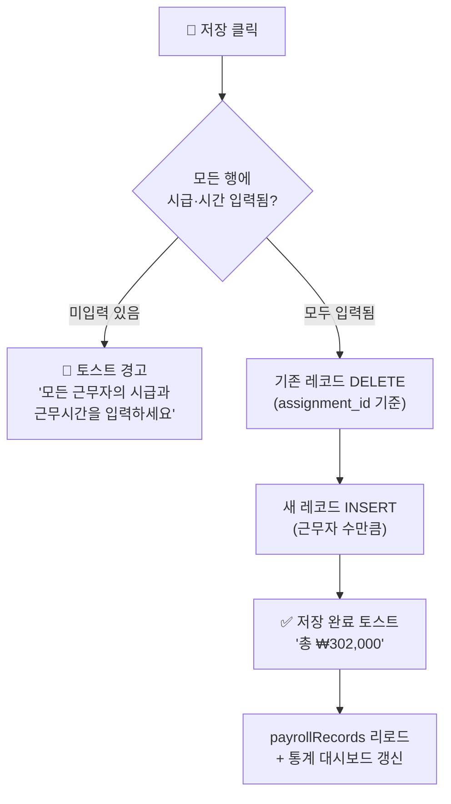
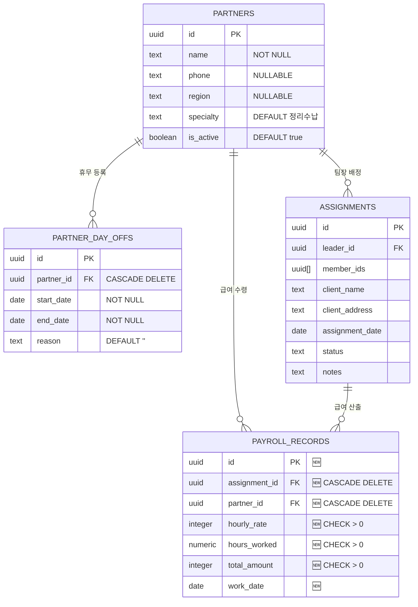
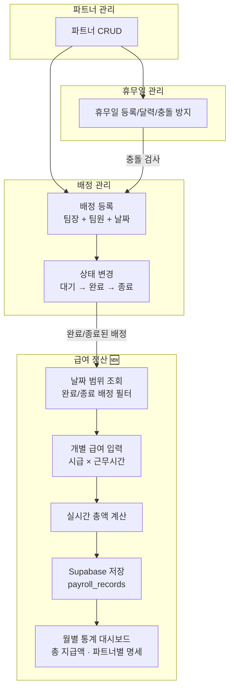
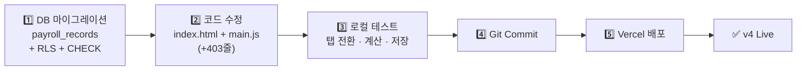
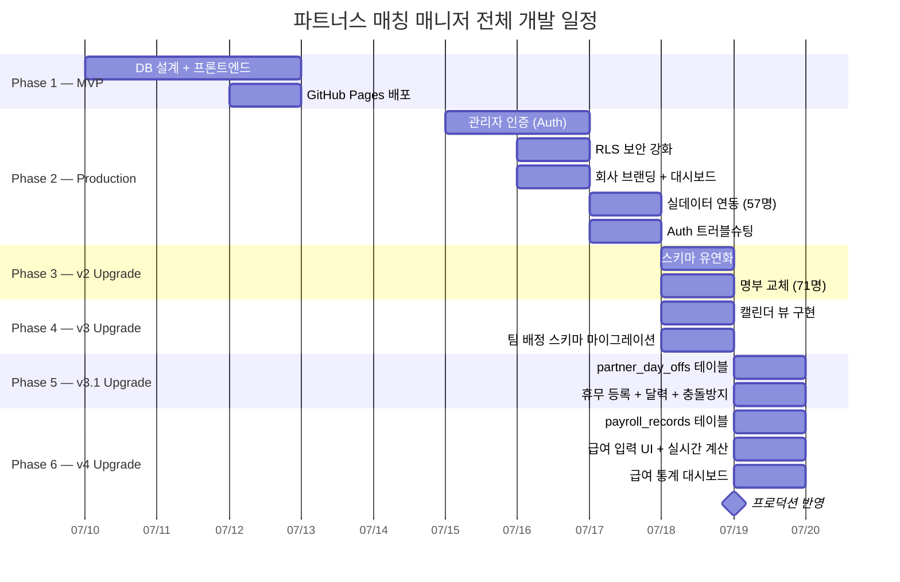

> 🏷️ **[NextX_AX_Solution]** · 주식회사 넥스트엑스(NEXT X) AX 솔루션 운영·유지보수 기록
{: .prompt-tip }

> 이 글은 파트너스 매칭 매니저 시리즈의 **일곱 번째 글**입니다.
> 1. [프로토타입 제작기]() — MVP 개발
> 2. [실전 납품 개발기]() — 인증·보안·실데이터
> 3. [Auth 트러블슈팅]() — 로그인 오류 해결
> 4. [v2 업그레이드]() — 명부 교체·스키마 유연화
> 5. [v3 업그레이드]() — 팀 배정 시스템·캘린더 뷰
> 6. [v3.1 업그레이드]() — 휴무일 관리·스케줄 충돌 방지
> 7. **[현재 글] v4 업그레이드** — 급여 정산 및 관리 시스템
> 8. [v4.1 업그레이드]() — UX 고도화 및 급여 기타수당
{: .prompt-info }

## 📋 업그레이드 배경

### v3.1에서 발견된 운영 공백

v3.1까지 오면서 파트너 관리, 팀 배정, 휴무일 관리까지 갖춰졌습니다. 하지만 현장 작업이 끝난 뒤 가장 중요한 단계인 **급여 정산**은 여전히 시스템 바깥에 있었습니다:

| 실무 상황 | v3.1의 한계 |
|-----------|----------|
| 현장 완료 후 급여 계산 | **엑셀 수작업** — 배정 목록 옮겨 적고, 시급·시간 입력 |
| 파트너마다 시급이 다름 | 시급 정보를 **별도 메모**에 관리 |
| 월말 급여 정산 | 배정 기록 역추적하여 **수동 합산** |
| 파트너별 총 급여 확인 | 스프레드시트 **피벗 테이블** 수작업 |

배정 시스템이 "누가 어디서 일했는지"를 이미 알고 있으니, 그 위에 "얼마를 받아야 하는지"를 바로 입력할 수 있어야 합니다.

핵심 요구사항은 네 가지였습니다:

1. **날짜별 완료 배정 조회** — 기간 내 완료/종료된 배정 목록
2. **개별 급여 입력** — 배정별, 근무자별 시급 × 근무시간
3. **실시간 자동 계산** — 입력과 동시에 총액 표시
4. **월별 통계 대시보드** — 총 지급액, 파트너별 명세 테이블

---

## 🗄️ Phase 1 — DB 설계

### payroll_records 테이블



### 마이그레이션 SQL

```sql
CREATE TABLE payroll_records (
  id UUID PRIMARY KEY DEFAULT gen_random_uuid(),
  assignment_id UUID NOT NULL REFERENCES assignments(id) ON DELETE CASCADE,
  partner_id UUID NOT NULL REFERENCES partners(id) ON DELETE CASCADE,
  hourly_rate INTEGER NOT NULL CHECK (hourly_rate > 0),
  hours_worked NUMERIC(5,2) NOT NULL CHECK (hours_worked > 0),
  total_amount INTEGER NOT NULL CHECK (total_amount > 0),
  work_date DATE NOT NULL,
  created_at TIMESTAMPTZ DEFAULT now(),
  UNIQUE(assignment_id, partner_id)
);
```

> 💡 **UNIQUE(assignment_id, partner_id)** 제약조건은 같은 배정에 같은 파트너의 급여가 중복 입력되는 것을 DB 레벨에서 차단합니다. 수정 시에는 기존 레코드를 삭제 후 재삽입하는 방식으로 처리합니다.
{: .prompt-tip }

### 설계 결정: 왜 `total_amount`를 별도 컬럼으로 저장하는가?

| 방식 | 장점 | 단점 |
|------|------|------|
| **컬럼 저장 (채택)** | 쿼리 시 계산 불필요, 정산 기록 불변 | 저장 시 정합성 검증 필요 |
| **매번 계산** | 데이터 중복 없음 | 집계 쿼리마다 연산, 부동소수점 오차 가능 |

급여 정산은 "그 당시 합의된 금액"이 기록으로 남아야 합니다. 나중에 시급이 변경되더라도 과거 정산 기록이 바뀌면 안 되기 때문에 **확정된 금액을 컬럼으로 저장**합니다.

### RLS 정책

보안 원칙은 기존 테이블과 동일합니다 — 인증된 사용자만 CRUD 가능:

```sql
ALTER TABLE payroll_records ENABLE ROW LEVEL SECURITY;

CREATE POLICY "payroll_select" ON payroll_records
  FOR SELECT TO authenticated USING (true);

CREATE POLICY "payroll_insert" ON payroll_records
  FOR INSERT TO authenticated WITH CHECK (true);

CREATE POLICY "payroll_update" ON payroll_records
  FOR UPDATE TO authenticated USING (true) WITH CHECK (true);

CREATE POLICY "payroll_delete" ON payroll_records
  FOR DELETE TO authenticated USING (true);
```

---

## 🎨 Phase 2 — 급여 관리 탭 UI

### 탭 네비게이션 확장

기존 2탭(파트너 관리, 배정 현황)에 **세 번째 탭**을 추가합니다:


### 탭 전환 로직 확장

```javascript
function setupTabs() {
  document.querySelectorAll('[data-tab]').forEach((btn) => {
    btn.addEventListener('click', () => {
      currentTab = btn.dataset.tab;
      // 3개 패널의 표시/숨김 토글
      document.getElementById('panel-partners')
        .classList.toggle('hidden', currentTab !== 'partners');
      document.getElementById('panel-assignments')
        .classList.toggle('hidden', currentTab !== 'assignments');
      document.getElementById('panel-payroll')
        .classList.toggle('hidden', currentTab !== 'payroll');

      // 급여 탭 진입 시 패널 초기화
      if (currentTab === 'payroll') {
        initPayrollPanel();
      }
    });
  });
}
```

### 패널 전체 구조

급여 관리 패널은 크게 **두 섹션**으로 구성됩니다:



---

## 💰 Phase 3 — 배정별 급여 입력

### 1단계: 날짜 범위로 배정 조회

탭 진입 시 현재 월의 1일~말일이 자동 설정됩니다:

```javascript
function initPayrollPanel() {
  const now = new Date();
  const y = now.getFullYear();
  const m = String(now.getMonth() + 1).padStart(2, '0');
  const lastDay = new Date(y, now.getMonth() + 1, 0).getDate();

  startEl.value = `${y}-${m}-01`;
  endEl.value = `${y}-${m}-${String(lastDay).padStart(2, '0')}`;
}
```

조회 버튼을 클릭하면, 해당 기간의 **완료 또는 종료** 상태 배정만 필터링합니다:

```javascript
function searchPayrollAssignments() {
  const completed = assignments.filter(a =>
    (a.status === '완료' || a.status === '종료') &&
    a.assignment_date >= startDate &&
    a.assignment_date <= endDate
  );
  renderPayrollAssignments(completed);
}
```

> ⚠️ **대기 상태 배정은 제외합니다.** 아직 현장에 나가지 않은 배정의 급여를 미리 입력하는 것은 실무 흐름에 맞지 않습니다. 완료/종료 처리를 먼저 하고, 그 후 급여를 입력하는 것이 올바른 워크플로우입니다.
{: .prompt-warning }

### 2단계: 배정 카드별 근무자 급여 입력

각 배정 카드에는 **팀장 + 전체 팀원**의 개별 입력 행이 표시됩니다:

```
┌──────────────────────────────────────────────────────┐
│  이승희  ·  서울시 강서구 허준로 가양아파트  ·  2026-07-22  │
│                                       배정 합계: ₩0  │
│  ┌────────────────────────────────────────────────┐  │
│  │ 👑 천예희   [시급: _____ 원] × [시간: ___ h] = ₩0 │  │
│  │ 👤 김경아   [시급: _____ 원] × [시간: ___ h] = ₩0 │  │
│  │ 👤 배영화   [시급: _____ 원] × [시간: ___ h] = ₩0 │  │
│  └────────────────────────────────────────────────┘  │
│                                 [💾 급여 저장]         │
└──────────────────────────────────────────────────────┘
```

### 3단계: 실시간 자동 계산

시급 또는 근무시간 입력칸에 값을 입력하면, 즉시 해당 행의 총액과 카드 전체 합계가 갱신됩니다:

```javascript
window.calcPayrollRow = function (input) {
  const row = input.closest('[data-worker-row]');
  const rate = parseFloat(row.querySelector('.payroll-rate').value) || 0;
  const hours = parseFloat(row.querySelector('.payroll-hours').value) || 0;
  const total = Math.round(rate * hours);

  // 행 총액 갱신
  row.querySelector('.payroll-row-total').textContent =
    '₩' + total.toLocaleString();

  // 카드 전체 합계 갱신
  const card = input.closest('.payroll-card');
  let cardTotal = 0;
  card.querySelectorAll('[data-worker-row]').forEach(r => {
    const rt = parseFloat(r.querySelector('.payroll-rate').value) || 0;
    const hr = parseFloat(r.querySelector('.payroll-hours').value) || 0;
    cardTotal += Math.round(rt * hr);
  });
  card.querySelector('.payroll-card-total').textContent =
    '₩' + cardTotal.toLocaleString();
};
```

> 💡 `Math.round()`를 사용하여 부동소수점 연산 오차를 방지합니다. 예를 들어 `13000 × 6.5 = 84500.00000000001` 같은 결과가 `84500`으로 정리됩니다.
{: .prompt-tip }

### 4단계: 급여 저장

저장 버튼 클릭 시, 해당 배정의 모든 근무자 급여를 한 번에 Supabase에 저장합니다:



수정 저장은 **DELETE + INSERT** 패턴을 사용합니다. `UNIQUE(assignment_id, partner_id)` 제약 때문에 UPSERT보다 깔끔하고, 팀원이 변경된 경우(기존 팀원 제외, 새 팀원 추가)에도 안전합니다.

---

## 📊 Phase 4 — 급여 통계 대시보드

### 4대 통계 카드

선택한 월의 급여 데이터를 집계하여 한눈에 보여줍니다:

| 카드 | 계산 방식 |
|------|----------|
| **총 지급액** | `SUM(total_amount)` |
| **정산 건수** | `COUNT(*)` |
| **투입 인원** | `COUNT(DISTINCT partner_id)` |
| **평균 시급** | `AVG(hourly_rate)` |

### 파트너별 급여 명세 테이블

월 선택 시, 해당 월에 급여가 기록된 모든 파트너의 명세를 테이블로 렌더링합니다:

```javascript
function renderPayrollDashboard() {
  const monthRecords = payrollRecords.filter(r =>
    r.work_date && r.work_date.startsWith(selectedMonth)
  );

  // 파트너별 집계
  const byPartner = {};
  monthRecords.forEach(r => {
    if (!byPartner[r.partner_id]) {
      byPartner[r.partner_id] = {
        count: 0, totalHours: 0,
        totalAmount: 0, rates: []
      };
    }
    byPartner[r.partner_id].count++;
    byPartner[r.partner_id].totalHours += parseFloat(r.hours_worked);
    byPartner[r.partner_id].totalAmount += r.total_amount;
    byPartner[r.partner_id].rates.push(r.hourly_rate);
  });

  // 총 급여 내림차순 정렬 → 테이블 렌더링
}
```

| 파트너 | 근무 건수 | 총 근무시간 | 평균 시급 | 총 급여 |
|--------|:---------:|:----------:|:---------:|--------:|
| 강미경 | 4건 | 32h | ₩15,000 | **₩480,000** |
| 천예희 | 3건 | 24h | ₩14,000 | **₩336,000** |
| 김경아 | 2건 | 16h | ₩13,000 | **₩208,000** |
| ... | ... | ... | ... | ... |

---

## 📐 스키마 변경 요약

### v3.1 → v4 추가된 테이블



### 버전별 변경 사항

| 항목 | v3.1 | v4 |
|------|:---:|:---:|
| **테이블 수** | 3개 | **4개** (+payroll_records) |
| **탭 수** | 2개 | **3개** (+급여 관리) |
| **급여 입력** | 없음 | **배정별 개별 입력** |
| **실시간 계산** | 없음 | **시급 × 시간 자동 합산** |
| **급여 통계** | 없음 | **월별 대시보드 + 명세 테이블** |
| **RLS 테이블** | 3개 | **4개** |
| **CHECK 제약조건** | 1개 | **4개** (+hourly_rate, hours_worked, total_amount) |
| **UNIQUE 제약조건** | 없음 | **1개** (assignment_id, partner_id) |

---

## 🔄 데이터 흐름

v4에서 급여 정산이 추가된 전체 시스템 흐름:



---

## 🚀 배포

### 배포 과정



---

## 💡 실전에서 배운 것

### 1. DELETE + INSERT vs UPSERT

급여 수정 시 두 가지 전략을 비교했습니다:

| 방식 | 장점 | 단점 |
|------|------|------|
| **UPSERT** | 존재하면 UPDATE, 없으면 INSERT | 팀원 변경 시 old 레코드 잔류 |
| **DELETE + INSERT (채택)** | 항상 clean state | 트랜잭션 내 2회 쿼리 |

팀원이 변경된 경우(예: 팀원 A 제외, 팀원 B 추가), UPSERT는 제외된 팀원 A의 레코드가 삭제되지 않습니다. DELETE + INSERT는 해당 배정의 모든 급여를 지우고 다시 쓰므로, **팀 구성 변경에도 안전**합니다.

### 2. 실시간 계산의 이벤트 전파

`oninput` 이벤트를 사용하면 키 하나 누를 때마다 계산이 실행됩니다. `onchange`보다 반응이 빠르지만, **DOM 탐색 범위를 최소화**하는 것이 중요합니다:

```javascript
// ✅ closest()로 자신이 속한 행만 탐색
const row = input.closest('[data-worker-row]');
const card = input.closest('.payroll-card');

// ❌ 전체 DOM에서 검색 — 카드가 많을 때 느려짐
document.querySelectorAll('.payroll-rate');
```

`closest()`는 자신부터 위쪽 조상만 탐색하므로, 카드가 수십 개여도 성능에 영향이 없습니다.

### 3. `NUMERIC(5,2)` — 정밀한 근무시간 타입

| 타입 | 범위 | 정밀도 | 용도 |
|------|------|--------|------|
| `INTEGER` | 정수만 | 1시간 단위 | ❌ 반일 근무 불가 |
| `REAL` | 부동소수점 | 오차 있음 | ❌ 정산에 부적합 |
| **`NUMERIC(5,2)`** | 0.00~999.99 | **정확** | ✅ 0.5시간 단위 지원 |

`step="0.5"` 속성과 함께 사용하여, 4시간, 6.5시간, 8시간 등 **30분 단위 입력**을 지원합니다.

### 4. 급여 저장 상태 시각화

저장된 배정 카드와 미저장 카드를 **테두리 색상**으로 구분합니다:

| 상태 | 스타일 | 뱃지 |
|------|--------|------|
| **미저장** | `border-gray-100` | 없음 |
| **저장됨** | `border-emerald-200 bg-emerald-50/30` | `저장됨` 뱃지 |

관리자가 한눈에 "어떤 배정의 급여를 아직 입력하지 않았는지" 파악할 수 있습니다.

---

## 📈 시리즈 타임라인



---

## 🔗 프로젝트 링크

| 항목 | URL |
|------|-----|
| **라이브 서비스** | [partners-manager-omega.vercel.app](https://partners-manager-omega.vercel.app/) |
| **GitHub 소스코드** | [github.com/200gyu/partners-manager](https://github.com/200gyu/partners-manager) |
| **시리즈 #1** | [프로토타입 제작기]() |
| **시리즈 #2** | [실전 납품 개발기]() |
| **시리즈 #3** | [Auth 트러블슈팅]() |
| **시리즈 #4** | [v2 업그레이드]() |
| **시리즈 #5** | [v3 업그레이드]() |
| **시리즈 #6** | [v3.1 업그레이드]() |

---

## 🔮 다음 단계

v4까지 완료된 시스템의 현재 상태와 앞으로의 계획:

| 기능 | 상태 | 다음 목표 |
|------|:---:|----------|
| 파트너 CRUD | ✅ | 인라인 수정 (전화번호·지역 편집) |
| 관리자 인증 | ✅ | 다중 관리자 권한 분리 |
| 대시보드 | ✅ | 지역별·월별 통계 차트 |
| 캘린더 뷰 | ✅ | 드래그 배정 |
| 팀 배정 | ✅ | 팀원별 역할 기록 |
| 휴무일 관리 | ✅ | 정기 휴무 패턴 자동 등록 |
| 스케줄 충돌 방지 | ✅ | 충돌 시 대체 인원 자동 추천 |
| 급여 정산 | ✅ | 급여 내역 PDF/Excel 내보내기 |
| 급여 통계 | ✅ | 분기별·연간 급여 추이 차트 |
| AI 자동 매칭 | 🔜 | 지역·전문성·휴무·과거 이력 기반 추천 |

> 급여 정산은 단순히 "돈을 계산하는 기능"이 아닙니다. 시스템이 **"누가, 어디서, 얼마나 일했는지"**를 기록하기 시작하면, 파트너별 생산성 분석, 현장 유형별 적정 인원 산출, 나아가 **AI 기반 최적 팀 편성**의 데이터 기반이 됩니다. 배정과 정산이 하나의 시스템 안에 연결된 것이 핵심입니다.
{: .prompt-tip }

---

*NEXT X R&D · AI Transformation*
