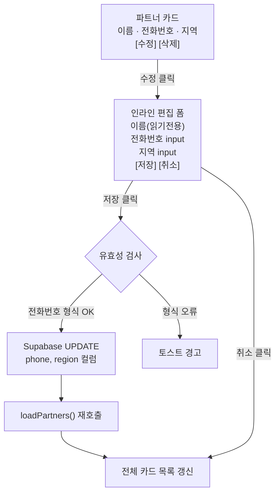
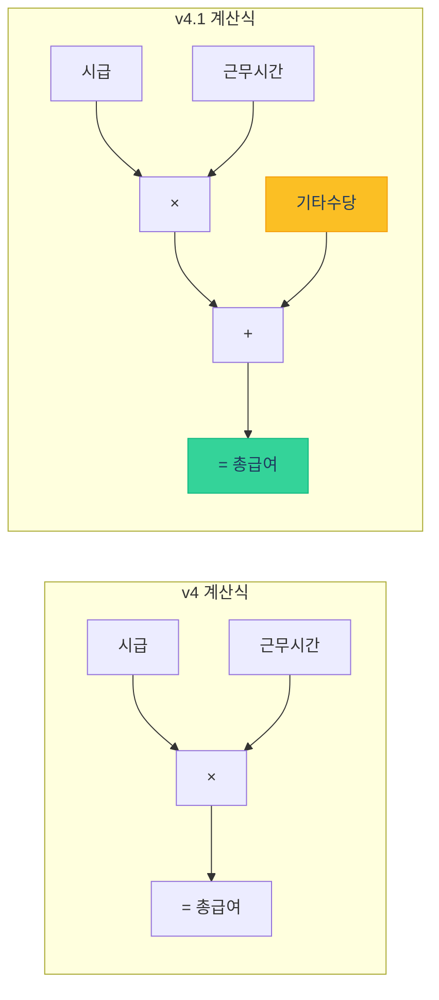
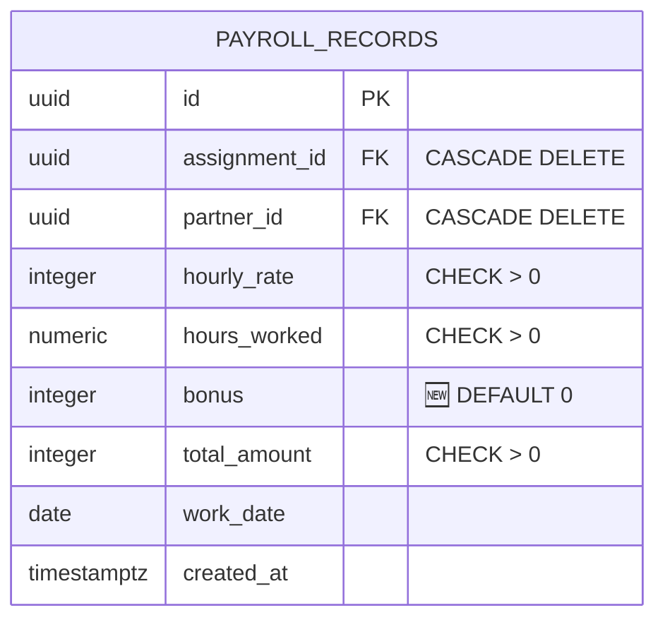
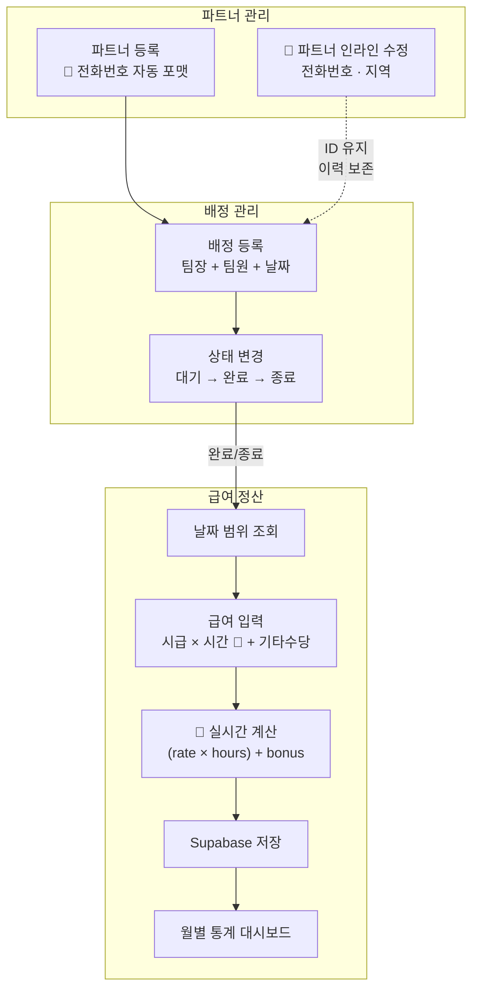
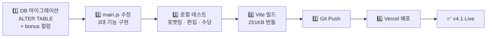
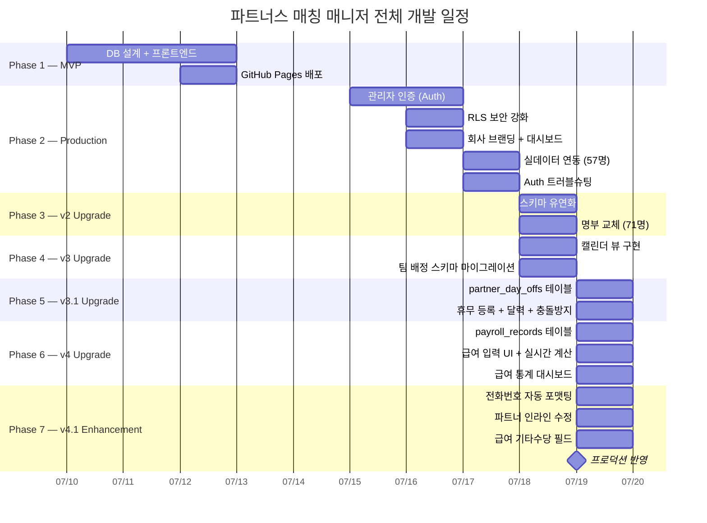

> 🏷️ **[NextX_AX_Solution]** · 주식회사 넥스트엑스(NEXT X) AX 솔루션 운영·유지보수 기록
{: .prompt-tip }

> 이 글은 파트너스 매칭 매니저 시리즈의 **여덟 번째 글**입니다.
> 1. [프로토타입 제작기]() — MVP 개발
> 2. [실전 납품 개발기]() — 인증·보안·실데이터
> 3. [Auth 트러블슈팅]() — 로그인 오류 해결
> 4. [v2 업그레이드]() — 명부 교체·스키마 유연화
> 5. [v3 업그레이드]() — 팀 배정 시스템·캘린더 뷰
> 6. [v3.1 업그레이드]() — 휴무일 관리·스케줄 충돌 방지
> 7. [v4 업그레이드]() — 급여 정산 및 관리 시스템
> 8. **[현재 글] v4.1 업그레이드** — UX 고도화 및 급여 기타수당
> 9. [v5 업그레이드]() — 통합 일정 관리 달력
> 10. [v5.1 업그레이드]() — 급여 산식 정밀화 및 모바일 카드 레이아웃
> 11. [v5.2 업그레이드]() — 엑셀 기반 Mock 데이터 파이프라인
> 12. [v5.3 업그레이드]() — 운영 데이터 전환 및 공제액 산식
{: .prompt-info }

## 📋 업그레이드 배경

### v4에서 발견된 세 가지 불편

v4까지 오면서 파트너 관리, 팀 배정, 휴무 관리, 급여 정산까지 완성됐습니다. 하지만 실제로 시스템을 사용하면서 **세 가지 사소하지만 반복적인 불편**이 나타났습니다:

| 실무 상황 | v4의 한계 |
|-----------|----------|
| 파트너 전화번호 입력 | 숫자만 11자리 나열 → **가독성 떨어짐**, 확인 시 오류 발생 |
| 전화번호·지역 변경 | 파트너 삭제 → 재등록 → **배정 이력 손실 위험** |
| 교통비·식대 지급 | 시급 × 시간에 포함 불가 → **별도 메모로 관리** |

하나하나는 작은 문제지만, **매일 반복되면 운영 효율을 갉아먹는 병목**이 됩니다.

핵심 요구사항은 세 가지였습니다:

1. **전화번호 자동 포맷팅** — 숫자 입력만으로 `010-1234-5678` 형식 자동 생성
2. **파트너 정보 인라인 수정** — 삭제 없이 전화번호·지역 즉시 편집
3. **급여 기타수당 필드** — 시급 × 시간 + 기타수당(교통비·식대 등) 계산

---

## 📱 Phase 1 — 전화번호 자동 포맷팅

### 문제: 읽기 어려운 전화번호

`01041252009`와 `010-4125-2009` — 같은 번호지만 가독성은 완전히 다릅니다. 70명이 넘는 파트너 목록에서 번호를 확인할 때, 하이픈 없는 숫자 나열은 오류의 원인이 됩니다.

### 해법: input 이벤트 기반 실시간 포맷터


핵심은 `formatPhoneNumber()` 함수입니다:

```javascript
function formatPhoneNumber(value) {
  const digits = value.replace(/\D/g, '');
  if (digits.length <= 3) return digits;
  if (digits.length <= 7)
    return digits.slice(0, 3) + '-' + digits.slice(3);
  return digits.slice(0, 3) + '-' + digits.slice(3, 7) + '-' + digits.slice(7, 11);
}
```

| 입력 길이 | 포맷 결과 | 설명 |
|:---------:|----------|------|
| 1~3자리 | `010` | 숫자만 표시 |
| 4~7자리 | `010-4125` | 첫 하이픈 삽입 |
| 8~11자리 | `010-4125-2009` | 두 번째 하이픈 삽입, 11자리 제한 |

### 적용 위치: 등록 폼 + 수정 폼

전화번호 포맷터는 **두 군데**에서 동작합니다:

```javascript
// 1. 파트너 등록 폼
function setupForms() {
  const phoneInput = partnerForm.querySelector('input[name="phone"]');
  phoneInput.addEventListener('input', () => {
    phoneInput.value = formatPhoneNumber(phoneInput.value);
  });
}

// 2. 파트너 수정 폼 (Phase 2에서 추가)
const editPhone = document.getElementById(`edit-phone-${id}`);
editPhone.addEventListener('input', () => {
  editPhone.value = formatPhoneNumber(editPhone.value);
});
```

> 💡 `replace(/\D/g, '')` 로 숫자가 아닌 문자를 제거하므로, 사용자가 하이픈을 직접 입력해도 중복되지 않습니다. 붙여넣기(`010-1234-5678` 또는 `01012345678`)도 모두 올바르게 처리됩니다.
{: .prompt-tip }

---

## ✏️ Phase 2 — 파트너 정보 인라인 수정

### 문제: 정보 변경 = 삭제 + 재등록?

파트너의 전화번호가 바뀌거나 활동 지역이 변경되면, v4까지는 **삭제 후 재등록**밖에 방법이 없었습니다. 이 과정에서 배정 이력과 급여 기록이 새 파트너 ID에 연결되지 않아 **데이터 일관성이 깨지는 위험**이 있었습니다.

### 해법: 카드 → 인라인 편집 폼 전환



### 카드에 수정 버튼 추가

기존 파트너 카드에 `data-partner-id` 속성과 수정 버튼을 추가합니다:

```javascript
<div class="bg-white rounded-xl shadow-sm border border-gray-100 p-5
     hover:shadow-md transition-shadow" data-partner-id="${p.id}">
  <!-- 기존 파트너 정보 -->
  <button onclick="editPartner('${p.id}')"
    class="text-xs px-3 py-1.5 rounded-lg bg-blue-50 text-blue-600
           hover:bg-blue-100 transition-colors">
    수정
  </button>
</div>
```

### editPartner — 카드를 편집 폼으로 교체

수정 버튼 클릭 시, 해당 카드의 `innerHTML`을 편집 폼으로 교체합니다:

```javascript
window.editPartner = function (id) {
  const p = partners.find(x => x.id === id);
  const card = document.querySelector(
    `#partner-list [data-partner-id="${id}"]`
  );

  card.innerHTML = `
    <div class="space-y-3">
      <h3 class="text-lg font-semibold text-gray-800">${esc(p.name)}</h3>
      <div>
        <label class="block text-xs font-medium text-gray-500 mb-1">
          전화번호
        </label>
        <input type="tel" id="edit-phone-${id}"
          value="${p.phone || ''}" placeholder="010-1234-5678" />
      </div>
      <div>
        <label class="block text-xs font-medium text-gray-500 mb-1">
          활동 지역
        </label>
        <input type="text" id="edit-region-${id}"
          value="${p.region || ''}" placeholder="제주시" />
      </div>
      <div class="flex gap-2">
        <button onclick="savePartnerEdit('${id}')">저장</button>
        <button onclick="cancelPartnerEdit()">취소</button>
      </div>
    </div>`;

  // 수정 폼에도 전화번호 포맷터 적용
  const editPhone = document.getElementById(`edit-phone-${id}`);
  editPhone.addEventListener('input', () => {
    editPhone.value = formatPhoneNumber(editPhone.value);
  });
};
```

> ⚠️ 이름은 **읽기 전용**으로 표시합니다. 파트너 이름은 배정·급여 등 다른 테이블에서 참조되는 식별자이므로, 변경이 필요하면 관리자가 의도적으로 판단해야 합니다. 전화번호와 지역은 운영 중 자연스럽게 바뀔 수 있는 정보이므로 인라인 수정을 허용합니다.
{: .prompt-warning }

### savePartnerEdit — Supabase UPDATE

저장 시 전화번호 유효성을 검사한 뒤, Supabase에 UPDATE 쿼리를 보냅니다:

```javascript
window.savePartnerEdit = async function (id) {
  const phone = document.getElementById(`edit-phone-${id}`).value.trim();
  const region = document.getElementById(`edit-region-${id}`).value.trim();

  if (phone && !validatePhone(phone)) {
    showToast('전화번호 형식이 올바르지 않습니다', 'error');
    return;
  }

  const { error } = await supabase
    .from('partners')
    .update({ phone: phone || '', region: region || '' })
    .eq('id', id);

  if (error) {
    showToast('수정 실패: ' + error.message, 'error');
    return;
  }

  showToast('파트너 정보가 수정되었습니다');
  await loadPartners();
};
```

### 설계 결정: 왜 모달이 아니라 인라인 편집인가?

| 방식 | 장점 | 단점 |
|------|------|------|
| **모달 팝업** | 화면 전환 명확, 복잡한 폼 가능 | 맥락 이탈, 모바일에서 불편 |
| **별도 페이지** | 전체 필드 수정 가능 | 네비게이션 추가, SPA 흐름 끊김 |
| **인라인 편집 (채택)** | 맥락 유지, 즉시 반응 | 복잡한 폼에는 부적합 |

수정 대상이 **전화번호와 지역** 두 필드뿐이므로, 카드 안에서 바로 수정하는 것이 가장 빠르고 직관적입니다.

---

## 💰 Phase 3 — 급여 기타수당 필드

### 문제: 시급 × 시간에 포함되지 않는 비용

현장에서는 교통비, 식대, 야근수당 등 **시급에 포함되지 않는 부가 비용**이 발생합니다. v4에서는 이런 비용을 기록할 방법이 없어, 별도 메모나 정산 시 수작업으로 합산해야 했습니다.

### DB 마이그레이션

`payroll_records` 테이블에 `bonus` 컬럼을 추가합니다:

```sql
ALTER TABLE payroll_records
ADD COLUMN IF NOT EXISTS bonus INTEGER DEFAULT 0;
```

| 컬럼 | 타입 | 기본값 | 용도 |
|------|------|--------|------|
| `bonus` | `INTEGER` | `0` | 교통비·식대·야근수당 등 부가 비용 |

> 💡 `DEFAULT 0`으로 설정하여 기존 급여 레코드에 영향을 주지 않습니다. 기존 데이터는 자동으로 `bonus = 0`이 되어, v4 → v4.1 전환이 **무중단으로 이루어집니다**.
{: .prompt-tip }

### 급여 계산식 변경



### UI: 기타수당 입력 필드 추가

각 근무자 행에 기타수당 입력 칸을 추가합니다:

```
┌──────────────────────────────────────────────────────────────────┐
│  이승희  ·  서울시 강서구 허준로 가양아파트  ·  2026-07-22         │
│                                            배정 합계: ₩302,000  │
│  ┌────────────────────────────────────────────────────────────┐  │
│  │ 👑 천예희  [시급: 15000 원] × [시간: 8 h] + [기타: 2000 원] │  │
│  │                                           = ₩122,000      │  │
│  │ 👤 김경아  [시급: 13000 원] × [시간: 6.5h] + [기타: 0 원]   │  │
│  │                                           = ₩84,500       │  │
│  │ 👤 배영화  [시급: 12000 원] × [시간: 8 h] + [기타: 500 원]  │  │
│  │                                           = ₩96,500       │  │
│  └────────────────────────────────────────────────────────────┘  │
│                                              [💾 급여 저장]       │
└──────────────────────────────────────────────────────────────────┘
```

### calcPayrollRow 업데이트

실시간 계산 함수에 `bonus` 필드를 반영합니다:

```javascript
window.calcPayrollRow = function (input) {
  const row = input.closest('[data-worker-row]');
  const rate = parseFloat(row.querySelector('.payroll-rate').value) || 0;
  const hours = parseFloat(row.querySelector('.payroll-hours').value) || 0;
  const bonus = parseFloat(row.querySelector('.payroll-bonus').value) || 0;

  // 행 총액: (시급 × 시간) + 기타수당
  const total = Math.round(rate * hours) + Math.round(bonus);
  row.querySelector('.payroll-row-total').textContent =
    '₩' + total.toLocaleString();

  // 카드 전체 합계
  const card = input.closest('.payroll-card');
  let cardTotal = 0;
  card.querySelectorAll('[data-worker-row]').forEach(r => {
    const rt = parseFloat(r.querySelector('.payroll-rate').value) || 0;
    const hr = parseFloat(r.querySelector('.payroll-hours').value) || 0;
    const bn = parseFloat(r.querySelector('.payroll-bonus').value) || 0;
    cardTotal += Math.round(rt * hr) + Math.round(bn);
  });
  card.querySelector('.payroll-card-total').textContent =
    '₩' + cardTotal.toLocaleString();
};
```

### 저장 로직 업데이트

저장 시 `bonus` 값을 함께 Supabase에 기록합니다:

```javascript
const bonus = parseFloat(row.querySelector('.payroll-bonus').value) || 0;

records.push({
  assignment_id: assignmentId,
  partner_id: partnerId,
  hourly_rate: Math.round(rate),
  hours_worked: hours,
  bonus: Math.round(bonus),
  total_amount: Math.round(rate * hours) + Math.round(bonus),
  work_date: assignment.assignment_date,
});
```

> ⚠️ `bonus`는 **선택 입력**입니다. 기타수당이 없으면 0으로 처리되며, `시급`과 `근무시간`은 여전히 필수입니다. 기존 v4의 유효성 검증 로직은 그대로 유지됩니다.
{: .prompt-warning }

### 레이아웃 개선: flex-wrap

기타수당 필드 추가로 행이 길어지는 것을 대비해, 근무자 행의 레이아웃을 `flex-wrap`으로 변경했습니다:

```javascript
// Before (v4)
<div class="flex items-center gap-3">

// After (v4.1)
<div class="flex items-center gap-3 flex-wrap">
```

모바일이나 좁은 화면에서 입력 필드가 **자연스럽게 줄 바꿈**됩니다.

---

## 📐 스키마 변경 요약

### v4 → v4.1 변경 사항



### 버전별 비교

| 항목 | v4 | v4.1 |
|------|:---:|:---:|
| **payroll_records 컬럼** | 7개 | **8개** (+bonus) |
| **급여 계산식** | 시급 × 시간 | **시급 × 시간 + 기타수당** |
| **전화번호 입력** | 숫자 나열 | **자동 하이픈 포맷팅** |
| **파트너 정보 수정** | 삭제→재등록 | **인라인 편집** |
| **급여 행 레이아웃** | flex 고정 | **flex-wrap 반응형** |
| **DB 마이그레이션** | CREATE TABLE | **ALTER TABLE ADD COLUMN** |

---

## 🔄 데이터 흐름

v4.1에서 추가된 기능(🔵)이 전체 시스템에 어떻게 연결되는지:



---

## 🚀 배포

### v4.1 배포 프로세스



### 변경 파일

| 파일 | 변경 내용 |
|------|----------|
| `src/main.js` | `formatPhoneNumber()`, `editPartner()`, `savePartnerEdit()`, `cancelPartnerEdit()`, `calcPayrollRow()` 업데이트, 급여 저장 로직 업데이트 |
| `payroll_records` (DB) | `bonus INTEGER DEFAULT 0` 컬럼 추가 |

> `index.html`은 **변경 없음**. 모든 UI 변경이 JavaScript의 동적 렌더링으로 처리되므로, HTML 구조를 건드리지 않고 기능을 추가할 수 있는 것이 SPA 아키텍처의 장점입니다.
{: .prompt-tip }

---

## 💡 실전에서 배운 것

### 1. 전화번호 포맷팅 — 왜 정규식 한 줄이 아닌가?

흔히 `replace(/(\d{3})(\d{4})(\d{4})/, '$1-$2-$3')` 같은 정규식 한 줄로 처리하려 하지만, **입력 중간 상태**를 고려하면 이 방식은 작동하지 않습니다:

| 입력 | 정규식 한 줄 | 분기 처리 |
|------|:----------:|:--------:|
| `010` | `010` | `010` |
| `0104` | `0104` (미매칭) | `010-4` |
| `01041` | `01041` (미매칭) | `010-41` |
| `01041252009` | `010-4125-2009` | `010-4125-2009` |

**입력이 완성되기 전 단계**에서도 하이픈이 올바르게 표시되려면, 길이별 분기 처리가 필요합니다.

### 2. innerHTML 교체 패턴의 이벤트 리스너

`innerHTML`을 교체하면 기존 DOM이 완전히 교체됩니다. 이때 **이벤트 리스너도 함께 사라지므로**, 새 DOM에 리스너를 다시 바인딩해야 합니다:

```javascript
// ❌ innerHTML 교체 전에 바인딩 — 작동 안 함
editPhone.addEventListener('input', handler);
card.innerHTML = newHTML;

// ✅ innerHTML 교체 후에 바인딩
card.innerHTML = newHTML;
const editPhone = document.getElementById(`edit-phone-${id}`);
editPhone.addEventListener('input', handler);
```

### 3. ALTER TABLE vs CREATE TABLE 마이그레이션

| 시나리오 | 적합한 전략 |
|----------|------------|
| **새 테이블** | `CREATE TABLE` — 스키마 자유롭게 설계 |
| **기존 테이블에 컬럼 추가** | `ALTER TABLE ADD COLUMN` — 기존 데이터 보존 |
| **컬럼 타입 변경** | `ALTER TABLE ALTER COLUMN` — 데이터 호환성 주의 |

v4.1에서는 기존 `payroll_records`에 `bonus`를 추가했기 때문에 `ALTER TABLE`을 사용했습니다. `DEFAULT 0`으로 설정하여 **기존 레코드의 급여 계산이 깨지지 않도록** 보장합니다.

### 4. 선택 필드와 필수 필드의 유효성 분리

```javascript
// 시급과 근무시간은 필수 (0이면 저장 불가)
if (!rate || !hours) {
  showToast('시급과 근무시간을 입력하세요', 'error');
  return;
}

// 기타수당은 선택 (0이어도 저장 가능)
const bonus = parseFloat(row.querySelector('.payroll-bonus').value) || 0;
```

기타수당은 `|| 0` 처리로 미입력 시 0원이 되며, 기존 필수 검증 로직을 변경하지 않습니다. **새 필드 추가가 기존 유효성 검사를 깨뜨리지 않는 것**이 중요합니다.

---

## 📈 시리즈 타임라인



---

## 🔗 프로젝트 링크

| 항목 | URL |
|------|-----|
| **라이브 서비스** | [partners-manager-omega.vercel.app](https://partners-manager-omega.vercel.app/) |
| **GitHub 소스코드** | [github.com/200gyu/partners-manager](https://github.com/200gyu/partners-manager) |
| **시리즈 #1** | [프로토타입 제작기]() |
| **시리즈 #2** | [실전 납품 개발기]() |
| **시리즈 #3** | [Auth 트러블슈팅]() |
| **시리즈 #4** | [v2 업그레이드]() |
| **시리즈 #5** | [v3 업그레이드]() |
| **시리즈 #6** | [v3.1 업그레이드]() |
| **시리즈 #7** | [v4 업그레이드]() |

---

## 🔮 다음 단계

v4.1까지 완료된 시스템의 현재 상태와 앞으로의 계획:

| 기능 | 상태 | 다음 목표 |
|------|:---:|----------|
| 파트너 CRUD | ✅ | ~~인라인 수정~~ **완료** |
| 전화번호 입력 | ✅ | ~~자동 포맷팅~~ **완료** |
| 관리자 인증 | ✅ | 다중 관리자 권한 분리 |
| 대시보드 | ✅ | 지역별·월별 통계 차트 |
| 캘린더 뷰 | ✅ | 드래그 배정 |
| 팀 배정 | ✅ | 팀원별 역할 기록 |
| 휴무일 관리 | ✅ | 정기 휴무 패턴 자동 등록 |
| 스케줄 충돌 방지 | ✅ | 충돌 시 대체 인원 자동 추천 |
| 급여 정산 | ✅ | ~~기타수당~~ **완료** · PDF/Excel 내보내기 |
| 급여 통계 | ✅ | 분기별·연간 급여 추이 차트 |
| AI 자동 매칭 | 🔜 | 지역·전문성·휴무·과거 이력 기반 추천 |

> v4.1의 세 가지 업그레이드는 "큰 기능"이 아니라 **"작은 불편의 해소"**입니다. 하지만 매일 쓰는 도구에서 반복되는 불편을 제거하면, 누적 효과는 큰 기능 하나를 추가한 것 이상입니다. **UX 개선은 기능 개발만큼 중요합니다.**
{: .prompt-tip }

---

*NEXT X R&D · AI Transformation*
