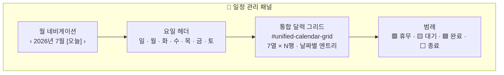
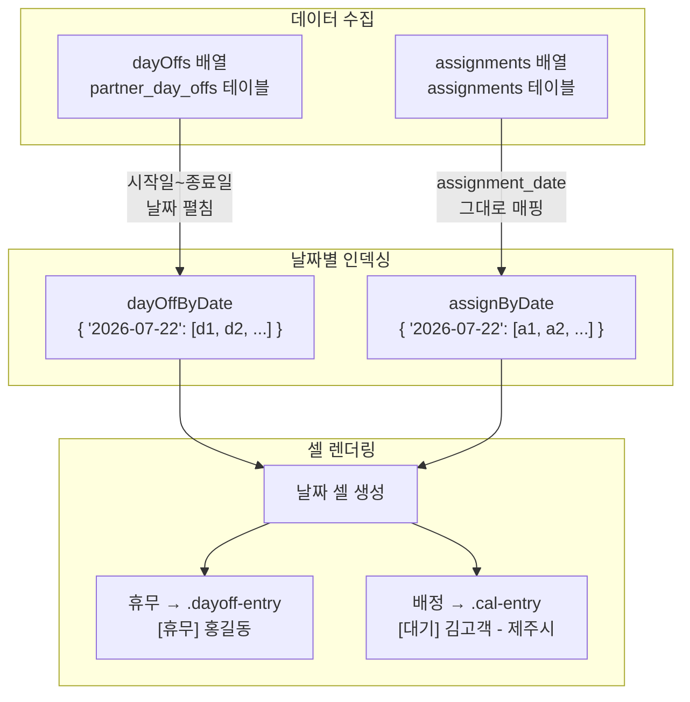
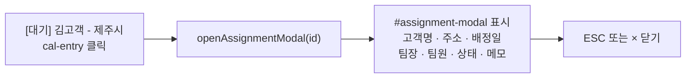
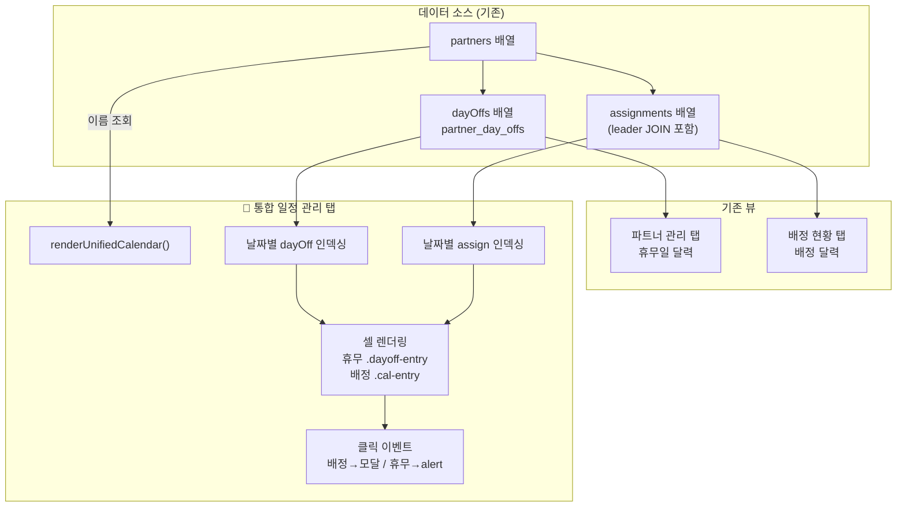
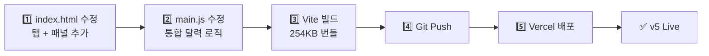
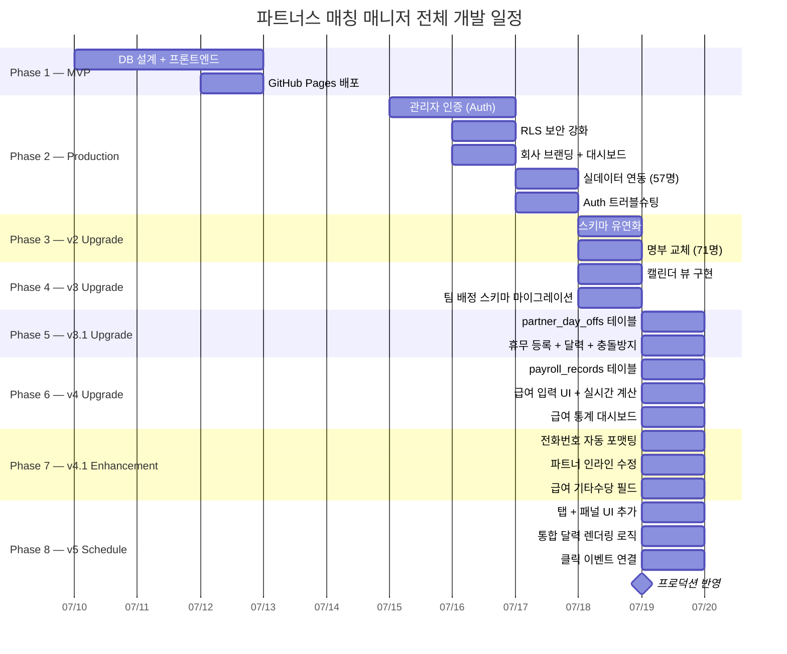

> 🏷️ **[NextX_AX_Solution]** · 주식회사 넥스트엑스(NEXT X) AX 솔루션 운영·유지보수 기록
{: .prompt-tip }

> 이 글은 파트너스 매칭 매니저 시리즈의 **아홉 번째 글**입니다.
> 1. [프로토타입 제작기]() — MVP 개발
> 2. [실전 납품 개발기]() — 인증·보안·실데이터
> 3. [Auth 트러블슈팅]() — 로그인 오류 해결
> 4. [v2 업그레이드]() — 명부 교체·스키마 유연화
> 5. [v3 업그레이드]() — 팀 배정 시스템·캘린더 뷰
> 6. [v3.1 업그레이드]() — 휴무일 관리·스케줄 충돌 방지
> 7. [v4 업그레이드]() — 급여 정산 및 관리 시스템
> 8. [v4.1 업그레이드]() — UX 고도화 및 급여 기타수당
> 9. **[현재 글] v5 업그레이드** — 통합 일정 관리 달력
> 10. [v5.1 업그레이드]() — 급여 산식 정밀화 및 모바일 카드 레이아웃
> 11. [v5.2 업그레이드]() — 엑셀 기반 Mock 데이터 파이프라인
> 12. [v5.3 업그레이드]() — 운영 데이터 전환 및 공제액 산식
> 13. [v5.4 업그레이드]() — 보안 감사·권한 분리(RBAC)·엑셀
{: .prompt-info }

## 📋 업그레이드 배경

### 데이터는 있는데, 한눈에 안 보인다

v4.1까지 시스템을 운영하면서 파트너 관리, 팀 배정, 휴무일, 급여 정산까지 모든 데이터가 시스템 안에 축적되었습니다. 하지만 **"내일 일정이 어떻게 되지?"**라는 단순한 질문에 답하려면 최소 두 개 이상의 화면을 확인해야 했습니다:

| 확인하고 싶은 것 | 확인해야 하는 위치 | 문제 |
|----------------|----------------|------|
| 7/22 배정 현황 | 배정 현황 탭 → 달력 뷰 전환 → 날짜 확인 | **배정만 보임**, 휴무자 모름 |
| 7/22 휴무 파트너 | 파트너 관리 탭 → 스크롤 → 휴무일 달력 확인 | **휴무만 보임**, 배정 모름 |
| 7/22 종합 판단 | 양쪽을 **번갈아 확인**하며 머릿속에서 조합 | **인지 부하**, 실수 가능 |

핵심 문제는 **데이터의 분산**이었습니다. 같은 날짜에 대한 정보가 서로 다른 탭, 서로 다른 달력에 흩어져 있어, 관리자가 "오늘 누가 쉬고, 어디에 배정됐고, 어떤 상태인지"를 종합적으로 파악하려면 **화면 전환**이 필수였습니다.

### 핵심 요구사항

1. **통합 달력** — 휴무일과 배정 데이터를 하나의 달력에 표시
2. **상태별 시각 구분** — 휴무(빨강), 대기(노랑), 완료(파랑), 종료(회색)
3. **클릭→상세** — 배정 항목 클릭 시 모달, 휴무 항목 클릭 시 상세 정보
4. **4번째 탭** — 기존 3탭(파트너/배정/급여)에 일정 관리 탭 추가

---

## 🏗️ Phase 1 — 탭 및 패널 추가 (index.html)

### 4번째 탭 버튼

기존 3탭 네비게이션에 `data-tab="schedule"` 속성의 일정 관리 버튼을 추가합니다:


```html
<button data-tab="schedule"
  class="tab-inactive px-5 py-2.5 rounded-xl text-sm font-semibold transition-all">
  📅 일정 관리
</button>
```

### 통합 달력 패널

`panel-schedule`은 전체 너비를 사용하는 큰 달력 하나로 구성됩니다:



기존에 정의된 CSS 클래스를 그대로 재활용합니다:

| 클래스 | 용도 | 기존 위치 |
|--------|------|----------|
| `.cal-cell` | 날짜 셀 (min-height: 110px) | 배정 달력 |
| `.cal-entry` | 배정 항목 배지 | 배정 달력 |
| `.dayoff-entry` | 휴무 항목 배지 | 휴무일 달력 |

> 💡 기존 CSS 클래스를 재사용함으로써 **새 스타일시트를 추가하지 않고** 통합 달력을 구현할 수 있습니다. 디자인 일관성도 자동으로 보장됩니다.
{: .prompt-tip }

---

## 📅 Phase 2 — 통합 달력 렌더링 로직 (main.js)

### 상태 변수 추가

통합 달력 전용 연/월 상태를 관리합니다:

```javascript
let uniCalYear = new Date().getFullYear();
let uniCalMonth = new Date().getMonth();
```

기존의 `calYear/calMonth`(배정 달력)와 `dayoffCalYear/dayoffCalMonth`(휴무 달력)는 그대로 유지하고, 통합 달력은 **독립적인 상태**로 운용합니다. 각 달력이 다른 월을 보고 있어도 서로 간섭하지 않습니다.

### 탭 전환 확장

```javascript
function setupTabs() {
  document.querySelectorAll('[data-tab]').forEach((btn) => {
    btn.addEventListener('click', () => {
      currentTab = btn.dataset.tab;
      // 4개 패널의 표시/숨김 토글
      document.getElementById('panel-partners')
        .classList.toggle('hidden', currentTab !== 'partners');
      document.getElementById('panel-assignments')
        .classList.toggle('hidden', currentTab !== 'assignments');
      document.getElementById('panel-payroll')
        .classList.toggle('hidden', currentTab !== 'payroll');
      document.getElementById('panel-schedule')
        .classList.toggle('hidden', currentTab !== 'schedule');

      if (currentTab === 'payroll') initPayrollPanel();
      if (currentTab === 'schedule') renderUnifiedCalendar();
    });
  });
}
```

### renderUnifiedCalendar — 핵심 렌더링 함수

이 함수가 v5의 핵심입니다. 두 가지 데이터 소스를 **하나의 날짜 그리드에 병합**합니다:



#### 1단계: 휴무일 날짜 인덱싱

휴무일은 기간(start_date ~ end_date)이므로, 각 날짜로 **펼쳐서 인덱싱**합니다:

```javascript
const dayOffByDate = {};
dayOffs.forEach(d => {
  const start = new Date(d.start_date + 'T00:00:00');
  const end = new Date(d.end_date + 'T00:00:00');
  for (let cur = new Date(start); cur <= end; cur.setDate(cur.getDate() + 1)) {
    const dateStr = `${cur.getFullYear()}-${String(cur.getMonth() + 1).padStart(2, '0')}-${String(cur.getDate()).padStart(2, '0')}`;
    if (!dayOffByDate[dateStr]) dayOffByDate[dateStr] = [];
    dayOffByDate[dateStr].push(d);
  }
});
```

#### 2단계: 배정 날짜 인덱싱

배정은 단일 날짜이므로 간단합니다:

```javascript
const assignByDate = {};
assignments.forEach(a => {
  const d = a.assignment_date;
  if (!d) return;
  if (!assignByDate[d]) assignByDate[d] = [];
  assignByDate[d].push(a);
});
```

#### 3단계: 셀별 통합 렌더링

각 날짜 셀 안에 **휴무 먼저, 배정 다음** 순서로 엔트리를 배치합니다:

```javascript
// 휴무 엔트리 (빨강 배경)
const seenDayOff = new Set();
dayOffEntries.forEach(d => {
  if (seenDayOff.has(d.id)) return; // 동일 휴무 중복 방지
  seenDayOff.add(d.id);
  const name = partner ? partner.name : '?';
  html += `<div class="dayoff-entry cursor-pointer"
    onclick="showDayOffDetail('${d.id}')">
    [휴무] ${esc(name)}
  </div>`;
});

// 배정 엔트리 (상태별 색상)
assignEntries.forEach(a => {
  const label = `[${a.status}] ${a.client_name} - ${region}`;
  const style = statusStyles[a.status];
  html += `<div class="cal-entry ${style}"
    onclick="openAssignmentModal('${a.id}')">
    ${esc(label)}
  </div>`;
});
```

> ⚠️ 휴무일 데이터에서 `seenDayOff` Set을 사용하는 이유는, 하나의 휴무 등록(3일 연속)이 **같은 날짜 셀에 중복 렌더링되는 것을 방지**하기 위해서입니다. `d.id`가 이미 처리되었으면 건너뜁니다.
{: .prompt-warning }

---

## 🖱️ Phase 3 — 클릭 이벤트 연결

### 배정 항목 클릭 → 배정 상세 모달

배정 엔트리를 클릭하면 기존의 `#assignment-modal`이 열립니다. v3에서 이미 구현한 `openAssignmentModal()` 함수를 **그대로 재사용**합니다:



이 패턴의 장점은 **새 코드 없이 기능 연결**이 가능하다는 것입니다. 통합 달력의 배정 엔트리와 배정 현황 달력의 엔트리가 같은 함수를 호출하므로, 모달의 동작과 스타일이 완벽히 일치합니다.

### 휴무 항목 클릭 → 상세 정보 표시

휴무 엔트리 클릭 시 `showDayOffDetail()` 함수가 호출되어 `alert()`로 상세 정보를 보여줍니다:

```javascript
window.showDayOffDetail = function (dayOffId) {
  const d = dayOffs.find(x => x.id === dayOffId);
  if (!d) return;
  const partner = partners.find(p => p.id === d.partner_id);
  const name = partner ? partner.name : '알 수 없음';
  const reason = d.reason ? d.reason : '사유 없음';
  alert(
    `🗓️ 휴무 상세\n\n` +
    `파트너: ${name}\n` +
    `기간: ${d.start_date} ~ ${d.end_date}\n` +
    `사유: ${reason}`
  );
};
```

> 💡 휴무 상세에 `alert()`를 사용한 이유: 휴무일 정보는 파트너명, 기간, 사유 세 줄로 충분하며, 별도 모달을 만드는 것은 과도한 설계입니다. 추후 정기 휴무 패턴이나 대체 인원 추천 기능이 추가되면 전용 모달로 업그레이드할 수 있습니다.
{: .prompt-tip }

---

## 🧭 Phase 4 — 달력 네비게이션

### 월 이동 함수

통합 달력의 월 이동은 기존 달력들과 동일한 패턴으로 구현합니다:

```javascript
window.uniCalPrev = function () {
  uniCalMonth--;
  if (uniCalMonth < 0) { uniCalMonth = 11; uniCalYear--; }
  renderUnifiedCalendar();
};

window.uniCalNext = function () {
  uniCalMonth++;
  if (uniCalMonth > 11) { uniCalMonth = 0; uniCalYear++; }
  renderUnifiedCalendar();
};

window.uniCalToday = function () {
  const now = new Date();
  uniCalYear = now.getFullYear();
  uniCalMonth = now.getMonth();
  renderUnifiedCalendar();
};
```

### 날짜 셀 스타일

| 조건 | 배경색 | 날짜 숫자 스타일 |
|------|--------|--------------|
| **오늘** | `bg-brand-50` (밝은 파랑) | 흰색 원형 배경 (`bg-brand-700`) |
| **일요일** | 일반 | `text-red-500` |
| **토요일** | 일반 | `text-blue-500` |
| **평일** | `bg-white` | `text-gray-700` |
| **이번달 아님** | `bg-gray-50` | 표시 안 함 |

---

## 📐 변경 사항 요약

### 버전별 비교

| 항목 | v4.1 | v5 |
|------|:---:|:---:|
| **탭 수** | 3개 | **4개** (+일정 관리) |
| **달력 수** | 2개 (분산) | **3개** (+통합 달력) |
| **휴무+배정 통합 조회** | 불가능 | **한 화면에서 가능** |
| **날짜별 전체 현황** | 2탭 번갈아 확인 | **한 셀에 모두 표시** |
| **배정 상세 진입** | 배정 달력에서만 | **통합 달력에서도 가능** |
| **휴무 상세 확인** | 달력에서 삭제만 | **클릭으로 상세 조회** |
| **DB 변경** | 있음 (ALTER TABLE) | **없음** |

> 💡 v5는 **DB 스키마 변경 없이** 기존 데이터를 새로운 방식으로 조합하는 순수 프론트엔드 업그레이드입니다. 기존 `dayOffs`와 `assignments` 배열을 날짜 기준으로 병합해서 렌더링할 뿐, 새로운 테이블이나 컬럼은 필요하지 않습니다.
{: .prompt-tip }

### 변경 파일

| 파일 | 변경 내용 |
|------|----------|
| `index.html` | `data-tab="schedule"` 탭 버튼, `panel-schedule` 패널 (달력 그리드 + 범례) |
| `src/main.js` | `uniCalYear/uniCalMonth` 상태, `renderUnifiedCalendar()`, `showDayOffDetail()`, 탭 전환 확장, 월 네비게이션 3함수 |

---

## 🔄 데이터 흐름

v5에서 추가된 통합 달력(🔵)이 전체 시스템에 어떻게 연결되는지:



---

## 🚀 배포

### v5 배포 프로세스



> DB 마이그레이션이 없으므로 **코드 배포만으로 완료**됩니다. 기존 사용자의 데이터는 그대로 유지되면서, 새 탭에서 통합된 형태로 조회할 수 있습니다.
{: .prompt-tip }

---

## 💡 실전에서 배운 것

### 1. 데이터는 그대로, 뷰만 바꾸는 리팩토링의 가치

v5에서 DB 스키마를 변경하지 않은 것은 의도적인 설계입니다. 기존 데이터 구조가 이미 충분히 잘 설계되어 있으면, **같은 데이터를 다른 각도에서 보여주는 것만으로** 큰 UX 개선이 가능합니다.

| 접근 | 비용 | 위험 | 효과 |
|------|------|------|------|
| **새 뷰 추가 (채택)** | JS 코드만 추가 | 없음 | 높음 |
| 새 테이블 생성 | DB 마이그레이션 | 데이터 정합성 | 불필요 |
| 기존 달력에 기능 추가 | 기존 코드 수정 | 회귀 버그 | 중간 |

### 2. 날짜 인덱싱 — 기간 데이터 vs 단일 날짜 데이터

휴무일(기간)과 배정(단일 날짜)은 인덱싱 방식이 다릅니다:

```javascript
// 기간 데이터: 날짜 펼침 필요
// 7/20~7/22 휴무 → { '7/20': [d], '7/21': [d], '7/22': [d] }
for (let cur = new Date(start); cur <= end; cur.setDate(cur.getDate() + 1)) {
  dayOffByDate[dateStr].push(d);
}

// 단일 날짜: 그대로 매핑
// 7/22 배정 → { '7/22': [a] }
assignByDate[a.assignment_date].push(a);
```

> 이 차이 때문에 두 데이터를 하나의 인덱스로 합치지 않고, **별도 인덱스를 만든 후 렌더링 시점에 병합**합니다. 데이터 구조의 차이를 존중하면서 뷰 레이어에서 통합하는 것이 가장 깔끔합니다.

### 3. 기존 함수 재사용의 효율

통합 달력에서 호출하는 함수들의 출처:

| 함수 | 최초 구현 버전 | 재사용 위치 |
|------|:----------:|----------|
| `openAssignmentModal()` | v3 | 배정 달력, **통합 달력** |
| `getMemberNames()` | v3 | 배정 목록, 달력, **통합 달력** |
| `extractRegion()` | v3 | 배정 달력, **통합 달력** |
| `esc()` | v1 | 전체 앱 |

새 기능인데 **새 함수는 2개뿐**(renderUnifiedCalendar, showDayOffDetail). 나머지는 모두 기존 코드의 재사용입니다. 이것이 잘 설계된 유틸리티 함수의 복리 효과입니다.

### 4. 독립적 달력 상태의 장점

```javascript
// 3개의 독립적 달력 상태
let calYear, calMonth;           // 배정 현황 달력
let dayoffCalYear, dayoffCalMonth; // 휴무일 달력
let uniCalYear, uniCalMonth;      // 통합 달력
```

각 달력이 독립적인 연/월 상태를 가지므로, 통합 달력에서 3월을 보면서 배정 달력은 7월을 보는 것이 가능합니다. **한 달력의 네비게이션이 다른 달력에 영향을 주지 않습니다.**

---

## 📈 시리즈 타임라인



---

## 🔗 프로젝트 링크

| 항목 | URL |
|------|-----|
| **라이브 서비스** | [partners-manager-omega.vercel.app](https://partners-manager-omega.vercel.app/) |
| **GitHub 소스코드** | [github.com/200gyu/partners-manager](https://github.com/200gyu/partners-manager) |
| **시리즈 #1** | [프로토타입 제작기]() |
| **시리즈 #2** | [실전 납품 개발기]() |
| **시리즈 #3** | [Auth 트러블슈팅]() |
| **시리즈 #4** | [v2 업그레이드]() |
| **시리즈 #5** | [v3 업그레이드]() |
| **시리즈 #6** | [v3.1 업그레이드]() |
| **시리즈 #7** | [v4 업그레이드]() |
| **시리즈 #8** | [v4.1 업그레이드]() |
| **시리즈 #10** | [v5.1 업그레이드]() |

---

## 🔮 다음 단계

v5까지 완료된 시스템의 현재 상태와 앞으로의 계획:

| 기능 | 상태 | 다음 목표 |
|------|:---:|----------|
| 파트너 CRUD + 인라인 수정 | ✅ | 일괄 수정 (복수 파트너) |
| 전화번호 자동 포맷팅 | ✅ | — |
| 관리자 인증 | ✅ | 다중 관리자 권한 분리 |
| 대시보드 | ✅ | 지역별·월별 통계 차트 |
| 캘린더 뷰 | ✅ | 드래그 배정 |
| 팀 배정 | ✅ | 팀원별 역할 기록 |
| 휴무일 관리 | ✅ | 정기 휴무 패턴 자동 등록 |
| 스케줄 충돌 방지 | ✅ | 충돌 시 대체 인원 자동 추천 |
| 급여 정산 + 기타수당 | ✅ | PDF/Excel 내보내기 |
| 급여 통계 | ✅ | 분기별·연간 급여 추이 차트 |
| 통합 일정 달력 | ✅ | 주간 뷰, 일간 상세 뷰 |
| AI 자동 매칭 | 🔜 | 지역·전문성·휴무·과거 이력 기반 추천 |

> 통합 달력은 **"시스템이 알고 있는 모든 일정"을 한 곳에서 보는 것**입니다. 이전까지는 데이터를 만들고 저장하는 데 집중했다면, v5부터는 **축적된 데이터를 어떻게 효과적으로 보여줄 것인가**에 초점이 이동합니다. 다음 단계인 주간 뷰, 일간 상세 뷰, 그리고 궁극적으로 AI 자동 매칭까지 — 모두 이 통합 데이터 위에서 동작하게 될 것입니다.
{: .prompt-tip }

---

*NEXT X R&D · AI Transformation*
