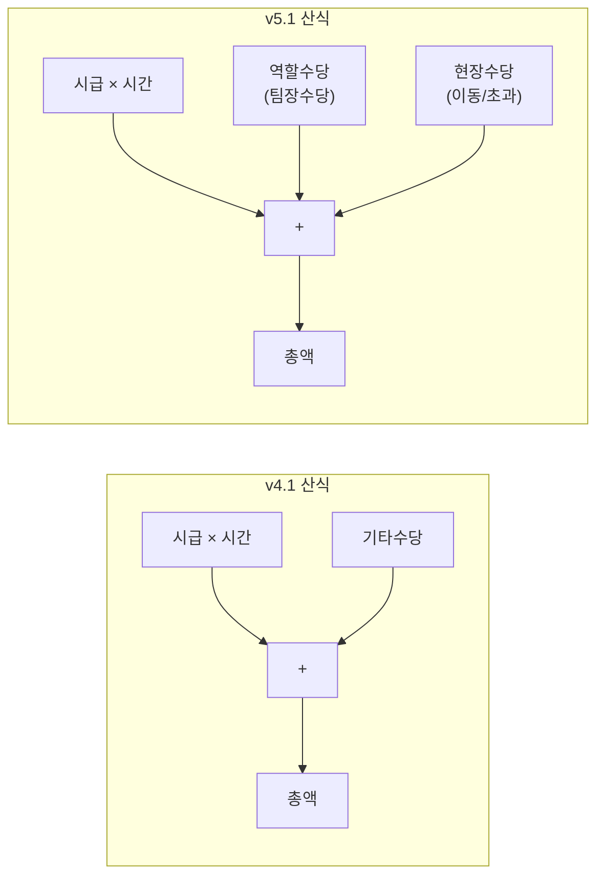
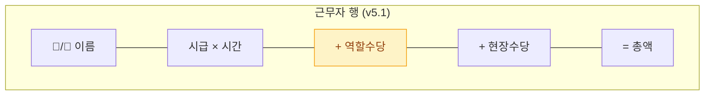
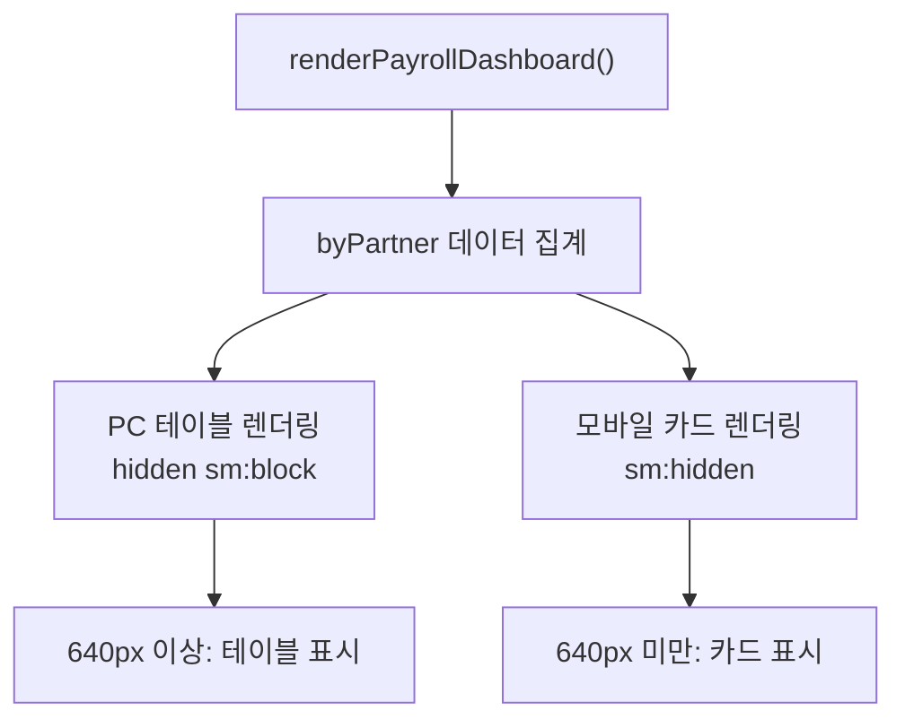
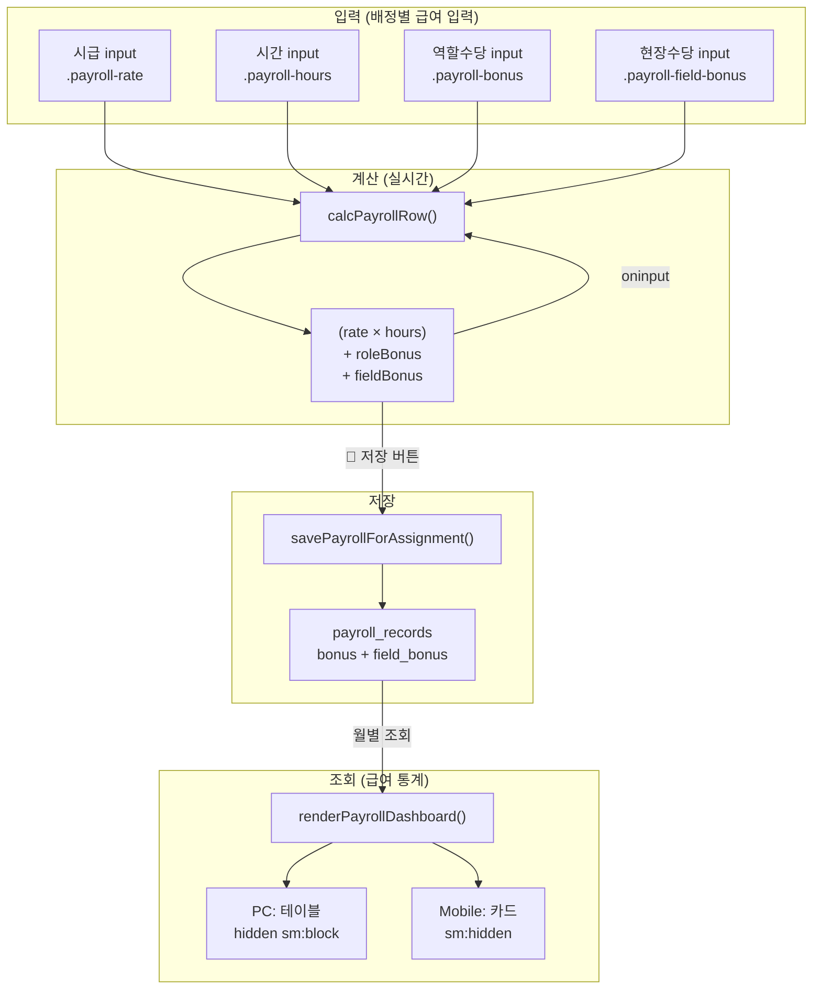
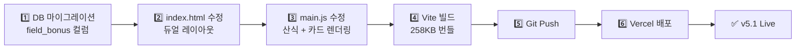
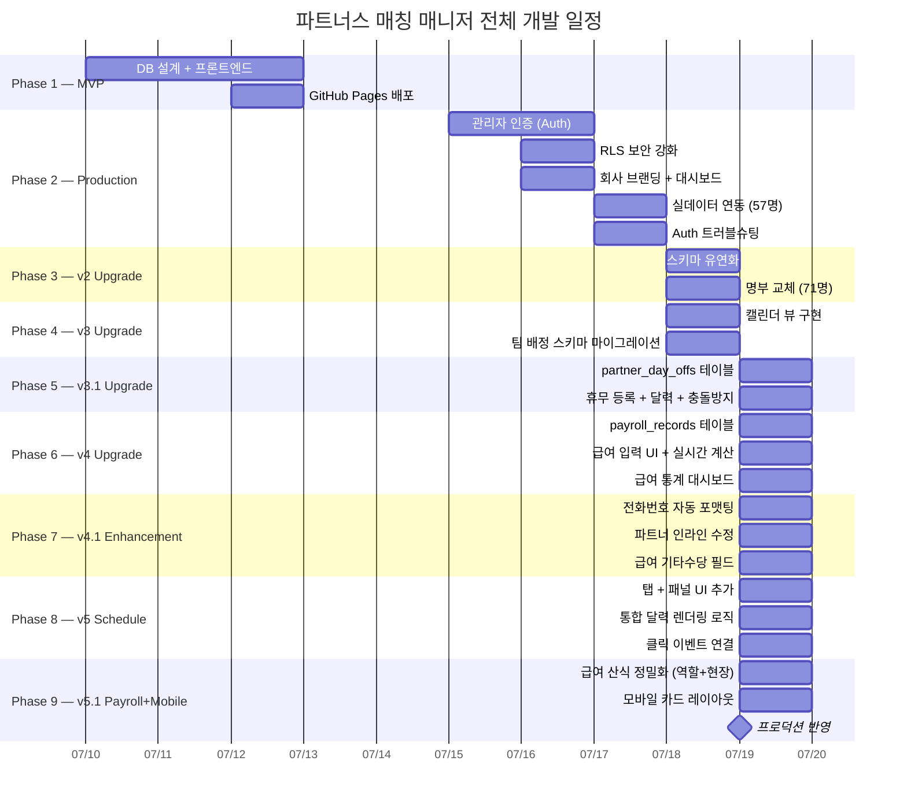

> 🏷️ **[NextX_AX_Solution]** · 주식회사 넥스트엑스(NEXT X) AX 솔루션 운영·유지보수 기록
{: .prompt-tip }

> 이 글은 파트너스 매칭 매니저 시리즈의 **열 번째 글**입니다.
> 1. [프로토타입 제작기]() — MVP 개발
> 2. [실전 납품 개발기]() — 인증·보안·실데이터
> 3. [Auth 트러블슈팅]() — 로그인 오류 해결
> 4. [v2 업그레이드]() — 명부 교체·스키마 유연화
> 5. [v3 업그레이드]() — 팀 배정 시스템·캘린더 뷰
> 6. [v3.1 업그레이드]() — 휴무일 관리·스케줄 충돌 방지
> 7. [v4 업그레이드]() — 급여 정산 및 관리 시스템
> 8. [v4.1 업그레이드]() — UX 고도화 및 급여 기타수당
> 9. [v5 업그레이드]() — 통합 일정 관리 달력
> 10. **[현재 글] v5.1 업그레이드** — 급여 산식 정밀화 및 모바일 카드 레이아웃
> 11. [v5.2 업그레이드]() — 엑셀 기반 Mock 데이터 파이프라인
{: .prompt-info }

## 📋 업그레이드 배경

### 70명의 급여를 실시간으로 정산하려면

v4.1에서 급여 관리 시스템을 도입하면서 **기본 시급 × 근무 시간 + 기타수당** 산식으로 정산을 시작했습니다. 하지만 실제 현장 운영에서 두 가지 한계가 드러났습니다:

| 문제 | 현재 (v4.1) | 실제 필요 |
|------|-----------|----------|
| **수당 구분** | "기타수당" 하나에 모든 수당 합산 | 팀장수당(역할수당)과 현장수당을 **분리** |
| **역할별 차등** | 팀장/팀원 구분 없이 동일 입력 | 팀장은 **팀장수당** 항목이 강조 |
| **모바일 조회** | 5열 테이블이 모바일에서 가로 스크롤 | 모바일에서 **카드 형태**로 조회 |

### 핵심 요구사항

1. **급여 산식 정밀화** — `(기본 시급 × 근무시간) + 역할수당(팀장수당) + 현장이동/초과근무수당`
2. **모바일 반응형 카드 레이아웃** — PC에서는 테이블, 모바일(`<640px`)에서는 카드

---

## 💰 Phase 1 — 급여 산식 정밀화

### DB 스키마 확장

기존 `payroll_records` 테이블에 `field_bonus` 컬럼을 추가합니다:

```sql
ALTER TABLE payroll_records
  ADD COLUMN IF NOT EXISTS field_bonus INTEGER DEFAULT 0;
```

| 컬럼 | 용도 | 비고 |
|------|------|------|
| `hourly_rate` | 기본 시급 | 기존 |
| `hours_worked` | 근무 시간 | 기존 |
| `bonus` | 역할수당 (팀장수당) | 기존 "기타수당"에서 **역할 재정의** |
| `field_bonus` | 현장수당 (이동/초과근무) | **신규** |
| `total_amount` | 총 급여 | 산식 변경 |

> 기존 `bonus` 컬럼의 역할을 "기타수당"에서 "역할수당"으로 **재정의**합니다. 기존 데이터는 그대로 유지되며, 새 `field_bonus` 컬럼은 `DEFAULT 0`이므로 기존 레코드에 영향을 주지 않습니다.
{: .prompt-tip }

### 급여 산식 변경



JavaScript 계산 함수의 변경:

```javascript
// v4.1 — 기타수당 하나
const total = Math.round(rate * hours) + Math.round(bonus);

// v5.1 — 역할수당 + 현장수당 분리
const total = Math.round(rate * hours)
            + Math.round(roleBonus)
            + Math.round(fieldBonus);
```

### 워커 행 UI 개선

각 근무자 행에 수당 입력 필드를 추가하고, 팀장과 팀원을 시각적으로 구분합니다:



팀장의 역할수당 입력란에는 **amber 배경색**(`bg-amber-50 border-amber-200`)을 적용해서 시각적으로 구분합니다:

```javascript
const roleBonusLabel = isLeader ? '팀장수당' : '역할수당';

// 팀장인 경우 amber 배경 강조
`<input class="payroll-bonus ...
  ${isLeader ? 'bg-amber-50 border-amber-200' : ''}"
  placeholder="${roleBonusLabel}" />`
```

### 저장 로직 확장

`savePayrollForAssignment()` 함수에 `field_bonus` 필드를 추가합니다:

```javascript
records.push({
  assignment_id: assignmentId,
  partner_id: partnerId,
  hourly_rate: Math.round(rate),
  hours_worked: hours,
  bonus: Math.round(roleBonus),        // 역할수당
  field_bonus: Math.round(fieldBonus),  // 현장수당 (신규)
  total_amount: Math.round(rate * hours)
              + Math.round(roleBonus)
              + Math.round(fieldBonus),
  work_date: assignment.assignment_date,
});
```

---

## 📱 Phase 2 — 모바일 반응형 카드 레이아웃

### 문제: 5열 테이블의 모바일 가독성

급여 통계 섹션의 파트너별 명세 테이블은 5개 컬럼(파트너, 근무 건수, 총 근무시간, 평균 시급, 총 급여)으로 구성됩니다. PC에서는 문제없지만, 모바일 화면에서는 **가로 스크롤이 필요하거나 텍스트가 잘리는** 문제가 발생합니다.

### 해결: Tailwind 반응형 듀얼 렌더링

하나의 데이터를 **두 가지 포맷으로 동시에 렌더링**하되, Tailwind의 반응형 클래스로 화면 크기에 따라 적절한 것만 보여줍니다:



### HTML 구조

```html
<!-- PC 테이블: 640px 이상에서만 표시 -->
<div class="overflow-x-auto hidden sm:block">
  <table class="w-full text-sm">
    <thead>...</thead>
    <tbody id="payroll-stat-table">...</tbody>
  </table>
</div>

<!-- 모바일 카드: 640px 미만에서만 표시 -->
<div id="payroll-stat-cards" class="sm:hidden space-y-3">
  ...
</div>
```

| 클래스 | 의미 | 적용 대상 |
|--------|------|----------|
| `hidden sm:block` | 기본 숨김, 640px+ 표시 | PC 테이블 |
| `sm:hidden` | 기본 표시, 640px+ 숨김 | 모바일 카드 |

### 카드 레이아웃 구조

모바일 카드는 **2열 그리드**로 핵심 정보를 압축합니다:


수당 항목은 **0원이 아닌 경우에만 조건부 렌더링**됩니다:

```javascript
${data.totalRoleBonus > 0 ? `
<div class="flex justify-between bg-amber-50 rounded-lg px-3 py-2">
  <span class="text-amber-600">역할수당</span>
  <span class="font-semibold text-amber-700">
    ₩${data.totalRoleBonus.toLocaleString()}
  </span>
</div>` : ''}

${data.totalFieldBonus > 0 ? `
<div class="flex justify-between bg-blue-50 rounded-lg px-3 py-2">
  <span class="text-blue-600">현장수당</span>
  <span class="font-semibold text-blue-700">
    ₩${data.totalFieldBonus.toLocaleString()}
  </span>
</div>` : ''}
```

> 조건부 렌더링으로 수당이 없는 파트너의 카드는 간결하게, 수당이 있는 파트너의 카드는 상세하게 표시됩니다. **정보 밀도를 데이터에 맞게 동적으로 조절**하는 것이 모바일 UX의 핵심입니다.
{: .prompt-tip }

---

## 📐 변경 사항 요약

### 버전별 비교

| 항목 | v4.1 | v5.1 |
|------|:---:|:---:|
| **급여 산식** | `시급×시간 + 기타수당` | `시급×시간 + 역할수당 + 현장수당` |
| **수당 분류** | 1종 (기타수당) | **2종** (역할 + 현장) |
| **팀장 시각 구분** | 👑 배지만 | 👑 배지 + **amber 입력란** |
| **급여 통계 (PC)** | 5열 테이블 | 5열 테이블 (유지) |
| **급여 통계 (모바일)** | 가로 스크롤 필요 | **카드 레이아웃** |
| **DB 변경** | 없음 | `field_bonus` 컬럼 추가 |
| **카드 수당 표시** | — | **조건부** (0원이면 숨김) |

### 변경 파일

| 파일 | 변경 내용 |
|------|----------|
| `index.html` | 급여 통계 영역 듀얼 렌더링 구조 (`hidden sm:block` + `sm:hidden`) |
| `src/main.js` | 워커 행 현장수당 필드, `calcPayrollRow()` 산식, `savePayrollForAssignment()` 저장 로직, `renderPayrollDashboard()` 카드 렌더링 |
| DB | `payroll_records.field_bonus INTEGER DEFAULT 0` 추가 |

---

## 🧮 데이터 흐름

v5.1에서 변경된 급여 계산 및 렌더링 파이프라인:



---

## 🚀 배포

### v5.1 배포 프로세스



> `ALTER TABLE ... ADD COLUMN IF NOT EXISTS`를 사용하므로 마이그레이션은 **멱등적(idempotent)**입니다. 여러 번 실행해도 안전합니다. `DEFAULT 0` 덕분에 기존 레코드는 자동으로 `field_bonus = 0`을 갖게 됩니다.
{: .prompt-tip }

---

## 💡 실전에서 배운 것

### 1. 기존 컬럼의 역할 재정의 vs 새 컬럼 추가

| 접근 | 적용 | 이유 |
|------|------|------|
| `bonus` → "역할수당" | **역할 재정의** | 기존 데이터 호환, 코드 변경 최소화 |
| `field_bonus` 추가 | **새 컬럼** | 새로운 의미의 데이터, `DEFAULT 0`으로 안전 |

"기타수당"이라는 모호한 이름을 "역할수당"으로 명확히 하면서, 실제로는 기존 데이터나 컬럼을 변경하지 않습니다. **이름만 바꾸고 새 필드를 추가하는 것**이 가장 안전한 스키마 진화 패턴입니다.

### 2. Tailwind 반응형 듀얼 렌더링의 트레이드오프

```javascript
// 같은 데이터를 두 번 렌더링하는 비용
tableBody.innerHTML = entries.map(/* 테이블 행 */).join('');
cardContainer.innerHTML = entries.map(/* 카드 *//).join('');
```

| 장점 | 단점 |
|------|------|
| CSS 미디어쿼리만으로 전환 | DOM 노드 2배 |
| JS 리사이즈 이벤트 불필요 | 렌더링 함수 코드 증가 |
| 깜빡임 없는 즉시 전환 | — |

70명 규모에서 DOM 노드 2배는 **무시 가능한 수준**입니다. 수천 건 이상이면 `matchMedia` API로 한쪽만 렌더링하는 최적화가 필요하지만, 현재 규모에서는 과도한 설계입니다.

### 3. 조건부 카드 항목의 UX 효과

```javascript
// 수당이 0이면 카드에서 아예 안 보임
${data.totalRoleBonus > 0 ? `<div>역할수당: ₩...</div>` : ''}
${data.totalFieldBonus > 0 ? `<div>현장수당: ₩...</div>` : ''}
```

모든 카드에 모든 항목을 동일하게 표시하면, 수당이 없는 파트너의 카드에 `₩0`이 두 줄이나 차지합니다. **의미 있는 정보만 표시**하면:
- 수당 없는 일반 팀원 카드: 4줄 (간결)
- 수당 있는 팀장 카드: 6줄 (상세)

정보 밀도가 **데이터에 따라 자연스럽게 조절**됩니다.

---

## 📈 시리즈 타임라인



---

## 🔗 프로젝트 링크

| 항목 | URL |
|------|-----|
| **라이브 서비스** | [partners-manager-omega.vercel.app](https://partners-manager-omega.vercel.app/) |
| **GitHub 소스코드** | [github.com/200gyu/partners-manager](https://github.com/200gyu/partners-manager) |
| **시리즈 #1** | [프로토타입 제작기]() |
| **시리즈 #2** | [실전 납품 개발기]() |
| **시리즈 #3** | [Auth 트러블슈팅]() |
| **시리즈 #4** | [v2 업그레이드]() |
| **시리즈 #5** | [v3 업그레이드]() |
| **시리즈 #6** | [v3.1 업그레이드]() |
| **시리즈 #7** | [v4 업그레이드]() |
| **시리즈 #8** | [v4.1 업그레이드]() |
| **시리즈 #9** | [v5 업그레이드]() |

---

## 🔮 다음 단계

v5.1까지 완료된 시스템의 현재 상태와 앞으로의 계획:

| 기능 | 상태 | 다음 목표 |
|------|:---:|----------|
| 파트너 CRUD + 인라인 수정 | ✅ | 일괄 수정 (복수 파트너) |
| 관리자 인증 + RLS | ✅ | 다중 관리자 권한 분리 |
| 캘린더 뷰 + 통합 일정 | ✅ | 주간 뷰, 일간 상세 뷰 |
| 팀 배정 + 휴무 관리 | ✅ | 정기 휴무 패턴 자동 등록 |
| 급여 정산 (역할+현장수당) | ✅ | PDF/Excel 내보내기 |
| 급여 통계 + 모바일 카드 | ✅ | 분기별·연간 급여 추이 차트 |
| AI 자동 매칭 | 🔜 | 지역·전문성·휴무·과거 이력 기반 추천 |

> v5.1은 **"같은 데이터를 더 정확하게 입력하고, 더 편리하게 조회하는 것"**에 집중한 업그레이드입니다. 산식 정밀화로 70명 이상의 프리랜서를 **역할별·수당별로 정확히 정산**할 수 있게 되었고, 모바일 카드 레이아웃으로 **현장에서도 급여 현황을 한눈에 확인**할 수 있게 되었습니다.
{: .prompt-tip }

---

*NEXT X R&D · AI Transformation*
