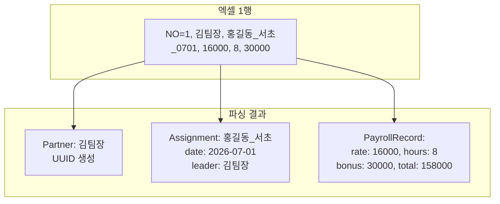
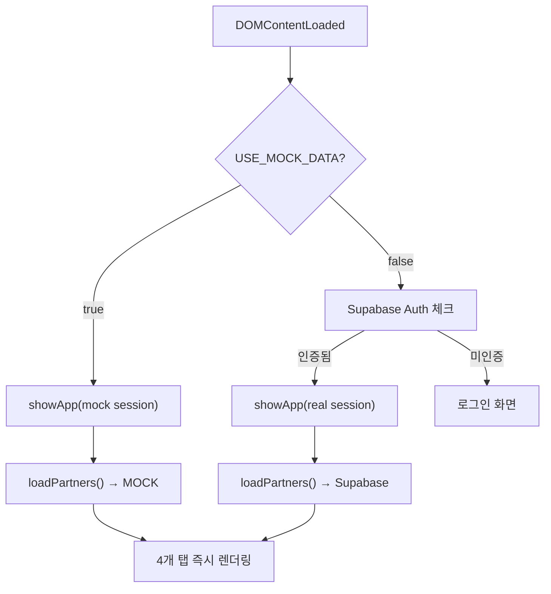
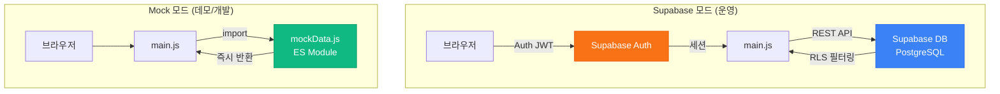
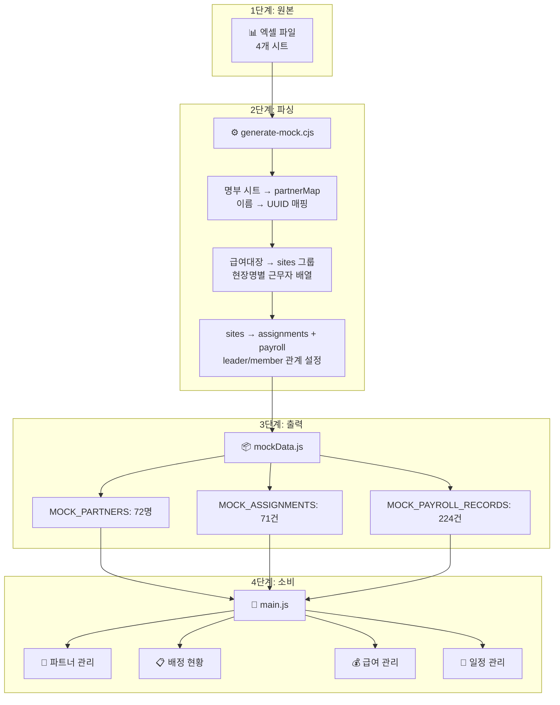
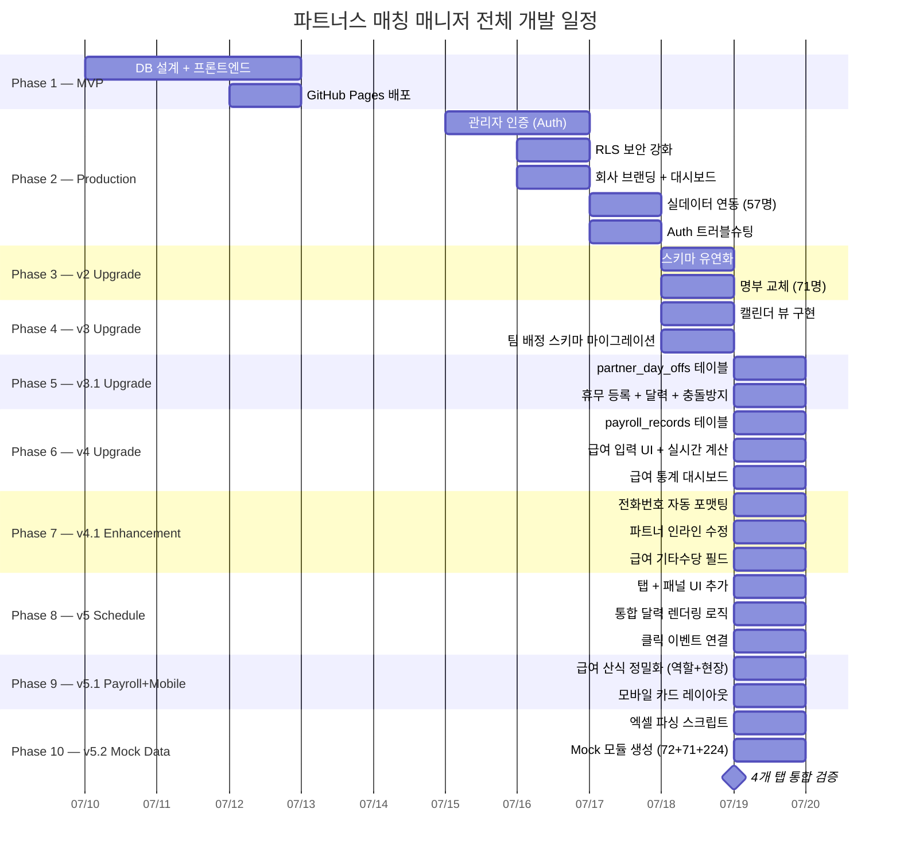

> 🏷️ **[NextX_AX_Solution]** · 주식회사 넥스트엑스(NEXT X) AX 솔루션 운영·유지보수 기록
{: .prompt-tip }

> 이 글은 파트너스 매칭 매니저 시리즈의 **열한 번째 글**입니다.
> 1. [프로토타입 제작기]() — MVP 개발
> 2. [실전 납품 개발기]() — 인증·보안·실데이터
> 3. [Auth 트러블슈팅]() — 로그인 오류 해결
> 4. [v2 업그레이드]() — 명부 교체·스키마 유연화
> 5. [v3 업그레이드]() — 팀 배정 시스템·캘린더 뷰
> 6. [v3.1 업그레이드]() — 휴무일 관리·스케줄 충돌 방지
> 7. [v4 업그레이드]() — 급여 정산 및 관리 시스템
> 8. [v4.1 업그레이드]() — UX 고도화 및 급여 기타수당
> 9. [v5 업그레이드]() — 통합 일정 관리 달력
> 10. [v5.1 업그레이드]() — 급여 산식 정밀화 및 모바일 카드 레이아웃
> 11. **[현재 글] v5.2 업그레이드** — 엑셀 기반 Mock 데이터 파이프라인
{: .prompt-info }

## 📋 업그레이드 배경

### 실데이터로 검증하려면 Supabase가 필요할까?

v5.1까지의 개발 과정에서 모든 데이터는 **Supabase PostgreSQL**에 저장하고 **REST API**로 조회했습니다. 실데이터 검증에는 반드시 Supabase 연결이 필요했고, 이는 몇 가지 제약을 만들었습니다:

| 문제 | 영향 |
|------|------|
| **네트워크 의존** | 오프라인 환경에서 개발·테스트 불가 |
| **인증 필수** | 데모 시연 시 로그인 과정 필요 |
| **데이터 격리** | 테스트 데이터가 운영 DB를 오염시킬 위험 |
| **DNS 이슈** | IPv6 전용 Supabase 호스트에 연결 실패 경험 |

### 핵심 아이디어

실무에서 사용 중인 **7월 프리랜서 일별 급여대장 엑셀**을 그대로 파싱하여, Supabase 없이도 **모든 탭의 데이터를 즉시 로드**할 수 있는 Mock 데이터 모듈을 구축합니다.


---

## 📊 Phase 1 — 엑셀 데이터 분석

### 원본 엑셀 구조

`프리랜서 일별 급여대장 26년 7월.xlsx` 파일에는 4개의 시트가 있습니다:

| 시트 | 내용 | 활용 |
|------|------|------|
| Sheet1 | 월별 요약 | 미사용 |
| Sheet2 | 요약 (별도) | 미사용 |
| **7월 사업소득지급대장** | 일별 근무·급여 내역 (224행) | ✅ 핵심 데이터 |
| **정리수납사 명부** | 등록 프리랜서 목록 (70명+) | ✅ 파트너 목록 |

### 급여대장 시트 컬럼 구조

```
NO | 대상여부 | 성명 | 지급년월일 | 현장명 | 시급 | 근무시간 | 수당 | 은행명 | 계좌번호 | 세전금액 | 공제액 | 차인지급액
```

핵심 파싱 포인트:

- **현장명** — `고객명_지역_MMDD` 형식 (예: `홍길동_서초_0701`)으로 고객·지역·날짜 정보를 인코딩
- **같은 현장** — 같은 현장명에 속한 근무자들이 하나의 **배정(Assignment)** 단위
- **첫 번째 근무자** — 각 현장의 첫 줄이 **팀장(Leader)**, 나머지가 팀원

> 엑셀의 현장명 컨벤션이 곧 데이터 모델입니다. `고객명_지역_MMDD` 하나에서 `client_name`, `client_address`, `assignment_date` 세 필드가 추출됩니다.
{: .prompt-tip }

---

## ⚙️ Phase 2 — 변환기 구현

### Node.js 파싱 스크립트

`generate-mock.cjs` — 엑셀을 읽어 3개의 Mock 데이터 배열을 생성합니다:

```javascript
const XLSX = require('xlsx');
const crypto = require('crypto');

const wb = XLSX.readFile('프리랜서 일별 급여대장 26년 7월.xlsx');

// 1단계: 명부 시트에서 파트너 목록 생성
const roster = XLSX.utils.sheet_to_json(
  wb.Sheets['정리수납사 명부'], { header: 1 }
);
const partnerMap = {};
roster.slice(1).forEach(r => {
  const name = String(r[1]).trim();
  if (name && !partnerMap[name]) {
    partnerMap[name] = {
      id: crypto.randomUUID(),
      name,
      region: '서울/경기',
      specialty: '정리수납',
      is_active: true,
    };
  }
});
```

### 현장명 파싱과 배정 그룹핑

```javascript
// 2단계: 급여대장에서 현장별로 그룹핑
const sites = {};
dataRows.forEach(r => {
  const site = String(r[4]).trim();  // 현장명: "홍길동_서초_0701"
  if (!sites[site]) sites[site] = [];
  sites[site].push({
    name: String(r[2]).trim(),
    date: parseDateFromYYYYMMDD(r[3]),
    rate: Number(r[5]),
    hours: Number(r[6]),
    bonus: Number(r[7]),
    gross: Number(r[10]),
  });
});

// 3단계: 각 현장 → 1개 Assignment + N개 Payroll Record
Object.entries(sites).forEach(([site, workers]) => {
  const { client, address } = parseSite(site);
  const leader = workers[0];  // 첫 번째 = 팀장
  const memberIds = workers.slice(1).map(w => partnerMap[w.name]?.id);

  assignmentsArr.push({
    id: crypto.randomUUID(),
    leader_id: partnerMap[leader.name]?.id,
    member_ids: memberIds,
    client_name: client,
    client_address: address,
    assignment_date: workers[0].date,
    status: '완료',
  });
});
```



### 데이터 매핑 규칙

| 엑셀 필드 | Mock 데이터 필드 | 변환 로직 |
|-----------|-----------------|----------|
| 성명 | `partner.name` | 명부 시트와 매칭, 없으면 신규 추가 |
| 지급년월일 | `assignment_date` | `YYYYMMDD` → `YYYY-MM-DD` |
| 현장명 | `client_name` + `client_address` | `_` 기준 분리 |
| 시급 | `hourly_rate` | 숫자 직접 매핑 |
| 근무시간 | `hours_worked` | 숫자 직접 매핑 |
| 수당 | `bonus` | 역할수당 (팀장수당) |
| 세전금액 | `total_amount` | 총 급여 |

---

## 📦 Phase 3 — Mock 모듈 설계

### 생성된 mockData.js 구조

```javascript
// src/mockData.js — ES Module로 export
export const MOCK_PARTNERS = [
  { id: "uuid-1", name: "파트너A", region: "서울/경기",
    specialty: "정리수납", is_active: true },
  { id: "uuid-2", name: "파트너B", region: "서울/경기",
    specialty: "정리수납", is_active: true },
  // ... 총 72명 (실명 → 익명화)
];

export const MOCK_ASSIGNMENTS = [
  { id: "uuid-a1", leader_id: "uuid-1",
    member_ids: ["uuid-2", "uuid-3", ...],
    client_name: "홍길동", client_address: "서초",
    assignment_date: "2026-07-01", status: "완료" },
  // ... 총 71건
];

export const MOCK_PAYROLL_RECORDS = [
  { id: "uuid-p1", assignment_id: "uuid-a1",
    partner_id: "uuid-1",
    hourly_rate: 16000, hours_worked: 8,
    bonus: 30000, field_bonus: 0,
    total_amount: 158000, work_date: "2026-07-01" },
  // ... 총 224건
];
```

### 데이터 규모

| 항목 | 수량 | 비고 |
|------|:---:|------|
| **파트너 (MOCK_PARTNERS)** | 72명 | 명부 + 급여대장 합산 |
| **배정 (MOCK_ASSIGNMENTS)** | 71건 | 현장명 기준 그룹핑 |
| **급여 (MOCK_PAYROLL_RECORDS)** | 224건 | 7/1~7/17 근무 기록 |
| **총 급여** | ₩26,854,000 | 엑셀 원본과 일치 |
| **투입 인원** | 46명 | 실제 근무한 파트너 수 |

> UUID는 `crypto.randomUUID()`으로 생성하여 Supabase의 UUID 기본키와 동일한 형식을 유지합니다. 이로써 Mock ↔ 실DB 전환 시 코드 변경이 최소화됩니다.
{: .prompt-tip }

---

## 🔌 Phase 4 — Mock 모드 통합

### USE_MOCK_DATA 플래그

`main.js` 상단에서 하나의 플래그로 전체 데이터 소스를 전환합니다:

```javascript
import { MOCK_PARTNERS, MOCK_ASSIGNMENTS, MOCK_PAYROLL_RECORDS }
  from './mockData.js';

const USE_MOCK_DATA = true;  // false → Supabase 원복
```

### 인증 바이패스

Mock 모드에서는 Supabase Auth를 건너뛰고 바로 앱을 표시합니다:

```javascript
document.addEventListener('DOMContentLoaded', async () => {
  setupAuthForms();
  if (USE_MOCK_DATA) {
    // 가상 세션으로 즉시 앱 진입
    showApp({ user: { email: 'mock@kjpartners.co.kr' } });
    return;
  }
  // ... 원래 Supabase Auth 흐름
});
```



### 데이터 로드 함수 분기

각 로드 함수에서 `USE_MOCK_DATA` 플래그로 데이터 소스를 선택합니다:

```javascript
async function loadPartners() {
  if (USE_MOCK_DATA) {
    partners = MOCK_PARTNERS.map(p => ({
      ...p,
      phone: '',
      created_at: '2026-07-01T00:00:00Z',
    }));
  } else {
    const { data } = await supabase.from('partners')
      .select('*').order('created_at');
    partners = data || [];
  }
  renderPartners();
  populateTeamSelect();
  updateDashboard();
}
```

### 배정 데이터의 JOIN 시뮬레이션

Supabase에서는 배정 조회 시 팀장 정보를 **JOIN**으로 가져옵니다. Mock 모드에서는 이를 **메모리 내 lookup**으로 시뮬레이션합니다:

```javascript
async function loadAssignments() {
  if (USE_MOCK_DATA) {
    assignments = MOCK_ASSIGNMENTS.map(a => {
      const leaderP = partners.find(p => p.id === a.leader_id);
      return {
        ...a,
        // Supabase JOIN 결과와 동일한 구조 재현
        leader: leaderP
          ? { name: leaderP.name, region: leaderP.region }
          : null,
      };
    });
  } else {
    const { data } = await supabase.from('assignments')
      .select('*, leader:partners!leader_id(name, region)')
      .order('assignment_date', { ascending: false });
    assignments = data || [];
  }
  renderAssignments();
  updateDashboard();
}
```

> Mock 모드에서도 Supabase JOIN과 **동일한 데이터 구조**(`leader: { name, region }`)를 유지합니다. 렌더링 함수는 데이터 소스를 전혀 의식하지 않습니다.
{: .prompt-tip }

---

## ✅ Phase 5 — 검증 결과

### 4개 탭 데이터 확인

| 탭 | 기대값 | 실측값 | 상태 |
|---|---|---|:---:|
| **파트너 관리** | 72명 | 72명 | ✅ |
| **배정 현황** | 71건 | 71건 | ✅ |
| **급여 관리** | ₩26,854,000 / 224건 / 46명 | 일치 | ✅ |
| **일정 관리** | 7월 캘린더 71건 | 71건 | ✅ |

### 급여 통계 상위 10명 (익명화)

| 파트너 | 근무 건수 | 총 근무시간 | 평균 시급 | 총 급여 |
|--------|:-------:|:---------:|:-------:|------:|
| 파트너 A | 14건 | 109h | ₩16,143 | ₩1,907,000 |
| 파트너 B | 13건 | 99h | ₩15,154 | ₩1,560,000 |
| 파트너 C | 11건 | 81h | ₩15,364 | ₩1,282,000 |
| 파트너 D | 10건 | 76h | ₩15,400 | ₩1,246,000 |
| 파트너 E | 9건 | 74h | ₩15,222 | ₩1,164,000 |
| 파트너 F | 10건 | 71h | ₩15,400 | ₩1,140,000 |
| 파트너 G | 9건 | 67h | ₩15,333 | ₩1,113,000 |
| 파트너 H | 9건 | 69h | ₩15,222 | ₩1,087,000 |
| 파트너 I | 9건 | 67h | ₩15,333 | ₩1,073,000 |
| 파트너 J | 10건 | 60h | ₩16,800 | ₩1,008,000 |

> 실제 시스템에서는 실명으로 표시되지만, 블로그에서는 **개인정보 보호**를 위해 익명화했습니다.
{: .prompt-warning }

---

## 📐 아키텍처 비교

### Supabase 모드 vs Mock 모드



### 전환 비용 비교

| 항목 | Supabase 모드 | Mock 모드 |
|------|:---:|:---:|
| **네트워크** | 필수 | 불필요 |
| **인증** | 이메일/비밀번호 | 자동 바이패스 |
| **초기 로딩** | REST API 4회 호출 | 동기 import |
| **데이터 CRUD** | 실시간 저장 | 메모리 내 (새로고침 시 초기화) |
| **전환 방법** | `USE_MOCK_DATA = false` | `USE_MOCK_DATA = true` |

> Mock 모드에서 데이터를 수정해도 새로고침하면 원본 상태로 복원됩니다. **파괴적 테스트에 안전한 샌드박스**입니다.
{: .prompt-warning }

---

## 🧮 데이터 파이프라인 전체 흐름



---

## 💡 실전에서 배운 것

### 1. 엑셀 컨벤션이 곧 스키마

```
현장명: "홍길동_서초_0701"
         ↓        ↓     ↓
   client_name  addr  date
```

현장 관리자가 만든 엑셀 명명 규칙이 그대로 데이터 모델의 파싱 규칙이 됩니다. **사용자의 기존 습관을 코드가 따라가는 것**이 가장 자연스러운 데이터 설계입니다. 새로운 입력 규칙을 강제하는 대신, 이미 익숙한 형식을 그대로 수용합니다.

### 2. Mock은 "가짜"가 아니라 "격리"

Mock 데이터라고 하면 `"홍길동"`, `"테스트"` 같은 더미 데이터를 떠올리기 쉽습니다. 하지만 이번 접근은 **실제 데이터를 그대로 사용하되, 저장소만 격리**한 것입니다:

| 구분 | 더미 Mock | 실데이터 Mock (이번 접근) |
|------|----------|----------------------|
| 데이터 품질 | 의미 없는 값 | 실제 급여·시간·인원 |
| 테스트 신뢰도 | 기능만 확인 | **비즈니스 로직 검증** |
| 엣지 케이스 | 직접 만들어야 함 | 실데이터에 자연히 포함 |
| 유지보수 | 별도 관리 | 엑셀 업데이트 → 재생성 |

### 3. JOIN 시뮬레이션의 핵심: 동일한 출력 구조

```javascript
// Supabase JOIN 결과
{ ...assignment, leader: { name: "김팀장", region: "서초" } }

// Mock 시뮬레이션 — 동일한 구조
const leaderP = partners.find(p => p.id === a.leader_id);
{ ...a, leader: { name: leaderP.name, region: leaderP.region } }
```

렌더링 함수가 `assignment.leader.name`으로 접근하므로, **데이터 소스에 관계없이 출력 구조만 맞추면** 모든 UI가 정상 동작합니다. 이것이 Mock 모드와 운영 모드 간의 **계약(Contract)**입니다.

### 4. 플래그 하나로 전환하는 설계의 가치

```javascript
const USE_MOCK_DATA = true;   // 데모·개발
const USE_MOCK_DATA = false;  // 운영
```

5개 함수(`loadPartners`, `loadAssignments`, `loadDayOffs`, `loadPayrollRecords`, `DOMContentLoaded`)에 각각 `if (USE_MOCK_DATA)` 분기를 넣었습니다. 전체 코드베이스에서 **단 1줄만 바꾸면** 운영 모드로 전환됩니다. 환경 변수나 빌드 설정이 아닌, 코드 내 상수로 관리하여 **가시성을 최대화**했습니다.

---

## 📈 시리즈 타임라인



---

## 🔗 프로젝트 링크

| 항목 | URL |
|------|-----|
| **라이브 서비스** | [partners-manager-omega.vercel.app](https://partners-manager-omega.vercel.app/) |
| **GitHub 소스코드** | [github.com/200gyu/partners-manager](https://github.com/200gyu/partners-manager) |
| **시리즈 #1** | [프로토타입 제작기]() |
| **시리즈 #2** | [실전 납품 개발기]() |
| **시리즈 #3** | [Auth 트러블슈팅]() |
| **시리즈 #4** | [v2 업그레이드]() |
| **시리즈 #5** | [v3 업그레이드]() |
| **시리즈 #6** | [v3.1 업그레이드]() |
| **시리즈 #7** | [v4 업그레이드]() |
| **시리즈 #8** | [v4.1 업그레이드]() |
| **시리즈 #9** | [v5 업그레이드]() |
| **시리즈 #10** | [v5.1 업그레이드]() |

---

## 🔮 다음 단계

v5.2까지 완료된 시스템의 현재 상태와 앞으로의 계획:

| 기능 | 상태 | 다음 목표 |
|------|:---:|----------|
| 파트너 CRUD + 인라인 수정 | ✅ | 일괄 수정 (복수 파트너) |
| 관리자 인증 + RLS | ✅ | 다중 관리자 권한 분리 |
| 캘린더 뷰 + 통합 일정 | ✅ | 주간 뷰, 일간 상세 뷰 |
| 팀 배정 + 휴무 관리 | ✅ | 정기 휴무 패턴 자동 등록 |
| 급여 정산 (역할+현장수당) | ✅ | PDF/Excel 내보내기 |
| 급여 통계 + 모바일 카드 | ✅ | 분기별·연간 급여 추이 차트 |
| **Mock 데이터 파이프라인** | ✅ | **엑셀 업로드 → 자동 변환 UI** |
| AI 자동 매칭 | 🔜 | 지역·전문성·휴무·과거 이력 기반 추천 |

> v5.2의 핵심 가치는 **"실데이터의 품질 + 격리 환경의 안전성"**을 동시에 확보한 것입니다. 224건의 실제 급여 데이터가 4개 탭에서 즉시 렌더링되므로, Supabase 연결 없이도 **모든 비즈니스 시나리오를 검증**할 수 있습니다. 다음 단계에서는 엑셀 파일을 브라우저에서 직접 업로드하여 자동으로 Mock 데이터를 생성하는 UI를 구현할 예정입니다.
{: .prompt-tip }

---

*NEXT X R&D · AI Transformation*