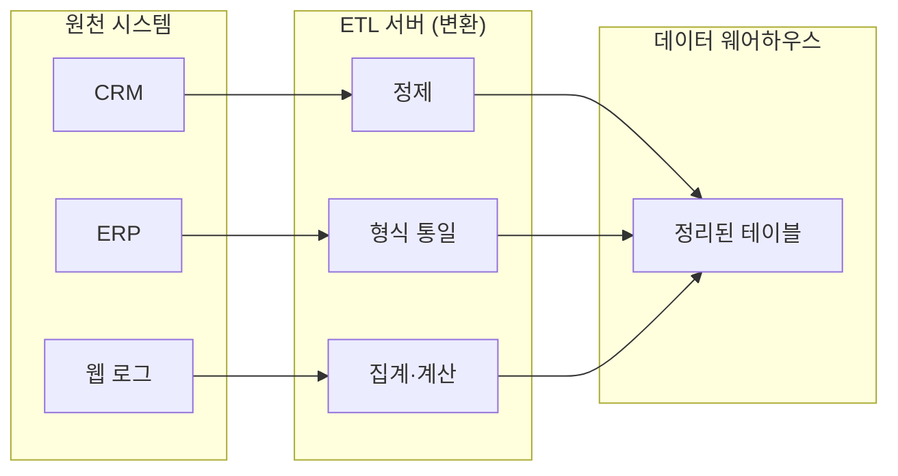
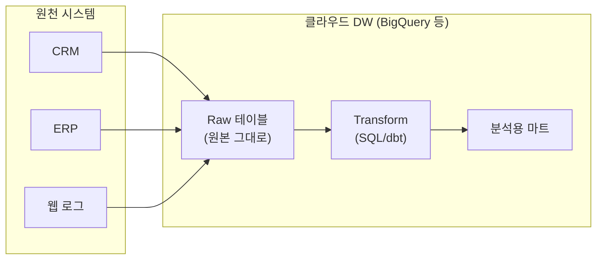
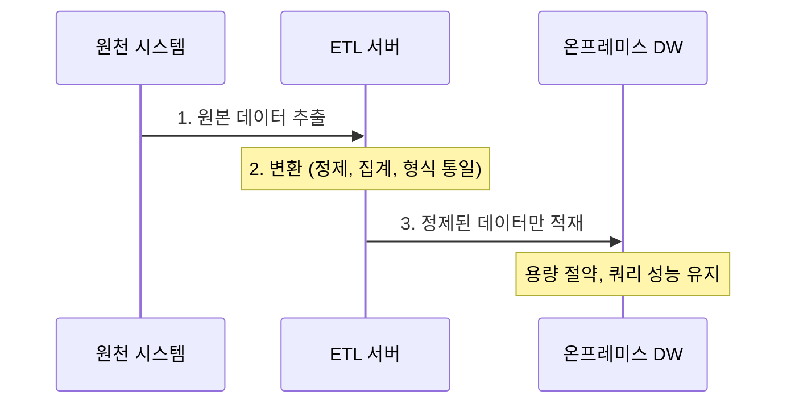
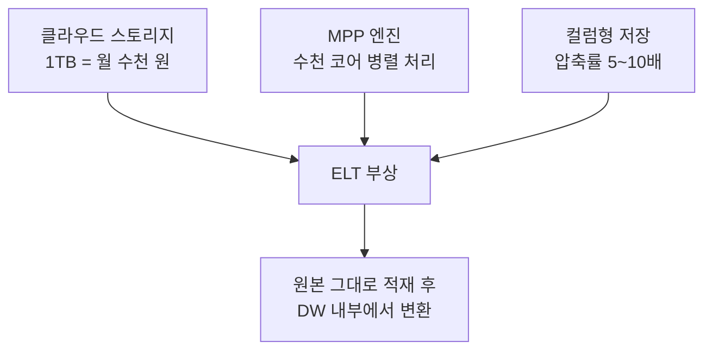
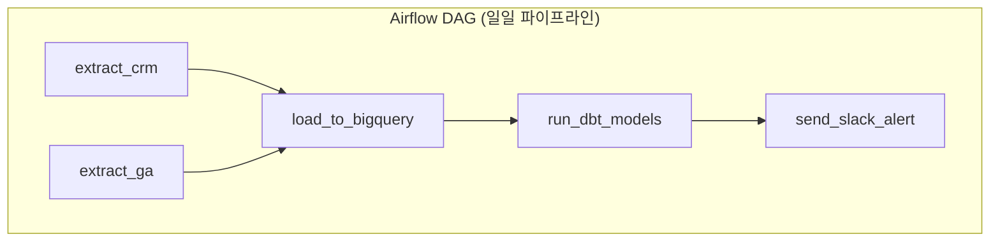
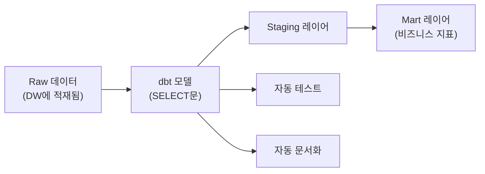
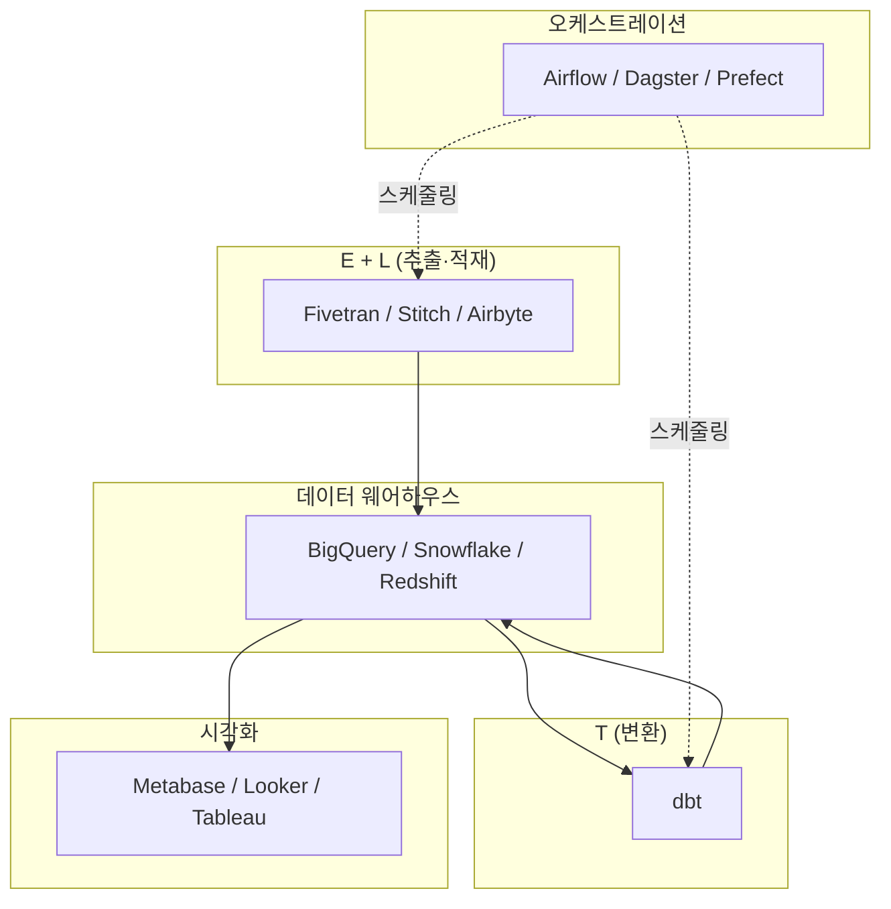
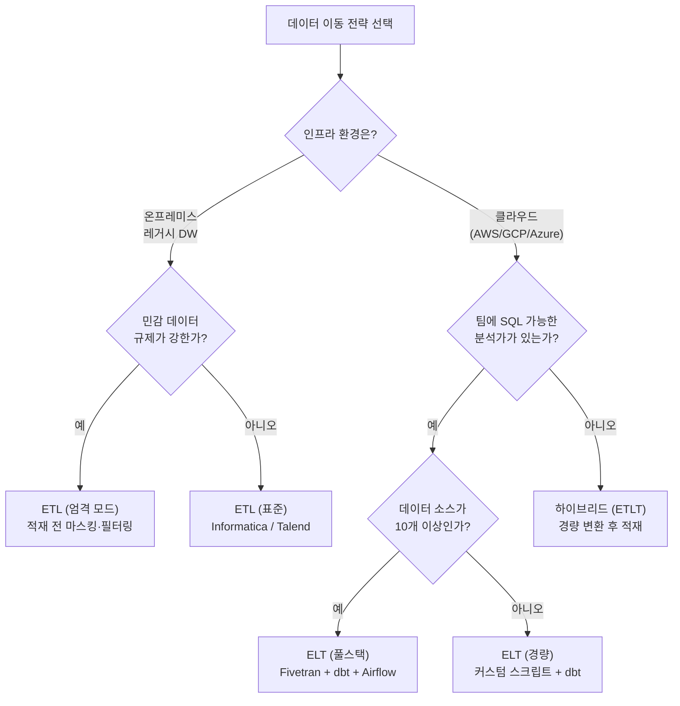
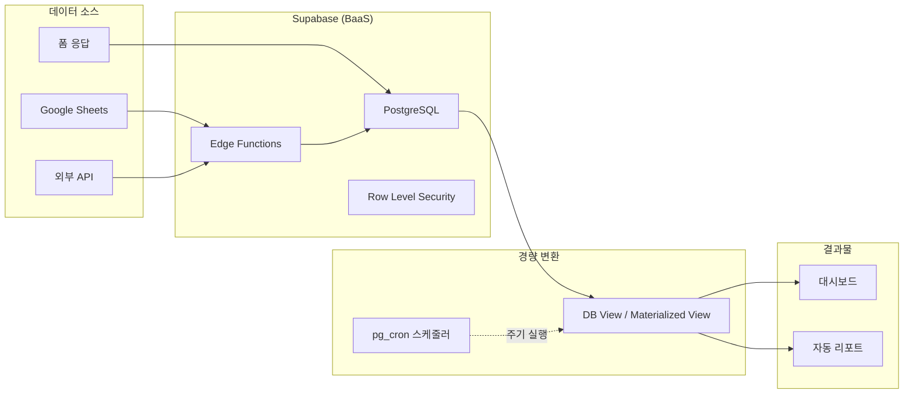
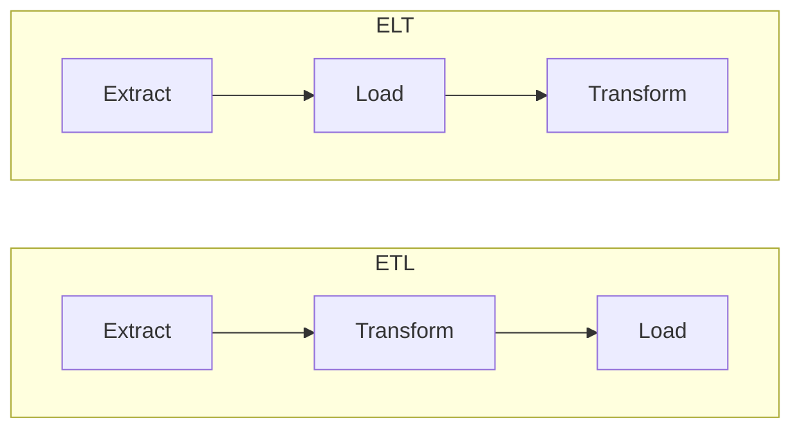

> **[NextX_Data_Solution]** · 주식회사 넥스트엑스(NEXT X) 정식 데이터 솔루션
{: .prompt-tip }

> [데이터 파이프라인이란?]()에서 Extract → Transform → Load라는 세 단계를 소개했습니다. 그런데 최근 클라우드 환경에서는 **순서를 바꿔** Extract → Load → Transform으로 처리하는 흐름이 빠르게 확산되고 있습니다. 왜 순서가 바뀌었을까요? 이 글에서 ETL과 ELT의 차이를 역사부터 실전 도구까지 한 번에 정리합니다.
{: .prompt-info }

---

## 1. ETL이란 — Extract, Transform, Load

### 한 줄 정의

원천 시스템에서 데이터를 **추출(Extract)** 하고, 별도의 서버에서 **변환(Transform)** 한 뒤, 최종 저장소에 **적재(Load)** 하는 방식입니다.

### 택배 공장 비유

ETL은 **택배 분류 센터**와 같습니다.

1. 전국 각지에서 택배가 도착합니다 → **Extract**
2. 분류 센터에서 지역별로 나누고, 라벨을 붙이고, 파손품을 걸러냅니다 → **Transform**
3. 정리가 끝난 택배만 각 지역 배송 창고에 보냅니다 → **Load**

핵심은 **"창고에 넣기 전에 미리 정리한다"** 는 점입니다. 창고에는 이미 깨끗하게 분류된 택배만 들어갑니다.

### ETL의 특징

| 항목 | 설명 |
|------|------|
| 변환 위치 | 별도의 ETL 서버(중간 단계) |
| 저장소 부담 | 낮음 — 정제된 데이터만 적재 |
| 유연성 | 낮음 — 변환 로직을 미리 결정해야 함 |
| 대표 시나리오 | 온프레미스 DW, 제한된 스토리지 환경 |

---

## 2. ELT란 — Extract, Load, Transform

### 한 줄 정의

원천 시스템에서 데이터를 **추출(Extract)** 하고, 변환 없이 **그대로 적재(Load)** 한 뒤, 저장소 내부에서 **변환(Transform)** 하는 방식입니다.

### 대형 창고 비유

ELT는 **코스트코 물류 센터**에 비유할 수 있습니다.

1. 공급업체에서 물건이 팔레트 단위로 도착합니다 → **Extract**
2. 일단 창고에 전부 넣습니다 → **Load**
3. 필요할 때 직원이 창고 안에서 소분하고, 진열대에 정리합니다 → **Transform**

핵심은 **"일단 다 넣고, 필요할 때 정리한다"** 는 점입니다. 창고가 넓고 인력(연산력)이 충분하니까 가능한 전략입니다.

### ELT의 특징

| 항목 | 설명 |
|------|------|
| 변환 위치 | 저장소 내부 (DW의 연산력 활용) |
| 저장소 부담 | 높음 — 원본 데이터를 그대로 보관 |
| 유연성 | 높음 — 나중에 변환 로직을 바꿀 수 있음 |
| 대표 시나리오 | 클라우드 DW(BigQuery, Snowflake, Redshift) |

---

## 3. 왜 ETL이 먼저 나왔나 — 온프레미스 시대의 필연

### 1990~2000년대: 스토리지는 비싸고, 연산력은 제한적

ETL이 표준이 된 데에는 당시의 기술적 제약이 있었습니다.

| 제약 | 결과 |
|------|------|
| 디스크 1GB당 수만 원 | 원본을 그대로 저장할 여유가 없음 → 미리 정제해서 용량을 줄임 |
| DW 서버 1대 고정 | DW의 CPU로 변환까지 처리하면 쿼리 성능 저하 → 변환은 별도 서버에서 |
| 네트워크 속도 느림 | 대용량 원본 전송이 부담 → 변환 후 압축된 결과만 전송 |

### Informatica, Talend, SSIS의 시대

이 시기에 ETL 전문 도구들이 등장했습니다.

| 도구 | 특징 |
|------|------|
| **Informatica PowerCenter** | 엔터프라이즈 ETL의 대명사, GUI 기반 매핑 |
| **Talend** | 오픈소스 ETL, 자바 기반 |
| **SSIS** | Microsoft SQL Server 통합 서비스 |
| **DataStage** | IBM의 대규모 ETL 솔루션 |

> 이 시기의 ETL은 **"아껴 써야 하는 자원에 맞춘 최적화 전략"** 이었습니다. 한정된 스토리지와 연산력이라는 제약 아래서의 합리적 선택이었죠.
{: .prompt-info }

---

## 4. 왜 ELT가 뜨는가 — 클라우드의 무한 연산력

### 2010년대 후반: 게임 체인저 세 가지

| 변화 | ETL 시대 | ELT 시대 |
|------|---------|---------|
| 스토리지 비용 | 1GB = 수만 원 | 1GB = 수십 원 |
| 연산 방식 | 단일 서버 | MPP(Massively Parallel Processing) |
| 확장 | 서버 증설(수 주) | 버튼 하나로 스케일업(수 분) |
| 저장 형식 | 행(Row) 기반 | 열(Column) 기반 — 분석 쿼리에 최적 |

### 클라우드 DW의 핵심 특성

**BigQuery, Snowflake, Redshift** 같은 클라우드 데이터 웨어하우스는 근본적으로 다른 아키텍처를 가집니다.

- **스토리지와 컴퓨팅 분리**: 저장은 저렴하게, 연산은 필요할 때만 과금
- **탄력적 확장**: 복잡한 변환이 필요하면 일시적으로 클러스터를 키우고, 끝나면 줄임
- **SQL 기반 변환**: 별도 ETL 서버 없이 SQL만으로 변환 가능

> "스토리지가 싸니까 일단 다 넣고, 연산력이 넘치니까 안에서 변환한다." — 이것이 ELT의 논리입니다.
{: .prompt-tip }

### ELT가 가져온 실무적 변화

| 관점 | ETL 방식 | ELT 방식 |
|------|---------|---------|
| 데이터 분석가의 자율성 | 변환 로직 변경 시 ETL 개발자에게 요청 | SQL로 직접 변환 로직 작성 |
| 원본 데이터 보존 | 변환 후 원본 삭제되는 경우 많음 | 원본이 항상 남아 있어 **재처리 가능** |
| 스키마 변경 대응 | ETL 파이프라인 전체 수정 필요 | 변환 SQL만 수정하면 됨 |
| 새로운 지표 추가 | 소스부터 다시 추출해야 할 수 있음 | 이미 적재된 원본에서 바로 계산 |

---

## 5. ETL vs ELT 상세 비교표

아래 표는 두 방식의 차이를 항목별로 정리한 것입니다.

| 비교 항목 | ETL | ELT |
|----------|-----|-----|
| **처리 순서** | Extract → Transform → Load | Extract → Load → Transform |
| **변환 위치** | 별도 ETL 서버 | 대상 저장소(DW) 내부 |
| **원본 보존** | 변환 후 원본 폐기 가능 | 원본 그대로 보존 |
| **스토리지 요구량** | 적음 (정제 후 적재) | 많음 (원본 + 변환 결과) |
| **연산 비용** | ETL 서버 비용 | DW 쿼리 비용 (종량제) |
| **초기 구축 복잡도** | 높음 (변환 로직 선설계) | 낮음 (일단 적재) |
| **유연성** | 낮음 | 높음 |
| **적합한 환경** | 온프레미스, 레거시 | 클라우드, 모던 스택 |
| **데이터 거버넌스** | 적재 전 정제로 품질 보장 | 적재 후 레이어링으로 품질 관리 |
| **실시간 처리** | 배치 중심 (스트리밍은 별도) | 배치 + 마이크로배치 확장 용이 |
| **대표 도구** | Informatica, Talend, SSIS | dbt, Fivetran + BigQuery |
| **팀 구조** | ETL 전문 개발자 필요 | 분석가(Analytics Engineer) 중심 |
| **디버깅** | 변환 서버 로그 확인 | DW 내부 SQL 실행 이력 확인 |
| **규제 대응** | 민감 데이터 적재 전 마스킹 가능 | 적재 후 뷰 레벨에서 접근 제어 |

> 한 가지 방식이 절대적으로 우월한 것이 아닙니다. **인프라 환경, 팀 역량, 규제 요건**에 따라 최적의 선택이 달라집니다.
{: .prompt-warning }

---

## 6. 하이브리드 접근 — ETLT

현실에서는 순수 ETL이나 순수 ELT만 쓰는 경우보다, **두 방식을 결합**하는 경우가 많습니다.

| 단계 | 하는 일 | 이유 |
|------|--------|------|
| 적재 전 경량 변환 (T1) | 개인정보 마스킹, 날짜 포맷 통일, 인코딩 변환 | 규제 준수, 기본 품질 보장 |
| 적재 후 본격 변환 (T2) | 비즈니스 로직 적용, 집계, 조인, 파생 지표 계산 | DW의 연산력 활용, 유연한 분석 |

> 실무에서 "우리는 ELT를 씁니다"라고 말하는 팀도, 민감 데이터 마스킹 같은 **적재 전 변환**은 거의 항상 수행합니다. 순수한 ELT는 이론에 가깝습니다.
{: .prompt-info }

---

## 7. 실전 도구 가이드

### 7-1. Apache Airflow — 오케스트레이션의 표준

Airflow는 ETL/ELT **워크플로를 스케줄링하고 관리**하는 도구입니다. 변환 자체를 하는 것이 아니라, **"언제, 어떤 순서로 실행할지"** 를 제어합니다.

| 항목 | 내용 |
|------|------|
| 역할 | 워크플로 스케줄링, 의존관계 관리, 실패 재시도 |
| 핵심 개념 | DAG(방향 비순환 그래프), Task, Operator |
| 언어 | Python으로 DAG 정의 |
| 관리형 서비스 | Google Cloud Composer, Amazon MWAA, Astronomer |
| 적합한 팀 | Python 가능한 데이터 엔지니어가 있는 조직 |

### 7-2. dbt (Data Build Tool) — SQL 기반 변환의 혁명

dbt는 ELT에서 **T(Transform)** 를 담당합니다. SQL만으로 변환 로직을 작성하고, 버전 관리, 테스트, 문서화까지 가능하게 합니다.

| 항목 | 내용 |
|------|------|
| 역할 | DW 내부에서 SQL 기반 변환 |
| 핵심 철학 | "Analytics as Code" — 변환 로직도 Git으로 관리 |
| 지원 DW | BigQuery, Snowflake, Redshift, Databricks, PostgreSQL |
| 종류 | dbt Core(오픈소스, CLI) / dbt Cloud(관리형 SaaS) |
| 적합한 팀 | SQL을 잘 아는 분석가·Analytics Engineer |

> dbt의 등장이 **ELT 패러다임의 실질적인 촉매**가 되었습니다. "변환을 SQL로 하고, Git으로 관리하고, CI/CD를 돌린다"는 개발자 문화를 분석 영역에 도입한 것입니다.
{: .prompt-tip }

### 7-3. Fivetran — 추출과 적재의 자동화

Fivetran은 ELT에서 **E(Extract)** 와 **L(Load)** 를 자동화합니다. 수백 개의 소스 커넥터를 제공하며, 코드를 한 줄도 쓰지 않고 데이터를 DW에 적재할 수 있습니다.

| 항목 | 내용 |
|------|------|
| 역할 | 소스 → DW 자동 적재 (E+L) |
| 커넥터 수 | 300개 이상 (Salesforce, GA, Stripe, MySQL 등) |
| 핵심 장점 | 스키마 변경 자동 감지, 증분(incremental) 동기화 |
| 대안 도구 | Stitch Data, Airbyte(오픈소스), Hevo Data |
| 적합한 팀 | 엔지니어 없이 빠르게 데이터 통합이 필요한 조직 |

### 7-4. Stitch Data — 경량 대안

| 항목 | 내용 |
|------|------|
| 역할 | Fivetran과 유사한 E+L 자동화 |
| 가격 | 상대적으로 저렴 (행 수 기반 과금) |
| 특징 | Singer 프로토콜 기반, 커뮤니티 커넥터 풍부 |
| 제한 | 변환 기능 없음 — dbt와 결합 필요 |

### 도구 조합 맵

> 모던 데이터 스택(Modern Data Stack)의 핵심은 **각 레이어를 독립된 도구로 분리**하는 것입니다. 하나의 무거운 ETL 도구가 모든 것을 처리하던 시대에서, 각자 잘하는 것에 집중하는 **조합형 아키텍처**로 전환되고 있습니다.
{: .prompt-info }

---

## 8. 언제 뭘 써야 하는가 — 의사결정 플로우차트

아래 플로우차트로 우리 조직에 맞는 전략을 판단해 보세요.

### 시나리오별 추천 요약

| 시나리오 | 추천 전략 | 이유 |
|---------|----------|------|
| 온프레미스 Oracle DW, 10년된 파이프라인 | ETL 유지 | 마이그레이션 리스크 > 전환 이점 |
| 스타트업, BigQuery 시작 | ELT (경량) | 초기 비용 최소화, 빠른 실험 |
| 중견기업, 다수 SaaS 연동 | ELT (풀스택) | Fivetran으로 커넥터 관리, dbt로 변환 표준화 |
| 의료·금융, 개인정보 다량 | 하이브리드 (ETLT) | 적재 전 마스킹 필수, 적재 후 분석 유연성 확보 |
| 실시간 이벤트 처리 | 스트리밍 + ELT | Kafka/Pub-Sub로 수집, DW에서 배치 변환 |

---

## 9. 넥스트엑스의 접근법 — BaaS + 경량 파이프라인

주식회사 넥스트엑스는 중소·1인 기업 고객을 위한 데이터 솔루션에서 다음과 같은 원칙을 적용합니다.

### 원칙: 무겁게 짓지 않는다

대기업형 풀스택 ELT를 그대로 도입하면, 소규모 조직에는 **과잉 설계**가 됩니다. 넥스트엑스는 **BaaS(Backend as a Service) 기반 경량 파이프라인**을 지향합니다.

### 왜 이 구조인가

| 설계 원칙 | 구현 방법 | 이유 |
|----------|----------|------|
| 별도 ETL 서버 없음 | Supabase Edge Functions로 추출·적재 | 인프라 관리 부담 제거 |
| SQL 기반 변환 | PostgreSQL View + Materialized View | 분석가가 직접 수정 가능 |
| 스케줄링 최소화 | pg_cron 또는 Supabase Webhooks | Airflow 없이 간단한 배치 처리 |
| 보안 내장 | Row Level Security (RLS) | 적재 전 마스킹 대신, DB 레벨 접근 제어 |

> [DB와 DBA]()에서 다룬 PostgreSQL의 **View, 인덱스, RLS**가 이 경량 파이프라인의 핵심 기반이 됩니다.
{: .prompt-info }

### 규모에 따른 확장 경로

조직이 성장하면 파이프라인도 함께 성장해야 합니다. 넥스트엑스는 단계별 확장 경로를 다음과 같이 설계합니다.

| 단계 | 데이터 규모 | 아키텍처 | 도구 |
|------|-----------|---------|------|
| 1단계 | 수천~수만 행 | BaaS 경량 ELT | Supabase + View |
| 2단계 | 수십만 행, 소스 5개+ | ELT 표준화 | Supabase + dbt Core |
| 3단계 | 수백만 행, 소스 10개+ | 모던 데이터 스택 | BigQuery + Fivetran + dbt + Airflow |

> 처음부터 3단계를 구축하면 비용과 복잡도가 과도합니다. **"지금 필요한 만큼만 짓고, 성장에 맞춰 확장한다"** 가 핵심입니다.
{: .prompt-warning }

---

## 10. 정리 — 핵심 비교 한눈에

| 키워드 | 핵심 요약 |
|--------|----------|
| **ETL** | 추출 → 변환 → 적재. 온프레미스 시대의 표준. 저장소 부담을 줄이기 위해 미리 정제 |
| **ELT** | 추출 → 적재 → 변환. 클라우드 시대의 대세. DW의 연산력으로 내부 변환 |
| **ETLT** | 적재 전 경량 변환 + 적재 후 본격 변환. 현실에서 가장 흔한 하이브리드 |
| **Airflow** | 워크플로 오케스트레이션. "언제, 어떤 순서로" 실행할지 제어 |
| **dbt** | SQL 기반 변환 도구. ELT의 T를 코드로 관리 |
| **Fivetran** | E+L 자동화. 300개+ 커넥터로 코드 없이 적재 |
| **BaaS 경량 ELT** | 소규모 조직을 위한 넥스트엑스 접근법. Supabase + View |

---

## 함께 보기

- [데이터 파이프라인이란?]() — ETL/ELT의 기반 개념
- [DB와 DBA]() — PostgreSQL, 인덱스, View의 기초
- [데이터 웨어하우스 vs 데이터 레이크]() — ETL/ELT의 목적지가 되는 저장소 비교

---

*NEXT X R&D · Data Engineering*
