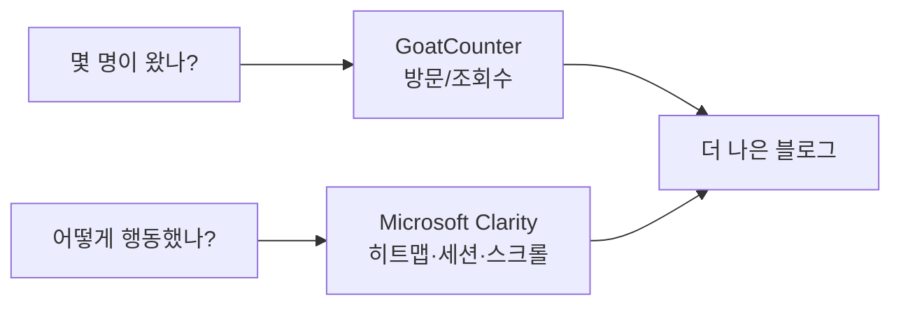

> "측정할 수 없으면 개선할 수 없다." 이 블로그([code209.kr]())에 방문자 통계를 붙인 **실제 과정**을 그대로 공개합니다. 1단계는 가벼운 **GoatCounter**, 2단계는 행동 분석 **Microsoft Clarity**. 왜 두 개를 썼는지, 어떻게 붙였는지까지.
{: .prompt-info }

## 🧭 왜 굳이 두 개를?

한 도구가 모든 걸 해주지 않습니다. **질문이 다르면 도구도 다릅니다.**

- "**몇 명이** 왔나?" → 가볍고 프라이버시 친화적인 **GoatCounter**
- "글을 **끝까지 읽었나**, 어디서 이탈했나, 뭘 눌렀나?" → 행동 분석 **Microsoft Clarity**



## 1️⃣ 1단계 — GoatCounter (가볍게, 프라이버시 우선)

가장 먼저 붙인 건 [GoatCounter](https://www.goatcounter.com)입니다.

**왜 골랐나**
- **무료 · 초경량** (스크립트가 매우 가벼워 페이지 속도 영향 최소)
- **개인정보 친화적** — 쿠키 없이 익명 집계. 기업 블로그의 첫 통계로 부담이 적음
- Chirpy 테마가 **기본 지원**

**설치 (Chirpy 기준)** — GoatCounter에서 사이트 코드를 만든 뒤, `_config.yml` 한 줄이면 끝입니다.

```yaml
analytics:
  goatcounter:
    id: "209"   # 209.goatcounter.com 의 'code' 값
pageviews:
  provider: goatcounter   # 글마다 조회수 표시
```

**무엇을 알 수 있나 / 한계**
- ✅ 일자별 방문/페이지뷰, 인기 글, 유입 경로(대략), 국가
- ⚠️ **체류 시간·스크롤·클릭은 모름** — "몇 명"까진 알아도 "어떻게 행동했나"는 알 수 없습니다.

## 2️⃣ 2단계 — Microsoft Clarity (깊게 관찰)

방문자의 **행동**이 궁금해지면서 [Microsoft Clarity](https://clarity.microsoft.com)를 추가했습니다.

**왜 골랐나 (vs GA4)**
- **무료 · 무제한**, 세팅이 쉬움
- **히트맵 · 세션 녹화 · 스크롤 깊이 · 클릭**을 그대로 보여줌 → "정독률" 같은 질문에 직답
- GA4는 *유입 경로·전환 퍼널* 분석엔 강하지만, "끝까지 읽었나"엔 Clarity가 더 적합

**설치 (Chirpy에 없는 provider 붙이기)** — Clarity는 Chirpy 기본 목록엔 없습니다. 하지만 Chirpy 7.x의 애널리틱스 로더는 `_config.yml`의 `analytics:` 아래 **모든 provider를 순회하며 `_includes/analytics/{이름}.html`을 자동 include**하는 구조라, 이 점을 이용하면 깔끔합니다.

**① `_config.yml`에 provider 추가**

```yaml
analytics:
  goatcounter:
    id: "209"
  clarity:
    id: "발급받은-Clarity-프로젝트-ID"
```

**② `_includes/analytics/clarity.html` 생성** (Chirpy가 `id`가 채워지면 프로덕션 빌드에서 자동 로드)

```html
<script type="text/javascript">
  (function(c,l,a,r,i,t,y){
    c[a]=c[a]||function(){(c[a].q=c[a].q||[]).push(arguments)};
    t=l.createElement(r);t.async=1;t.src="https://www.clarity.ms/tag/"+i;
    y=l.getElementsByTagName(r)[0];y.parentNode.insertBefore(t,y);
  })(window, document, "clarity", "script", "{{ site.analytics.clarity.id }}");
</script>
```

> 💡 **핵심 트릭**: Chirpy 소스를 뜯어고치지 않고, 로더가 이미 도는 규칙(`analytics/{provider}.html`)에 **파일 하나만 얹어** 네이티브처럼 연동했습니다. GoatCounter와 100% 동일한 방식으로 켜지고 꺼집니다.
{: .prompt-tip }

## 📊 세 도구 한눈 비교

| | GoatCounter | Microsoft Clarity | Google GA4 |
|---|---|---|---|
| 잘하는 것 | 방문/조회수(가볍게) | **히트맵·세션·스크롤·클릭** | 유입 경로·전환 퍼널 |
| 비용 | 무료 | 무료·무제한 | 무료(복잡) |
| 프라이버시 | ◎ 쿠키리스 | △ 세션 추적 | △ 쿠키 |
| 이럴 때 | 첫 통계·공개 조회수 | "정독률·이탈 지점" | 마케팅 유입 분석 |

## 🕳️ 도입하며 배운 것 (함정)

- **작은 트래픽에선 히트맵이 노이즈** — 행동 분석은 방문자가 **수백 명은 넘어야** 의미가 보입니다. 도구는 미리 붙여 데이터를 쌓되, 해석은 나중에.
- **프라이버시 성격이 다름** — 쿠키리스 GoatCounter와 달리 세션 추적 도구는 방문자 고지 등 **운영 정책을 함께 검토**해야 합니다.
- **큰 개편 후엔 재색인 요청** — 구글 서치콘솔 `URL 검사 → 색인 생성 요청`으로 재방문을 앞당깁니다.
- **둘 다 켜도 됨** — GoatCounter(가벼운 공개 지표) + Clarity(행동 관찰)를 **병행**하는 게 현실적인 조합이었습니다.

## 🔗 이어보기

- 🛠️ 이 블로그를 만든 과정 → [코드 없이 기업 블로그 배포하기]() · [커스텀 도메인·HTTPS]()
- 🏢 왜 이렇게까지 하나 → 넥스트엑스의 [일하는 방식]()은 "측정 → 개선"입니다.

## 📩 우리 서비스도 이렇게 측정하고 싶다면

방문자·사용자 행동을 데이터로 보고 싶은데 어디서부터일지 막막하다면, 진단부터 도와드립니다.
→ [Business Inquiry]() · [csnextx@gmail.com](mailto:csnextx@gmail.com)


---

> 📎 본 글은 **주식회사 넥스트엑스(NEXT X) 기술연구소**의 R&D 자산입니다.
> **함께 읽기** — [🛠️ 개발 대표 사례]() · [📖 블로그 안내]() · [📩 비즈니스 문의]()
{: .prompt-info }
