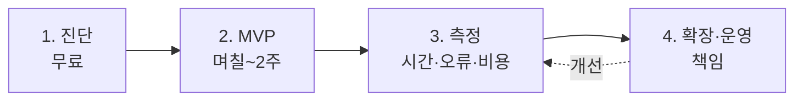

> "AI 자동화, 어디에 맡기지?" — 대형 SI는 비싸고 느리고, 프리랜서는 불안하고. 넥스트엑스는 **그 사이의 빈자리**를 채웁니다. **실무를 아는 소수 정예**가, **경영자의 언어**로, **끝까지** 함께합니다.
{: .prompt-info }

## 🆚 무엇이 다른가

| | 대형 SI | 프리랜서 | **넥스트엑스** |
|---|:---:|:---:|:---:|
| 비용 | 매우 높음 | 낮음 | **합리적 (작게 시작)** |
| 속도 | 느림(수개월) | 들쭉날쭉 | **빠름 (며칠~2주 MVP)** |
| 경영 관점 | 약함 | 거의 없음 | **강함 (대표가 직접 리드)** |
| 책임·운영 | 계약 종료 후 단절 | 잠수 리스크 | **운영까지 책임** |
| 소통 | 담당자 여러 단계 | 1:1 | **의사결정자와 직접** |

> 우리의 강점은 **"실제로 회사를 운영하며 검증한"** 관점입니다. 기술만 아는 게 아니라, [그 기술이 매출·비용에 어떻게 닿는지]()를 압니다.
{: .prompt-tip }

## 🔄 일하는 4단계 — 작게, 빠르게, 확실하게

모든 프로젝트를 관통하는 원칙은 하나입니다. **"큰 계획"이 아니라 "작은 증명"에서 시작합니다.**

| 단계 | 하는 일 | 고객이 얻는 것 |
|------|---------|----------------|
| **1. 진단 (무료)** | 반복 업무를 분해해 "자동화 OK / 아직"을 가림 | 냉정한 진단서 (안 되는 건 안 된다고) |
| **2. MVP** | 가장 아픈 업무 1건을 빠르게 시제품화 | **눈으로 보이는** 첫 결과물 |
| **3. 측정** | 시간·오류·비용 절감을 숫자로 확인 | 투자 대비 효과(ROI) 근거 |
| **4. 확장·운영** | 예약 실행·예외 처리·모니터링 | 계속 굴러가는 시스템 + 책임 |

이 방식은 [AX]()·[자동화]()·[데이터]() 어느 영역에나 동일하게 적용됩니다.

## 💰 비용이 걱정된다면

- **진단은 무료**입니다. 부담 없이 "이거 되나요?"부터 물어보세요.
- 대부분 **월 몇만 원대 AI 비용 + 1건 구축비**로 시작합니다. ([FAQ]())
- **작게 검증 → 효과 확인 후 확장**이라, 큰돈을 미리 태우지 않습니다.

## 🛡️ "만들고 끝"이 아닙니다

가장 많이 겪는 실망은 *"만들어는 줬는데 얼마 못 가 멈췄다"* 입니다. 넥스트엑스는 [자동화가 실패하는 이유]()를 알기에, **운영·모니터링·유지보수**를 처음부터 설계에 넣습니다.

## 👥 누가 하나

소규모 **정예 팀**이 문제 정의부터 운영까지 직접 만들고 책임집니다. 리더십과 이력은 → [비즈니스 문의 안내]()에 투명하게 공개돼 있습니다.

## 📩 첫걸음은 "무료 진단"

무엇을 자동화할지 몰라도 괜찮습니다. **가장 귀찮은 반복 업무 1건**만 알려주시면, 되는지 안 되는지부터 정직하게 말씀드립니다.

→ [Business Inquiry]() · [csnextx@gmail.com](mailto:csnextx@gmail.com) · ☎ 010-4125-2009

> **주식회사 넥스트엑스(NEXT X)** — 작게 시작해, 끝까지 함께합니다.
> 우리의 철학이 궁금하다면 → [우리는 왜 NEXT X인가]()
{: .prompt-tip }

---

> 📎 본 글은 **주식회사 넥스트엑스(NEXT X) 기술연구소**의 R&D 자산입니다.
> **함께 읽기** — [🏢 대표 사례 & 기술 스택]() · [📖 블로그 안내]() · [📩 비즈니스 문의]()
{: .prompt-info }
