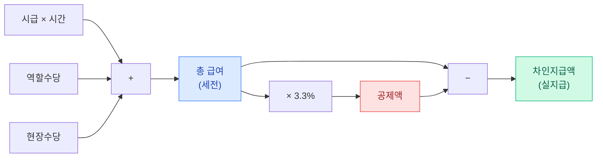
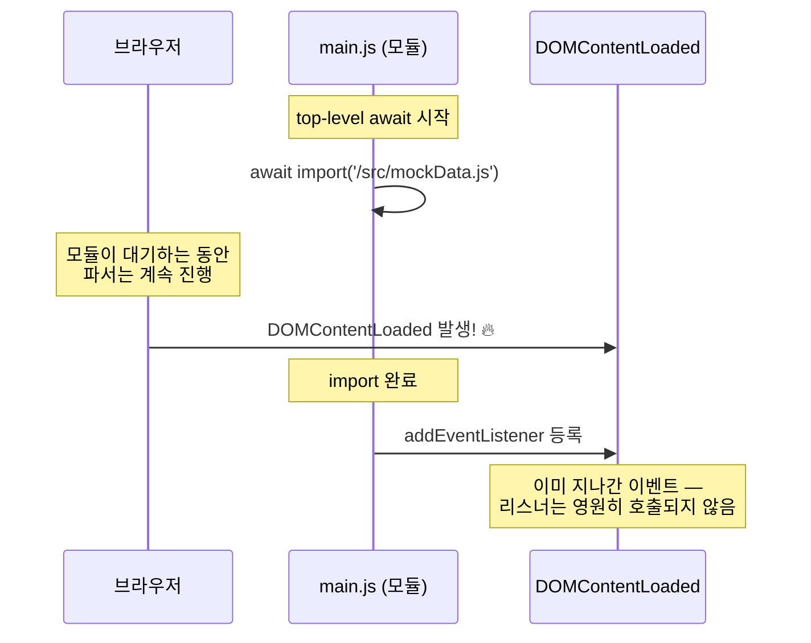
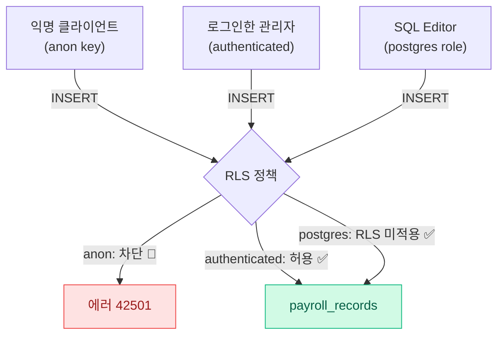
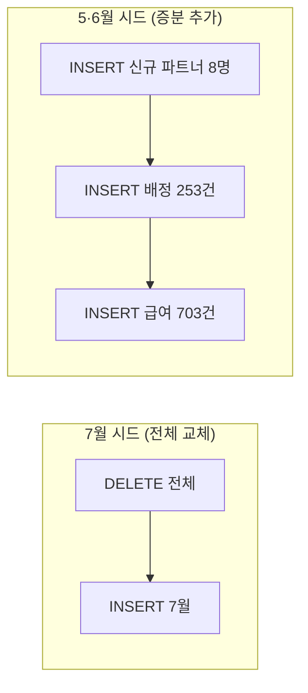
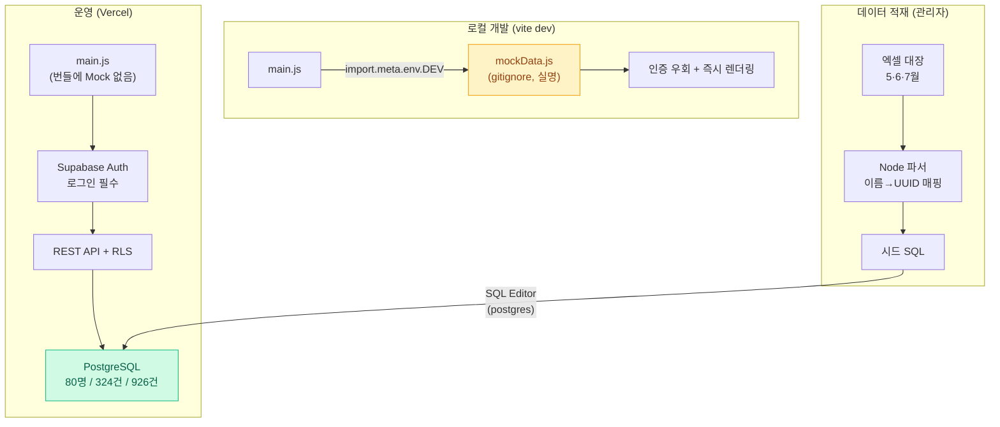
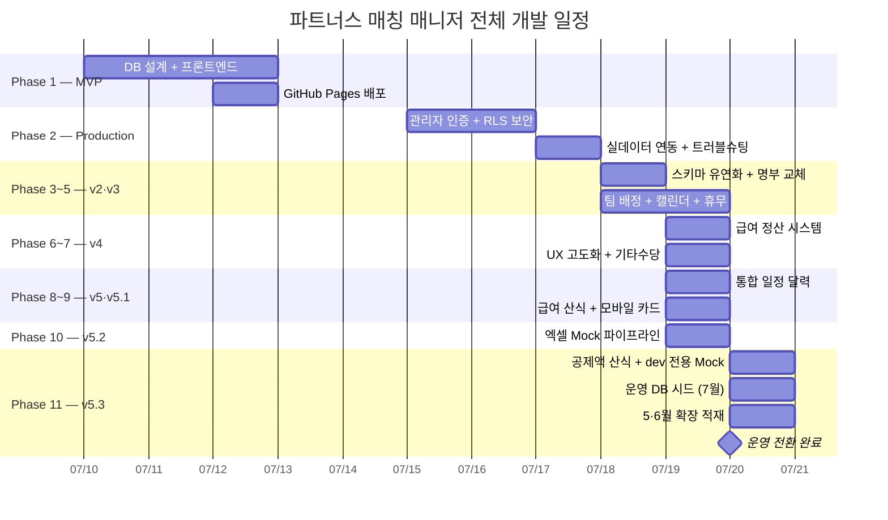

> 🏷️ **[NextX_AX_Solution]** · 주식회사 넥스트엑스(NEXT X) AX 솔루션 운영·유지보수 기록
{: .prompt-tip }

> 이 글은 파트너스 매칭 매니저 시리즈의 **열두 번째 글**입니다.
> 1. [프로토타입 제작기]() — MVP 개발
> 2. [실전 납품 개발기]() — 인증·보안·실데이터
> 3. [Auth 트러블슈팅]() — 로그인 오류 해결
> 4. [v2 업그레이드]() — 명부 교체·스키마 유연화
> 5. [v3 업그레이드]() — 팀 배정 시스템·캘린더 뷰
> 6. [v3.1 업그레이드]() — 휴무일 관리·스케줄 충돌 방지
> 7. [v4 업그레이드]() — 급여 정산 및 관리 시스템
> 8. [v4.1 업그레이드]() — UX 고도화 및 급여 기타수당
> 9. [v5 업그레이드]() — 통합 일정 관리 달력
> 10. [v5.1 업그레이드]() — 급여 산식 정밀화 및 모바일 카드 레이아웃
> 11. [v5.2 업그레이드]() — 엑셀 기반 Mock 데이터 파이프라인
> 12. **[현재 글] v5.3 업그레이드** — 운영 데이터 전환 및 공제액 산식
{: .prompt-info }

## 📋 업그레이드 배경

### Mock으로 검증했으면, 이제 운영으로

[v5.2]()에서 엑셀 급여대장을 Mock 데이터로 변환해 전체 기능을 검증했습니다. 검증이 끝났으니 다음 단계는 명확합니다 — **실제 운영 데이터베이스에 실데이터를 넣는 것**.

하지만 "Mock을 운영으로 바꾼다"는 것은 플래그 하나 바꾸는 일이 아니었습니다:

| 과제 | 왜 문제인가 |
|------|-----------|
| **개인정보 격리** | Mock 파일에는 실명이 포함 — 공개 저장소·번들에 실리면 안 됨 |
| **인증 우회 제거** | Mock 모드는 로그인을 건너뜀 — 운영에 켜지면 데이터가 무방비 노출 |
| **공제액 산식 부재** | 3.3% 사업소득세 공제·차인지급액이 UI에 없었음 |
| **DB 접근 경로** | 직접 PostgreSQL 연결이 IPv6 전용이라 불가능한 환경 |
| **누적 데이터** | 7월뿐 아니라 5월·6월 대장도 적재 필요 |

이번 글은 이 다섯 가지를 모두 해결한 기록입니다.

---

## 🧮 Phase 1 — 공제액(3.3%)·차인지급액 산식

### 프리랜서 정산의 완성형

사업소득자(프리랜서) 급여는 **원천징수 3.3%**를 공제한 금액이 실제 지급됩니다. 엑셀 급여대장에도 세전금액·공제액·차인지급액 컬럼이 있었지만, 시스템 UI는 세전 총액까지만 보여주고 있었습니다.

```
총 급여    = (시급 × 근무시간) + 역할수당 + 현장수당
공제액     = 총 급여 × 3.3%  (원단위 반올림)
차인지급액 = 총 급여 − 공제액
```



### 공제액은 저장하지 않고 파생시킨다

핵심 설계 결정: 공제액과 차인지급액을 **DB에 저장하지 않고 렌더링 시점에 계산**합니다.

```javascript
// 저장: total_amount (세전)만 저장
// 표시: 렌더링할 때마다 파생 계산
const deduction = Math.round(data.totalAmount * 0.033);
const netPay = data.totalAmount - deduction;
```

| 접근 | 장점 | 단점 |
|------|------|------|
| **파생 계산** (채택) | 스키마 변경 없음, 세율 변경 시 코드 한 곳만 수정 | 매 렌더링 시 연산 (무시 가능한 비용) |
| DB 컬럼 저장 | 조회 시 연산 불필요 | 마이그레이션 필요, 세율 변경 시 전체 UPDATE |

> 세율(3.3%)처럼 **정책적으로 변할 수 있는 값**은 원본(세전 금액)만 저장하고 파생값은 계산하는 것이 안전합니다. 과거 데이터를 소급 재계산할 일이 생겨도 원본이 무결하면 문제없습니다.
{: .prompt-tip }

### UI 세 곳에 일관 적용

**① 급여 통계 테이블 (PC)** — 공제액·차인지급액 2개 열 추가:

```html
<th>총 급여</th>
<th>공제액 (3.3%)</th>   <!-- 신규 -->
<th>차인지급액</th>       <!-- 신규 -->
```

**② 모바일 카드** — 빨강(공제)·초록(실지급) 색상 코딩:

```javascript
<div class="flex justify-between bg-red-50 rounded-lg px-3 py-2">
  <span class="text-red-500">공제액 (3.3%)</span>
  <span class="font-semibold text-red-600">-₩${deduction.toLocaleString()}</span>
</div>
<div class="flex justify-between bg-emerald-50 rounded-lg px-3 py-2">
  <span class="text-emerald-600">차인지급액</span>
  <span class="font-semibold text-emerald-700">₩${netPay.toLocaleString()}</span>
</div>
```

**③ 배정별 급여 입력 행** — 입력값이 바뀔 때마다 실시간 재계산:

```javascript
window.calcPayrollRow = function (input) {
  const total = Math.round(rate * hours) + Math.round(roleBonus) + Math.round(fieldBonus);
  const deduction = Math.round(total * 0.033);
  row.querySelector('.payroll-row-net').innerHTML =
    `실지급 ₩${(total - deduction).toLocaleString()}
     <span class="text-red-400">(-₩${deduction.toLocaleString()})</span>`;
};
```

---

## 🔀 Phase 2 — Mock 모드를 dev 전용으로 격리

### 문제: 플래그 하나로는 부족하다

v5.2의 `USE_MOCK_DATA` 플래그는 수동 전환 방식이었습니다. 사람이 플래그를 끄는 것을 잊으면? **실명 데이터가 로그인 없이 공개**됩니다. 사람의 기억에 의존하지 않는 구조가 필요했습니다.

### 해결: 빌드 환경이 모드를 결정

```javascript
// 로컬 개발(vite dev)에서만 Mock 시도. 운영 빌드에서는 이 분기 자체가 죽은 코드.
let USE_MOCK_DATA = false;
const mockReady = import.meta.env.DEV
  ? import(/* @vite-ignore */ '/src/mockData.js')
      .then((m) => {
        MOCK_PARTNERS = m.MOCK_PARTNERS;
        // ...
        USE_MOCK_DATA = MOCK_PARTNERS.length > 0;
      })
      .catch(() => { /* mockData.js 미존재 시 Supabase 모드 */ })
  : Promise.resolve();
```

| 안전장치 | 동작 |
|---------|------|
| `import.meta.env.DEV` | 운영 빌드에서 분기 자체가 제거됨 |
| 동적 `import()` + `@vite-ignore` | mockData.js가 번들에 포함되지 않음 |
| `.gitignore`의 `src/mockData.js` | 실명 파일이 저장소에 올라가지 않음 |
| `.catch()` 폴백 | 파일이 없으면 조용히 Supabase 모드 |

빌드 후 번들을 검사해 실명이 0건임을 확인했습니다:

```bash
$ npm run build && grep -c "실명패턴" dist/assets/*.js
0
```

### 함정: top-level await와 DOMContentLoaded의 레이스

처음에는 모듈 최상단에서 `await import()`를 사용했는데, **앱이 로그인 화면에서 멈추는** 증상이 나타났습니다.



**top-level await가 모듈 평가를 지연시키는 동안 `DOMContentLoaded`가 먼저 발생**해서, 그 뒤에 등록된 리스너가 영원히 실행되지 않는 것이었습니다.

해결은 Promise를 변수에 담아두고, 이벤트 핸들러 안에서 await하는 것:

```javascript
// ❌ top-level await — DOMContentLoaded를 놓칠 수 있음
const m = await import('/src/mockData.js');

// ✅ Promise 보관 → 핸들러 안에서 대기
const mockReady = import('/src/mockData.js').then(...).catch(...);

document.addEventListener('DOMContentLoaded', async () => {
  await mockReady;   // 이벤트는 놓치지 않고, 데이터는 기다림
  if (USE_MOCK_DATA) { showApp(mockSession); return; }
  // ... Supabase 인증 흐름
});
```

> top-level await는 편리하지만 **모듈 평가 완료 시점을 예측 불가능하게** 만듭니다. DOM 이벤트에 의존하는 코드가 있다면, await를 이벤트 핸들러 내부로 옮기는 것이 안전합니다.
{: .prompt-warning }

---

## 🛡️ Phase 3 — RLS가 개발자를 막았을 때

### REST API로 시드 시도

운영 DB에 직접 연결(PostgreSQL 5432)이 불가능한 환경이라, 앱과 동일한 경로인 **Supabase REST API**로 시드를 시도했습니다:

```
1. 기존 데이터 삭제... ✅
2. 파트너 72명 입력... ✅
3. 배정 71건 입력... ✅
4. 급여 기록 223건 입력...
   실패: new row violates row-level security policy
         for table "payroll_records"  ❌
```

`partners`와 `assignments`는 들어갔는데 `payroll_records`에서 거부. **급여 테이블만 인증된 사용자에게만 쓰기를 허용**하는 RLS 정책이 설정되어 있었기 때문입니다 — [2편]()에서 우리가 직접 만든 정책입니다.

### 보안이 작동했다는 증거

이 실패는 버그가 아니라 **설계가 의도대로 작동한 증거**입니다:



급여는 이 시스템에서 가장 민감한 데이터입니다. 만약 anon 키로 급여 쓰기가 됐다면, 공개된 번들에서 키를 추출한 누구든 급여를 조작할 수 있다는 뜻이 됩니다.

### 우회가 아닌 정공법: SQL Editor

시드는 Supabase 대시보드의 **SQL Editor**로 실행했습니다. postgres 역할로 실행되어 RLS의 영향을 받지 않는, 관리자를 위한 정식 경로입니다:

```sql
BEGIN;

DELETE FROM payroll_records;
DELETE FROM partner_day_offs;
DELETE FROM assignments;
DELETE FROM partners;

INSERT INTO partners (id, name, phone, region, specialty, is_active) VALUES
('uuid-...', '파트너A', '', '서울/경기', '정리수납', true),
-- ... 72명

INSERT INTO assignments (...) VALUES ... ;  -- 71건
INSERT INTO payroll_records (...) VALUES ... ;  -- 223건

COMMIT;
```

> 전체를 `BEGIN...COMMIT` 트랜잭션으로 감싸면 **중간에 하나라도 실패할 경우 전부 롤백**됩니다. 실제로 첫 실행에서 CHECK 제약 위반이 발생했지만, 트랜잭션 덕분에 DB는 깨끗한 상태로 남아 재실행이 안전했습니다.
{: .prompt-tip }

### 덤: CHECK 제약이 잡아낸 유령 데이터

첫 시드 실행은 이 에러로 실패했습니다:

```
ERROR: 23514: new row for relation "payroll_records"
violates check constraint "payroll_records_hourly_rate_check"
DETAIL: Failing row contains (..., 0, 8.00, 0, ...)
```

원인을 추적하니 엑셀의 **"○○○외 7명"이라는 요약 행**(시급 0원, 총액 0원)이 데이터 행으로 파싱되어 있었습니다. `hourly_rate > 0` CHECK 제약이 이를 잡아낸 것입니다.

| 방어선 | 역할 | 이번 사례 |
|--------|------|----------|
| 파서 필터 | 형식이 다른 행 제외 | 통과시킴 (형식은 유효했음) |
| RLS 정책 | 권한 없는 접근 차단 | 해당 없음 |
| **CHECK 제약** | **의미상 불가능한 값 차단** | **✅ 유령 행 검출** |

> 애플리케이션 검증만 믿지 말고 DB 제약을 함께 두어야 하는 이유입니다. 파서가 놓친 것을 스키마가 잡았습니다.
{: .prompt-tip }

---

## 📚 Phase 4 — 5월·6월 데이터 확장 적재

### 이름→UUID 매핑 재사용이 핵심

7월 데이터가 이미 운영 DB에 있는 상태에서 5월·6월을 추가하려면, **같은 사람이 같은 UUID로 연결**되어야 합니다. 파트너 "가"의 5월 급여와 7월 급여가 다른 사람으로 집계되면 안 되니까요.

```javascript
// 기존(7월) 파트너의 이름 → UUID 매핑을 그대로 재사용
const partnerMap = {};
EXISTING_PARTNERS.forEach(p => { partnerMap[p.name] = p; });

function getPartner(name) {
  if (!partnerMap[name]) {
    // 5·6월에만 등장하는 신규 인원만 새 UUID 발급
    partnerMap[name] = { id: randomUUID(), name, ... };
    newPartners.push(partnerMap[name]);
  }
  return partnerMap[name];
}
```

결과: 5·6월에서 **신규 파트너는 단 8명**, 나머지는 전부 기존 UUID에 연결되었습니다.

### 추가 적재는 삭제 없이 INSERT만

7월 시드와 달리 5·6월 SQL은 **기존 데이터를 건드리지 않습니다**:



새 레코드는 모두 새 UUID이므로 기본키 충돌이 없고, 파트너는 신규 8명만 INSERT하므로 중복도 없습니다.

### 최종 운영 데이터

| 월 | 급여 건수 | 총 지급액 (세전) | 실지급액 | 투입 인원 | 현장 수 |
|---|---:|---:|---:|---:|---:|
| 5월 | 338건 | ₩40,114,000 | ₩38,790,238 | 49명 | 125곳 |
| 6월 | 365건 | ₩44,754,000 | ₩43,277,118 | 66명 | 128곳 |
| 7월 | 223건 | ₩26,854,000 | ₩25,967,818 | 45명 | 71곳 |
| **합계** | **926건** | **₩111,722,000** | — | **80명** | **324곳** |

3개월 누적 **1억 1천만 원** 규모의 실제 정산 데이터가 시스템에서 조회됩니다.

---

## 📐 최종 아키텍처



같은 코드베이스가 환경에 따라 다르게 동작합니다:

| | 로컬 개발 | 운영 |
|---|---|---|
| 데이터 소스 | mockData.js (파일) | Supabase PostgreSQL |
| 인증 | 자동 우회 | 이메일/비밀번호 필수 |
| 실명 데이터 | 로컬 파일에만 존재 | RLS 뒤에서 보호 |
| 급여 쓰기 | 메모리 (휘발) | authenticated만 가능 |

---

## 💡 실전에서 배운 것

### 1. 보안 정책은 개발자 자신도 막는다 — 그게 정상

REST API 시드가 RLS에 막혔을 때 첫 반응은 "귀찮다"였지만, 곧 "다행이다"로 바뀌었습니다. **개발자의 스크립트를 막지 못하는 보안은 공격자도 막지 못합니다.** 관리 작업에는 SQL Editor라는 정식 관리자 경로를 쓰면 됩니다.

### 2. 파생값은 저장하지 말 것

공제액·차인지급액을 컬럼으로 저장했다면 세율 변경, 소급 정정 때마다 대량 UPDATE가 필요했을 것입니다. **원본(세전 금액)만 저장하고 파생값은 계산**하면 스키마도 코드도 단순해집니다.

### 3. top-level await는 이벤트 리스너와 상극

모듈 최상단의 `await`는 `DOMContentLoaded` 같은 생명주기 이벤트를 놓치게 만들 수 있습니다. **Promise를 변수에 보관하고 핸들러 안에서 await**하는 패턴이 안전합니다.

### 4. 증분 적재의 열쇠는 안정적인 식별자 매핑

월별 데이터를 누적할 때 "이름→UUID" 매핑을 재사용하지 않았다면, 같은 사람이 월마다 다른 파트너로 등록되어 통계가 무의미해졌을 것입니다. **엔티티의 자연키(이름)와 대리키(UUID)의 매핑을 시드 파이프라인의 상태로 유지**하는 것이 증분 적재의 핵심입니다.

---

## 📈 시리즈 타임라인



---

## 🔗 프로젝트 링크

| 항목 | URL |
|------|-----|
| **라이브 서비스** | [partners-manager-omega.vercel.app](https://partners-manager-omega.vercel.app/) |
| **GitHub 소스코드** | [github.com/200gyu/partners-manager](https://github.com/200gyu/partners-manager) |
| **시리즈 #1** | [프로토타입 제작기]() |
| **시리즈 #2** | [실전 납품 개발기]() |
| **시리즈 #3** | [Auth 트러블슈팅]() |
| **시리즈 #4** | [v2 업그레이드]() |
| **시리즈 #5** | [v3 업그레이드]() |
| **시리즈 #6** | [v3.1 업그레이드]() |
| **시리즈 #7** | [v4 업그레이드]() |
| **시리즈 #8** | [v4.1 업그레이드]() |
| **시리즈 #9** | [v5 업그레이드]() |
| **시리즈 #10** | [v5.1 업그레이드]() |
| **시리즈 #11** | [v5.2 업그레이드]() |

---

## 🔮 다음 단계

v5.3으로 시스템이 **실제 운영 데이터 기반으로 완전히 전환**되었습니다:

| 기능 | 상태 | 다음 목표 |
|------|:---:|----------|
| 파트너 CRUD + 인라인 수정 | ✅ | 일괄 수정 (복수 파트너) |
| 관리자 인증 + RLS | ✅ | 다중 관리자 권한 분리 |
| 캘린더 뷰 + 통합 일정 | ✅ | 주간 뷰, 일간 상세 뷰 |
| 급여 정산 (수당 + 공제액) | ✅ | PDF/Excel 명세서 내보내기 |
| **3개월 운영 데이터 (926건)** | ✅ | **엑셀 업로드 → 자동 적재 UI** |
| 월별 급여 통계 | ✅ | 월간 추이 비교 차트 |
| AI 자동 매칭 | 🔜 | 지역·전문성·휴무·과거 이력 기반 추천 |

> v5.3의 의미는 단순한 데이터 적재가 아닙니다. **Mock으로 검증 → 산식 완성 → 보안 경로로 적재 → 증분 확장**이라는 운영 전환의 표준 절차를 확립했다는 것입니다. 다음 달 급여대장이 나오면, 같은 파이프라인으로 몇 분 만에 적재할 수 있습니다.
{: .prompt-tip }

---

*NEXT X R&D · AI Transformation*
