> **[NextX_Data_Solution]** · 주식회사 넥스트엑스(NEXT X) 정식 데이터 솔루션
{: .prompt-tip }

> [DB와 DBA]()에서 "데이터를 어디에 저장하느냐"를 다뤘습니다. 하지만 데이터가 수십 테이블, 수억 행으로 불어나면 운영 DB만으로는 **분석이 버겁습니다.** 이 글에서는 분석 전용 저장소인 데이터 웨어하우스와 데이터 레이크의 차이, 두 세계를 합친 레이크하우스, 그리고 실전 도구 선택까지 정리합니다.
{: .prompt-info }

---

## 1. 왜 "또 다른 저장소"가 필요한가

### 엑셀의 한계, 그리고 운영 DB의 한계

[DB와 DBA]() 편에서 엑셀의 한계를 넘어 데이터베이스로 이동했습니다. 그런데 운영 DB(OLTP)에 직접 분석 쿼리를 날리면 어떤 일이 벌어질까요?

| 상황 | 운영 DB에서 분석하면 | 분석 전용 저장소에서 하면 |
|------|---------------------|------------------------|
| 대시보드용 집계 쿼리 | 서비스가 느려짐 | 운영 DB에 영향 없음 |
| 3년치 매출 추이 | 과거 데이터 보관 어려움 | 장기 이력 보관 최적화 |
| 마케팅 + 매출 + CS 데이터 조합 | 테이블이 제각각, JOIN 지옥 | 통합 스키마로 정리됨 |
| 비정형 데이터(로그, 이미지) | 저장 자체가 불가 | 파일 형태 그대로 저장 |

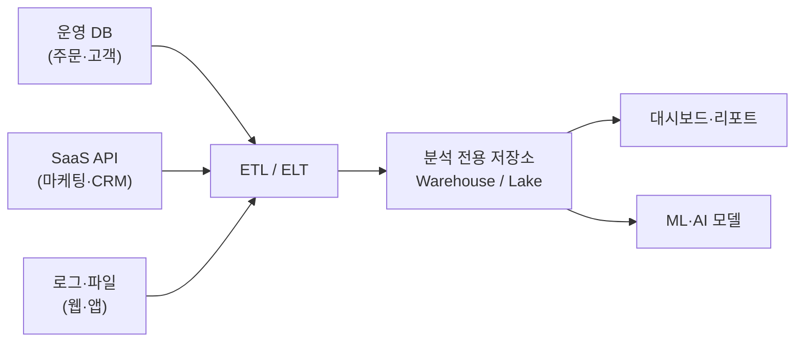

> 운영 DB는 **거래를 처리**하는 곳이고, 분석 전용 저장소는 **의사결정을 지원**하는 곳입니다. 목적이 다르니 구조도 달라야 합니다.
{: .prompt-info }

[데이터 파이프라인]() 편에서 "수집 → 처리 → 저장 → 활용"의 흐름을 설명했는데, 오늘은 그중 **"저장"** 단계를 깊이 파고듭니다.

### OLTP vs OLAP — 두 가지 세계

| 구분 | OLTP (Online Transaction Processing) | OLAP (Online Analytical Processing) |
|------|--------------------------------------|--------------------------------------|
| 목적 | 거래 처리 (주문, 결제, 재고 변경) | 분석 (추세, 집계, 패턴 발견) |
| 쿼리 특성 | 한 번에 소수 행 읽기/쓰기 | 수백만 행 집계·스캔 |
| 응답 시간 | 밀리초 (사용자 대기) | 초~분 (분석가 대기) |
| 스키마 | 정규화 (중복 최소화) | 비정규화 (JOIN 최소화) |
| 대표 제품 | PostgreSQL, MySQL | BigQuery, Snowflake, Redshift |

데이터 웨어하우스와 데이터 레이크는 모두 **OLAP 영역**에 속하지만, 접근 철학이 근본적으로 다릅니다.

---

## 2. 데이터 웨어하우스 — 잘 정리된 도서관

### 비유: 도서관

도서관에 들어가면 모든 책이 **분류 번호**에 따라 정리되어 있습니다. 십진분류법에 따라 사회과학은 300번대, 자연과학은 500번대. 원하는 책을 빠르게 찾을 수 있고, 사서에게 물어보면 정확한 위치를 알려줍니다.

데이터 웨어하우스도 마찬가지입니다. 데이터가 들어오기 **전에** 스키마(구조)를 정의하고, 깨끗하게 정리된 데이터만 입고됩니다.

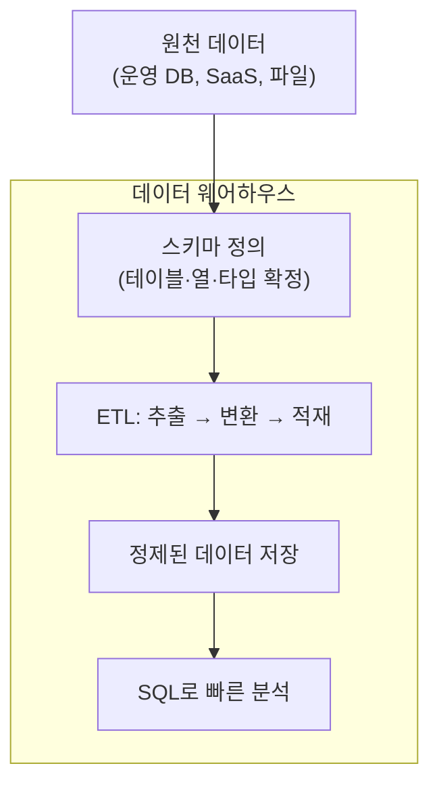

### 핵심 특징

| 특징 | 설명 |
|------|------|
| **Schema-on-Write** | 데이터를 **쓸 때** 구조를 강제함 — 들어올 때 이미 정리 완료 |
| **구조화 데이터 전용** | 행과 열로 표현 가능한 데이터만 저장 |
| **SQL 최적화** | 분석용 SQL 쿼리에 극도로 최적화 (컬럼 기반 저장) |
| **높은 데이터 품질** | ETL 단계에서 정제되므로 신뢰도 높음 |
| **비용 구조** | 컴퓨팅 + 스토리지 함께 과금, 대체로 높은 단가 |

### 스타 스키마 — 웨어하우스의 설계 패턴

웨어하우스에서는 [DB와 DBA]() 편의 정규화와는 다른 설계 패턴을 씁니다. 분석에 최적화된 **스타 스키마**가 대표적입니다.

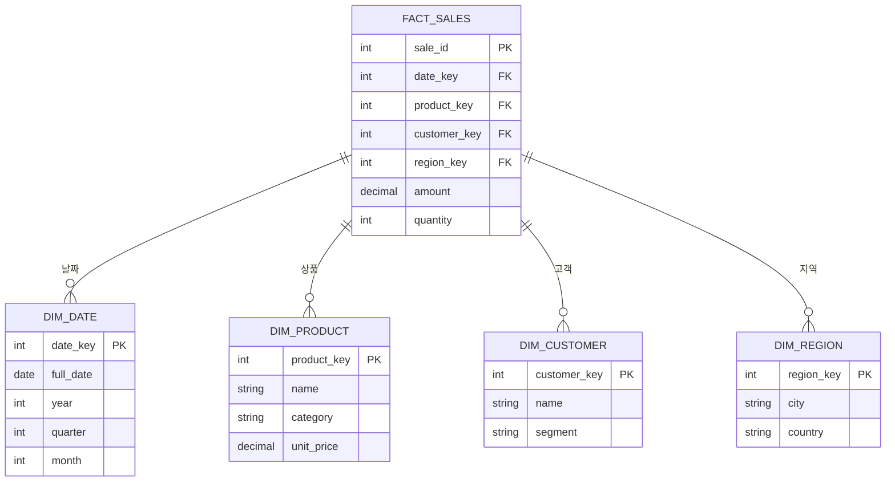

- **Fact 테이블**: 매출, 주문 같은 **측정값**(숫자)을 저장
- **Dimension 테이블**: 날짜, 상품, 고객 같은 **분석 축**(맥락)을 저장
- 가운데 Fact를 중심으로 Dimension이 별 모양으로 연결 → "스타 스키마"

> 정규화는 **중복을 줄여 저장 효율을 높이는 것**이고, 스타 스키마는 **JOIN을 줄여 분석 속도를 높이는 것**입니다. 목적이 다르면 설계도 달라야 합니다.
{: .prompt-info }

---

## 3. 데이터 레이크 — 거대한 호수

### 비유: 산속 호수

산에서 흘러내리는 물은 깨끗한 시냇물도 있고, 진흙 섞인 빗물도 있고, 눈 녹은 물도 있습니다. 호수는 **일단 다 받아들입니다.** 나중에 정수해서 식수로 쓸 수도 있고, 농업용수로 쓸 수도 있고, 그냥 둘 수도 있습니다.

데이터 레이크도 마찬가지입니다. **원본 데이터를 있는 그대로** — CSV, JSON, Parquet, 이미지, 동영상, 로그 파일 — 저장합니다. 구조를 미리 정의하지 않고, 분석할 때 구조를 입힙니다.

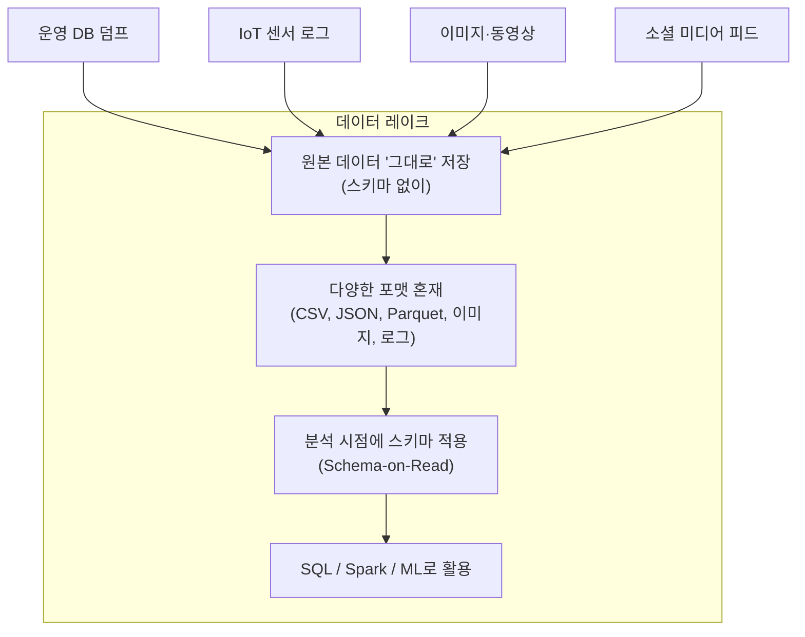

### 핵심 특징

| 특징 | 설명 |
|------|------|
| **Schema-on-Read** | 데이터를 **읽을 때** 구조를 입힘 — 저장할 때는 구조 없음 |
| **모든 형태의 데이터** | 구조화 + 반구조화(JSON) + 비정형(이미지, 로그) 전부 수용 |
| **저렴한 스토리지** | 객체 저장소(S3, GCS) 기반 → GB당 매우 낮은 비용 |
| **유연성** | 어떤 데이터든 일단 넣고, 나중에 용도를 결정할 수 있음 |
| **데이터 품질 리스크** | 관리 안 하면 "데이터 늪(Data Swamp)"으로 전락 |

### 데이터 늪 경고

> 레이크에 데이터를 "일단 다 넣자"는 접근은 위험합니다. 메타데이터(카탈로그) 없이 무분별하게 쌓으면, 누가 언제 왜 넣었는지 모르는 **데이터 늪**이 됩니다. 레이크에도 **거버넌스**가 필수입니다.
{: .prompt-warning }

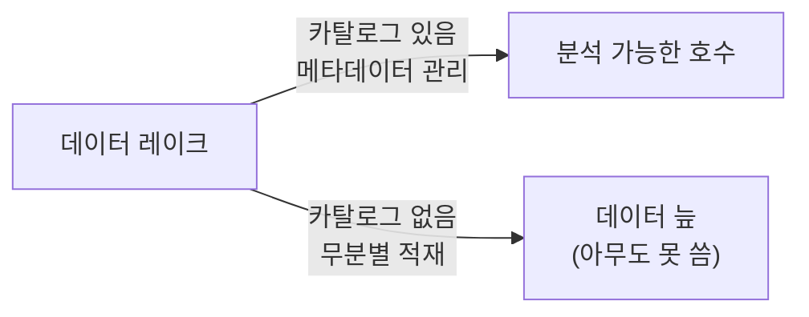

---

## 4. 웨어하우스 vs 레이크 — 상세 비교

### 비교표 1: 구조와 철학

| 비교 항목 | 데이터 웨어하우스 | 데이터 레이크 |
|-----------|------------------|--------------|
| **스키마 전략** | Schema-on-Write (쓰기 시 정의) | Schema-on-Read (읽기 시 정의) |
| **데이터 형태** | 구조화 데이터만 | 구조화 + 반구조화 + 비정형 전부 |
| **데이터 품질** | 높음 (ETL에서 정제) | 원본 그대로 (품질은 사용 시점에 확인) |
| **저장 포맷** | 자체 컬럼 포맷 (내부 최적화) | 오픈 포맷 (Parquet, ORC, JSON, CSV) |
| **비유** | 정리된 도서관 | 거대한 호수 |

### 비교표 2: 사용자와 활용

| 비교 항목 | 데이터 웨어하우스 | 데이터 레이크 |
|-----------|------------------|--------------|
| **주 사용자** | 비즈니스 분석가, 경영진 | 데이터 엔지니어, 데이터 과학자 |
| **주 활용** | BI 대시보드, 리포트, KPI 추적 | ML 학습, 탐색적 분석, 로그 분석 |
| **쿼리 도구** | SQL (표준) | SQL + Spark + Python + 기타 |
| **학습 곡선** | SQL 알면 바로 활용 | Spark, 파일 포맷 이해 필요 |
| **거버넌스** | 내장 (권한, RLS, 감사) | 별도 카탈로그 도구 필요 (Glue, Unity Catalog) |

### 비교표 3: 비용과 성능

| 비교 항목 | 데이터 웨어하우스 | 데이터 레이크 |
|-----------|------------------|--------------|
| **스토리지 단가** | 높음 ($20~40/TB/월) | 매우 낮음 ($1~5/TB/월) |
| **컴퓨팅 비용** | 쿼리당 또는 클러스터 단위 | 별도 엔진 비용 (Athena, Spark) |
| **쿼리 속도** | 빠름 (인덱스, 캐시, 컬럼 저장) | 상대적으로 느림 (스캔 범위 넓음) |
| **확장성** | 수 TB~PB 규모 | PB~EB 규모까지 무한 확장 |
| **데이터 지연** | 배치 (분~시간) 또는 니어 리얼타임 | 실시간 스트리밍 가능 |
| **비용 예측** | 예측 가능 (슬롯/용량 기반) | 변동 가능 (쿼리 패턴에 따라) |

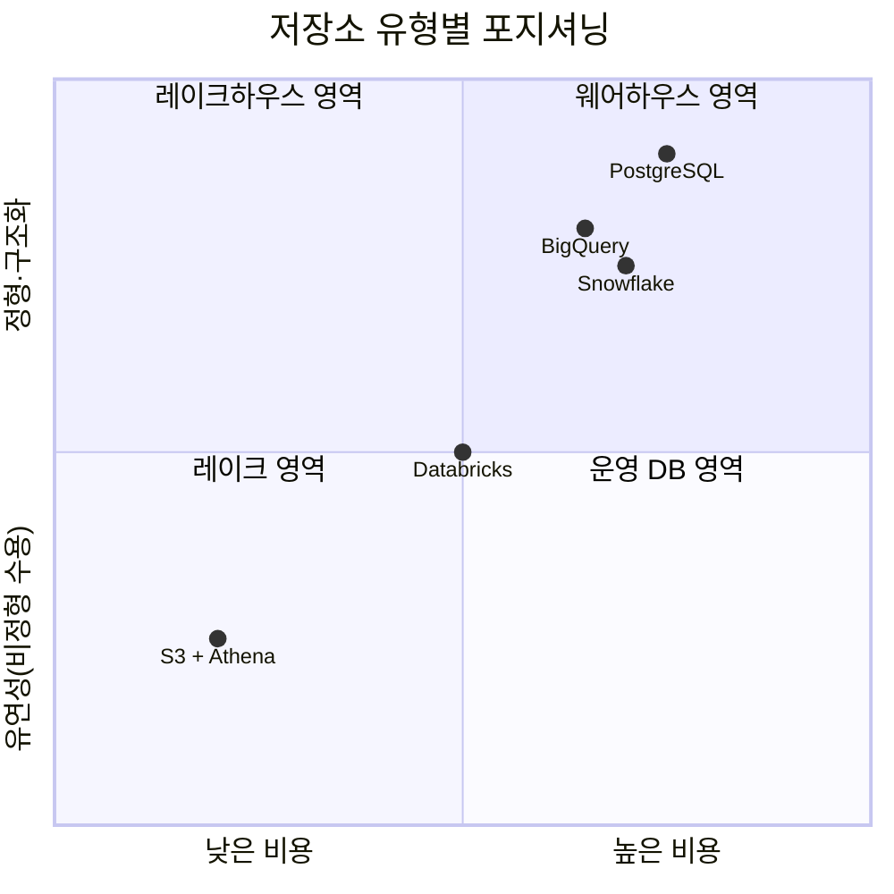

---

## 5. 데이터 레이크하우스 — 두 세계의 결합

### 왜 레이크하우스가 등장했는가

웨어하우스와 레이크를 **동시에 운영**하는 조직이 많았습니다. 그런데 이 구조에는 문제가 있었습니다.

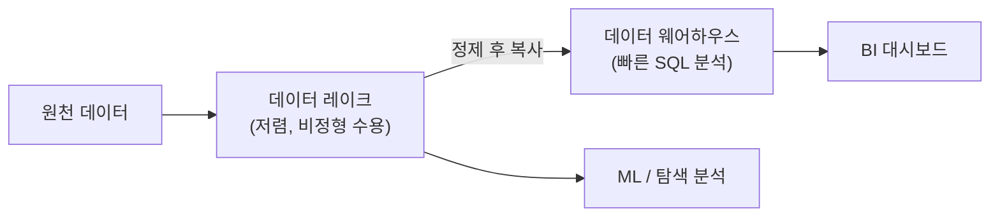

| 문제 | 설명 |
|------|------|
| **데이터 이중 저장** | 같은 데이터가 레이크와 웨어하우스에 각각 존재 → 비용 2배 |
| **정합성 불일치** | 레이크의 원본과 웨어하우스의 사본이 달라지는 경우 |
| **ETL 파이프라인 복잡도** | 레이크 → 웨어하우스 복사 파이프라인 유지보수 부담 |
| **실시간 분석 어려움** | 배치 복사 주기 때문에 최신 데이터 분석까지 시간 지연 |

### 레이크하우스란

레이크하우스(Lakehouse)는 **데이터 레이크의 저렴한 스토리지 위에 웨어하우스급 관리 기능을 얹은** 아키텍처입니다.

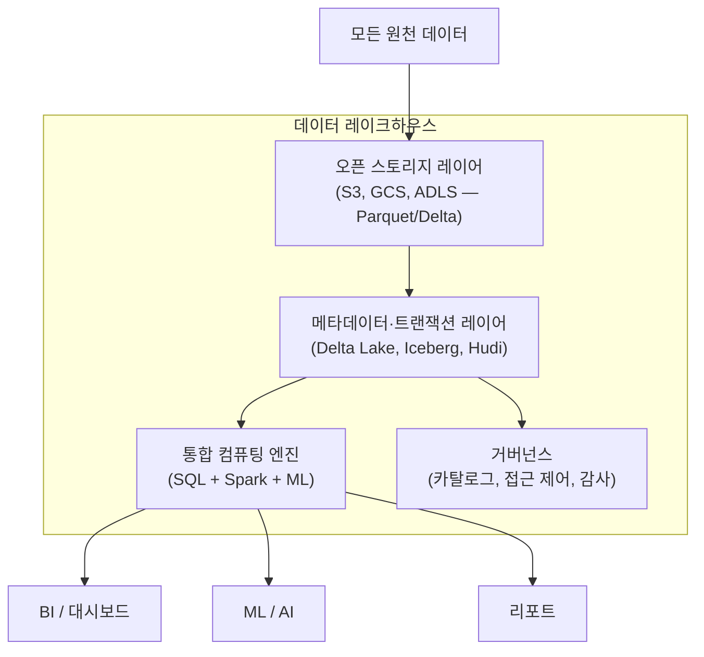

### 레이크하우스의 핵심 기술

| 기술 | 역할 | 대표 구현 |
|------|------|----------|
| **오픈 테이블 포맷** | 레이크 위에 ACID 트랜잭션 + 스키마 관리 | Delta Lake, Apache Iceberg, Apache Hudi |
| **컬럼 기반 저장** | 분석 쿼리 속도 향상 (필요한 열만 읽기) | Parquet, ORC |
| **통합 카탈로그** | 테이블 메타데이터 중앙 관리 | Unity Catalog, AWS Glue |
| **타임 트래블** | 과거 시점 데이터 조회·롤백 | Delta Lake `VERSION AS OF` |

### 3가지 아키텍처 한눈에 비교

| | 데이터 웨어하우스 | 데이터 레이크 | 데이터 레이크하우스 |
|---|---|---|---|
| **스토리지** | 자체 (비쌈) | 객체 저장소 (저렴) | 객체 저장소 (저렴) |
| **ACID 트랜잭션** | 지원 | 미지원 | 지원 (Delta/Iceberg) |
| **스키마 관리** | 강제 | 없음 | 선택적 강제 |
| **비정형 데이터** | 불가 | 가능 | 가능 |
| **SQL 성능** | 최고 | 보통 | 우수 |
| **ML 워크로드** | 제한적 | 최적 | 최적 |
| **거버넌스** | 내장 | 별도 구축 | 내장 가능 |
| **비용** | 높음 | 낮음 | 중간 |

> 레이크하우스는 "웨어하우스를 대체한다"기보다 "레이크 위에 웨어하우스 능력을 추가한다"에 가깝습니다. 기존 웨어하우스 사용자가 하루아침에 바꿀 필요는 없습니다.
{: .prompt-info }

---

## 6. 실전 도구 비교

### BigQuery (Google Cloud)

```
[서버리스] ─ 인프라 관리 없음
[쿼리당 과금] ─ 쓴 만큼만 비용
[표준 SQL] ─ 기존 SQL 그대로 사용
[ML 내장] ─ BigQuery ML로 SQL만으로 모델 학습
```

| 항목 | 내용 |
|------|------|
| **유형** | 클라우드 웨어하우스 (서버리스) |
| **과금** | 쿼리 스캔량 기반 ($7.5/TB) 또는 슬롯 예약 |
| **강점** | 설정 제로, GCP 에코시스템 통합, 비용 예측 |
| **약점** | 비정형 데이터 직접 저장 불가, GCP 종속 |
| **적합** | SQL 중심 분석팀, 빠르게 시작하고 싶은 조직 |

### Snowflake

```
[컴퓨팅·스토리지 분리] ─ 각각 독립 확장
[멀티 클라우드] ─ AWS, GCP, Azure 모두 지원
[데이터 마켓플레이스] ─ 외부 데이터 구독
[제로 카피 클론] ─ 테이블 복제 시 추가 스토리지 0
```

| 항목 | 내용 |
|------|------|
| **유형** | 클라우드 웨어하우스 (컴퓨팅·스토리지 분리) |
| **과금** | 크레딧 기반 (웨어하우스 크기 x 시간) + 스토리지 별도 |
| **강점** | 멀티 클라우드, 동시 워크로드 격리, 데이터 공유 |
| **약점** | 비정형 처리 제한적, 비용 관리에 주의 필요 |
| **적합** | 멀티 클라우드 전략, 여러 팀이 독립적으로 분석하는 조직 |

### Databricks (레이크하우스)

```
[Spark 기반] ─ 대규모 데이터 처리 엔진
[Delta Lake] ─ 레이크 + ACID 트랜잭션
[Unity Catalog] ─ 중앙 거버넌스
[노트북 환경] ─ Python + SQL + Scala 통합
```

| 항목 | 내용 |
|------|------|
| **유형** | 레이크하우스 플랫폼 |
| **과금** | DBU(Databricks Unit) 기반 + 클라우드 인프라 비용 |
| **강점** | ML/AI 워크로드 최적, Delta Lake 오픈 포맷, Python 친화 |
| **약점** | 학습 곡선 높음, SQL-only 팀에는 과도할 수 있음 |
| **적합** | ML 팀이 있는 조직, 대규모 비정형 데이터 보유 |

### S3 + Athena (AWS 조합)

```
[S3] ─ 무한 확장 객체 스토리지
[Athena] ─ 서버리스 SQL 엔진 (Presto/Trino 기반)
[Glue] ─ ETL + 데이터 카탈로그
[비용 최저] ─ 저장은 S3 가격, 쿼리만 Athena 과금
```

| 항목 | 내용 |
|------|------|
| **유형** | DIY 레이크 + 쿼리 엔진 |
| **과금** | S3 저장 비용 + Athena 쿼리 스캔량 ($5/TB) |
| **강점** | 최저 비용, AWS 에코시스템, 유연한 구성 |
| **약점** | 직접 설계 필요, 거버넌스 별도 구축, 쿼리 성능 한계 |
| **적합** | 비용 우선, AWS 이미 사용 중, 엔지니어링 역량 보유 |

### 도구 종합 비교표

| 기준 | BigQuery | Snowflake | Databricks | S3 + Athena |
|------|----------|-----------|------------|-------------|
| **아키텍처** | 웨어하우스 | 웨어하우스 | 레이크하우스 | 레이크 + 쿼리 엔진 |
| **서버리스** | 완전 서버리스 | 부분 (크기 선택) | 클러스터 관리 | 완전 서버리스 |
| **SQL 성능** | 최상 | 최상 | 우수 | 양호 |
| **ML 지원** | BigQuery ML | Snowpark | MLflow 내장 | SageMaker 연동 |
| **비정형 처리** | 제한적 | 제한적 | 우수 | 우수 |
| **학습 곡선** | 낮음 | 낮음 | 높음 | 중간 |
| **초기 비용** | 낮음 (쿼리당) | 중간 | 높음 | 최저 |
| **클라우드** | GCP | AWS/GCP/Azure | AWS/GCP/Azure | AWS 전용 |

> [ETL vs ELT]() 편에서 다룬 것처럼, 도구 선택은 **파이프라인 전략**과 함께 결정해야 합니다. BigQuery나 Snowflake를 쓴다면 ELT 방식이 자연스럽고, S3 + Spark 조합이면 ETL이 더 맞을 수 있습니다.
{: .prompt-tip }

---

## 7. 조직 규모별 추천 전략

### 스타트업 / 소규모 (데이터 10GB 이하, 분석가 1-3명)

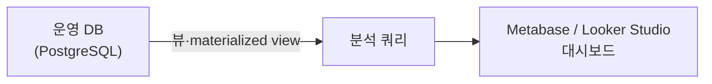

| 추천 | 이유 |
|------|------|
| **운영 DB에서 직접 분석** | 데이터가 적으면 분리할 필요 없음 |
| **PostgreSQL + Materialized View** | 복잡한 집계를 미리 계산해두면 속도 충분 |
| **무료 BI 도구** | Metabase(오픈소스) 또는 Looker Studio(무료) |
| **예산** | 월 $0~50 |

> "아직 데이터가 적은데 웨어하우스를 도입해야 하나요?" — 아닙니다. **운영 DB에 부하가 체감될 때**가 분리 시점입니다. 너무 이른 최적화는 비용만 늘립니다.
{: .prompt-tip }

### 성장기 / 중견기업 (데이터 100GB~1TB, 분석가 3-10명)

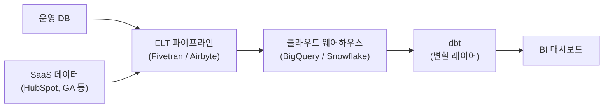

| 추천 | 이유 |
|------|------|
| **BigQuery 또는 Snowflake** | 서버리스/반서버리스로 인프라 부담 최소화 |
| **ELT + dbt** | 웨어하우스 안에서 SQL로 변환 — 엔지니어 없이 분석가가 직접 |
| **Fivetran / Airbyte** | 커넥터 기반으로 다양한 SaaS 데이터 자동 수집 |
| **예산** | 월 $200~2,000 |

### 대기업 / 데이터 집약 조직 (데이터 수 TB 이상, ML 팀 보유)

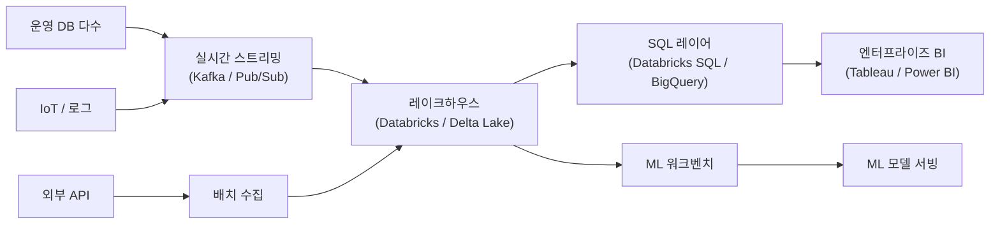

| 추천 | 이유 |
|------|------|
| **레이크하우스 (Databricks)** | 비정형 + 정형 통합, ML 파이프라인 내장 |
| **Delta Lake / Iceberg** | ACID 트랜잭션으로 데이터 품질 보장 |
| **실시간 스트리밍** | Kafka/Spark Structured Streaming으로 니어 리얼타임 분석 |
| **전담 데이터 엔지니어링 팀** | 인프라 설계·운영 전문가 필수 |
| **예산** | 월 $5,000~$50,000+ |

### 규모별 요약표

| | 스타트업 | 중견기업 | 대기업 |
|---|---|---|---|
| **데이터 규모** | ~10 GB | 100 GB ~ 1 TB | 수 TB 이상 |
| **추천 저장소** | 운영 DB 직접 사용 | 클라우드 웨어하우스 | 레이크하우스 |
| **추천 도구** | PostgreSQL + Metabase | BigQuery + dbt | Databricks + Delta Lake |
| **팀 구성** | 분석 겸임 1명 | 분석가 3-10명 | 데이터 엔지니어 + 분석가 + ML |
| **월 비용** | $0~50 | $200~2,000 | $5,000~50,000+ |
| **핵심 원칙** | 단순하게 시작 | SQL 중심으로 확장 | 통합 플랫폼으로 표준화 |

---

## 8. 넥스트엑스의 접근법 — Supabase PostgreSQL as Lightweight Warehouse

넥스트엑스는 현재 **스타트업~초기 성장기** 단계입니다. 거대한 웨어하우스 대신 **Supabase PostgreSQL을 경량 분석 저장소로 활용**하는 실용적 접근을 취하고 있습니다.

### 현재 아키텍처

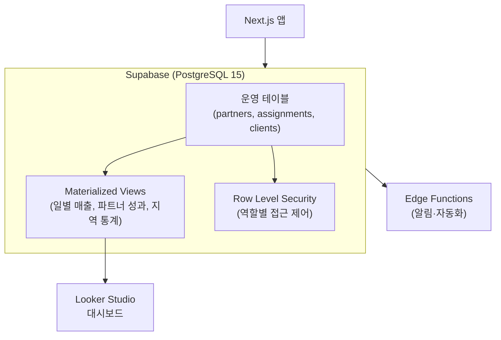

### 왜 이 구조인가

| 선택 | 이유 |
|------|------|
| **Supabase PostgreSQL** | 운영 DB와 분석을 하나로 — 데이터 복사 불필요 |
| **Materialized View** | 복잡한 집계를 미리 계산 → 대시보드 응답 속도 향상 |
| **RLS(Row Level Security)** | [DB와 DBA]() 편의 보안 원칙 적용 |
| **별도 웨어하우스 미도입** | 현재 데이터 규모에서는 과잉 투자 |

### 성장에 따른 로드맵

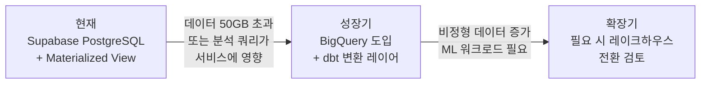

| 단계 | 트리거 (전환 시점) | 액션 |
|------|-------------------|------|
| **현재** | — | Supabase + Materialized View + Looker Studio |
| **성장기** | 데이터 50GB 초과, 분석 쿼리가 서비스 지연 유발 | BigQuery 도입, Supabase → BigQuery ELT 파이프라인 구축 |
| **확장기** | 비정형 데이터(이미지, 로그) 급증, ML 팀 구성 | 레이크하우스 전환 검토 (Databricks 또는 BigLake) |

> 넥스트엑스의 원칙: **"지금 필요한 것만 도입하고, 다음 단계의 전환 기준을 미리 정해둔다."** 이것이 스타트업이 데이터 인프라에서 살아남는 방법입니다.
{: .prompt-tip }

---

## 9. 의사결정 플로우차트 — 우리 조직에 맞는 저장소 찾기

어떤 저장소를 선택해야 할지 모르겠다면, 이 플로우를 따라가 보세요.

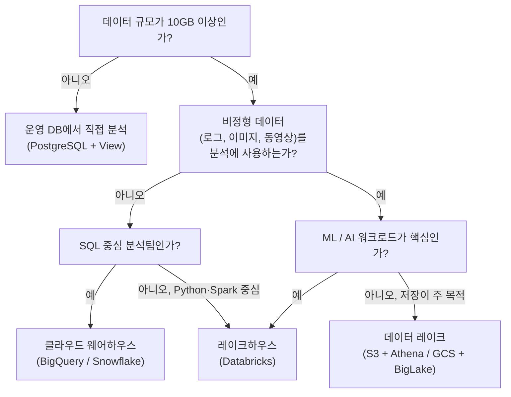

---

## 10. 정리 — 한 장으로 보기

| 키워드 | 핵심 요약 |
|--------|----------|
| **OLTP vs OLAP** | 거래 처리 vs 분석 — 목적이 다르면 저장소도 분리 |
| **데이터 웨어하우스** | Schema-on-Write, 정제된 데이터, SQL 최적화 — "정리된 도서관" |
| **데이터 레이크** | Schema-on-Read, 모든 형태 수용, 저렴한 스토리지 — "거대한 호수" |
| **데이터 레이크하우스** | 레이크 스토리지 + 웨어하우스 관리 기능 — 두 세계의 결합 |
| **BigQuery / Snowflake** | SQL 중심 클라우드 웨어하우스, 빠른 시작에 적합 |
| **Databricks** | 레이크하우스 플랫폼, ML/AI 워크로드에 최적 |
| **S3 + Athena** | 최저 비용 레이크 구성, 엔지니어링 역량 필요 |
| **조직 규모별 선택** | 스타트업은 운영 DB, 중견은 웨어하우스, 대기업은 레이크하우스 |

---

## 함께 보기

- **데이터 기초** -- [데이터 파이프라인이란?]() · [DB와 DBA]()
- **파이프라인 전략** -- [ETL vs ELT]()
- **시각화** -- [대시보드 설계의 기술]()

---

> 본 글은 **주식회사 넥스트엑스(NEXT X) 기술연구소**의 R&D 자산입니다.
> **함께 읽기** — [블로그 안내]() · [비즈니스 문의]()
{: .prompt-info }

*NEXT X R&D · Data Engineering*
